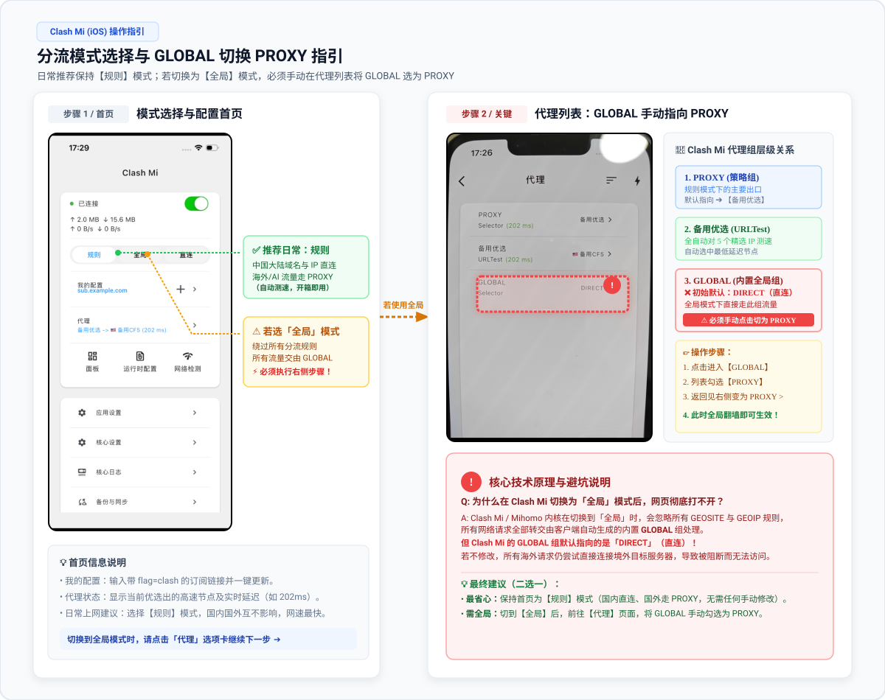
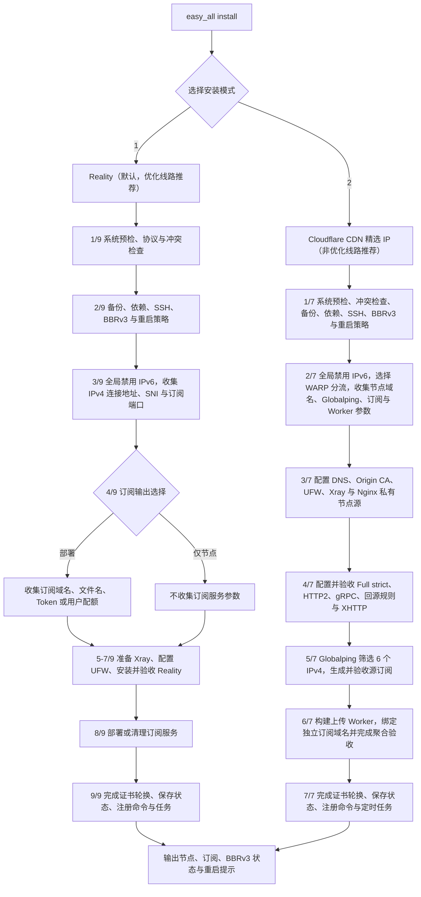

# easy_all

`easy_all` 是面向全新 Debian 12/13 amd64 VPS 的单节点安装器。一个项目、一个命令，
安装时只能选择一种模式。本文先给第一次使用的完整路径；协议、端口和配额等技术细节放在后文，
第一次安装不必先理解它们。

| 安装模式       | 协议                         | CDN Provider / 入口 |
| -------------- | ---------------------------- | ------------------- |
| 1. 直连 - Reality | VLESS TCP Reality Vision     | VPS TCP 443         |
| 2. Cloudflare CDN 精选 IP - XHTTP stream-up | VLESS XHTTP stream-up / TLS | 6 个三网精选 IPv4，完全无域名兜底 |

Cloudflare 提供纯 XHTTP stream-up（固定保留 6 个三网精选 IPv4）；Reality 用于直连。

### IP 版本

只支持 IPv4。

同一台 VPS 只能安装一种模式。脚本会管理 Xray、Nginx、证书、UFW、BBR 和订阅文件，
只适合不承载其他业务的专用 VPS。它不能承诺某条线路一定更快、更稳定或适合所有网络；请遵守
所在地区法律、VPS 服务商以及 Cloudflare 的服务条款。

## 第一次安装：先看这里

### 1. 选择模式

| 你的情况 | 建议 | 需要额外准备 |
| --- | --- | --- |
| 第一次使用，或 VPS 直连已经可用 | 选择 `1`：Reality | 只需 VPS；如需自托管订阅，另需 Cloudflare 域名和 API Token。 |
| 明确要使用 Cloudflare CDN，追求纯 XHTTP | 选择 `2`：Cloudflare 纯 XHTTP | 同一 Active Zone 下互不相同的节点域名和 Worker 订阅域名、具备 Zone 权限及账户级 Workers Scripts Write 的 Cloudflare API Token、Globalping Token，并在控制台打开 gRPC。固定下发 6 个三网精选 IPv4。 |

“优化线路”没有统一、可由脚本判断的标准。若不确定，先选择 Reality；只有直连体验不理想且你愿意
处理 Cloudflare 前置准备时，再选择对应 CDN 模式。

### 2. 运行前检查清单

请逐项确认后再运行安装器：

- 你购买的是一台有**公网 IPv4** 的 VPS，系统为 **Debian 12 或 Debian 13**，CPU 架构为
  **amd64/x86_64/x64**；不要选择 ARM/aarch64，也不要使用 Docker、LXC 等容器。
- 你已经从自己的电脑登录到 VPS，且知道当前 SSH 登录用户、密码或密钥、端口和公网 IP。购买页面中的
  “Console / VNC / Web console” 也应能打开；它是 SSH 意外断开时的救援入口。
- 这是专用服务器：没有其他代理面板、Xray、Nginx 或业务占用相关端口。安装前建议在服务商控制台创建
  一份快照。
- 如果服务商还有 Security Group、云防火墙或网络 ACL，它与 VPS 内的 UFW 是两套规则。请勿让它拦截
  当前 SSH 端口、Reality 的 `443`，或 CDN 回源所需的 `443`；脚本无法修改服务商控制台规则。
- Cloudflare XHTTP 已按[前置准备手册](docs/preparation-guide.md)完成域名、Token 与 gRPC；不要提前创建
  `node.example.com` 或计划使用的独立订阅域名的 DNS 记录。

> **安装会改动系统。** 它会安装 XanMod 内核和依赖、设置系统时区为 `Asia/Shanghai`、配置 UFW 和
> Fail2ban、额外让 SSH 监听 TCP `65533`、创建 systemd 定时任务，并管理 Xray/Nginx。请保留当前 SSH
> 会话直到安装、重启和重新登录均验证完成。

几个词的含义：VPS 是远程服务器；SSH 是从自己电脑连接它的终端方式；公网 IPv4 是别人可访问的
服务器 IP；Cloudflare Zone 就是已交给 Cloudflare 托管的根域名；橙云/Proxied 表示经过 Cloudflare，
灰云/DNS only 表示直连服务器。

### 3. 先登录 VPS，再运行安装命令

**下面的命令必须在 VPS 的 SSH 终端中运行，不是在自己的 Windows/macOS 终端、手机终端或 Cloudflare
网页中运行。**

例如，在 macOS/Linux 的 Terminal 或 Windows PowerShell/Windows Terminal 中，先按服务商提供的
登录信息连接（将尖括号内容替换为自己的值）：

```bash
ssh <登录用户>@<VPS公网IP> -p <SSH端口>
```

首次连接询问是否信任主机指纹时，先与服务商控制台显示的指纹核对；确认无误后输入 `yes`。看到类似
`root@...` 或 `<用户名>@...` 的提示符后，才表示已经进入 VPS。若服务商只提供网页终端，也可以在那里运行。

## 系统与安全保障

两种安装模式都会保留 sshd 已检测到的现有端口，并通过公共平台模块额外监听 TCP `65533`；
UFW 会在拒绝其他入站流量前同时放行现有 SSH 端口和 `65533`。安装与 `easy_all apply`
都会校验 sshd 配置、实际监听套接字和 UFW 规则，任一环节失败都会停止应用。两种模式还会
通过同一公共模块安装并启用 Fail2ban：任一来源在 3 分钟内失败 6 次，只封禁触发 IP
3 小时；重复来源递增封禁且最长 1 周；`sshd` jail
始终跟随实际 SSH 端口列表。
生成的 Mihomo 配置会把 TCP `22` 和 `65533` 直连规则固定在规则列表顶部，避免开启 TUN 后
SSH 管理流量再次进入代理节点。

## 安装

线路与费用提示：CDN 模式面向直连 VPS 体验不理想、且愿意维护域名和第三方账号的场景，并不保证一定更快。
Cloudflare XHTTP 是实时回源链路，不会缓存隧道内的业务数据。若 VPS 仅统计出站流量，其月度出站额度
通常是可用代理载荷的主要上限，但协议开销和 Cloudflare 服务规则会使两者并非严格等值；VPS 双向计费时
还需按服务商口径同时计算入站与出站。Cloudflare Free Zone 的使用边界按 Provider 当前规则执行，
域名注册费和 VPS 费用另计。

CDN 模式需要先准备 Cloudflare 的域名、账号和 Token。请先阅读统一的
[前置准备手册](docs/preparation-guide.md)。Reality 只有在选择“部署订阅”时才需要 Cloudflare 域名和 API Token。

一条命令下载完整项目并进入交互安装：

```bash
bash <(curl -fsSL https://raw.githubusercontent.com/v2yiz/easy_all/main/bootstrap.sh)
```

请原样粘贴这条命令；不要改成 `curl ... | sudo bash`，安装器需要持续从当前终端读取选项。它会在
需要管理员权限时提示输入当前登录用户的 `sudo` 密码；输入密码时屏幕没有字符回显是正常的。

安装完成后，使用系统命令更新 easy_all 项目代码本身：

```bash
sudo easy_all self-update
```

`self-update` 只下载并原子替换 `/usr/local/lib/easy_all` 中的入口、两个 Profile、CDN 公共
运行时、公共支持模块和 Mihomo 模板，不修改 Xray、Nginx、订阅文件、系统参数或云端 CDN 资源。
代码包含配置生成变化时，再显式执行 `sudo easy_all apply` 将新代码应用到本机部署。

仅更新订阅规则时，在 `self-update` 成功后执行 `sudo easy_all update-sub`；Cloudflare 模式选择
保留现有 Worker 聚合配置，脚本会重新生成订阅并构建部署 Worker，无需再执行 `apply-cloud`。
最后在客户端更新订阅并重启代理内核。

仓库保留两个无功能的源码迁移占位文件，使移除 Gcore 前安装的旧更新器也能通过完整性检查。
它们不会被当前清单加载、打包或安装到 `/usr/local/lib/easy_all`，不恢复任何已移除功能。
正常用户仍只需执行：

```bash
sudo easy_all self-update
sudo easy_all update-sub
```

如果仍出现旧的“项目不完整”提示，通常表示使用了未同步的镜像或固定到兼容桥之前的提交；
此时再从官方仓库的新入口执行 `register-command`。不要用 `bootstrap.sh` 重装，也不要修改
`STATE_VERSION` 绕过校验。

更新 Xray 核心请使用 `sudo easy_all update-core`。

安装引导脚本会：

1. 检查 `git`；缺失时先通过 APT 安装 `git` 和 CA 证书。
2. 浅克隆 `main` 分支完整项目到权限受限的临时目录。
3. 校验入口、两个 Profile、全部公共运行时模块和 Mihomo 模板均存在。
4. 通过 `sudo` 启动交互安装。
5. 安装结束后删除临时下载目录。

也可以克隆或下载完整项目后手动执行：

```bash
chmod 700 easy_all
sudo ./easy_all install
```

安装器只支持交互安装，不接受 `install reality` 或 `install xhttp` 参数：

```text
请选择安装模式：
  1. 直连 - Reality（优化线路推荐）
  2. Cloudflare CDN 精选 IP（非优化线路推荐）
 请选择 [1]（直接回车使用默认值）:
```

### 4. 第一次输入时怎么选

下列建议面向“只自己使用、首次部署”的情况；不需要多用户配额时，遇到 JSON、Token 覆盖、UUID 和
Xray email 等问题都可以直接阅读后文的进阶章节，不必现在填写。

| 看到的选项 | 首次单用户建议 | 说明 |
| --- | --- | --- |
| 安装模式 | 不确定时选 `1` | `1` 是 Reality 直连，`2` 是 Cloudflare 纯 XHTTP stream-up。 |
| 订阅输出 | 选 `1` 或直接回车 | 在本机部署订阅，之后可从客户端按链接导入。已有别的订阅服务器才选 `2`。 |
| 月度用户配额 | 选 `1` 或直接回车 | 单人通常不需要；启用后每个用户有独立凭据，适合之后再配置。 |
| 定时重启 | 希望每天凌晨短暂断线选 `1`；否则选 `3` | 默认每天 `04:00`（服务器时区 `Asia/Shanghai`）先更新并校验 GeoSite/GeoIP，再重启；会中断已有连接。 |
| Reality SNI/目标 | 直接回车 | 使用脚本验证过的默认值；不要随意填常见网站。 |
| Reality 动态端口 | 直接回车 | 这是**节点连接端口**的轮换策略，不是订阅下载端口。 |

所有提示中的 `[值]` 都表示直接按回车会采用该值；没有方括号且没有写“可留空”的输入必须填写。
输入 Cloudflare 或 Globalping Token 时不会显示字符，粘贴后直接按回车即可。

### 5. 安装完成后：重启、验证、导入客户端

安装结束后不要立刻关闭终端。新 XanMod 内核需要重启才会生效：

```bash
sudo reboot
```

SSH 会断开。等待 VPS 启动后重新登录，运行：

```bash
sudo easy_all status
sudo easy_all subscription
```

`status` 显示 `BBRv3: active` 才表示新内核已生效；若显示 `pending-reboot`，说明还没有成功从新内核
启动。`subscription` 会显示每位用户的订阅地址。订阅地址与 UUID 都是访问凭据，不要截图、公开或发送给
不信任的人。

在电脑或手机上安装支持 Mihomo 配置的客户端，在其“从 URL 导入配置 / Import from URL”位置粘贴输出中带
`flag=clash` 的 **Mihomo** 地址，然后启用该配置并访问一个普通网站测试。Cloudflare 精选 IP 节点需确保客户端支持独立 IP、TLS SNI、HTTP Host 和 XHTTP `stream-up` 字段；兼容性要求见
[Cloudflare 客户端说明](#精选-ip-的客户端要求)。

#### 客户端选择与导入

本项目订阅基于标准的 **Mihomo (Clash Meta)** 规范生成，**任何基于 Mihomo 内核的客户端均可直接使用**（包括直连 Reality 与 Cloudflare CDN 精选 IP 的 XHTTP stream-up 纯流模式）。

下载客户端时，请务必从官方开源项目发布页或应用商店下载对应操作系统与 CPU 架构的安装包。以下按操作系统分类推荐社区主流热门的 Mihomo 客户端：

| 平台 / 操作系统 | 推荐热门客户端 | 特点与首次导入方式 |
| --- | --- | --- |
| **Windows** | [Clash Verge Rev](https://github.com/clash-verge-rev/clash-verge-rev/releases)<br>[Clash Mi](https://clashmi.app/download)<br>[Bettbox](https://github.com/appshubcc/Bettbox/releases)<br>[FlClash](https://github.com/chen08209/FlClash/releases) | **Clash Verge Rev**（主流首选）：Tauri 桌面客户端，支持 x64/x86。<br>**Clash Mi**：Flutter 多平台客户端，支持 Windows 10+ amd64。<br>**Bettbox**：支持 Windows x64/ARM64，内置 Mihomo。<br>**FlClash**：跨平台界面简洁。<br>**导入方式**：在“订阅 / 订阅管理”中新建订阅，粘贴输出的 Mihomo 地址，保存并启用。 |
| **macOS** | [Clash Verge Rev](https://github.com/clash-verge-rev/clash-verge-rev/releases)<br>[Clash Mi](https://clashmi.app/download)<br>[Bettbox](https://github.com/appshubcc/Bettbox/releases)<br>[FlClash](https://github.com/chen08209/FlClash/releases) | **Clash Verge Rev**：支持 Intel 与 Apple Silicon。<br>**Clash Mi**：支持 macOS 12+ 的 Intel 与 Apple Silicon。<br>**Bettbox**：支持 Intel 与 Apple Silicon。<br>**FlClash**：操作逻辑与其他平台一致。<br>**导入方式**：在订阅设置中粘贴带 `flag=clash` 的 URL，启用系统代理或 TUN。 |
| **Android** | [Clash Mi](https://clashmi.app/download)<br>[Bettbox](https://github.com/appshubcc/Bettbox/releases)<br>[FlClash](https://github.com/chen08209/FlClash/releases)<br>[Clash Meta for Android (CMFA)](https://github.com/MetaCubeX/ClashMetaForAndroid/releases) | **Clash Mi**：支持 Android 8+。<br>**Bettbox**：支持 Android 8+，提供 ARMv8、ARMv7、x86_64 与 Universal 包。<br>**FlClash**：移动端界面简洁。<br>**CMFA**：经典功能全面，支持细粒度分应用代理。<br>**导入方式**：配置 -> 新建配置 -> URL 导入，粘贴订阅地址并保存。 |
| **iOS / iPadOS** | [Clash Mi](https://clashmi.app/download)<br>[Shadowrocket（小火箭）](https://apps.apple.com/app/shadowrocket/id932747118) | **Clash Mi**（首选推荐）：支持 iOS 15+，可通过 App Store / TestFlight 安装；配图说明详见其[官方用户手册](https://clashmi.app/guide/)。**特别提示**：日常请保持「规则」模式；若切换为「全局」模式，必须手动在“代理”页面将 `GLOBAL` 指向 `PROXY`（详见下方指引图）。<br>**Shadowrocket**：**不作为本项目首选推荐**。虽支持 Base64 / 单节点，但对精选 IP 所需的 IP/SNI/Host 分离解析能力需自行逐节点测试确认。 |
| **Linux** | [Clash Verge Rev](https://github.com/clash-verge-rev/clash-verge-rev/releases)<br>[Clash Mi](https://clashmi.app/download)<br>[Bettbox](https://github.com/appshubcc/Bettbox/releases)<br>[FlClash](https://github.com/chen08209/FlClash/releases)<br>[Mihomo Core (CLI)](https://github.com/MetaCubeX/mihomo/releases) | **桌面环境**：Clash Verge Rev 支持 x64/ARM64，Clash Mi 支持 amd64，Bettbox 支持 x64/ARM64；也可使用 FlClash。<br>**服务器/路由器环境**：可直接下载原生 Mihomo 二进制核心配合 systemd 守护进程运行。 |

“能导入”不代表“全部节点都能连接”。Cloudflare 模式固定提供 6 个 IPv4 节点，完全无域名兜底；
请确保客户端完整支持 XHTTP stream-up 并正确解析 IP/SNI/Host 分离字段。启用 TUN 或“全局代理”会改变设备的网络路由，首次使用前请先确认客户端
如何一键关闭或恢复网络。

##### iOS Clash Mi 模式设置与关键避坑提醒

> [!IMPORTANT]
> **Clash Mi「规则」与「全局」模式设置提醒：**
> - **日常推荐选择【规则】模式**：本项目下发的 Mihomo 订阅内置高精简高性能分流规则。在「规则」模式下，中国大陆域名与 IP 直连（含 Apple、微软国内 CDN），境外网站与 AI 流量自动经由 `PROXY` 节点组（自动测速优选最优节点），**开箱即用，无需任何手动修改**。
> - **切换至【全局】模式的特别注意点**：Clash Mi 客户端内置了名为 `GLOBAL` 的全局选择器分组，**该分组初始默认指向 `DIRECT`（直连）**。
>   - 若在首页切换为「全局」模式，客户端将强制所有请求走 `GLOBAL` 组；
>   - **若未修改 `GLOBAL` 的目标，所有流量仍将直连，导致看似已连上但境外网站打不开**；
>   - **正确做法**：进入客户端底部的**「代理 (Proxies)」**页面，点击 **`GLOBAL`** 策略组，**手动勾选 `PROXY`**（或具体的 `🇺🇸优选` 节点），全局代理才会生效。



##### 订阅更新故障与 DNS 污染排查：客户端 DNS 覆写指引

在某些特定网络环境（如部分省份移动/广电宽带、校园网或企业内网），本地运营商的默认递归 DNS 可能会对自建二级域名或 Cloudflare 代理的订阅域名进行投毒劫持或解析超时，导致客户端在初次导入或刷新订阅时提示 `i/o timeout`、`connect: connection refused` 或 `no such host`。

此时可通过在客户端中**覆写内置 DNS** 或配置**加密 DNS (DoH)** 彻底解决。

> [!TIP]
> **推荐使用的抗污染公共 DNS / DoH：**
> - **国内首选（防劫持、低延迟、国内网站 CDN 不绕路）：**
>   - **阿里 DNS**：DoH `https://223.5.5.5/dns-query` ｜ 普通 IP `223.5.5.5` / `223.6.6.6`
>   - **腾讯 DNSPod**：DoH `https://doh.pub/dns-query` ｜ 普通 IP `119.29.29.29` / `1.12.12.12`
> - **海外纯净备用（若订阅域名在国内解析被彻底封锁）：**
>   - **Cloudflare DNS**：DoH `https://1.1.1.1/dns-query` ｜ 普通 IP `1.1.1.1`
>   - **Google DNS**：DoH `https://dns.google/dns-query` ｜ 普通 IP `8.8.8.8`

主流客户端 DNS 覆写与排查操作指引：

1. **Clash Verge Rev (Windows / macOS / Linux)**
   - **配置 DoH 覆写**：进入左侧「设置」→「DNS 设置」→ 开启「自定义 DNS」，在 `nameserver` 列表中添加 `https://223.5.5.5/dns-query`，保存即可。
   - **订阅单独绑定 Hosts（最稳妥手段）**：在「订阅」页面右键点击订阅卡片 →「编辑信息」→ 在「Hosts」区域添加一行 `你的订阅域名 104.19.14.59`（指向任意 Cloudflare 官方 IPv4），客户端更新订阅时将完全绕过本地 DNS。
2. **Clash Mi (iOS / iPadOS)**
   - 点击底栏「设置」→「DNS 设置」→ 开启「自定义 DNS 覆写」→ 添加并置顶 `https://223.5.5.5/dns-query`（或 `223.5.5.5`），返回首页重新刷新订阅。
3. **FlClash (Android / Windows / macOS / Linux)**
   - 进入「设置」→「网络 / DNS」→ 开启「覆写 DNS」选项 → 将默认 DNS 服务器修改为 `https://223.5.5.5/dns-query`。
4. **Clash Meta for Android (CMFA)**
   - 进入「设置」→「覆写」→「DNS 覆写」→ 将 `nameserver` 修改为 `https://223.5.5.5/dns-query`。
5. **Shadowrocket (小火箭，iOS)**
   - 点击底栏「设置」→「DNS」→ 启用「DoH」并添加 `https://223.5.5.5/dns-query`；或在「配置」中长按本地规则文件 →「编辑纯文本」并在 `[Host]` 字段下添加一行 `你的订阅域名 = 104.19.14.59`。

### 第一次安装常见问题

| 现象 | 先做什么 |
| --- | --- |
| 订阅链接在部分网络下拉取失败或提示超时 | 本地运营商 DNS 污染了订阅域名。请参考上方「客户端 DNS 覆写指引」在客户端配置阿里 DoH（`https://223.5.5.5/dns-query`），或在 Hosts 中直接指定 Cloudflare IP。 |
| 在本机运行后提示系统不支持 | 退出命令，在 VPS 的 SSH 或网页终端中重新运行。 |
| SSH 断开或重启后无法登录 | 不要反复猜端口；使用服务商网页 Console/VNC，确认当前 SSH 端口与 UFW/安全组规则。保留旧 SSH 会话直到新会话可登录。 |
| 提示 Zone 不是 Active 或找不到域名 | 回到 Cloudflare Overview，等待 Zone 变为 **Active**；检查注册商名称服务器是否完整替换。 |
| 提示 `Cloudflare Zone 尚未开启 gRPC` | 在目标 Zone 的 **Network → gRPC** 手动开启 gRPC，等待设置生效后重新安装；安装器只在真实 XHTTP 重试全部失败后执行该辅助诊断。 |
| Cloudflare XHTTP 端到端验收失败 | 安装器会通过临时 Xray 客户端访问已验证的 Google `204` 地址，并重试 6 次；仍失败时会附带 gRPC 边缘辅助诊断，再检查 Xray/Nginx 日志和 Cloudflare 规则。 |
| API Token 权限不足或同名 DNS 记录冲突 | 不要删除不认识的记录或扩大 Token 权限。按准备手册核对最小权限；为节点/订阅换一个未被占用的一级子域名。 |
| Globalping 额度不足或没有候选 IP | 等额度恢复后执行 `sudo easy_all refresh-cdn-ips`；已有缓存会继续使用。 |
| 检测到 UEFI Secure Boot | 安装器不会安装无法确认启动的第三方内核。请改用满足要求的 VPS，或在完全理解风险后从服务商控制台处理 Secure Boot。 |
| 能下载订阅但客户端连接失败 | 先确认客户端支持 Mihomo XHTTP；Cloudflare 模式再检查 gRPC。可使用 Base64 通用链接单节点逐一排查，不要直接删除 Cloudflare 规则。 |
| Clash Mi 开启「全局」模式后打不开境外网站 | Clash Mi 内置的 GLOBAL 分组默认指向 DIRECT。切换为全局模式后，必须进入客户端「代理」页面，点击 GLOBAL 并手动勾选「PROXY」（详见上方指引图）。推荐日常直接使用「规则」模式。 |

## 安装脑图



图中是安装器的实际执行顺序。两种模式都只询问一次订阅输出；后续步骤只应用已保存的选择，不会再次询问。Cloudflare 模式部署订阅时必须使用与节点不同的一级子域绑定 Worker。

公共交互选项：

| 输入 | 选项/格式 | 默认值 | 直接回车 |
| --- | --- | --- | --- |
| Globalping Token | Cloudflare XHTTP 必填，隐藏输入 | 无 | 不允许为空；保存到 root-only 独立文件 |
| Cloudflare API Token | Cloudflare XHTTP 必填；Reality 选择“部署订阅”时也必填，隐藏输入 | 无 | XHTTP 还需目标账号的 Workers Scripts Write；完整最小权限见前置准备手册 |
| 订阅输出 | `1` 部署（仅当前服务器推荐） / `2` 仅输出节点（多节点聚合或已有订阅服务器推荐） | `1` | 部署当前模式对应的订阅服务 |
| CDN 订阅链接完整域名 | Cloudflare 部署订阅时出现；完整主机名，例如 `sub.example.com` | `sub.<Zone>` | 必须与节点域名不同并绑定 Worker |
| Cloudflare Worker 名称 | 仅 Cloudflare 部署订阅时出现；小写字母、数字、短横线，1-63 字符 | `easyall` | 使用 `easyall` |
| 月度用户配额 | 仅选择“部署订阅”时出现；`1` 不启用 / `2` 启用 | `1` | 所有订阅用户共用当前节点 UUID |
| 非配额用户 Token | `{用户名: Token}` 完整 JSON 字典 | 自动生成 `owner` | `update-sub` 中省略用户即删除，替换值即更换 Token |
| 配额 Token 覆盖 | `{用户: Token}` JSON 子集 | `{}` | 使用自动生成或已有 Token |
| 是否聚合订阅 | 仅 Cloudflare Worker 订阅；`1` 不需要 / `2` 需要 | `1` | 不聚合 |
| Worker 聚合配置 | 选择需要聚合后出现；不含 `vpsSubUrl` 的 `config.local.json` JSON | 无 | 隐藏输入；本机自动注入 `vpsSubUrl`，后续可保留、替换或清空 |
| VPS 开通日期 | `YYYY-MM-DD` | 当前 UTC 日期 | 以默认日期的“日”作为每月账期边界 |
| 安装模式 | `1` Reality / `2` Cloudflare | `1` | 安装 Reality |
| WARP 分流（仅模式 2） | `1` 不分流 / `2` Google AI / `3` 全部 Google / `4` 全部代理流量 | `1` | 更新时保留当前选择；首次启用另行确认 WARP 服务条款 |
| 定时重启 | `1` 每日 04:00 / `2` 自定义 / `3` 不配置 | `1` | 按服务器 `Asia/Shanghai` 时区写入 root crontab；重启前最多用 10 分钟更新并校验 GeoSite/GeoIP，更新失败保留旧资产且不阻止重启 |
| 自定义重启小时 | `0-23` | 无 | 不允许为空 |

脚本提示中的 `[值]` 表示直接回车会采用该值；没有方括号且没有明确写“可留空”的输入必须填写。
UUID、Reality 密钥、XHTTP 路径和 Origin Key 属于自动生成项，不会作为交互选项询问。
所有需要用户输入的交互提示仅显示中文；密码提示同样使用中文并继续隐藏输入。

服务器初始化和每次 `apply` 都会把系统、UFW、Xray、WARP、Reality 节点及 Mihomo 订阅收口为
IPv4-only。仅 WARP 的 Google AI/全部 Google 域名分流需要 GeoSite/GeoIP；每日重启前的资产更新在
当前策略不需要 Geo 数据时直接跳过。服务端与客户端规则默认阻断
境外 UDP/443（QUIC），使 HTTP/3 快速回退至 TCP；局域网与中国大陆 QUIC 仍保持直连。

内置 Mihomo 模板启用 `tcp-concurrent`，并发尝试节点域名解析出的候选地址以降低首次连接的
尾延迟，同时持久化 fake-IP 映射以减少客户端重启后的连接扰动。Google、OpenAI、Anthropic
及明确的 Copilot/验证码/微软短链例外在路由与 DNS 中优先于中国大陆分类和微软国内 CDN。
Google Play 的 `services.googleapis.cn` 不再被 `.cn` 抢先直连；`r.bing.com`、
`in.appcenter.ms`、`aka.ms`、`1drv.ms` 等也统一经 `PROXY`，相关 UDP/443 先拒绝以回退 TCP。

仅新增两个 `type: inline` 的小域名集合：`proxy-services` 包含 24 条业务例外，
`direct-cdn` 包含 5 条既有直连域名，直接内嵌订阅并供 DNS 与路由复用，不下载额外规则文件。
Google/OpenAI/Anthropic 分类复用现有 `geosite.dat`，不引入大型外部代理集合。
Steam 下载、Apple/微软国内 CDN 及其他中国大陆域名使用国内 DoH；其他域名通过 `PROXY`
使用 Cloudflare 与 Google DoH。代理节点域名保留独立的直连 DoH 启动解析。
不将 Microsoft、Cloudflare、Auth0 或 Stripe 整个平台强制代理；其余 AI 分类仍位于 CN 之后，
Kimi、MiniMax 等重叠服务维持国内规则优先。Windows Update、Office 和 Steam 下载继续直连。
VPS 使用 `fq + XanMod BBRv3`，并关闭
`tcp_slow_start_after_idle`，避免复用的空闲 TCP 连接恢复传输时重新进入慢启动。

服务器把启用 `SO_KEEPALIVE` 的 TCP 套接字默认探测参数设为 `300/30/5`，并在 Xray 入站
显式启用相同的 300 秒空闲阈值与 30 秒探测间隔：空闲 300 秒后每 30 秒探测一次，连续 5 次无响应
后回收失效连接。它用于限制半开连接的资源占用，不能替代 XHTTP 自身的应用层保活。出站 TCP/UDP 临时端口范围设为
`13000-60999`（48,000 个端口），为代理出站连接增加容量，并避开 Reality 动态入口
`10000-12927`、本机 Xray/API 端口和 SSH `65533`；这项设置增加并发上限，不改善单连接延迟。

两种模式统一安装 XanMod LTS 内核；XanMod 官方将 Google BBRv3 内置为默认 `tcp_bbr`，因此
sysctl 中算法名称仍是 `bbr`，不能仅凭该名称把 Debian 官方内核的 BBRv1 当成 BBRv3。
安装器固定校验 XanMod APT 公钥指纹，通过 HTTPS 仓库安装，并按当前 CPU 能力选择
`linux-xanmod-lts-x64v1/v2/v3`；这里的 x64v1/v2/v3 是 CPU 指令集等级，不是 BBR 版本。
参考：[Google BBRv3 源码分支](https://github.com/google/bbr/tree/v3)、
[XanMod 官方 BBRv3 与 APT 安装说明](https://xanmod.org/)。

新内核安装后不会强制中断 SSH 自动重启；当前服务先继续运行，并显示 `pending-reboot`。完成安装后执行
`sudo reboot`，重新连接再运行 `sudo easy_all status`，只有输出 `BBRv3: active` 才表示已经进入
XanMod BBRv3。检测到 UEFI Secure Boot 时安装会提前停止，避免写入无法确认能够启动的第三方内核。

## 命令说明

安装成功后统一使用 `easy_all <命令>`：

| 命令 | 功能说明 |
| --- | --- |
| `show` | 显示当前 VLESS 链接和 Mihomo/Clash 节点片段。 |
| `subscription` | 显示节点、订阅部署状态和各 Token 对应的订阅地址。 |
| `status` | 显示 BBRv3、当前协议、本机服务、端口及订阅状态；Cloudflare 模式额外显示 Globalping 缓存，不调用云 API。 |
| `self-update` | 从 GitHub 下载并原子替换 easy_all 项目代码；不刷新部署，也不修改 Xray、Nginx、订阅或云端资源。 |
| `apply` | 使用 VPS 已安装的代码按当前状态重新生成并验收运行时和订阅；Reality 部署订阅时会同步其 Cloudflare DNS、Strict TLS 与 Origin CA。 |
| `apply-cloud` | Cloudflare 模式可用；应用本机配置并同步 DNS、证书、规则和 Worker。 |
| `update-sub` | 重新选择订阅输出并管理用户/配额；Cloudflare 模式还可选择 WARP 分流、保留/替换/清空 Worker 聚合配置、重新构建部署 Worker 和刷新与当前入口策略兼容的缓存，并同步重建本机 Xray、Nginx 和订阅文件。 |
| `warp` | 仅模式 2：交互选择 WARP 分流策略，验证 IPv4 出口并重启 Xray；不修改 Worker、订阅、Nginx 或系统默认路由。 |
| `refresh-cdn-ips` | Cloudflare 模式可用；立即运行一次 Globalping 测量，更新本地缓存并重建订阅。 |
| `update-core` | 下载并更新 Xray 核心；更新失败时恢复旧版本。 |
| `refresh-xray-assets` | WARP 域名分流需要时，下载、校验并原子更新 Xray GeoSite/GeoIP；下次重启加载。 |
| `renew-cert` | 强制轮换当前模式的 Cloudflare Origin CA 证书并重新验收。 |
| `quota-status` | 显示每用户月度配额和 Xray 本地统计。 |
| `quota-set <用户> <GB>` | 修改指定用户的月度额度，不清零本月已用流量；`0` 表示不限量。 |
| `quota-reset <用户>` | 清零指定用户的本月已用流量，不修改额度、Token、UUID 或 email。 |
| `uninstall` | 默认仅卸载本机资源。使用 `--purge-cloud` 时，仅删除所有权标记和当前值都匹配的本工具资源，永不删除 DNS Zone。 |
| `help` | 显示命令帮助。 |

项目脚本升级使用 `easy_all self-update`；部署配置应用使用 `easy_all apply`；只有确实需要同步
云资源时才使用 `easy_all apply-cloud`。

卸载与远端资源处理：默认 `easy_all uninstall` 只清理本机。Reality 与 Cloudflare 模式执行
`easy_all uninstall --purge-cloud` 时，脚本会删除带所有权标记的节点 DNS、Cloudflare Worker 及其自定义域名、
按稳定 `ref` 定位的 Transform/Config Rules、删除规则后为空且名称匹配的 easy_all ruleset，以及
Origin CA 证书；Reality 使用自己的 `easy_all reality subscription origin` DNS 标记和 Strict TLS
规则，不会触碰 XHTTP 资源。脚本不会删除未带 easy_all 标记的 DNS 或包含其他规则的 ruleset。Zone 级 origin HTTP/2
设置和需要手动开启的 gRPC 开关不会自动还原，因为没有安全的方式判断它们是否仍被其他业务使用。

### `apply` 的具体操作

默认执行 `easy_all apply` 不会改变 Reality/CDN 模式、UUID、节点域名或传输路径，也不会
重新询问订阅模式。它读取 `/etc/easy_all/state.env` 中已有状态，以当前保存的参数重新生成配置。

| 当前模式 | `easy_all apply` 的执行步骤 |
| --- | --- |
| Reality | 1. 读取已安装模式，安装或验收 XanMod LTS BBRv3、全局禁用 IPv6、重写 TCP 参数并注册当前 easy_all 代码。<br>2. 备份 Xray/Nginx 配置、订阅文件、证书和 UFW 规则。<br>3. 将旧地址族状态归一化为 IPv4；保留订阅与端口模式，自托管模式同步 Cloudflare Proxied DNS、Origin CA 与 Strict TLS。<br>4. 生成、重启并验收 IPv4-only Xray，保存状态、恢复配额任务后显示输出。 |
| Cloudflare CDN XHTTP | 1. 读取状态，备份 Xray/Nginx 配置、WARP 凭据、Geo 数据和订阅文件。<br>2. 安装或验收 XanMod LTS BBRv3，全局禁用 IPv6，同步 UFW 与 Fail2ban。<br>3. 生成并验收 IPv4-only Xray 与 Nginx 私有节点源；启用 WARP 时验证实际出口。<br>4. 使用完整 6 个已验证 IPv4 重建源订阅，不生成域名或 IPv6 兜底。<br>5. 保存状态、恢复配额和 Globalping 刷新任务。复用 WARP 设备，不重新注册；Worker 动态读取节点源，因此普通 `apply` 不需要 Cloudflare Token，也不修改 Worker。 |

Reality 和 CDN 模式在订阅或运行时配置更新失败时，会恢复已备份的状态、
Xray/Nginx 配置、TLS 证书与订阅文件。首次安装在云资源检查点之前失败时，会恢复 TCP sysctl、
root crontab、UFW 启停状态、SSH 与 Fail2ban；已安装的内核包不会自动删除。Cloudflare 模式只有在
XHTTP、Globalping、Nginx 私有源、Worker 上传、自定义域名和公网聚合订阅全部验收成功后才保存最终状态。
云资源创建中途失败只会按本次安装记录的 ID 回滚新建 DNS、Origin CA、规则、ruleset 和 Worker；
安装前已存在的匹配资源不会进入清理范围。清理失败只告警，不会阻断本机回滚。

配置更新、核心更新和用户配额统计共用一把运行时写锁。同一时间只能执行一个写操作；检测到另一个
任务正在运行时会立即停止并提示稍后重试，避免并发写入覆盖最新配置。

### `apply-cloud` 的具体操作

`easy_all apply-cloud` 仅适用于 Cloudflare 模式。它读取状态与备份，应用本机配置，并同步
Cloudflare DNS、Origin CA、规则和 Worker。已成功创建或变更的云资源不自动回滚，因此只有云端配置
确实需要同步时才应执行该命令。

### 轮换 UUID

`apply` 不会交互询问 UUID；需要轮换时，通过环境变量显式传入新值。以下命令会自动生成一个
新 UUID，重建当前模式的 Xray 和订阅配置，并将新 UUID 保存到状态文件：

```bash
sudo env VLESS_UUID="$(cat /proc/sys/kernel/random/uuid)" easy_all apply
```

也可将命令中的值替换为指定的标准 UUID。更新成功后，旧 UUID 立即失效；请从
`easy_all show` 获取新节点，或在已部署订阅服务时让客户端重新拉取订阅。CDN 模式的普通
`apply` 不要求云端凭证。

### 新增、删除或修改订阅用户

Cloudflare 模式部署订阅时必须使用与节点不同的同 Zone 一级子域，默认建议为 `sub.<Zone>`；
安装器通过 Workers Custom Domain API 绑定，不为它创建指向 VPS 的 A 记录。脚本只接受 Cloudflare
已托管且状态为 Active 的 Zone；已有
其他 A、AAAA、CNAME 记录或自定义域名绑定到其他 Worker 时停止；同名 Worker 和匹配的已有绑定会复用。

用户清单统一通过 `easy_all update-sub` 管理。该命令接收的是**完整用户清单**：保留的用户必须
继续写入，新增用户名会创建用户，省略已有用户名会删除用户。操作完成后运行
`sudo easy_all subscription` 查看每个用户名对应的新订阅地址。

#### 未启用月度配额

未启用配额时，用户由 `ALLOWED_TOKENS` JSON 定义。先运行 `sudo easy_all subscription` 找到
需要保留的现有 Token，再提交包含所有用户的完整字典。例如保留 `owner` 并新增 `user1`：

```bash
sudo env ALLOWED_TOKENS='{"owner":"existing-owner-token","user1":"new-user1-token"}' \
  easy_all update-sub
```

在订阅模式、下载文件名和配额提示中直接回车即可保留当前选择。若要删除 `user1`，再次执行命令
并从完整 JSON 中移除 `user1`。这种模式下每个用户有独立订阅 Token，但共享同一个 VLESS UUID；
如需独立 UUID 和独立流量统计，应启用月度配额，额度可设为 `0` 表示不限量。

用户名只能包含字母、数字、点、下划线和短横线，长度为 `1-64`。Token 只能使用 URL 安全字符
`A-Z`、`a-z`、`0-9`、`.`、`_`、`~`、`-`，长度为 `8-128`，且必须唯一。
`ALLOWED_TOKENS` 和 `QUOTA_TOKEN_OVERRIDES` 中的 Token 值必须是 JSON 字符串，不接受数字、布尔值或 `null`。环境变量中的 Token
可能进入 shell history；在共享服务器上应先关闭历史记录或改用安全的交互环境。

#### 已启用月度配额

运行 `sudo easy_all update-sub`，保留当前订阅选择，在“用户与月度配额 JSON”中提交完整用户
清单即可新增或删除用户。例如保留 `owner`、`user1`，并新增每月 `50 GB` 的 `user2`：

```bash
sudo env ENABLE_MONTHLY_QUOTA=2 \
  MONTHLY_QUOTAS_GB='{"owner":0,"user1":100,"user2":50}' \
  easy_all update-sub
```

脚本会为 `user2` 自动生成 Token、UUID 和 `easy_all.user2` email；同名已有用户会复用原 Token
和 UUID。需要指定新用户 Token 时增加
`QUOTA_TOKEN_OVERRIDES='{"user2":"new-user2-token"}'`。从完整配额 JSON 中省略用户会删除该用户。
`quota-set` 只能修改已有用户额度，不能新增用户。

### 可选的用户月度流量配额

部署订阅服务时，Reality 和 CDN XHTTP 都会询问是否启用按用户月度流量配额，默认不启用：

```text
是否启用按用户月度流量配额（按 VPS 开通日计算 UTC 月度账期）？
  1. 不启用（共用单个节点 UUID）
  2. 启用（每个订阅用户使用独立 UUID，超额自动停用）
请选择 [1]（直接回车使用默认值）:
```

选择启用后，只需填写“用户名到月度 GB 配额”的 JSON。这个 JSON 同时定义用户清单：

```json
{"owner": 0, "user1": 100, "user2": 250}
```

`0` 表示不限量。脚本会为每个新增用户名自动生成：

- 一个 URL 安全的订阅 Token；
- 一个独立的 VLESS UUID；
- 一个 `easy_all.<用户名>` 格式的 Xray `email`。

#### 覆盖自动生成的 Token

脚本生成或复用 Token 后会显示完整 Token 字典，并允许输入可选覆盖表。只填写需要覆盖的用户：

```text
已生成或复用用户 Token：{"owner":"自动Token1","user1":"自动Token2","user2":"自动Token3"}
可选 Token 覆盖 JSON（仅填写要覆盖的用户，直接回车不覆盖） [{}]:
```

例如只覆盖 `user1`：

```json
{"user1": "my-user1-token"}
```

最终结果中 `user1` 使用指定 Token，其他用户继续使用自动生成或原有 Token。覆盖表不能包含用户
清单之外的用户名；Token 必须使用 URL 安全字符且长度为 `8-128`，所有 Token 必须唯一。直接
回车采用 `{}`，即不覆盖。也可以非交互传入：

```bash
sudo env ENABLE_MONTHLY_QUOTA=2 \
  MONTHLY_QUOTAS_GB='{"owner":0,"user1":100}' \
  QUOTA_TOKEN_OVERRIDES='{"user1":"my-user1-token"}' \
  QUOTA_START_DATE='2026-08-15' \
  easy_all update-sub
```

托管 Nginx 对 `/subscribe` 关闭访问日志，避免查询参数中的 Token 写入
`/var/log/nginx/access.log`；Cloudflare 模式只把 Nginx 作为 Worker 私有节点源，其他模式由
Nginx 直接提供订阅。所有订阅 URL 仍应视为敏感凭据。

不需要手工填写 UUID 或 email。安装完成后，`easy_all subscription` 会显示每个用户的最终
订阅地址。通过 `easy_all update-sub` 调整配额时，同名用户会复用原 Token 和 UUID；新增用户
名自动生成新凭据，删除用户名会移除对应凭据。`owner` 保留当前主 UUID，其他用户使用独立
UUID。启用或关闭配额会使受影响用户之前取得的共享节点配置失效，应重新拉取订阅。

#### VPS 开通日期与账期

启用配额时还会询问 VPS 开通日期：

```text
VPS 开通日期（YYYY-MM-DD，作为每月配额周期起点） [2026-08-19]（直接回车使用默认值）:
```

必须填写有效且不晚于当前 UTC 日期的日期。完整日期会保存到状态中，其中“日”作为以后每个月
的账期边界。例如开通日期为 `2026-01-15`：

```text
2026-08-15 至 2026-09-15
2026-09-15 至 2026-10-15
```

边界时间按 UTC 计算。若开通日为 29、30 或 31，而某个月没有该日期，则该月使用最后一天：
例如开通日为 31 日，2026 年 2 月的边界为 `2026-02-28`，下一个边界为 `2026-03-31`。
状态中必须包含开通日期；缺失时直接拒绝加载，不执行兼容补全。

#### 用户鉴权与流量归属

启用配额后，每个用户名对应一组 Token、UUID 和 Xray `email`，三者职责不同：

| 字段 | 使用位置 | 作用 |
| --- | --- | --- |
| Token | Worker 或 Nginx `/subscribe?token=...` | 鉴权订阅请求，并选择该用户专属的订阅文件。Cloudflare XHTTP 由 Worker 校验格式并转发，私有 Nginx 源执行最终鉴权。 |
| UUID | Xray VLESS `clients[].id` | 节点连接的实际认证凭据；每个用户必须不同。 |
| `email` | Xray VLESS `clients[].email` | Xray 内部的用户标识和流量计数器名称，不参与连接鉴权。 |

脚本根据用户名自动生成 Xray `email`，例如用户 `user1` 对应：

```json
{
  "id": "user1 的独立 UUID",
  "email": "easy_all.user1"
}
```

完整链路为：

```text
user1 的订阅 Token
  -> Cloudflare XHTTP 先由 Worker 鉴权；其他模式直接进入 Nginx
  -> Nginx 只返回 user1 的订阅文件
  -> 客户端使用 user1 的独立 UUID 连接
  -> Xray 使用 UUID 完成 VLESS 鉴权
  -> Xray 将流量记入 email=easy_all.user1
```

Xray `StatsService` 生成以下计数器：

```text
user>>>easy_all.user1>>>traffic>>>uplink
user>>>easy_all.user1>>>traffic>>>downlink
```

因此，流量在 Xray 中是**按 email 标识统计**，但用户实际是**按 UUID 鉴权**。不能让多个用户
共用 UUID、只配置不同 email，否则 Xray 无法判断一次连接属于哪个用户。用户分享自己的 UUID
或订阅地址时，产生的流量仍全部计入该用户。

`StatsService` 仅监听 `127.0.0.1:10085`。systemd timer 每分钟累计各 email 的上下行流量到
`/etc/easy_all/quota-usage.json`。达到配额后，脚本从 Xray 客户端列表中移除该用户 UUID，
同时从 Nginx 订阅 Token 映射中移除该用户；Cloudflare Worker 随后无法从私有源取得该用户订阅。
进入下一个开通日账期后自动清零并恢复。状态文件
和统计文件权限均为 `0600`。

查看当前用量：

```bash
sudo easy_all quota-status
```

#### 单独修改用户额度

先通过 `quota-status` 确认用户名，再设置该用户的新月度额度：

```bash
sudo easy_all quota-set user1 200
```

该命令只把 `user1` 的月度额度改为 `200 GB`，不会清零本月已用量，也不会修改 Token、UUID
或 email。新额度立即参与判断：

- 新额度低于或等于本月已用量：用户立即停用；
- 调高额度后本月已用量低于新额度：用户立即恢复；
- 设置为 `0`：改为不限量并立即恢复。

用户名必须已经存在，额度必须是 `0-1000000` 的整数 GB。未知用户或未启用配额时命令会
fail-fast，不会隐式创建用户。新增或删除用户仍应使用 `easy_all update-sub` 修改完整用户清单。

#### 单独重置用户本月流量

需要保留额度和凭据、只把某个用户本月用量归零时执行：

```bash
sudo easy_all quota-reset user1
```

该命令会把 `user1` 的本月上下行累计值清零，但保持原月度额度、Token、UUID 和
`email=easy_all.user1` 不变。如果该用户因超额已停用，会立即重新加入 Xray 客户端列表和
Nginx Token 映射。重置只影响指定用户，不影响其他用户，也不会改变开通日账期。

重置是管理操作，执行后不会保留可恢复的旧累计值。执行前建议先运行
`easy_all quota-status` 记录当前用量。

通过 `easy_all update-sub` 可以重新选择是否启用配额或调整额度。非交互执行
`easy_all apply` 会保留当前配额配置。该机制按一分钟周期执行，属于近实时配额控制，不是
精确计费系统；定时任务执行间隔内可能有少量超额流量。CDN XHTTP 统计的是 Xray 看到的用户
载荷，不等同于 CDN 边缘侧的请求数、协议开销或总传输字节。

## 直连 Reality

Reality 使用 Xray 监听 TCP `443`，客户端节点包含：

- `security=reality`
- `flow=xtls-rprx-vision`
- `type=tcp`
- Chrome 指纹、Reality public key 和 short ID

安装时需要确认客户端连接地址和 Reality SNI/伪装目标。默认伪装目标为
`swdist.apple.com:443`。安装器会使用当前 Xray 执行带 SNI 的 TLS 1.3 握手验收；握手失败
会中止应用。随后通过 RIPE Stat 尝试比较 VPS 与目标 IPv4 的 ASN：同 ASN 会确认通过，不同
ASN 会给出警告但不会阻止安装，查询不可用时同样只警告。Reality 官方建议优先选择与 VPS
同 ASN、证书和 TLS 行为稳定的目标。

订阅支持固定 `443` 或动态端口。动态模式按上海时间每 3 小时固定生成一个端口，所有物理节点
共享该端口；端口范围为 `10000-12927`，按闰年预留共 `2,928` 个端口。UFW 的 `before.rules` 受管 NAT 区块
保留前面 `56` 个历史 3 小时窗口，同时预开放当天全天 `8` 个端口和次日凌晨 `00/03` 的
`2` 个端口，共 `66` 个端口，并将它们重定向到 Xray `443`；不会生成数万条 UFW allow 规则。
每个 3 小时窗口开始后的第 1 分钟会刷新 NAT，并先完整生成、校验再切换已部署的 Base64/Mihomo 订阅；
每日重启任务会先尝试更新 GeoSite/GeoIP；Reality 再刷新动态端口后执行重启。Geo 数据下载、SHA256
或 Xray 分类校验失败时保留旧资产，不因外部下载故障取消重启。Worker 聚合仍在每次请求时直接计算当前端口。UFW 过滤规则默认拒绝入站与转发，始终放行检测到的 SSH
端口和 Reality TCP `443`；部署自托管订阅时，HTTPS `8443` 仅允许 Cloudflare 官方 IPv4 回源段，
不开放 HTTP `80`。

Reality 的订阅模式：

1. 部署 Nginx HTTPS `8443` 订阅。
2. 不部署，仅输出节点信息。

Mihomo 模板全局设置 `ipv6: false`，DNS 不查询 AAAA，TUN 不创建 IPv6 地址。Reality 和
Cloudflare 节点全部输出 `ip-version: ipv4`；Reality 域名若发布 AAAA，安装或 `apply` 会停止并要求删除。
客户端将 Google 交给代理后，VPS 原生出站和 WARP 都固定使用 IPv4。

Reality 服务端与 CDN XHTTP 均阻断 IPv4/IPv6 私网、链路本地、回环、组播及保留地址，
避免订阅凭据泄露后被用于访问 VPS 内网或云元数据。

Reality 交互选项：

| 输入 | 默认值 | 直接回车 |
| --- | --- | --- |
| 客户端连接地址 | 自动探测到的公网 IPv4 | 使用探测值；探测失败时必须手填 |
| Reality SNI/目标 | `swdist.apple.com:443` | 使用默认目标 |
| 订阅端口 | `dynamic` | 每 3 小时固定生成并共享一个 `10000-12927` 端口 |
| 订阅输出 | 部署 Nginx HTTPS `8443` | 部署订阅服务 |
| 自托管订阅域名 | 无 | 不允许为空 |
| Mihomo 下载文件名 | `EASY_ALL` | 使用 `EASY_ALL` |
| Token 字典 | 自动生成 `owner` Token | 使用屏幕显示的随机 Token |

Reality 固定使用 IPv4：

- sysctl 设置 `disable_ipv6=1`、UFW 设置 `IPV6=no`，Xray 只监听 `0.0.0.0:443`。
- 动态端口只写入 IPv4 NAT；应用新版本时会清除旧的 easy_all IPv6 NAT 块。
- 使用域名作为 Reality 连接地址时，A 记录必须指向当前 VPS 公网 IPv4，且不得发布 AAAA。
- Nginx 自托管订阅源站仍只监听 IPv4 `8443`，由 Cloudflare IPv4 回源白名单保护。
- Xray 阻断私网目标和 UDP/443；普通出站固定 `ForceIPv4` + `UseIPv4`。

自托管订阅域名必须是 Cloudflare Active Zone 下的一级子域名。安装器创建 Proxied A 记录；
客户端由 Universal SSL 终止 TLS，Cloudflare 使用 Full (strict) 连接 VPS `8443` 上的 Origin CA：

```text
https://sub.example.com:8443/subscribe?token=owner-token
https://sub.example.com:8443/subscribe?token=owner-token&flag=clash
```

订阅域名不能与 Reality 节点连接域名相同：节点域名必须保持 DNS only/灰云以便直连，订阅域名则必须
保持 Proxied/橙云。

### Reality 维护与证书

`easy_all apply` 是 Reality 的幂等应用入口：它保留 UUID、Reality 密钥、订阅域名、Token
和 Cloudflare Origin CA 状态；现有证书仍匹配域名且至少剩余 30 天时不会重复签发。

Reality 数据链路仍由客户端直连 VPS `443`，不经过 Cloudflare，也不使用该证书。只有订阅 HTTPS
经过 Cloudflare。VPS 的 `8443` 仅放行 Cloudflare 官方 IPv4 回源段，TCP `80` 不再开放。

Origin CA 默认签发 5475 天（15 年），`renew-cert` 可手动轮换并在本机、公网验收通过后吊销旧证书。
API Token 只在当前进程使用，不写入状态。`uninstall` 默认保留远端资源；追加 `--purge-cloud`
才会删除带 easy_all 所有权标记的订阅 A 记录、Strict TLS 规则并吊销 Origin CA。

## 模式 2：Cloudflare CDN 精选 IP - 纯 XHTTP stream-up（6 个 IPv4）

模式 2 采用 Xray 作为服务端后端，监听 VLESS XHTTP（端口 `10086`，模式 `stream-up`），使用一个 proxied 一级子域（例如 `node.example.com`）作为节点入口；部署订阅时另用一个一级子域（例如 `sub.example.com`）作为唯一公开 Worker 聚合入口：

- **流量容量不是 Cloudflare 提供的固定免费额度**：XHTTP 只做实时转发，用户上行由 VPS 发往目标站，用户下行由 VPS 发往 Cloudflare 边缘。若 VPS 仅计出站，用户上下行载荷之和会消耗 VPS 出站额度，因此该额度通常是主要容量上限；协议、TLS 和重传开销会让有效载荷低于账单流量。若 VPS 统计双向流量，同一载荷进入并离开 VPS 都可能计费，必须按服务商规则折算。Cloudflare 服务条款、账户风控和连接质量仍可能先于 VPS 额度形成限制。
- **完全适配 Cloudflare 的纯 XHTTP stream-up 架构**：后端与 Nginx 均针对 Cloudflare 边缘代理特性进行了深度调优，去除冗余的 WebSocket 与 Trojan 逻辑，采用单入站 `stream-up` 模式，配置 `scStreamUpServerSecs="20-40"` 与 `xPaddingBytes="100-1000"`，上行极速流式传输，下行分块响应，完美穿透 Cloudflare CDN 并大幅降低握手与排队延迟。
- **三网定向精选 6 节点（平铺）**：基于 Cloudflare 官方 IPv4 CIDR 构建候选池，经 Globalping eyeball 探针针对电信、联通、移动三网实测与 TLS 深度校验，每家运营商严格挑选 2 个最优节点平铺输出（节点名称统一为 `🇺🇸优选1` 到 `🇺🇸优选6`），**严格输出 6 个精选节点，绝不输出域名兜底节点**。
- **全链路固定 IPv4**：VPS 候选池和订阅源只生成上述 6 个 Cloudflare IPv4 节点，不发现或下发 Cloudflare 边缘 IPv6；Worker 将旧 `dual/ipv6` 标记归一化为 IPv4，并拒绝 IPv6 literal。
- **全能双模式订阅支持**：
  - **通用模式（Base64）**：默认直接输出或通过订阅链接提供标准 Base64 编码的 `vless://` 链接列表，兼容主流客户端（v2rayN、v2rayNG、Shadowrocket 等）。
  - **Clash 模式（`flag=clash`）**：支持在订阅 URL 附加 `flag=clash` 参数，直接返回 Mihomo / Clash Meta 格式配置，内置全局单一 `AUTO`（自动测速）策略组与 `PROXY` 选择器，剔除多子组干扰，大幅节省客户端后台电量与连接开销。
  - Worker 名称可在安装时指定，默认 `easyall`；发现同名 Worker 时复用并更新订阅脚本；首次安装失败不会删除复用的 Worker，已更新的脚本不会恢复旧版本。
  - 选择聚合时输入一份不含 `vpsSubUrl` 的 `config.local.json`。安装器保留其中的 `nodes`、`externalSubUrl` 和 `fallbackCdnNodes`；如果包含 `allowedTokens`，它会覆盖之前在安装器中设置的用户 Token。随后注入本机生成的私有 `vpsSubUrl`、源密钥和鉴权策略。
  - 完整配置会交给 `scripts/build-worker.mjs` 校验并构建，而不是由 shell 拼接 Worker；构建成功后自动上传、绑定 Custom Domain 并输出订阅链接。
  - 公开请求只进入安装器创建的 Cloudflare Worker。Worker 校验 Token 格式后，将同一 Token 和私有 `X-Easy-All-Worker-Source` 密钥转发给节点域名上的 Nginx，由 Nginx 执行最终用户/配额鉴权；直接请求 Nginx 源返回 `404`。
  - Worker 使用 `global_fetch_strictly_public` 并只绑定独立订阅域名，避免同 Zone 请求被 Worker 路由递归或触发 `1042`。源订阅请求使用 `cache: no-store`，安装、`apply-cloud` 和 `update-sub` 都会执行真实公网拉取验收。
  - 非配额模式下，如果 Worker 动态源验收持续失败，安装器会保留本机与 Cloudflare 配置，并在执行用户的主目录生成权限为 `0600` 的 `worker.js` 供手工部署。该恢复版本在 Worker 内校验当前 Token，但仍强制每次请求成功读取 VPS 动态源；源不可用时返回 `502`，不会把静态兜底伪装成完整订阅。配额模式不会生成内嵌 Token 的恢复版本，仍按失败回滚。

交互顺序固定为先完成用户 Token/配额，再询问聚合：

```text
订阅用户 Token 完整字典 JSON（用户名=>token）: ...
是否需要进行订阅聚合？
  1. 不需要
  2. 需要，输入 config.local.json
config.local.json JSON（不得包含 vpsSubUrl）:
```

输入结构基于 [`worker-src/config.example.json`](worker-src/config.example.json)，但必须删除
`vpsSubUrl`。如果保留 `allowedTokens`，以下配置会覆盖前一步的用户 Token：

```json
{
  "allowedTokens": {
    "owner": "replace-installer-token"
  },
  "externalSubUrl": "https://subscription.example.com/path",
  "fallbackCdnNodes": [],
  "nodes": [
    {
      "type": "vless",
      "security": "reality",
      "network": "tcp",
      "name": "Reality-US",
      "host": "us.example.com",
      "uuid": "00000000-0000-4000-8000-000000000001",
      "sni": "www.example.com",
      "pbk": "RealityPublicKey",
      "sid": "0123456789abcdef",
      "fp": "chrome",
      "ipVersion": "ipv4",
      "port": 443
    }
  ]
}
```

`name` 必须唯一且不能使用 `🇺🇸优选1`～`🇺🇸优选6` 或策略组保留名。
Reality 节点省略 `port` 时按北京时间三小时端口规则计算，也可填写固定端口。不需要聚合时选择 `1`，
安装器会构建只包含本机动态 Cloudflare 节点的 Worker。
未启用配额时，`allowedTokens` 可重新定义完整用户集合；启用配额时，它的用户名必须与前一步设置的
配额用户完全一致，仅覆盖 Token，不猜测新增用户的额度。
- **边缘规则与安全防护**：
  - Cloudflare Universal SSL 终止客户端 TLS；VPS 使用 Origin CA 证书，SSL 模式固定为 Full (strict)。
  - 边缘开启 HTTP/2 与 gRPC（部署前必须在目标 Zone 的 **Network → gRPC** 中手动开启 gRPC；该开关没有可用 API）。安装和 `apply-cloud` 会启动临时 Xray 客户端，通过真实 XHTTP 路径访问已验证的 Google `204` 地址并容忍短暂传播延迟；只有真实链路失败后才发送 `application/grpc` 请求辅助识别未开启的开关或源站 TLS 错误，该辅助请求不单独决定验收结果。
  - Transform Rule 为该节点名的回源请求注入专属 Origin Key（`X-Easy-All-Origin-Key`），Nginx 同时校验 Host 与该密钥，阻断非 CDN 恶意扫描。
  - VPS 防火墙（UFW）只允许 Cloudflare 官方 IP 段访问 443，并随官方 IP 列表更新。
  - 后端开启 `ip_is_private` 私网阻断与 UDP 443 (QUIC) 阻断。
- **定时刷新与客户端测速**：
  - VPS 使用 systemd timer 每小时更新缓存；安装、`apply` 和手动 `refresh-cdn-ips` 都会自动修复并验收该 timer。缓存必须包含完整 6 个已验证 IPv4；刷新失败时仅复用兼容缓存，不使用域名或内置 IP 凑数。
  - 候选缓存使用 schema v8；旧 schema 或包含非 IPv4 候选的缓存会被拒绝并触发重新测量。
  - Mihomo 每 300 秒在客户端网络运行一次 `url-test` 自动选优。

### 精选 IP 的客户端要求

本项目的精选 IP 订阅按 Mihomo 的配置格式和 XHTTP 能力生成，需要使用 Mihomo，或明确兼容同等 Mihomo XHTTP 字段的客户端。每个节点的 `server` 是筛选出的 Cloudflare IPv4，但 `servername` 和 `xhttp-opts.host` 仍然必须是节点域名。客户端如果不能分别保存 IP、TLS SNI 和 HTTP Host，节点会连接失败。

“小火箭”通常指 Shadowrocket。其官方 App Store 更新记录已列出 XHTTP、XHTTP transport options parsing，以及 `stream-up` 相关修复，但没有逐项确认本项目所需的 IP/SNI/Host 分离和完整 Mihomo XHTTP 参数。因此当前不把 Shadowrocket 列为本项目的已验证客户端；如使用小火箭，请升级到最新版并导入实际订阅逐个测试。不能确认兼容时，请使用 Mihomo。

该模式只使用一枚 API Token：Zone 侧限制到目标 Zone，并授予 Zone Read、DNS Edit、Transform Rules Edit、Config Rules Edit、Zone Settings Edit、SSL and Certificates Edit；Account 侧限制到目标账号，并额外授予 Workers Scripts Write。完整的 DNS、Worker、证书、规则、防火墙和条款/100 MB/长连接风险说明见 [前置准备手册](docs/preparation-guide.md)。


### WARP 出站分流（仅模式 2）

采用 [3x-ui v3.7.0 的 WARP 注册与 Xray WireGuard 接入方式](https://github.com/MHSanaei/3x-ui/blob/v3.7.0/internal/web/service/integration/warp.go)，
不安装 3x-ui 面板或系统 WARP 服务。首次启用时确认服务条款，按需安装 `wireguard-tools` 生成密钥，
调用 WARP 注册接口取得地址、peer 和 `client_id`，解码为 `reserved`。Xray 使用用户态
WireGuard（仅保留 IPv4 地址，`noKernelTun: true`、MTU 1420、`ForceIPv4`），不修改系统默认路由或 SSH 出口。

| 选项 | 分流范围 | 未命中流量 |
| --- | --- | --- |
| 1（默认） | 不启用 WARP | VPS 原生 IPv4 |
| 2 | `geosite:google-gemini`，当前包含 Gemini、AI Studio、NotebookLM 等 Google AI 服务 | VPS 原生 IPv4 |
| 3 | `geosite:google` 与 `geoip:google`，包含 YouTube | VPS 原生 IPv4 |
| 4 | 全部进入本机 Xray 的代理流量 | 默认出口为 WARP IPv4 |

安装时直接询问 WARP 分流；已有模式 2 安装先更新项目代码，再运行：

```bash
sudo easy_all warp
```

关闭 WARP 会保留设备凭据供再次启用；Google 原生出站始终固定 IPv4，不再探测地址族。
没有 WARP 字段的现有 schema 9 状态默认为关闭，无需重装。`apply`、`apply-cloud`、
`update-sub`、`update-core` 都遵循当前策略；定时配额刷新仅重建配置，不做 WARP 联网探测。

路由优先级：私网阻断、UDP/443 阻断、WARP 业务例外、剩余 Google 原生路由、默认出口。
WARP 故障时命中流量不会自动回退 VPS 原生出口；更新验证失败恢复旧状态、凭据、Geo 数据与配置。
域名规则依赖请求携带域名或 Xray 嗅探，无法从共享 Google IP 精确识别 Gemini。
客户端保留 Google 代理/DNS 规则；聚合进来的其他 VPS 不会因此自动启用 WARP。

验证使用临时本机 SOCKS 探针检查 Cloudflare trace 的 `warp=on/plus`，并要求 Xray access log
明确记录 Gemini 请求命中 `warp-check -> warp`；仅返回 HTTP 状态不算路由验收通过。
WARP 只使用注册响应中的 IPv4 地址和 `ForceIPv4`，不保证国家、IP 信誉或 Gemini 账号可用性，
需要客户端实际对话验收；不启用自动换 IP。WARP 注册接口及 WireGuard 可用性取决于 Cloudflare
和 VPS 网络，公网 UDP 出站必须可用。凭据不下发到 Worker/订阅，接口失败展示方法、路径、HTTP 状态
和脱敏后的完整响应。首次注册后若安装失败，会尝试注销本次设备；注销失败时将完整凭据以 `0600`
保存到 `/root/easy_all-warp-account.json` 供下次安装复用，或仅保存注销凭据到
`/root/easy_all-warp-pending-delete.json` 并在下次注册前强制重试；成功后删除恢复文件。
正常卸载只删除本机 WARP 凭据，不自动注销远端设备。

## 状态与边界

统一状态目录（不同模式只使用其中对应项）：

```text
/etc/easy_all/state.env
/etc/easy_all/quota-usage.json
/etc/easy_all/globalping.token
/etc/easy_all/cloudflare-cdn-ips.json
/etc/easy_all/cloudflare-origin-ipv4.txt
/etc/easy_all/xray/config.json
/etc/easy_all/warp/account.json
/etc/easy_all/certs/
/var/www/easy_all/subscriptions/
/etc/nginx/conf.d/easy_all.conf
/etc/systemd/system/easy_all-xray.service
/etc/systemd/system/easy_all-quota.service
/etc/systemd/system/easy_all-quota.timer
/etc/systemd/system/easy_all-globalping-refresh.service
/etc/systemd/system/easy_all-globalping-refresh.timer
```

状态文件由安装器自动维护；仅接受当前新装生成的格式：

```text
STATE_VERSION=7  # Reality
STATE_VERSION=9  # Cloudflare XHTTP
PROTOCOL=reality|cloudflare-streamup
CDN_PROVIDER=cloudflare
VPS_IP_FAMILY=ipv4
VPS_PUBLIC_IPV6=     # 始终为空
CLOUDFLARE_ACCOUNT_ID=...               # 仅 Cloudflare XHTTP
CLOUDFLARE_WORKER_NAME=easyall          # 仅 Cloudflare Worker 订阅
CLOUDFLARE_WORKER_DOMAIN_ID=...         # 仅 Cloudflare Worker 订阅
WORKER_SOURCE_SECRET=...                # Worker 访问 Nginx 私有源的密钥
WORKER_AGGREGATION_CONFIG={...}         # 不含 vpsSubUrl 的聚合配置，root-only 状态
GOOGLE_EGRESS_MODE=ipv4
GOOGLE_EGRESS_RESOLVED=ipv4
WARP_SCOPE=off|gemini|google|all  # 仅模式 2；旧 schema 9 缺失时按 off
```

不提供跨版本状态自动迁移；状态版本或必填策略字段不匹配时需重新安装。
可选的 `WARP_SCOPE` 缺失时按 `off`；WARP 凭据独立保存在 `warp/account.json`，权限 `root:root 0600`。

Reality 与 Cloudflare 客户端节点族固定为 IPv4。旧状态中的双栈和 Google IPv6 值在 `apply`
时归一化并保存为 IPv4。
Reality 的 `CDN_PROVIDER` 为空。
Globalping Token 由 Cloudflare 模式使用，单独保存在
`/etc/easy_all/globalping.token`，权限为 `root:root 0600`，不会写入状态文件。

默认 `uninstall` 只删除本机资源并保留远端资源。追加 `--purge-cloud` 时，Reality 清理带所有权标记的
Cloudflare 订阅 A 记录、Strict TLS 规则和 Origin CA；Cloudflare 模式清理其 Worker、自定义域名、节点 DNS、规则和 Origin CA。
所有模式都先校验资源所有权与当前值，永不删除 DNS Zone；远端操作完成后仍应在对应 Provider 控制台复核。

## 模块

用户始终只运行 `easy_all`。依赖方向固定为“统一入口 → Profile → 公共模块”：

```text
easy_all
├─ profiles/
│  ├─ reality.sh                   Reality 编排与专属配置
│  └─ xhttp-cloudflare-streamup.sh  Cloudflare 纯 XHTTP stream-up Provider
├─ lib/
│  ├─ xhttp-runtime.sh             CDN Profile 复用的本机运行时骨架
│  ├─ globalping-cdn.sh            CDN 精选 IP 凭据、缓存与每小时刷新任务
│  ├─ cloudflare-ip-pool.sh        Cloudflare 官方 IPv4 候选筛选
│  ├─ quota.sh                     用户配额与统计
│  ├─ platform.sh                  root/systemd/SSH 启动保障
│  ├─ profile-common.sh            Profile 公共辅助、交互与字段校验
│  ├─ network.sh                   全局 IPv4-only、Xray 出站与私网阻断
│  ├─ mihomo-template.sh           Mihomo 模板加载与校验
│  ├─ firewall.sh                  SSH 端口发现与受管 UFW 过滤规则
│  ├─ xray-core.sh                 Xray/GeoSite/GeoIP 下载、校验与安装
│  ├─ warp.sh                      仅模式 2：WARP 注册、凭据、分流与出口验证
│  ├─ scheduled-maintenance.sh     Geo 数据预更新与可选定时重启
│  ├─ subscription-auth.sh         非配额订阅 Token 校验与映射
│  └─ tcp-tuning.sh                XanMod LTS BBRv3 内核与保守 TCP 参数
├─ templates/
│  └─ mihomo.yaml                  服务器订阅使用的生产模板
├─ worker-src/
│  └─ index.js                     Worker 聚合运行源码
└─ scripts/
   ├─ build-worker.mjs             Worker 配置校验与原子构建
   └─ debian-init.sh               独立 Debian 初始化实现
```

入口负责模式选择、命令分发和完整运行时的原子注册。Cloudflare Profile 只实现协议节点渲染、
Provider 云资源和网络策略；公共模块不反向依赖 Profile。Cloudflare Profile 加载 `xhttp-runtime.sh`，
共享订阅渲染、配额用户展开、状态应用收尾、命令注册、证书和本机回滚实现。

`profile-common.sh` 合并了公共交互、临时目录、统一命令注册和字段校验；
`scheduled-maintenance.sh` 统一管理 Geo 数据预更新与可选定时重启。`network.sh` 负责全局
IPv4-only 和 Xray 出站策略，`firewall.sh` 负责具有系统副作用的 UFW 修改。

## 测试

```bash
npm test
```

测试覆盖统一入口、公共模块归属与安装完整性、Reality 目标验收、Cloudflare 纯 XHTTP stream-up、
Globalping 低丢包筛选、用户凭据与月度配额、TCP 参数回滚、Xray 配置、
订阅渲染、Token 鉴权、Origin CA 轮换检查和更新顺序。

## Cloudflare 模式参考

模式 2 的 DNS、Worker Custom Domain、Universal SSL、Origin CA、Full (strict)、gRPC、
Transform Rule、Account/Zone-scoped Token、Cloudflare IP 防火墙，以及 Globalping 缓存和长连接风险均见
[前置准备手册](docs/preparation-guide.md)。

## 独立工具：debian_init

`scripts/debian-init.sh` 是独立的个人服务器初始化工具，不是 `easy_all` 的组成部分或安装前置步骤，
也不会安装、更新或卸载代理节点。

它应在本地管理机交互运行，通过 SSH 初始化一台全新的 Debian 12/13 amd64、systemd、
非容器服务器。一条命令下载并执行：

```bash
bash <(curl -fsSL https://raw.githubusercontent.com/v2yiz/easy_all/main/scripts/debian-init.sh)
```

不要改成 `curl ... | bash`，脚本需要从当前终端持续读取服务器信息、密码和确认选项。
单文件入口会下载并校验项目的 `lib/platform.sh`，再将它与远端初始化脚本一起上传；因此
`scripts/debian-init.sh` 与直连、Cloudflare CDN 使用完全相同的 SSH 端口和 Fail2ban 实现。

本地需要 `ssh`、`scp` 和 `ssh-keygen`；安装 `sshpass` 后可自动提交首次 SSH 密码，
否则按 SSH 提示交互输入。脚本会明确询问服务器地址、初始登录用户、普通用户名及 sudo
密码、SSH key、本地 Host 别名、当前/最终 SSH 端口，以及需要由 UFW 额外放行的 TCP 端口。

`debian_init` 交互选项：

| 输入 | 默认值 | 直接回车 |
| --- | --- | --- |
| 服务器 IP/域名 | 无 | 不允许为空 |
| 初始 SSH 用户 | `root` | 使用 `root` |
| 初始用户密码 | 无 | 交给 SSH 自己交互询问 |
| 最终普通用户名 | 无 | 不允许为空 |
| 普通用户 sudo 密码 | 无 | 不允许为空，必须输入两次 |
| 本地 SSH Host 别名 | `<普通用户>-<服务器>` | 使用生成值 |
| 当前 SSH 端口 | `22` | 使用 `22` |
| 新增 SSH 端口 | 固定 `65533` | 保留当前端口；当前端口使用默认值时同时监听 `22` 和 `65533` |
| UFW 额外 TCP 端口 | 空 | 仅放行 SSH 相关端口 |
| SSH key 选择 | `g` | 生成新的 ed25519 key |
| 新 key 文件名 | `id_ed25519_<Host别名>` | 使用生成名称 |
| 新私钥 passphrase | 空 | 创建无 passphrase 私钥 |

远端操作包括：

- 执行 `apt-get upgrade` 并安装基础工具及 Fail2ban。
- 服务器初始化阶段使用 Debian 官方内核的 Google BBR，并沿用与 `easy_all` 相同的 TCP 参数；
  `scripts/debian-init.sh` 是独立的 SSH/系统初始化工具，不属于代理链，因此不会安装 XanMod。随后安装
  easy_all 或执行 `easy_all apply` 时，代理模式会统一换成 XanMod BBRv3。
- 配置并启用 UFW：默认拒绝入站和转发、允许出站，并为 SSH 当前/最终端口及用户显式输入的额外 TCP 端口添加受管规则；已有的其他 UFW 规则保持不变。
- 设置 `Asia/Shanghai` 时区并启用时间同步。
- 创建或更新普通用户、sudo 密码和 SSH 公钥。
- 为普通用户安装 `uv` 和 Python 3.12。
- 写入优先级明确的独立 `sshd_config.d` 配置，保留普通用户和 root 的密码登录，也保留密钥登录；
  同时缩短未认证连接宽限时间，限制单一来源与全局预认证连接，避免扫描占满 sshd 队列。
- 启用 Fail2ban 的 `sshd` jail：任一来源 3 分钟内失败 6 次后，只封禁触发 IP 3 小时；
  重复来源递增封禁，最长 1 周；Fail2ban 永久监控当前 SSH
  端口和新增的 `65533`，并通过 UFW 执行封禁。
- 在本地 `~/.ssh/config` 写入连接重试和保活参数的受管 Host 配置。

Reality 动态端口最高为 `12927`；新增 SSH 端口 `65533` 位于该范围之外，不会冲突。动态 NAT
按每日刷新策略保留历史端口并预开放当天及次日凌晨端口，旧端口会在凌晨刷新时移除；`80`、`443` 和 SSH
端口不受这个动态端口清理影响。
当前 SSH 端口不会删除；使用默认当前端口 `22` 时，sshd、UFW 和 Fail2ban 都会同时覆盖
`22` 与 `65533`。新增端口使用普通用户密钥登录验收成功后写入本地 Host 配置。
由于密码认证和 root 密码登录仍然开放，必须使用足够长且不复用的随机密码；Fail2ban 可以压制
重复失败来源，但不能代替强密码，也不能完全阻断分布式低频尝试。

BBR 配置写入 `/etc/sysctl.d/99-debian-init-bbr.conf`，模块加载配置写入
`/etc/modules-load.d/debian-init-bbr.conf`。UFW 规则使用 `debian-init-managed` 注释，
重复执行时只替换该工具管理的规则，不删除用户自己的其他 UFW 规则。

该工具没有完整卸载或系统回滚命令。执行前应确认目标是可由它接管 SSH、安全策略、软件包、
时区和用户配置的个人服务器，并保留当前 SSH 会话，直到新的普通用户密钥登录验证成功。
