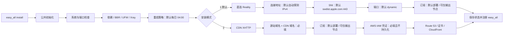

# easy_all

`easy_all` 是面向全新 Debian 12/13 amd64 VPS 的单节点安装器。一个项目、一个命令，
安装时只能选择一种模式：

| 安装模式       | 协议                         | 入口              |
| -------------- | ---------------------------- | ----------------- |
| 直连 - Reality | VLESS TCP Reality Vision     | VPS TCP 443       |
| CDN - XHTTP    | VLESS XHTTP stream-up / HTTP2 | CDN HTTPS 443     |

CDN XHTTP 当前使用 AWS Route 53、ACM 和 CloudFront。协议状态使用 `xhttp`，
Provider 单独记录为 `aws`，以后接入其他 CDN 时不改变安装模式和 XHTTP 实现。

同一台 VPS 只能安装一种模式。脚本会管理 Xray、Nginx、证书、UFW、BBR 和订阅文件，
只适合专用 VPS。

## 安装

一条命令下载完整项目并进入交互安装：

```bash
bash <(curl -fsSL https://raw.githubusercontent.com/v2yiz/easy_all/main/bootstrap.sh)
```

不要改成 `curl ... | sudo bash`：安装器需要从当前终端读取模式、域名和订阅选项。引导脚本会：

1. 检查 `git`；缺失时先通过 APT 安装 `git` 和 CA 证书。
2. 浅克隆 `main` 分支完整项目到权限受限的临时目录。
3. 校验入口、两个 Profile 和 Mihomo 模板均存在。
4. 通过 `sudo` 启动交互安装。
5. 安装结束后删除临时下载目录。

也可以克隆或下载完整项目后手动执行：

```bash
chmod 700 easy_all
sudo ./easy_all install
```

安装器只支持交互安装，不接受 `install reality` 或 `install xhttp` 参数：

```text
请选择安装模式：
  1. 直连 - Reality
  2. CDN - XHTTP
请选择 [1]:
```

## 安装脑图



公共交互选项：

| 输入 | 选项/格式 | 默认值 | 直接回车 |
| --- | --- | --- | --- |
| 安装模式 | `1` Reality / `2` CDN XHTTP | `1` | 安装 Reality |
| 定时重启 | `1` 每日 04:00 / `2` 自定义 / `3` 不配置 | `1` | 写入每日 04:00 的 root crontab |
| 自定义重启小时 | `0-23` | 无 | 不允许为空 |

脚本提示中的 `[值]` 表示直接回车会采用该值；没有方括号且没有明确写“可留空”的输入必须填写。
UUID、Reality 密钥、XHTTP 路径和 Origin Key 属于自动生成项，不会作为交互选项询问。

安装成功后统一使用：

```bash
easy_all show
easy_all subscription
easy_all status
easy_all update
easy_all update-sub
easy_all update-core
easy_all renew-cert
easy_all uninstall
```

## 直连 Reality

Reality 使用 Xray 监听 TCP `443`，客户端节点包含：

- `security=reality`
- `flow=xtls-rprx-vision`
- `type=tcp`
- Chrome 指纹、Reality public key 和 short ID

安装时需要确认客户端连接地址和 Reality SNI/伪装目标。默认伪装目标为
`swdist.apple.com:443`。

订阅支持固定 `443` 或动态端口。动态模式从 `10000-65535` 生成订阅端口，并由本机
UFW 受管 NAT 区块转发到 Xray `443`。UFW 默认拒绝入站与转发，只放行 SSH、Reality
和已启用的订阅端口。

Reality 的订阅模式：

1. 部署 Nginx HTTPS `8443` 订阅。
2. 不部署，仅输出节点信息。

Reality 交互选项：

| 输入 | 默认值 | 直接回车 |
| --- | --- | --- |
| 客户端连接地址 | 自动探测到的公网 IPv4 | 使用探测值；探测失败时必须手填 |
| Reality SNI/目标 | `swdist.apple.com:443` | 使用默认目标 |
| 订阅端口 | `dynamic` | 随机生成 `10000-65535` 端口 |
| 订阅输出 | 部署 Nginx HTTPS `8443` | 部署订阅服务 |
| 自托管订阅域名 | 无 | 不允许为空 |
| Mihomo 下载文件名 | `EASY_ALL` | 使用 `EASY_ALL` |
| Token 字典 | 自动生成 `owner` Token | 使用屏幕显示的随机 Token |

Reality 入站只监听 IPv4。使用域名作为连接地址时不得发布 AAAA，否则安装会 fail-fast。

自托管订阅域名必须直接解析到 VPS：

```text
https://sub.example.com:8443/subscribe?token=owner-token
https://sub.example.com:8443/subscribe?token=owner-token&flag=clash
```

## CDN XHTTP

XHTTP 使用 `stream-up + HTTP/2 + XMUX`。当前链路为：
CDN 模式只输出一个 VLESS XHTTP 节点，不混入其他协议。

安装和 `easy_all update-sub` 都提供两个订阅选项：

1. 部署 CloudFront + Nginx 订阅服务，并输出节点信息。
2. 不部署订阅服务，仅输出节点信息。

CDN XHTTP 交互选项：

| 输入 | 默认值 | 直接回车 |
| --- | --- | --- |
| Route 53 源站域名 | 无 | 不允许为空 |
| CloudFront CDN 域名 | 无 | 不允许为空 |
| 订阅输出 | 部署 CloudFront + Nginx | 部署订阅服务 |
| Mihomo 下载文件名 | `EASY_ALL` | 使用 `EASY_ALL` |
| Token 字典 | 自动生成 `owner` Token | 使用屏幕显示的随机 Token |
| AWS Access Key ID | 无 | 不允许为空 |
| AWS Secret Access Key | 无 | 不允许为空 |

XHTTP 节点名默认 `VLESS_XHTTP_H2`，本机端口默认 `10086`，UUID、XHTTP 路径和 Origin Key
自动生成，不需要用户输入。

`easy_all update-sub` 会重新显示订阅菜单。Reality 的端口菜单和两种 Profile 的订阅菜单
都会把当前值显示在方括号中，直接回车沿用当前状态。

```text
客户端 -> CloudFront HTTPS 443 -> Nginx gRPC -> Xray 127.0.0.1:10086
```

需要两个位于 Route 53 Public Hosted Zone 的域名：

| 域名示例             | 用途                                      |
| -------------------- | ----------------------------------------- |
| `origin.example.com` | CloudFront HTTPS 源站，A 记录指向 VPS     |
| `node.example.com`   | 客户端和订阅入口，CNAME 指向 CloudFront   |

CloudFront + Nginx 订阅接口同时校验：

- CloudFront 注入的 `X-Easy-All-Origin-Key`
- URL 查询参数中的用户 Token

订阅响应设置 `Cache-Control: no-store`。所有客户端节点和订阅地址只使用 CDN 域名，
不会暴露源站域名。

AWS Access Key ID 与 Secret Access Key 仅在当前命令进程中使用，不写入状态文件。不要为根用户创建访问密钥，应创建
权限受限的专用 IAM 用户。完整 IAM 权限、CloudFront 参数和故障排查见
[CDN XHTTP 的 AWS 配置](docs/xhttp-aws.md)。
推荐创建 `easy_all_deploy_policy`，并通过“添加用户到组”授予专用部署用户。

## 状态与边界

统一状态目录：

```text
/etc/easy_all/state.env
/etc/easy_all/xray/config.json
/var/www/easy_all/subscriptions/
/etc/nginx/conf.d/easy_all.conf
/etc/systemd/system/easy_all-xray.service
```

状态字段包括：

```text
STATE_VERSION=2
PROTOCOL=reality|xhttp
CDN_PROVIDER=aws
```

Reality 的 `CDN_PROVIDER` 为空。XHTTP 当前固定为 `aws`。AWS Access Key 和 Secret
Access Key 不会持久化。

卸载 XHTTP 时只删除本机资源，保留 CloudFront、ACM 和 Route 53 资源，避免误删共享的
云资源。卸载完成后应在 AWS Console 中人工确认是否清理。

## 模块

用户始终只运行 `easy_all`。内部按粗粒度拆分：

```text
easy_all
lib/reality.sh
lib/xhttp.sh
sample-mihomo.yaml
```

入口只负责模式选择和命令分发。两个 Profile 不互相调用；XHTTP 状态通过
`CDN_PROVIDER` 与具体 CDN 实现解耦。

## 测试

```bash
npm test
```

测试覆盖统一入口、Reality、XHTTP、Xray 配置、CloudFront JSON、Route 53、订阅渲染、
Token 鉴权、证书续期检查和更新顺序。

## 独立工具：debian_init

`debian_init.sh` 是独立的个人服务器初始化工具，不是 `easy_all` 的组成部分或安装前置步骤，
也不会安装、更新或卸载代理节点。

它应在本地管理机交互运行，通过 SSH 初始化一台全新的 Debian 12/13 amd64、systemd、
非容器服务器：

```bash
chmod 700 debian_init.sh
./debian_init.sh
```

本地需要 `ssh`、`scp` 和 `ssh-keygen`；安装 `sshpass` 后可自动提交首次 SSH 密码，
否则按 SSH 提示交互输入。脚本会明确询问服务器地址、初始登录用户、普通用户名及 sudo
密码、SSH key、本地 Host 别名、当前/最终 SSH 端口，以及需要由 UFW 额外放行的 TCP 端口。

`debian_init` 交互选项：

| 输入 | 默认值 | 直接回车 |
| --- | --- | --- |
| 服务器 IP/域名 | 无 | 不允许为空 |
| 初始 SSH 用户 | `root` | 使用 `root` |
| 初始用户密码 | 无 | 交给 SSH 自己交互询问 |
| 最终普通用户名 | 无 | 不允许为空 |
| 普通用户 sudo 密码 | 无 | 不允许为空，必须输入两次 |
| 本地 SSH Host 别名 | `<普通用户>-<服务器>` | 使用生成值 |
| 当前 SSH 端口 | `22` | 使用 `22` |
| 是否修改 SSH 端口 | `no` | 不修改 |
| 新 SSH 端口 | `2222` | 仅选择修改时采用 `2222` |
| UFW 额外 TCP 端口 | 空 | 仅放行 SSH 相关端口 |
| SSH key 选择 | `g` | 生成新的 ed25519 key |
| 新 key 文件名 | `id_ed25519_<Host别名>` | 使用生成名称 |
| 新私钥 passphrase | 空 | 创建无 passphrase 私钥 |
| 是否移除旧 SSH 端口 | `no` | 保留旧端口 |

远端操作包括：

- 执行 `apt-get upgrade` 并安装基础工具。
- 使用 Debian 官方内核的 Google BBR，TCP 参数与 `easy_all` 保持一致；拒绝 XanMod。
- 配置并启用 UFW：默认拒绝入站和转发、允许出站，并为 SSH 当前/最终端口及用户显式输入的额外 TCP 端口添加受管规则；已有的其他 UFW 规则保持不变。
- 设置 `Asia/Shanghai` 时区并启用时间同步。
- 创建或更新普通用户、sudo 密码和 SSH 公钥。
- 为普通用户安装 `uv` 和 Python 3.12。
- 写入独立的 `sshd_config.d` 配置，禁用密码及键盘交互认证，root 仅允许密钥登录。
- 在本地 `~/.ssh/config` 写入带保活参数的受管 Host 配置。

BBR 配置写入 `/etc/sysctl.d/99-debian-init-bbr.conf`，模块加载配置写入
`/etc/modules-load.d/debian-init-bbr.conf`。UFW 规则使用 `debian-init-managed` 注释，
重复执行时只替换该工具管理的规则，不删除用户自己的其他 UFW 规则。

该工具没有完整卸载或系统回滚命令。执行前应确认目标是可由它接管 SSH、安全策略、软件包、
时区和用户配置的个人服务器，并保留当前 SSH 会话，直到新的普通用户密钥登录验证成功。
