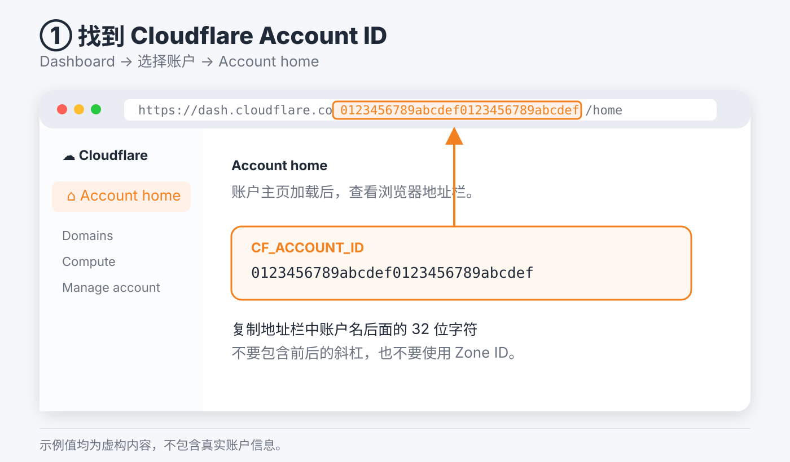
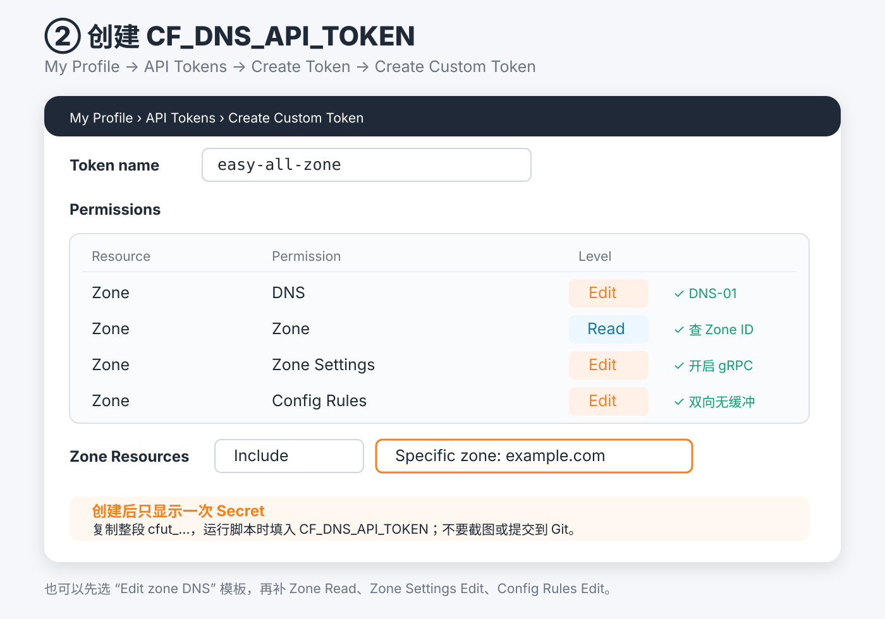
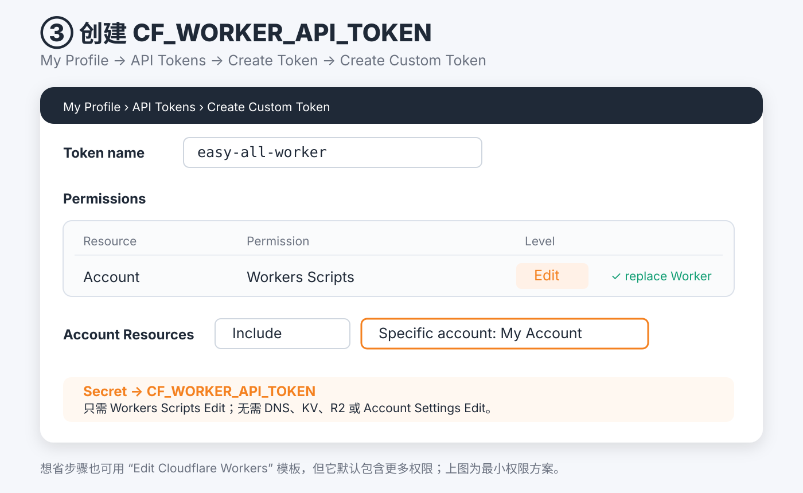
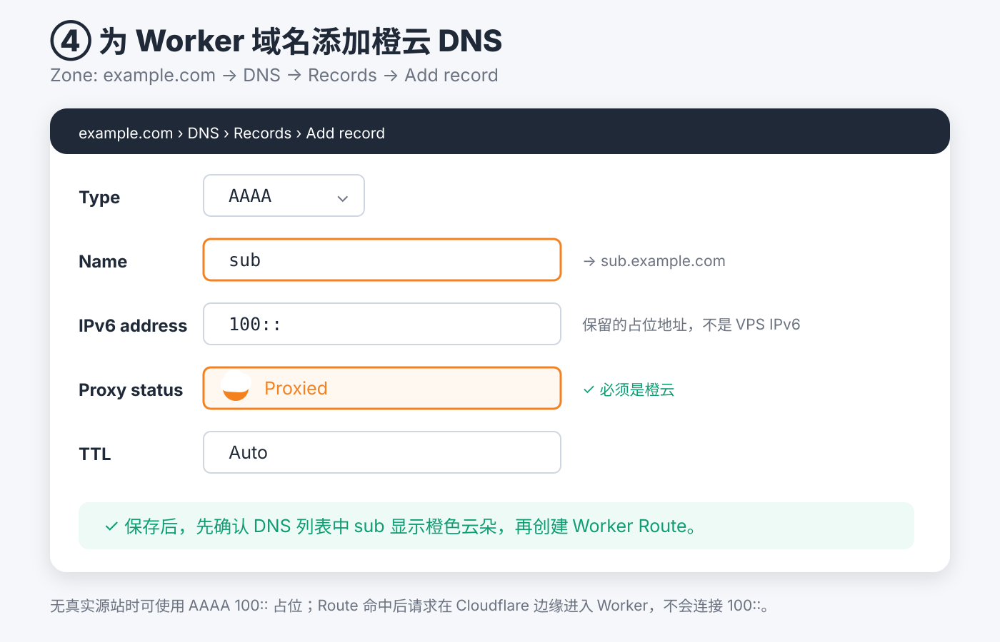
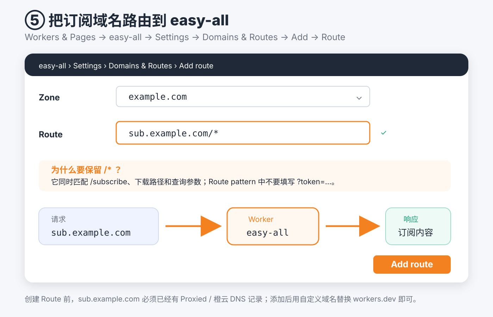

# easy_all

`easy_all` 是包含完整安装核心的单文件安装器，一次只运行一种协议：

| 协议 | 服务端 | 端口模式 | Cloudflare DNS |
|---|---|---|---|
| VLESS TCP Reality Vision | Xray | 默认 `dynamic`，可选 `443` | 不要求代理 |
| AnyTLS | sing-box | 默认 `443`，可选 `dynamic` | 必须始终保持灰云 |

该入口面向通用 VPS，只提供 Reality 与 AnyTLS，并部署 Worker `easy-all`。需要 XHTTP/WSS 和 Cloudflare CDN 时，请使用独立的 [`for_cmcc/easy_cmcc`](for_cmcc/README.md)。

如果服务器当前仍是旧版 `easy_all` 创建的 XHTTP/WSS 安装，请先用原有旧版命令执行 `easy_all uninstall`，再安装 `easy_cmcc`。新版 `easy_all` 会拒绝读取 XHTTP/WSS 状态，不再迁移、更新或接管这类安装。

旧的 `easy_reality.sh` 和 `easy_anytls.sh` 已下线，也不提供旧状态迁移。检测到 `/etc/easy_reality` 或 `/etc/easy_anytls` 时，新脚本会停止安装；请先用旧脚本的卸载命令清理。

## 安装前须知

- 只支持 Debian 12/13、amd64、systemd 和 root。
- 脚本适用于专用 VPS，会升级系统软件包、安装 XanMod LTS、启用 BBR、管理 root 每日重启任务，并接管完整 `/etc/nftables.conf`。
- TCP 使用 `fq + BBR`，收发自动调优上限为 32 MiB，接收积压为 16384，并启用 MTU 黑洞探测。
- 两种协议都使用 TCP 443，所以同一时间只能启用一种。
- Reality 和 AnyTLS 的 `dynamic` 是订阅端口：服务器仍监听 443，nftables 将 TCP `10000-65535` 转发到 443。
- 只有 Gemini 及其必要 Google 依赖会由每台 VPS 固定选择单一地址族；`auto` 模式实测 Gemini 的 IPv4/IPv6 后选择更快的一侧，避免 `IPv4 != IPv6` 且不牺牲速度。Claude、OpenAI、MEGA 及其他服务保持服务端默认双栈行为。
- AnyTLS 不是 WebSocket，普通 Cloudflare CDN 不能代理它；域名安装前后都要保持 DNS only / 灰云。

## 快速安装

```bash
wget -qO /root/easy_all.new "https://raw.githubusercontent.com/v2yiz/easy_all/main/easy_all" && chmod 700 /root/easy_all.new && mv -f /root/easy_all.new /root/easy_all && /root/easy_all install
```

也可以直接指定协议：

```bash
/root/easy_all install reality
/root/easy_all install anytls
```

安装成功后会注册 `/usr/local/bin/easy_all`。

`easy_all update` 使用当前单文件刷新服务端配置和 Worker；安装器本身有更新时，请重新执行上面的原子下载命令。

## 常用命令

```bash
easy_all show
easy_all subscription
easy_all status
easy_all update-sub
easy_all update-core
easy_all renew-cert
easy_all switch reality
easy_all switch anytls
easy_all uninstall
```

`switch` 只支持由 `easy_all` 创建的安装。切换过程会先保存原协议的状态、服务配置、证书、核心和 nftables；新协议本机验收成功后才更新 Worker。若核心启动或 Worker API 上传失败，会自动恢复原协议。

`uninstall` 默认就是完整本机 purge，不再需要 `--purge`：删除 easy_all 的服务、核心、配置、证书副本、状态、日志、命令入口和备份，尝试恢复安装前的 nftables，并从 root crontab 精确移除 easy_all 托管的重启任务。若 acme.sh 确认由 easy_all 安装且已无其他证书，也会一并清理；共享 acme.sh 会保留。XanMod、已安装软件包和系统级 BBR/IPv6 初始化不会降级。

远端 Cloudflare Worker 不属于卸载范围。每次自动安装或切换都以 replace 方式覆盖同名 Worker，因此保留远端 Worker 不影响下次安装。

`easy_all update` 始终以自动模式 replace 当前同名 Worker，不继承历史的手动输出模式。
交互更新会重新提示输入未保存的 Cloudflare Worker API Token。若 Worker replace 失败，
更新会明确失败，不会静默改成手动部署。仅执行 `easy_all update-sub` 时才继续沿用已保存
的订阅部署模式，并先显示端口模式菜单；直接回车沿用当前模式，改变模式时会同步更新
nftables、服务端配置和 Worker。

## 协议说明

### Reality

```bash
sudo ./easy_all install reality
```

脚本会自动探测 VPS 公网 IPv4，并把它作为 Reality 客户端连接地址的默认值；直接回车即可采用。若服务器使用 NAT、浮动 IP、额外入站 IP，或者希望订阅显示域名，可以手动覆盖为客户端实际可达的 IPv4 或域名。域名必须直接解析到 VPS，托管在 Cloudflare 时保持 DNS only / 灰云，不能通过普通橙云 CDN 代理 Reality。

下一项会单独询问 `Reality SNI / 伪装目标（域名:端口）`，默认是 `swdist.apple.com:443`，直接回车即可采用，也可以输入其他可用的 TLS 1.3 站点。脚本将冒号前的域名同时写入服务端 `serverNames` 和客户端 SNI，并把完整的 `域名:端口` 写入 Reality `dest`；因此客户端连接地址与 SNI 是两个不同参数。

输出为 VLESS TCP Reality Vision，包含 `security=reality`、`type=tcp`、`flow=xtls-rprx-vision`、public key 和 short ID。交互安装会询问订阅端口模式，Reality 默认选择 `dynamic`；此模式会为订阅节点随机生成 `10000-65535` 端口，并由服务端 nftables 转发到 443，也可以选择固定 `443`。显式设置 `SUB_PORT_MODE=443|dynamic` 时不再询问。

### AnyTLS

```bash
sudo ./easy_all install anytls
```

安装时会询问完整域名、Cloudflare DNS Token、sing-box 版本和订阅端口模式，AnyTLS 默认选择固定 `443`，也可以选择 `dynamic`。sing-box 可选最新稳定版、最新 Alpha/pre-release 或指定具体版本号，默认使用最新稳定版；Alpha 可能包含未稳定行为。脚本通过 acme.sh、Let's Encrypt 和 Cloudflare DNS-01 签发证书，AnyTLS 密码会自动生成。

Mihomo 节点包含 `type: anytls`、TLS SNI、Chrome 指纹和 `udp: true`。`udp: true` 只表示客户端允许通过节点转发 UDP，不会把 AnyTLS 服务端监听改为 UDP。

两种协议的服务端都会嗅探 HTTP、TLS 和 QUIC 目标域名。相关域名在 Mihomo 客户端保留 Fake-IP，由代理把域名交给 VPS 解析，避免客户端先确定与所选 VPS 不匹配的目标地址。只有 Gemini 及其必要 Google 依赖进入固定地址族策略；ChatGPT、Claude 及其辅助域名直接使用普通 `direct` 的默认双栈行为。默认模式会分别请求三次 `https://gemini.google.com/`，比较可用地址族的中位耗时后固定选择更快的一侧。Xray 使用 `ForceIPv4` 或 `ForceIPv6`，sing-box 使用 `ipv4_only` 或 `ipv6_only`，因此同一台 VPS 上的 Gemini 请求不会在 IPv4/IPv6 之间漂移。没有全局 IPv6 地址或默认 IPv6 路由的 VPS 不执行 IPv6 测试并固定使用 IPv4。

自动测速通常适合“RN 双栈、VM 只有 IPv4”的组合，选择结果会写入 `/etc/easy_all/state.env`，后续更新继续沿用。MEGA 不包含显式域名规则或地址族策略，按通用规则和普通 `direct` 出口处理。

订阅中的代理节点不设置 Mihomo `ip-version`；但为避免 Windows TUN 在不完整 IPv6 网络上向浏览器下发不可达的 Fake IPv6，客户端模板默认使用 IPv4 DNS/Fake-IP/TUN。Gemini 的地址族固定仍只发生在 VPS 到 Google 的出口侧，不会连带限制 ChatGPT、Claude 或 MEGA 的服务端出口策略。

模板只保留通用局域网适配：`.lan`、`.local` 使用系统 DNS，RFC1918 IPv4、链路本地 IPv4、IPv6 ULA 与链路本地地址显式直连并绕过 TUN。TUN 固定使用 `mtu: 1500`；为兼容 Windows TUN + Reality/BWG，使用 `strict-route: false`。UDP/443 拒绝规则位于国内直连、显式规则和 GEOIP 规则之后，仅对尚未命中的流量生效，让浏览器回退到 TCP，同时避免误伤国内直连。

Mihomo 订阅不再加载与现有分流重复的远程 `private`、`proxy`、`direct`、`telegramcidr`、`lancidr` 和 `cncidr` provider。局域网与 Telegram IP 继续由显式规则处理，其他流量使用 `GEOSITE`、`GEOIP` 和最终 `MATCH` 兜底，减少规则解析、内存与后台更新开销。DNS 保留国内主解析器和境外 fallback，但不在 `nameserver-policy` 中引用代理策略组，避免 Windows 客户端启动时形成 DNS 与代理初始化依赖。IP 类规则附带 `no-resolve` 并排在域名规则之后，避免额外解析。

为确保 Fake-IP 和服务端统一出口生效，浏览器的“安全 DNS/使用安全 DNS”应设为“使用当前服务提供商”或关闭，不要指定自定义 DoH；Android 的“私人 DNS”也应关闭或设为自动。自定义 DoH/DoT 不经过 Mihomo 的 53 端口 DNS 劫持，可能把真实 IPv4/IPv6 目标直接交给代理，重新造成出口族漂移。

## Cloudflare 凭据图解

自动部署需要一个 Account ID 和两个彼此独立的 API Token。推荐在
**My Profile → API Tokens** 创建 User API Token，并将资源限制到 easy_all 使用的单个
账户或 Zone。Token Secret 创建后只显示一次，不要写入脚本、README、截图或 Git；
easy_all 仅在当前命令进程中使用它们，不会保存到状态文件。Cloudflare 的
[Token 创建流程](https://developers.cloudflare.com/fundamentals/api/get-started/create-token/)
和[权限清单](https://developers.cloudflare.com/fundamentals/api/reference/permissions/)
可用于核对界面名称。

### 1. CF_ACCOUNT_ID

进入 Cloudflare Dashboard，选择账户并打开 **Account home**。复制地址栏中账户名后、
`/home` 前的 32 位字符；不要误用域名页面的 Zone ID。



### 2. CF_DNS_API_TOKEN

选择 **Create Custom Token**，资源限制为实际使用的单个 Zone，添加以下权限：

- Zone → DNS → Edit
- Zone → Zone → Read



上图为 `easy_all` 与 `easy_cmcc` 共用图例：`easy_all` 只需要前两行；图中的
`Zone Settings → Edit` 和 `Config Rules → Edit` 仅供 `easy_cmcc` 自动配置
gRPC、WebSockets 与 XHTTP 双向无缓冲规则，`easy_all` 不需要添加。

### 3. CF_WORKER_API_TOKEN

选择 **Create Custom Token**，资源限制为实际使用的单个 Account，只添加
**Account → Workers Scripts → Edit**。也可以使用 **Edit Cloudflare Workers** 模板，
但模板默认包含 Workers Routes、KV、R2 等 easy_all 不需要的额外权限。



### 4. 为订阅域名添加 Proxied DNS 记录

如果希望使用 `https://sub.example.com/subscribe?...` 而不是 `workers.dev`，并准备通过
**Worker Route** 绑定域名，必须先在对应 Zone 的 **DNS → Records** 中为该主机名创建
一条 **Proxied / 橙云** `A` 记录。没有真实源站时可使用 `2.2.2.2` 作为占位地址；它
不是 VPS 的真实地址，匹配路由的请求会在 Cloudflare 边缘进入 Worker，不会访问该
占位地址。没有可用 IPv6 地址时不需要创建 `AAAA` 记录；只有确实需要并拥有可用
IPv6 地址时，才额外添加同名的橙云 `AAAA` 记录。



示例中的 Zone 是 `example.com`，Worker 域名是 `sub.example.com`。DNS 名称只填写
`sub`，代理状态必须显示 **Proxied**，不能是 **DNS only**。Cloudflare 要求 Route 使用的
域名或子域名已经存在橙云 DNS 记录，详见
[Workers Routes 文档](https://developers.cloudflare.com/workers/configuration/routing/routes/)。

### 5. 将域名路由到 easy-all Worker

进入 **Workers & Pages → easy-all → Settings → Domains & Routes → Add → Route**，选择
`example.com` Zone，并填写 `sub.example.com/*`。末尾的 `/*` 会覆盖 `/subscribe` 以及带
查询参数的订阅 URL；不要把 token 或查询参数写进 Route pattern。



添加成功后可使用：

```text
https://sub.example.com/subscribe?token=owner-token-123
https://sub.example.com/subscribe?token=owner-token-123&flag=clash
```

以上是手工 **Route + Proxied DNS** 方案，不会改变脚本记录的 `workers.dev` 地址，也不
需要把 Workers Routes 权限加入 `CF_WORKER_API_TOKEN`。如果 Worker 是该主机名唯一的
源站，也可以在同一菜单选择 **Custom Domain**；Cloudflare 会自动创建 DNS 记录和证书，
此时不要再重复添加同主机名的 Route。Cloudflare 当前对纯 Worker 源站更推荐 Custom
Domain，二者选择一种即可。

## Worker 订阅

安装或 `update-sub` 时可选择：

1. 自动部署：通过 Cloudflare API replace Worker。
2. 手动部署：输出完整 Worker 源码。
3. 只输出当前节点链接。

脚本会先询问订阅输出方式。选择自动部署或手动部署后，才会询问订阅用户 Token 字典，因为两种方式都会生成带访问保护的 Worker；选择“只输出当前节点链接”时不生成 Worker，也不会要求订阅 Token、Account ID 或 Worker API Token。手动部署仍然需要订阅 Token，它会直接内嵌到输出 Worker 的 `ALLOWED_TOKENS` 中。

自动和手动 Worker 模式都会询问 Mihomo 下载文件名，默认是 `EASY_ALL`，输入时不需要 `.yaml` 后缀。首次选择自动部署且本地尚无已部署 Worker 时，还会询问 Worker 名称，默认是 `easy-all`；后续 `update`、协议切换和已有 Worker 的 `update-sub` 会复用状态中的名称，避免意外部署出第二个 Worker。由手动/仅链接模式首次改为自动部署时，也会询问一次 Worker 名称。

默认 Worker 名称是 `easy-all`。API 请求会对网络错误、HTTP 408/429/5xx、Cloudflare `10007` 和 `10035` 做有限次数退避重试；Cloudflare 返回 `Retry-After` 响应头或结构化错误体中的 `retry_after` 时会优先遵守（单次最多等待 300 秒）。Worker 部署完成后会先等待 10 秒，再进行最多 12 次订阅 HTTP 验收；失败后的重试间隔随机为 2–5 秒。每轮 base64 与 Clash 请求使用同一个 Worker 版本亲和键并附带防缓存参数，避免发布传播期间两个格式命中不同版本。最近一次部署日志位于：

```text
/etc/easy_all/last-worker-deploy.log
```

日志权限为 `0600`，并对 UUID、密码、Token 和 Reality 密钥做脱敏。Worker API 上传成功但 workers.dev 公网验收暂时未通过时，脚本会保留新协议并给出警告，避免错误地回滚到与远端订阅不一致的旧协议。

Worker 支持：

- 默认 base64 节点订阅：`/subscribe?token=...`
- Mihomo/Clash YAML：`/subscribe?token=...&flag=clash`
- 可自定义 Clash 下载文件名。

### Worker 模板与规则来源

`sample-worker.js` 是 Worker 模板、Mihomo 规则和 Gemini 地址族策略的唯一来源，`easy_all` 不再保存第二份域名列表。脚本会从模板的 `EASY_ALL_GEMINI_DOMAINS_START/END` JSON 区块提取域名，并写入 Xray 或 sing-box 服务端配置。默认读取本仓库 `main` 分支的 `sample-worker.js`。

模板不会缓存到安装目录。通过 `/usr/local/bin/easy_all` 运行安装、切换、`update` 或 `update-sub` 时，每次操作都会重新获取最新模板，但一次操作只获取一次；服务端配置和 Worker 都复用这份已校验模板。现有 Token 和节点信息从状态文件重新注入。模板缺少配置、规则或 Gemini 域名边界，或者域名 JSON 非法、重复、未规范化时，脚本会立即停止，不会生成不一致的配置。

VPS 只保留单个脚本文件时，先确保仓库中的 `easy_all` 与 `sample-worker.js` 已发布到 `main`，再执行一行命令：

```bash
wget -qO /root/easy_all.new "https://raw.githubusercontent.com/v2yiz/easy_all/main/easy_all" && chmod 700 /root/easy_all.new && mv -f /root/easy_all.new /root/easy_all && /root/easy_all update
```

`update` 会先重新应用 BBR/TCP 参数，把当前脚本注册为 `/usr/local/bin/easy_all`，然后调用与 `update-sub` 相同的同步更新流程：安全重写并验收当前 Xray/sing-box 服务端配置，再强制自动 replace Worker。Worker replace 前若任何一步失败，会恢复旧服务端配置、本地 Worker、端口模式和 nftables；replace 已完成后则保留新服务端配置，避免远端订阅与 VPS 回滚后不一致。它会沿用状态文件中的 `ALLOWED_TOKENS`、节点信息和 `CF_ACCOUNT_ID`；若状态中没有 Account ID，脚本会先提示输入，随后安全提示重新输入未保存的 Cloudflare Worker API Token。

### 订阅访问 Token

自动或手动 Worker 模式的订阅入口使用 Token 字典作为访问白名单，格式必须是 JSON object：key 是便于识别的用户名，value 才是订阅 URL 中使用的 token。只输出节点链接模式不需要这一项。

```json
{"owner":"owner-token-123","alice":"alice-token-456"}
```

上面的配置会生成两组订阅地址：

```text
https://<worker>.workers.dev/subscribe?token=owner-token-123
https://<worker>.workers.dev/subscribe?token=owner-token-123&flag=clash
https://<worker>.workers.dev/subscribe?token=alice-token-456
https://<worker>.workers.dev/subscribe?token=alice-token-456&flag=clash
```

规则：

- 至少要包含一个用户。
- 用户名只允许 `A-Z a-z 0-9 . _ -`，长度 `1-64`。
- token 只允许 URL 安全字符 `A-Z a-z 0-9 . _ ~ -`，长度 `8-128`。
- 用户名和 token 都会去掉首尾空白；不允许空值、重复用户名或重复 token。
- 订阅校验只匹配 token 值，不匹配用户名。访问 `/subscribe?token=owner` 不会通过，除非某个用户的 token 值正好是 `owner`。

可以用下面的命令生成一个 URL 安全 token：

```bash
openssl rand -base64 24 | tr '+/' '-_' | tr -d '=\n'
```

Cloudflare API Token、DNS Token 不写入状态文件；订阅访问用的 Token 字典会保存到权限为 `0600` 的 `/etc/easy_all/state.env`，并写入自动生成的 Worker。

## 状态与验证

主要文件：

| 路径                                     | 用途                             |
| ---------------------------------------- | -------------------------------- |
| `/etc/easy_all/state.env`              | 当前协议及订阅状态，权限`0600` |
| `/etc/easy_all/subscribe-worker.js`    | 当前协议生成的 Worker            |
| `/etc/easy_all/last-worker-deploy.log` | Worker 分阶段部署日志            |
| `/etc/easy_all/backups/`               | 安装前与更新过程备份             |
| `/usr/local/bin/easy_all`              | 注册命令                         |

本地测试：

```bash
npm test
```

测试覆盖 Reality/AnyTLS 节点链接、Mihomo 输出、Worker base64 输出、状态安全、协议切换/回滚守卫，以及 `sample-worker.js`。
若本机已安装 Mihomo，可额外执行真实配置校验：

```bash
MIHOMO_BIN=/path/to/mihomo MIHOMO_DATA_DIR=/path/to/mihomo-data npm run test:mihomo
```

`MIHOMO_DATA_DIR` 应包含 Mihomo 校验 `GEOSITE`、`GEOIP` 规则所需的 `GeoSite.dat` 与 `Country.mmdb`；若省略，Mihomo 会按自身配置尝试下载。
