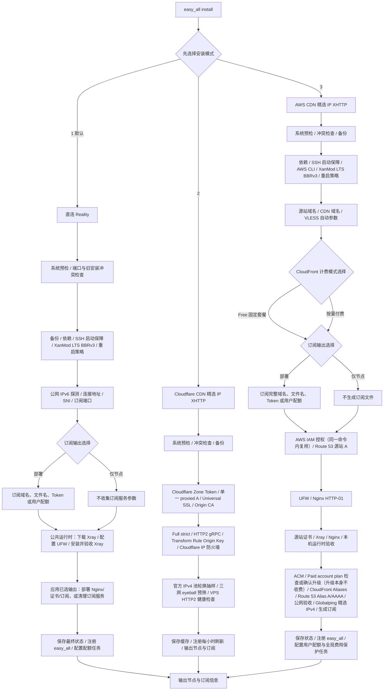

# easy_all

`easy_all` 是面向全新 Debian 12/13 amd64 VPS 的单节点安装器。一个项目、一个命令，
安装时只能选择一种模式：

| 安装模式       | 协议                         | CDN Provider / 入口 |
| -------------- | ---------------------------- | ------------------- |
| 1. 直连 - Reality | VLESS TCP Reality Vision     | VPS TCP 443         |
| 2. Cloudflare CDN 精选 IP - XHTTP | VLESS XHTTP stream-up / HTTP2 | Cloudflare + Globalping IPv4 |
| 3. AWS CDN 精选 IP - XHTTP | VLESS XHTTP stream-up / HTTP2 | CloudFront + Globalping IPv4 |

两个 CDN XHTTP 模式复用同一套 Xray、Nginx、订阅与用户配额运行时。精选 IP 模式由 VPS
Globalping 预筛、客户端测速选优；精选 IP 只改变客户端入口，不创建第二套 CDN 资源。

同一台 VPS 只能安装一种模式。脚本会管理 Xray、Nginx、证书、UFW、BBR 和订阅文件，
只适合专用 VPS。

三种安装模式都会保留 sshd 已检测到的现有端口，并通过公共平台模块额外监听 TCP `65533`；
UFW 会在拒绝其他入站流量前同时放行现有 SSH 端口和 `65533`。安装与 `easy_all apply`
都会校验 sshd 配置、实际监听套接字和 UFW 规则，任一环节失败都会停止应用。三种模式还会
通过同一公共模块安装并启用 Fail2ban：任一来源在 3 分钟内失败 6 次，只封禁触发 IP
3 小时；重复来源递增封禁且最长 1 周；`sshd` jail
始终跟随实际 SSH 端口列表。
生成的 Mihomo 配置会把 TCP `22` 和 `65533` 直连规则固定在规则列表顶部，避免开启 TUN 后
SSH 管理流量再次进入代理节点。

## 安装

线路与费用提示：只有非优化线路才推荐使用 CDN。Cloudflare 通常近乎免费；AWS CloudFront、
Route 53、ACM 等服务可能产生费用，启用 AWS 前请先阅读费用说明。

Cloudflare 精选 IP XHTTP 和 AWS 精选 IP XHTTP 需要先准备域名、Cloudflare/Globalping
账号和 Token；请先阅读统一的
[前置准备手册](docs/preparation-guide.md)。

一条命令下载完整项目并进入交互安装：

```bash
bash <(curl -fsSL https://raw.githubusercontent.com/v2yiz/easy_all/main/bootstrap.sh)
```

安装完成后，使用系统命令更新 easy_all 项目代码本身：

```bash
sudo easy_all self-update
```

`self-update` 只下载并原子替换 `/usr/local/lib/easy_all` 中的入口、三个 Profile、XHTTP 公共
运行时、公共支持模块和 Mihomo 模板，不修改 Xray、Nginx、订阅文件、系统参数或云端 CDN 资源。
代码包含配置生成变化时，再显式执行 `sudo easy_all apply` 将新代码应用到本机部署。

更新 Xray 核心请使用 `sudo easy_all update-core`。

不要把安装命令改成 `curl ... | sudo bash`：安装器需要从当前终端读取模式、域名和订阅选项。
安装引导脚本会：

1. 检查 `git`；缺失时先通过 APT 安装 `git` 和 CA 证书。
2. 浅克隆 `main` 分支完整项目到权限受限的临时目录。
3. 校验入口、三个 Profile、全部公共运行时模块和 Mihomo 模板均存在。
4. 通过 `sudo` 启动交互安装。
5. 安装结束后删除临时下载目录。

也可以克隆或下载完整项目后手动执行：

```bash
chmod 700 easy_all
sudo ./easy_all install
```

安装器只支持交互安装，不接受 `install reality` 或 `install xhttp` 参数：

```text
请选择安装模式：
  1. 直连 - Reality（优化线路推荐）
  2. Cloudflare CDN 精选 IP - XHTTP（中国大陆 Globalping 预筛 + 客户端测速）
  3. AWS CDN 精选 IP - XHTTP（中国大陆 Globalping 预筛 + 客户端测速）
请选择 [1]（直接回车使用默认值）:
```

## 安装脑图



图中是安装器的实际执行顺序。三种模式都只询问一次订阅输出；后续步骤只应用已保存的选择，不会再次询问。部署 CDN 订阅时可直接复用节点域名，也可输入独立的完整订阅域名。Cloudflare 模式只使用单一 proxied 一级子域；AWS 只接受 Route 53 Public Hosted Zone。所有精选 IP 模式均由 VPS 预筛并由客户端最终测速选优。

公共交互选项：

| 输入 | 选项/格式 | 默认值 | 直接回车 |
| --- | --- | --- | --- |
| CloudFront 计费 | `1` Free 固定套餐 / `2` 按量付费（默认推荐） | `2` | 选择 2 不会因升级 Paid account plan 立即收费；升级本身无固定月费，使用每月 1 TB / 1000 万请求免费额度，并启用 980 GB 全局费用保护 |
| Globalping Token | 模式 2/3 必填，隐藏输入 | 无 | 不允许为空；保存到 root-only 独立文件 |
| Cloudflare Zone Token | 模式 2 必填，隐藏输入 | 无 | 仅限目标 Zone 的 Zone、DNS、Transform Rules、Config Rules、Zone Settings、SSL and Certificates 最小权限 |
| 订阅输出 | `1` 部署（仅当前服务器推荐） / `2` 仅输出节点（多节点聚合或已有订阅服务器推荐） | `1` | 部署当前模式对应的订阅服务 |
| CDN 订阅链接完整域名 | 完整主机名，例如 `subscribe.example.com` | 当前 CDN 节点域名 | 复用节点域名；自定义值必须由当前 Provider 的同一 DNS 服务商托管 |
| 月度用户配额 | `1` 不启用 / `2` 启用 | `1` | 所有订阅用户共用当前节点 UUID |
| 配额 Token 覆盖 | `{用户: Token}` JSON 子集 | `{}` | 使用自动生成或已有 Token |
| VPS 开通日期 | `YYYY-MM-DD` | 当前 UTC 日期 | 以默认日期的“日”作为每月账期边界 |
| 安装模式 | `1` Reality / `2` Cloudflare 精选 IP / `3` AWS 精选 IP | `1` | 安装 Reality |
| 定时重启 | `1` 每日 04:00 / `2` 自定义 / `3` 不配置 | `1` | 写入每日 04:00 的 root crontab |
| 自定义重启小时 | `0-23` | 无 | 不允许为空 |

脚本提示中的 `[值]` 表示直接回车会采用该值；没有方括号且没有明确写“可留空”的输入必须填写。
UUID、Reality 密钥、XHTTP 路径和 Origin Key 属于自动生成项，不会作为交互选项询问。
所有需要用户输入的交互提示都会先显示中文，再在下一行显示英文；密码提示也保持双语并继续隐藏输入，
因此在中文乱码的 VNC 终端中仍可按英文提示完成操作。

三种安装模式的 Xray 普通公网出站统一使用 `AsIs`，由系统拨号器自动处理 IPv4/IPv6。Gemini 页面、
认证和静态资源使用的 Google 域名保留独立的 `ForceIPv4` 出站，客户端规则也继续固定走 `PROXY`，
因此同一 Gemini 会话始终看到所选 VPS 的 IPv4 出口，不会因某个关联请求走 IPv6 而混用出口地址。

内置 Mihomo 模板启用 `tcp-concurrent`，并发尝试节点域名解析出的候选地址以降低首次连接的
尾延迟，同时持久化 fake-IP 映射以减少客户端重启后的连接扰动。VPS 使用 `fq + XanMod BBRv3`，并关闭
`tcp_slow_start_after_idle`，避免复用的空闲 TCP 连接恢复传输时重新进入慢启动。

服务器把启用 `SO_KEEPALIVE` 的 TCP 套接字默认探测参数设为 `300/30/5`，并在三种 Xray 入站
显式启用相同的 300 秒空闲阈值与 30 秒探测间隔：空闲 300 秒后每 30 秒探测一次，连续 5 次无响应
后回收失效连接。它用于限制半开连接的资源占用，不能替代 XHTTP 为适配
CloudFront HTTP/2 空闲超时而设置的应用层保活。出站 TCP/UDP 临时端口范围设为
`13000-60999`（48,000 个端口），为代理出站连接增加容量，并避开 Reality 动态入口
`10000-12927`、本机 Xray/API 端口和 SSH `65533`；这项设置增加并发上限，不改善单连接延迟。

三种模式统一安装 XanMod LTS 内核；XanMod 官方将 Google BBRv3 内置为默认 `tcp_bbr`，因此
sysctl 中算法名称仍是 `bbr`，不能仅凭该名称把 Debian 官方内核的 BBRv1 当成 BBRv3。
安装器固定校验 XanMod APT 公钥指纹，通过 HTTPS 仓库安装，并按当前 CPU 能力选择
`linux-xanmod-lts-x64v1/v2/v3`；这里的 x64v1/v2/v3 是 CPU 指令集等级，不是 BBR 版本。
参考：[Google BBRv3 源码分支](https://github.com/google/bbr/tree/v3)、
[XanMod 官方 BBRv3 与 APT 安装说明](https://xanmod.org/)。

新内核安装后不会强制中断 SSH 自动重启；当前服务先继续运行，并显示 `pending-reboot`。完成安装后执行
`sudo reboot`，重新连接再运行 `sudo easy_all status`，只有输出 `BBRv3: active` 才表示已经进入
XanMod BBRv3。检测到 UEFI Secure Boot 时安装会提前停止，避免写入无法确认能够启动的第三方内核。

## 命令说明

安装成功后统一使用 `easy_all <命令>`：

| 命令 | 功能说明 |
| --- | --- |
| `show` | 显示当前 VLESS 链接和 Mihomo/Clash 节点片段。 |
| `subscription` | 显示节点、订阅部署状态和各 Token 对应的订阅地址。 |
| `status` | 显示 BBRv3、当前协议、本机服务、端口及订阅状态；CDN XHTTP 额外显示当前 Provider 的云端资源 ID、全局费用保护、Globalping 缓存与定时器状态，不调用云 API。 |
| `self-update` | 从 GitHub 下载并原子替换 easy_all 项目代码；不刷新部署，也不修改 Xray、Nginx、订阅或云端资源。 |
| `apply` | 使用 VPS 已安装的代码按当前状态重新生成并验收本机运行时和订阅；不下载项目代码，也不修改 Cloudflare 或 AWS。 |
| `apply-cloud` | 仅 CDN XHTTP 可用；应用本机配置，并同步当前 Provider 的云资源：Cloudflare 同步 proxied DNS/规则/边缘设置，AWS 同步 Route 53/ACM/CloudFront。 |
| `update-sub` | 重新选择订阅输出、订阅链接域名并管理用户/配额；同步重建本机 Xray、Nginx 和订阅文件。域名不变时不修改云资源，新增、更换或停用独立域名时同步当前 Provider 的 CDN、证书和托管 DNS。 |
| `refresh-cdn-ips` | 模式 2/3 可用；立即运行一次 Globalping 测量，更新当前 Provider 的本地缓存并原子重建订阅。 |
| `update-core` | 下载并更新 Xray 核心；更新失败时恢复旧版本。 |
| `renew-cert` | 强制续期当前模式使用的本机证书：Reality 仅在自托管订阅模式可用，CDN XHTTP 续期源站证书；不操作 ACM。 |
| `quota-status` | 显示每用户月度配额；AWS 按量付费时同时显示独立的 CDN 全局费用保护用量。 |
| `quota-set <用户> <GB>` | 修改指定用户的月度额度，不清零本月已用流量；`0` 表示不限量。 |
| `quota-reset <用户>` | 清零指定用户的本月已用流量，不修改额度、Token、UUID 或 email。 |
| `uninstall` | 仅卸载当前模式的本机资源，保留远端资源。使用 `easy_all uninstall --purge-cloud` 时，会先处理远端证书，再清理本机。 |
| `help` | 显示命令帮助。 |

项目脚本升级使用 `easy_all self-update`；部署配置应用使用 `easy_all apply`；只有确实需要同步
云资源时才使用 `easy_all apply-cloud`。

卸载与证书处理：默认 `easy_all uninstall` 只清理本机。若确认要先处理远端证书，再清理本机，
执行 `easy_all uninstall --purge-cloud`；脚本会在 Reality 上吊销 Let’s Encrypt 证书，并重新询问
对应的 Cloudflare 或 AWS 凭证。
远端操作失败时会立即停止，本机状态和证书不会删除。AWS ACM 没有此处意义上的吊销操作，脚本
尝试删除证书；若证书仍被 CloudFront 使用，AWS 会拒绝删除，需先在控制台解除关联。Cloudflare
Origin CA 可直接吊销。固定套餐、DNS、CDN
和其他共享资源不会被该选项自动删除。

### `apply` 的具体操作

默认执行 `easy_all apply` 不会改变 Reality/CDN 模式、UUID、节点域名或 XHTTP 路径，也不会
重新询问订阅模式。它读取 `/etc/easy_all/state.env` 中已有状态，以当前保存的参数重新生成配置。

| 当前模式 | `easy_all apply` 的执行步骤 |
| --- | --- |
| Reality | 1. 安装或验收 XanMod LTS BBRv3、重写 TCP 参数并注册当前 easy_all 代码。<br>2. 读取状态并备份 Xray/Nginx 配置、订阅文件、证书和 UFW 规则。<br>3. 保留订阅与端口模式，同步 SSH 监听、UFW 与 Fail2ban；自托管模式会校验 DNS、确保证书/Nginx 并重建订阅，仅节点模式会清理订阅服务。<br>4. 生成、重启并验收 Xray，保存状态、恢复配额任务后显示输出。 |
| CDN XHTTP（Cloudflare/AWS） | 1. 读取状态，备份 Xray/Nginx 配置和订阅文件。<br>2. 安装或验收 XanMod LTS BBRv3、重写 TCP 参数，并按当前状态同步 SSH 监听、UFW 与 Fail2ban。<br>3. 重启前结算尚未写入账本的 Xray 流量，再生成并验收 Xray 与 Nginx。<br>4. 按已保存的选择重建并验收订阅，或删除订阅文件；精选 IP 模式使用现有 Globalping 缓存。<br>5. 保存状态、注册当前代码、恢复用户配额、全局费用保护及 Globalping 刷新任务并显示输出。普通 `apply` 不读取云端凭证、不修改云资源。 |

Reality 和 CDN XHTTP 在订阅或运行时配置更新失败时，会恢复已备份的状态、
Xray/Nginx 配置和订阅文件。首次安装会恢复安装前记录的 TCP sysctl 运行值；普通 `apply` 会保留本次应用的
BBRv3/TCP 参数。已经成功创建或修改的云端资源不会自动回滚；已安装的内核包也不会在回滚或卸载时
自动删除，避免破坏当前启动项。

配置更新、核心更新和用户配额统计共用一把运行时写锁。同一时间只能执行一个写操作；检测到另一个
任务正在运行时会立即停止并提示稍后重试，避免并发写入覆盖最新配置。

### `apply-cloud` 的具体操作

`easy_all apply-cloud` 仅适用于 CDN XHTTP。它先读取状态与备份并更新本机 BBR/UFW，然后：
AWS 链路同步 Route 53 源站 A、ACM、账号套餐检查与 CloudFront。AWS 默认读取当前终端提供的
Access Key（也可显式启用默认凭证链）。已成功创建或变更的云资源不自动回滚，
因此只有云端配置确实需要同步时才应执行该命令。

### 轮换 UUID

`apply` 不会交互询问 UUID；需要轮换时，通过环境变量显式传入新值。以下命令会自动生成一个
新 UUID，重建当前模式的 Xray 和订阅配置，并将新 UUID 保存到状态文件：

```bash
sudo env VLESS_UUID="$(cat /proc/sys/kernel/random/uuid)" easy_all apply
```

也可将命令中的值替换为指定的标准 UUID。更新成功后，旧 UUID 立即失效；请从
`easy_all show` 获取新节点，或在已部署订阅服务时让客户端重新拉取订阅。CDN XHTTP 的普通
`apply` 不要求 AWS 凭证。

### 新增、删除或修改订阅用户

CDN XHTTP 部署订阅时，“订阅链接完整域名”直接回车会复用节点域名。输入独立域名后，AWS 会将它加入
同一 CloudFront 分配并由 ACM 证书覆盖。脚本只接受同一 DNS 服务商中已托管、已完成权威委派的
Route 53 Zone。若该完整域名已正确指向当前 CDN，脚本原样复用；没有记录才新增；已有其他 A、AAAA
或 CNAME 时停止，不接管也不覆盖。域名位于另一个托管 Zone 时，部署凭证必须同时拥有该 Zone 的
读写权限。

用户清单统一通过 `easy_all update-sub` 管理。该命令接收的是**完整用户清单**：保留的用户必须
继续写入，新增用户名会创建用户，省略已有用户名会删除用户。操作完成后运行
`sudo easy_all subscription` 查看每个用户名对应的新订阅地址。

#### 未启用月度配额

未启用配额时，用户由 `ALLOWED_TOKENS` JSON 定义。先运行 `sudo easy_all subscription` 找到
需要保留的现有 Token，再提交包含所有用户的完整字典。例如保留 `owner` 并新增 `user1`：

```bash
sudo env ALLOWED_TOKENS='{"owner":"existing-owner-token","user1":"new-user1-token"}' \
  easy_all update-sub
```

在订阅模式、下载文件名和配额提示中直接回车即可保留当前选择。若要删除 `user1`，再次执行命令
并从完整 JSON 中移除 `user1`。这种模式下每个用户有独立订阅 Token，但共享同一个 VLESS UUID；
如需独立 UUID 和独立流量统计，应启用月度配额，额度可设为 `0` 表示不限量。

用户名只能包含字母、数字、点、下划线和短横线，长度为 `1-64`。Token 只能使用 URL 安全字符
`A-Z`、`a-z`、`0-9`、`.`、`_`、`~`、`-`，长度为 `8-128`，且必须唯一。
`ALLOWED_TOKENS` 和 `QUOTA_TOKEN_OVERRIDES` 中的 Token 值必须是 JSON 字符串，不接受数字、布尔值或 `null`。环境变量中的 Token
可能进入 shell history；在共享服务器上应先关闭历史记录或改用安全的交互环境。

#### 已启用月度配额

运行 `sudo easy_all update-sub`，保留当前订阅选择，在“用户与月度配额 JSON”中提交完整用户
清单即可新增或删除用户。例如保留 `owner`、`user1`，并新增每月 `50 GB` 的 `user2`：

```bash
sudo env ENABLE_MONTHLY_QUOTA=2 \
  MONTHLY_QUOTAS_GB='{"owner":0,"user1":100,"user2":50}' \
  easy_all update-sub
```

脚本会为 `user2` 自动生成 Token、UUID 和 `easy_all.user2` email；同名已有用户会复用原 Token
和 UUID。需要指定新用户 Token 时增加
`QUOTA_TOKEN_OVERRIDES='{"user2":"new-user2-token"}'`。从完整配额 JSON 中省略用户会删除该用户。
`quota-set` 只能修改已有用户额度，不能新增用户。

### 可选的用户月度流量配额

部署订阅服务时，Reality 和 CDN XHTTP 都会询问是否启用按用户月度流量配额，默认不启用：

```text
是否启用按用户月度流量配额（按 VPS 开通日计算 UTC 月度账期）？
  1. 不启用（共用单个节点 UUID）
  2. 启用（每个订阅用户使用独立 UUID，超额自动停用）
请选择 [1]（直接回车使用默认值）:
```

选择启用后，只需填写“用户名到月度 GB 配额”的 JSON。这个 JSON 同时定义用户清单：

```json
{"owner": 0, "user1": 100, "user2": 250}
```

`0` 表示不限量。脚本会为每个新增用户名自动生成：

- 一个 URL 安全的订阅 Token；
- 一个独立的 VLESS UUID；
- 一个 `easy_all.<用户名>` 格式的 Xray `email`。

#### 覆盖自动生成的 Token

脚本生成或复用 Token 后会显示完整 Token 字典，并允许输入可选覆盖表。只填写需要覆盖的用户：

```text
已生成或复用用户 Token：{"owner":"自动Token1","user1":"自动Token2","user2":"自动Token3"}
可选 Token 覆盖 JSON（仅填写要覆盖的用户，直接回车不覆盖） [{}]:
```

例如只覆盖 `user1`：

```json
{"user1": "my-user1-token"}
```

最终结果中 `user1` 使用指定 Token，其他用户继续使用自动生成或原有 Token。覆盖表不能包含用户
清单之外的用户名；Token 必须使用 URL 安全字符且长度为 `8-128`，所有 Token 必须唯一。直接
回车采用 `{}`，即不覆盖。也可以非交互传入：

```bash
sudo env ENABLE_MONTHLY_QUOTA=2 \
  MONTHLY_QUOTAS_GB='{"owner":0,"user1":100}' \
  QUOTA_TOKEN_OVERRIDES='{"user1":"my-user1-token"}' \
  QUOTA_START_DATE='2026-08-15' \
  easy_all update-sub
```

不需要手工填写 UUID 或 email。安装完成后，`easy_all subscription` 会显示每个用户的最终
订阅地址。通过 `easy_all update-sub` 调整配额时，同名用户会复用原 Token 和 UUID；新增用户
名自动生成新凭据，删除用户名会移除对应凭据。`owner` 保留当前主 UUID，其他用户使用独立
UUID。启用或关闭配额会使受影响用户之前取得的共享节点配置失效，应重新拉取订阅。

#### VPS 开通日期与账期

启用配额时还会询问 VPS 开通日期：

```text
VPS 开通日期（YYYY-MM-DD，作为每月配额周期起点） [2026-08-19]（直接回车使用默认值）:
```

必须填写有效且不晚于当前 UTC 日期的日期。完整日期会保存到状态中，其中“日”作为以后每个月
的账期边界。例如开通日期为 `2026-01-15`：

```text
2026-08-15 至 2026-09-15
2026-09-15 至 2026-10-15
```

边界时间按 UTC 计算。若开通日为 29、30 或 31，而某个月没有该日期，则该月使用最后一天：
例如开通日为 31 日，2026 年 2 月的边界为 `2026-02-28`，下一个边界为 `2026-03-31`。
升级已有配额部署但状态中没有开通日期时，首次加载会使用升级当天，之后持久化保留。

#### 用户鉴权与流量归属

启用配额后，每个用户名对应一组 Token、UUID 和 Xray `email`，三者职责不同：

| 字段 | 使用位置 | 作用 |
| --- | --- | --- |
| Token | Nginx `/subscribe?token=...` | 鉴权订阅请求，并选择该用户专属的订阅文件。 |
| UUID | Xray VLESS `clients[].id` | 节点连接的实际认证凭据；每个用户必须不同。 |
| `email` | Xray VLESS `clients[].email` | Xray 内部的用户标识和流量计数器名称，不参与连接鉴权。 |

脚本根据用户名自动生成 Xray `email`，例如用户 `user1` 对应：

```json
{
  "id": "user1 的独立 UUID",
  "email": "easy_all.user1"
}
```

完整链路为：

```text
user1 的订阅 Token
  -> Nginx 只返回 user1 的订阅文件
  -> 客户端使用 user1 的独立 UUID 连接
  -> Xray 使用 UUID 完成 VLESS 鉴权
  -> Xray 将流量记入 email=easy_all.user1
```

Xray `StatsService` 生成以下计数器：

```text
user>>>easy_all.user1>>>traffic>>>uplink
user>>>easy_all.user1>>>traffic>>>downlink
```

因此，流量在 Xray 中是**按 email 标识统计**，但用户实际是**按 UUID 鉴权**。不能让多个用户
共用 UUID、只配置不同 email，否则 Xray 无法判断一次连接属于哪个用户。用户分享自己的 UUID
或订阅地址时，产生的流量仍全部计入该用户。

`StatsService` 仅监听 `127.0.0.1:10085`。systemd timer 每分钟累计各 email 的上下行流量到
`/etc/easy_all/quota-usage.json`。达到配额后，脚本从 Xray 客户端列表中移除该用户 UUID，
同时从 Nginx 订阅 Token 映射中移除该用户；进入下一个开通日账期后自动清零并恢复。状态文件
和统计文件权限均为 `0600`。

查看当前用量：

```bash
sudo easy_all quota-status
```

#### 单独修改用户额度

先通过 `quota-status` 确认用户名，再设置该用户的新月度额度：

```bash
sudo easy_all quota-set user1 200
```

该命令只把 `user1` 的月度额度改为 `200 GB`，不会清零本月已用量，也不会修改 Token、UUID
或 email。新额度立即参与判断：

- 新额度低于或等于本月已用量：用户立即停用；
- 调高额度后本月已用量低于新额度：用户立即恢复；
- 设置为 `0`：改为不限量并立即恢复。

用户名必须已经存在，额度必须是 `0-1000000` 的整数 GB。未知用户或未启用配额时命令会
fail-fast，不会隐式创建用户。新增或删除用户仍应使用 `easy_all update-sub` 修改完整用户清单。

#### 单独重置用户本月流量

需要保留额度和凭据、只把某个用户本月用量归零时执行：

```bash
sudo easy_all quota-reset user1
```

该命令会把 `user1` 的本月上下行累计值清零，但保持原月度额度、Token、UUID 和
`email=easy_all.user1` 不变。如果该用户因超额已停用，会立即重新加入 Xray 客户端列表和
Nginx Token 映射。重置只影响指定用户，不影响其他用户，也不会改变开通日账期。

重置是管理操作，执行后不会保留可恢复的旧累计值。执行前建议先运行
`easy_all quota-status` 记录当前用量。

通过 `easy_all update-sub` 可以重新选择是否启用配额或调整额度。非交互执行
`easy_all apply` 会保留当前配额配置。该机制按一分钟周期执行，属于近实时配额控制，不是
精确计费系统；定时任务执行间隔内可能有少量超额流量。CDN XHTTP 统计的是 Xray 看到的用户
载荷，不等同于 CloudFront 账单中的请求、协议开销或总传输字节。

## 直连 Reality

Reality 使用 Xray 监听 TCP `443`，客户端节点包含：

- `security=reality`
- `flow=xtls-rprx-vision`
- `type=tcp`
- Chrome 指纹、Reality public key 和 short ID

安装时需要确认客户端连接地址和 Reality SNI/伪装目标。默认伪装目标为
`swdist.apple.com:443`。安装器会使用当前 Xray 执行带 SNI 的 TLS 1.3 握手验收；握手失败
会中止应用。随后通过 RIPE Stat 尝试比较 VPS 与目标 IPv4 的 ASN：同 ASN 会确认通过，不同
ASN 会给出警告但不会阻止安装，查询不可用时同样只警告。Reality 官方建议优先选择与 VPS
同 ASN、证书和 TLS 行为稳定的目标。

订阅支持固定 `443` 或动态端口。动态模式按上海时间每 3 小时固定生成一个端口，所有物理节点
共享该端口；端口范围为 `10000-12927`，按闰年预留共 `2,928` 个端口。UFW 的 `before.rules` 受管 NAT 区块
保留前面 `56` 个历史 3 小时窗口，同时预开放当天全天 `8` 个端口和次日凌晨 `00/03` 的
`2` 个端口，共 `66` 个端口，并将它们重定向到 Xray `443`；不会生成数万条 UFW allow 规则。
每天 `00:01` 会刷新这组端口；每日重启任务也会先刷新并清理，再执行重启。UFW 过滤规则默认拒绝入站与转发，始终放行检测到的 SSH
端口、Reality TCP `443`、HTTP `80`（自托管订阅）和订阅 HTTPS `8443`（自托管订阅）。

Reality 的订阅模式：

1. 部署 Nginx HTTPS `8443` 订阅。
2. 不部署，仅输出节点信息。

Reality 生成的 Mihomo/Clash 节点默认输出 `ip-version: ipv4`。只有 VPS 已启用公网 IPv6，
且客户端连接域名发布的全部 AAAA 都与该公网 IPv6 匹配时，节点才输出 `ip-version: dual`。
模板总开关和业务 DNS 仍使用 `ipv6: true`，不会因此关闭其他业务域名的 IPv6 能力。

Reality 服务端与 CDN XHTTP 均阻断 IPv4/IPv6 私网、链路本地、回环、组播及保留地址，
避免订阅凭据泄露后被用于访问 VPS 内网或云元数据。

Reality 交互选项：

| 输入 | 默认值 | 直接回车 |
| --- | --- | --- |
| 客户端连接地址 | 自动探测到的公网 IPv4 | 使用探测值；探测失败时必须手填 |
| Reality SNI/目标 | `swdist.apple.com:443` | 使用默认目标 |
| 订阅端口 | `dynamic` | 每 3 小时固定生成并共享一个 `10000-12927` 端口 |
| 订阅输出 | 部署 Nginx HTTPS `8443` | 部署订阅服务 |
| 自托管订阅域名 | 无 | 不允许为空 |
| Mihomo 下载文件名 | `EASY_ALL` | 使用 `EASY_ALL` |
| Token 字典 | 自动生成 `owner` Token | 使用屏幕显示的随机 Token |

安装器会先检查服务器是否具有全局 IPv6 地址、IPv6 默认路由和可用的公网 IPv6 出口：

- 检测成功时，Reality 入站使用 `::` 显式启用 IPv4/IPv6 双栈，UFW 启用 IPv6；动态订阅端口同时写入 IPv4 与 IPv6 NAT 转发规则。
- 使用域名作为连接地址时，A 记录必须解析到当前 VPS 公网 IPv4；系统 DNS 优先，公共 DNS 可用时会交叉校验。
- 使用域名作为连接地址时，AAAA 可以不发布；未发布时客户端暂时使用 A 记录。发布 AAAA 后，其地址必须与检测到的 VPS 公网 IPv6 一致。
- 未检测到可用公网 IPv6 时保持 IPv4 入站；此时连接域名不得发布 AAAA，避免客户端连接到不可用的 IPv6 地址。

Reality 入站根据服务器公网 IPv6 自动选择 IPv4 或双栈监听；生成节点默认使用 `ipv4`，仅当
VPS 公网 IPv6 与节点域名 AAAA 完整匹配时使用 `dual`。Xray 普通目标出站使用双栈，Gemini
相关域名仍固定使用 IPv4 出口。

自托管订阅域名必须直接解析到 VPS：

```text
https://sub.example.com:8443/subscribe?token=owner-token
https://sub.example.com:8443/subscribe?token=owner-token&flag=clash
```

### Reality 维护与证书

`easy_all apply` 是 Reality 的幂等应用入口：它保留 UUID、Reality 密钥、订阅域名、Token
和 acme.sh 证书状态；证书尚未到续期时间时 acme.sh 不会重复签发。

Reality 的 `uninstall` 会删除本机状态和专用 acme.sh 目录；下一次安装是新的部署，并生成新的
节点凭据和证书状态。

证书申请失败时脚本会保留并显示 acme.sh/Let’s Encrypt 原始输出。检测到 HTTP 429、
`rateLimited`、`too many certificates` 或 `retry after` 时，会提示按 CA 给出的时间等待。
只有明确属于“重复证书/相同域名集合”限流时，才可改用已经解析到当前 VPS 的全新订阅域名；
账户、IP 或失败验证次数限流不能靠换域名绕过，应停止重试并等待。

## Cloudflare CDN 精选 IP XHTTP

模式 2 使用一个 proxied 一级子域（例如 `node.example.com`）作为唯一节点入口。Cloudflare
Universal SSL 终止客户端 TLS；VPS 使用 Origin CA 证书，SSL 模式固定为 Full (strict)。边缘开启
HTTP/2 与 gRPC，Transform Rule 为该节点名的回源请求注入 Origin Key，Nginx 同时校验 Host 与该密钥。
VPS 防火墙只允许 Cloudflare 官方 IP 段访问 443，并随官方 IP 列表更新。
部署前必须在目标 Zone 的 **Network → gRPC** 中手动开启 gRPC；该开关没有可用 API。安装、
`apply-cloud` 和 `refresh-cdn-ips` 会执行边缘验收，发现 Cloudflare 返回 `403` 时立即停止。

模式 2 从 Cloudflare 官方 IPv4 CIDR 按 `/24` 轮换抽样，每轮扫描 120 个地址。VPS 先以
`node.example.com` 作为 SNI/Host，并发验证 HTTPS、HTTP/2 与 `/easy_all-health`，避免把官方
地址范围中未提供 CDN 入口的地址提交测量。随后根据 Globalping 当前剩余免费额度自动限制候选数，
再分别使用中国电信 `AS4134`、中国联通 `AS4837`、中国移动 `AS9808` 的
`eyeball-network` 探针执行 TCP/443 零丢包预筛。每个运营商先按 RTT 取前 10，再合并去重并按
三网覆盖数、平均 RTT 排序，最终最多发布 18 个 IP 节点，并始终额外发布原始域名兜底节点。
所有节点的 `servername` 与
`xhttp-opts.host` 仍必须是 `node.example.com`。

VPS 使用 systemd timer 每小时更新缓存；安装、`apply` 和手动 `refresh-cdn-ips` 都会自动修复
并验收该 timer。刷新失败时保留旧缓存；缓存超过 72 小时只发布域名节点。Mihomo 每
600 秒在客户端网络运行一次 `url-test`；只有候选比当前节点快至少 50 ms 才切换，以减少抖动。
切换影响后续新连接，不会迁移已经建立的 XHTTP 会话。

该模式只使用一枚限制到目标 Zone 的 API Token（Zone Read、DNS Edit、Transform Rules Edit、
Config Rules Edit、Zone Settings Edit、SSL and Certificates Edit）。完整的
DNS、证书、规则、防火墙和条款/100 MB/长连接风险说明见
[前置准备手册](docs/preparation-guide.md)。

## AWS CDN XHTTP

XHTTP 使用 `stream-up + HTTP/2 + XMUX`。模式 3 使用 CloudFront 服务端链路，输出最多
10 个 Globalping 精选 IPv4 节点，不混入其他协议。AWS CloudFront、Route 53、ACM 等服务可能
产生费用；请在安装前阅读 [AWS 一次性准备指南](docs/aws-guide.md) 的费用边界。
XMUX 固定使用 `maxConnections: 2`、`cMaxReuseTimes: 0`、
`hMaxRequestTimes: "300-600"`、`hMaxReusableSecs: "900-1800"` 和
`hKeepAlivePeriod: 0`。

为避免长时间流式输出在中途被截断，Nginx 会在受 Origin Key 保护的 XHTTP 回源位置补充一个
合法的服务端 padding 标记，确保 Xray 实际启动 `scStreamUpServerSecs`，并每 `20-40` 秒发送
上行响应保活。该标记只存在于 CDN 到源站的内部链路，不会写入 VLESS URI 或 Mihomo/Clash
节点；客户端仍使用自身兼容的 padding 默认值。Nginx 对流式请求体和 gRPC 上下游统一使用
1 小时的读写空闲超时，CloudFront 源站响应包间超时与空闲连接复用时间均设为 120 秒，
且不设置请求总完成时限。

这项保活可减少长工具调用期间的中途重连，但不能承诺消除所有网络重连：如果下行响应连续超过
CloudFront 包间超时仍没有任何应用数据，CloudFront 仍可能关闭该请求。客户端应继续保留自动
重连能力。

安装和 `easy_all update-sub` 都提供两个订阅选项：

1. 启用通过 AWS CloudFront + Nginx 提供的订阅服务，并输出节点信息。
2. 不部署订阅服务，仅输出节点信息。

安装阶段会创建或同步 CloudFront；`update-sub` 会按新的用户/配额重建本机 Xray、
Nginx 和订阅文件，并复用现有 CloudFront，不会修改 AWS 资源。

CDN XHTTP 交互选项：

| 输入 | 默认值 | 直接回车 |
| --- | --- | --- |
| Route 53 源站域名 | 无 | 不允许为空 |
| CloudFront CDN 域名 | 无 | 不允许为空 |
| 客户端节点 IP 族 | 模式 2/3 固定为 `ipv4` | 自动固定，无需输入 |
| 订阅输出 | 启用 CloudFront + Nginx 订阅 | 启用订阅服务 |
| Mihomo 下载文件名 | `EASY_ALL` | 使用 `EASY_ALL` |
| Token 字典 | 自动生成 `owner` Token | 使用屏幕显示的随机 Token |
| AWS Access Key ID | 无 | 默认授权方式下不允许为空 |
| AWS Secret Access Key | 无 | 默认授权方式下不允许为空 |

XHTTP 节点名默认 `VLESS_XHTTP_H2`，本机端口默认 `10086`，UUID、XHTTP 路径和 Origin Key
自动生成，不需要用户输入。模式 2/3 的 Mihomo/Clash XHTTP 节点固定输出
`ip-version: ipv4`。Mihomo 模板同时固定
`unified-delay: false`，避免 XHTTP 上下行分离被统一延迟探测误判。模板总开关和业务 DNS 仍使用
`ipv6: true`。CloudFront 分配继续开启 IPv6 并创建 Alias A/AAAA；这与 VPS 是否具有 IPv6 无关。
两种 Provider 的源站回源仍使用独立 IPv4 A 记录；
VPS 普通目标出站使用双栈，Gemini 相关域名保持固定 IPv4 出口。

### 模式 2/3：Globalping 精选 IPv4

模式 3 使用 CloudFront、ACM、Route 53、源站证书、UUID、XHTTP 路径和 Origin Key，
并将 CloudFront 域名解析为经过 Globalping 筛选的 IPv4 节点：

```text
server: 精选 IPv4
servername: AWS CDN 域名
xhttp-opts.host: AWS CDN 域名
```

CloudFront 通过 TLS SNI 识别对应分配，因此连接地址可以是经过筛选的边缘 IPv4，但
`servername` 和 XHTTP `host` 必须继续使用已配置并由 ACM 证书覆盖的 CDN 域名。

模式 2 使用 Cloudflare 官方 IPv4 CIDR 抽样与三网探针算法，具体见上一节。模式 3
继续以 CDN 域名为目标，通过 Globalping 中国大陆探针执行 IPv4 TCP/443 测量，每个探针发送
10 包。只保留测量完成且 `loss=0`、`drop=0`、`rcv=10` 的地址，再由 VPS 使用 CDN 域名作为
SNI 访问 `/easy_all-health` 复核。结果去重并按覆盖探针数、平均 RTT 排序，最多保存 10 个：

```text
/etc/easy_all/aws-cdn-ips.json
/etc/easy_all/cloudflare-cdn-ips.json
```

刷新失败时继续使用上一版有效缓存；缓存超过 72 小时则生成原 CDN 域名回退节点。模式 2
即使缓存有效也保留域名兜底，并将 IP 候选限制为 18 个，因此 `url-test` 总计最多 19 个节点。
模式 2 的 Mihomo 订阅每 600 秒、模式 3 每 300 秒从客户端实际网络测速；候选快至少 50 ms
时才自动切换，且只影响后续新连接；Base64 订阅只包含多个候选 URI，不提供策略组语义。
客户端请求仍由 Nginx 读取静态订阅文件，不会等待 Globalping。

手动刷新：

```bash
sudo easy_all refresh-cdn-ips
```

Globalping 注册、Token 和运行边界见统一的
[前置准备手册](docs/preparation-guide.md)。

`easy_all update-sub` 会重新显示订阅菜单。Reality 的端口菜单和两种
Profile 的订阅菜单都会把当前值显示在方括号中，直接回车沿用当前状态。

Mihomo 响应的下载文件名严格使用保存值；默认下载为 `EASY_ALL`，不会自动追加 `.yaml`。

```text
客户端 -> CloudFront HTTPS 443 -> Nginx gRPC -> Xray 127.0.0.1:10086
```

CloudFront 源站链路固定使用 IPv4：脚本探测 VPS 公网 IPv4，并只为源站域名创建 Route 53
A 记录。同名 AAAA 或 CNAME 会被当作冲突并默认停止；确认覆盖时设置
`AWS_ORIGIN_DNS_REPLACE=1`。Nginx 同时写入 IPv4/IPv6 监听，但不会把 CloudFront 的源站 DNS
链路改为 AAAA。

需要两个位于 Route 53 Public Hosted Zone 的域名。这是必需条件：域名注册商可保留在原处，但这两个
域名所属的权威 DNS Zone 必须委派到 Route 53，脚本才能自动创建 A、ACM 验证和 CloudFront Alias
记录。本项目仅说明将整个主域名委派到 Route 53；如已有网站或邮件业务，请先迁移现有 DNS 记录。
完整操作、DNSSEC 注意事项和委派检查要点见
[AWS 一次性准备指南](docs/aws-guide.md#3-配置-route-53-权威-dns)。

> **DNS 操作边界：手动一次，后续自动。** 你只需手动创建 Route 53 Public Hosted Zone，并在域名
> 注册商将整个主域名的 NS 委派到 Route 53。之后安装脚本会探测 VPS 公网 IPv4，自动创建源站 A 记录、
> ACM DNS 验证记录，以及指向 CloudFront 的 Alias A/AAAA；无需手动创建这些节点记录。脚本不会
> 创建 Hosted Zone、修改注册商 NS，或接管已有记录。VPS IPv4 变化后，执行 `easy_all apply-cloud`
> 即可重新探测并同步源站 A 记录。

| 域名示例             | 用途                                      |
| -------------------- | ----------------------------------------- |
| `origin.example.com` | CloudFront HTTPS 源站，A 记录指向 VPS     |
| `node.example.com`   | 客户端和订阅入口，Alias A/AAAA 指向 CloudFront |

### CloudFront 计费选择与估算

安装时必须选择一种计费模式，选择结果写入状态，后续 `apply-cloud` 沿用该选择：

| 模式 | CloudFront 月度额度与超额 | Route 53/WAF 估算 |
| --- | --- | --- |
| Free 固定套餐 | `$0/月`，基准 100 GB + 100 万请求。超过基准仍无超额费，费用估算为 `$0`；持续明显超额时 AWS 可能减少或调整边缘交付能力。 | 脚本创建的 WAF，以及加入套餐的 CDN Hosted Zone、CloudFront Alias 和额度内其他 DNS 查询由套餐覆盖。若源站使用另一个 Hosted Zone，该 Zone 仍约 `$0.50/月 + $0.40/百万次标准查询`。 |
| 按量付费（默认） | 每月免费 1 TB + 1000 万请求。脚本自动启用独立的 980 GB 本机全局费用保护；超过 1 TB 后，以常见美国/欧洲至亚太边缘价格估算，每多 100 GB 约 `$8.50-$12.00`，超额请求另按实际边缘区域计费。 | 脚本不创建 WAF。每个 Public Hosted Zone 约 `$0.50/月`；指向 CloudFront 的 Alias A/AAAA 查询免费，其他标准查询约 `$0.04/10万次`、`$0.40/百万次`。同一 Zone 约 `$0.50/月`，源站与 CDN 分属两个 Zone 时约 `$1.00/月`，再加少量标准查询费。 |

两种 CloudFront 计费优惠不能叠加。按量付费的估算不包含 VPS 自身的 1 TB 上行流量、域名注册、
DNSSEC KMS、Health Check、Query Logs 等费用；最终金额还取决于实际边缘区域与 AWS 当期价格。

### 按量付费全局费用保护

选择 XHTTP + CloudFront 按量付费时，脚本自动启用一个独立于“每用户月度配额”的全局安全阀，
不再增加交互选项：

- 固定阈值为 `980 GB`，统计所有 Xray 用户的上行与下行总和；即使选择“仅输出节点”或没有启用
  每用户配额也会工作。
- 账期固定为 AWS 的 UTC 自然月：每月 1 日 `00:00 UTC` 重置；北京时间为每月 1 日 `08:00`。
- 本机 `StatsService` 只监听 `127.0.0.1:10085`，独立定时器每 15 秒结算一次。脚本主动重启
  Xray 前也会先结算，避免应用配置或更新核心时丢失尚未落盘的流量。
- 达到阈值后把 Xray 客户端列表整体置空并重启 Xray，从而终止现有连接并阻止新连接；进入下一
  UTC 自然月后自动恢复。
- 全局账本保存在 `/etc/easy_all/cdn-traffic-usage.json`，权限为 `0600`。AWS Access Key
  不会写入 VPS，也不参与这项本机定时统计。

该保护统计的是到达 Xray 的上下行字节，不是 CloudFront 精确账单，也不统计 CloudFront 已处理
但未到达 Xray 的请求、TLS/HTTP 开销或请求次数。因此它是带 20 GB 缓冲的费用安全阀，不是 AWS
侧硬额度；`1000 万次请求`仍不能通过 Xray 字节统计提前精确阻断。

### AWS 受管资源边界

安装和 `apply-cloud` 只管理带有 easy_all 稳定标记的 AWS 资源：

| AWS 资源 | 管理行为 |
| --- | --- |
| Route 53 源站 A | 已准确指向当前 VPS 时直接复用；不存在时创建。指向其他地址或存在 AAAA/CNAME 时默认停止，确认后设置 `AWS_ORIGIN_DNS_REPLACE=1`。 |
| ACM 证书 | 复用覆盖 CDN 域名的已签发或待验证证书，优先已签发证书；支持复用单级通配符证书。找不到时才申请新证书。 |
| WAF Web ACL | 仅 Free 固定套餐创建并复用默认放行的独占 Web ACL；按量付费不创建，避免 WAF 基础费。 |
| CloudFront | 按稳定标记 `easy_all:xhttp:<CDN域名>` 找回原分配，保留 Caller Reference 并更新为当前配置，不创建第二个分配。 |
| CloudFront 计费 | Free 固定套餐按分配 ARN 复用 `FREE` 套餐，并确保 CDN Hosted Zone 已加入；按量付费会确认分配没有关联固定套餐。检测到与已选模式冲突时停止，不自动切换计费。 |
| Route 53 CDN Alias | 已指向当前分配的 A 直接复用；遗留的同目标 AAAA 会自动删除。任何其他同名记录都默认停止，确认覆盖时设置 `AWS_DNS_REPLACE=1`。 |

脚本只复用带有当前稳定管理标记的 CloudFront 分配，不会自动接管无标记或其他用途的分配。
若 CDN 域名已被其他 CloudFront 分配占用，安装会停止，需先删除该分配或解除别名。若同一 CDN
域名异常存在多个带相同管理标记的分配，脚本也会停止并要求先消除歧义。

CloudFront + Nginx 订阅接口同时校验：

- CloudFront 注入的 `X-Easy-All-Origin-Key`
- URL 查询参数中的用户 Token

订阅响应设置 `Cache-Control: no-store`。模式 2/3 的节点连接地址使用精选 IPv4，但 SNI/Host
仍使用 CDN 域名。两种模式都不会暴露源站域名。

AWS 默认交互授权使用 Access Key ID 与 Secret Access Key；它们仅在当前命令进程中使用，
不写入状态文件。在 VPS 已配置可用的 IAM Role 或 AWS CLI 默认凭证链时，可执行
`sudo env AWS_USE_DEFAULT_CREDENTIAL_CHAIN=1 easy_all apply-cloud`，这时不询问两项 Access Key。
脚本检测到 Free account plan 时会在终端说明计费边界并要求一次确认，确认后调用 AWS API 升级
为 Paid。这个升级动作本身没有固定费用，也不是购买 CloudFront 固定套餐；它只是解除 Free plan
的服务限制并开启标准按量计费。只要仍在剩余 Free Tier Credit/适用免费额度内，通常不会产生
CloudFront 账单；超出 Credit/免费额度或使用不适用 credit 的资源后，AWS 仍会按标准价格计费。
剩余 Free Tier Credit 正常会保留至原到期日。脚本随后按安装时的选择创建 CloudFront
`FREE` 固定套餐，或保持按量付费且不创建 WAF；不会批准 Pro、Business 或 Premium 套餐。
非交互执行只有显式设置 `AWS_ACCOUNT_PLAN_UPGRADE=1` 才允许账号升级。
不要使用 AWS 根用户凭证；默认方式应创建权限受限的专用 IAM 用户。AWS 注册、最小权限策略、
IAM 用户与两项 Access Key 获取步骤见
[获取 AWS Access Key](docs/aws-guide.md#6-创建-access-key)。该文档只包含 AWS 控制台和域名注册商操作，不包含 VPS 命令；
默认凭证链的 VPS 用法仅在本 README 中说明。

## 状态与边界

统一状态目录：

```text
/etc/easy_all/state.env
/etc/easy_all/quota-usage.json
/etc/easy_all/cdn-traffic-usage.json
/etc/easy_all/globalping.token
/etc/easy_all/aws-cdn-ips.json
/etc/easy_all/xray/config.json
/etc/easy_all/certs/
/var/www/easy_all/subscriptions/
/etc/nginx/conf.d/easy_all.conf
/etc/systemd/system/easy_all-xray.service
/etc/systemd/system/easy_all-quota.service
/etc/systemd/system/easy_all-quota.timer
/etc/systemd/system/easy_all-cdn-traffic-guard.service
/etc/systemd/system/easy_all-cdn-traffic-guard.timer
/etc/systemd/system/easy_all-globalping-refresh.service
/etc/systemd/system/easy_all-globalping-refresh.timer
```

状态文件由安装器自动维护；仅接受当前新装生成的格式：

```text
STATE_VERSION=5  # Reality
STATE_VERSION=7  # XHTTP
PROTOCOL=reality|xhttp
CDN_PROVIDER=cloudflare|aws
AWS_CLOUDFRONT_BILLING_MODE=flat-free|payg   # 仅 AWS CDN XHTTP
CDN_CLIENT_IP_FAMILY=ipv4                     # 模式 2/3 固定 IPv4
CDN_TRAFFIC_PROTECTION_GB=0|980               # AWS 固定套餐为 0；AWS 按量为 980
```

Reality 的 `CDN_PROVIDER` 为空。easy_all 不会将 AWS Access Key、Secret Access Key、Session
Token 或 Globalping Token 持久化到状态文件。模式 2/3 的 Globalping Token
单独保存在 `/etc/easy_all/globalping.token`，权限为 `root:root 0600`。

CDN 全局保护由 `cdn-traffic-guard.sh` 统一实现，账本为 `cdn-traffic-usage.json`，定时器为
`easy_all-cdn-traffic-guard.timer`，AWS 按量付费使用内部命令 `cdn-traffic-sync`。

卸载 CDN XHTTP 时只删除本机资源，保留 AWS 远端资源，避免误删共享的云资源。卸载完成
后应在对应 Console 中人工确认是否清理。

## 模块

用户始终只运行 `easy_all`。依赖方向固定为“统一入口 → Profile → 公共模块”：

```text
easy_all
├─ profiles/
│  ├─ reality.sh             Reality 编排与专属配置
│  └─ xhttp-aws.sh           AWS Provider、状态与安装编排
├─ lib/
│  ├─ xhttp-runtime.sh       Cloudflare/AWS 共用的 XHTTP 本机运行时
│  ├─ globalping-cdn.sh      Cloudflare/AWS 精选 IPv4、缓存与每小时刷新任务
│  ├─ quota.sh               用户配额与统计
│  ├─ cdn-traffic-guard.sh    CDN 全局流量保护与 UTC 月度账本
│  ├─ platform.sh            root/systemd/SSH 启动保障
│  ├─ profile-common.sh      Profile 公共辅助、交互与字段校验
│  ├─ network.sh             公网 IPv4 探测、IPv4 直连与私网阻断
│  ├─ mihomo-template.sh     Mihomo 模板加载与校验
│  ├─ firewall.sh            SSH 端口发现与受管 UFW 过滤规则
│  ├─ xray-core.sh           Xray 下载、校验与安装
│  ├─ scheduled-maintenance.sh  证书续期与可选定时重启
│  ├─ subscription-auth.sh   非配额订阅 Token 校验与映射
│  └─ tcp-tuning.sh          XanMod LTS BBRv3 内核与保守 TCP 参数
├─ templates/
│  └─ mihomo.yaml            服务器订阅使用的生产模板
└─ scripts/
   └─ debian-init.sh         独立 Debian 初始化实现
```

入口负责模式选择、命令分发和完整运行时的原子注册。Reality、AWS XHTTP 与 Cloudflare XHTTP
Profile 只保留协议编排和 Provider 专属策略；公共模块不反向依赖 Profile。两个 XHTTP Profile
分别加载 `xhttp-runtime.sh`，共享 Xray、Nginx、订阅、证书和本机回滚实现，彼此不加载对方的
Provider 代码。两个 XHTTP Profile 通过 `xhttp_render_xray_config` 实现各自的服务端传输参数。

`profile-common.sh` 合并了公共交互、临时目录、统一命令注册和字段校验；
`scheduled-maintenance.sh` 统一管理 acme.sh 续期与可选定时重启。`network.sh` 负责公网 IPv4
探测和 Xray IPv4 直连策略，`firewall.sh` 负责具有系统副作用的 UFW 修改。

## 测试

```bash
npm test
```

测试覆盖统一入口、公共模块归属与安装完整性、XHTTP Runtime/Provider 隔离、Reality 目标验收、
三种安装模式的 IPv4 直连、私网目标阻断、Reality 客户端地址族策略、Globalping 严格零丢包筛选、
Cloudflare/AWS XHTTP、用户凭据与月度配额、TCP 参数回滚、Xray 配置、CloudFront JSON、
载荷、Route 53、订阅渲染、Token 鉴权、证书续期检查和更新顺序。

## Cloudflare 模式参考

模式 2 的 DNS、Universal SSL、Origin CA、Full (strict)、gRPC、Transform Rule、Zone-scoped Token、
Cloudflare IP 防火墙，以及 Globalping 缓存和长连接风险均见
[前置准备手册](docs/preparation-guide.md)。

## 独立工具：debian_init

`scripts/debian-init.sh` 是独立的个人服务器初始化工具，不是 `easy_all` 的组成部分或安装前置步骤，
也不会安装、更新或卸载代理节点。

它应在本地管理机交互运行，通过 SSH 初始化一台全新的 Debian 12/13 amd64、systemd、
非容器服务器。一条命令下载并执行：

```bash
bash <(curl -fsSL https://raw.githubusercontent.com/v2yiz/easy_all/main/scripts/debian-init.sh)
```

不要改成 `curl ... | bash`，脚本需要从当前终端持续读取服务器信息、密码和确认选项。
单文件入口会下载并校验项目的 `lib/platform.sh`，再将它与远端初始化脚本一起上传；因此
`scripts/debian-init.sh` 与直连、AWS CDN 使用完全相同的 SSH 端口和 Fail2ban 实现。

本地需要 `ssh`、`scp` 和 `ssh-keygen`；安装 `sshpass` 后可自动提交首次 SSH 密码，
否则按 SSH 提示交互输入。脚本会明确询问服务器地址、初始登录用户、普通用户名及 sudo
密码、SSH key、本地 Host 别名、当前/最终 SSH 端口，以及需要由 UFW 额外放行的 TCP 端口。

`debian_init` 交互选项：

| 输入 | 默认值 | 直接回车 |
| --- | --- | --- |
| 服务器 IP/域名 | 无 | 不允许为空 |
| 初始 SSH 用户 | `root` | 使用 `root` |
| 初始用户密码 | 无 | 交给 SSH 自己交互询问 |
| 最终普通用户名 | 无 | 不允许为空 |
| 普通用户 sudo 密码 | 无 | 不允许为空，必须输入两次 |
| 本地 SSH Host 别名 | `<普通用户>-<服务器>` | 使用生成值 |
| 当前 SSH 端口 | `22` | 使用 `22` |
| 新增 SSH 端口 | 固定 `65533` | 保留当前端口；当前端口使用默认值时同时监听 `22` 和 `65533` |
| UFW 额外 TCP 端口 | 空 | 仅放行 SSH 相关端口 |
| SSH key 选择 | `g` | 生成新的 ed25519 key |
| 新 key 文件名 | `id_ed25519_<Host别名>` | 使用生成名称 |
| 新私钥 passphrase | 空 | 创建无 passphrase 私钥 |

远端操作包括：

- 执行 `apt-get upgrade` 并安装基础工具及 Fail2ban。
- 服务器初始化阶段使用 Debian 官方内核的 Google BBR，并沿用与 `easy_all` 相同的 TCP 参数；
  `scripts/debian-init.sh` 是独立的 SSH/系统初始化工具，不属于三条代理链，因此不会安装 XanMod。随后安装
  easy_all 或执行 `easy_all apply` 时，三条代理链会统一换成 XanMod BBRv3。
- 配置并启用 UFW：默认拒绝入站和转发、允许出站，并为 SSH 当前/最终端口及用户显式输入的额外 TCP 端口添加受管规则；已有的其他 UFW 规则保持不变。
- 设置 `Asia/Shanghai` 时区并启用时间同步。
- 创建或更新普通用户、sudo 密码和 SSH 公钥。
- 为普通用户安装 `uv` 和 Python 3.12。
- 写入优先级明确的独立 `sshd_config.d` 配置，保留普通用户和 root 的密码登录，也保留密钥登录；
  同时缩短未认证连接宽限时间，限制单一来源与全局预认证连接，避免扫描占满 sshd 队列。
- 启用 Fail2ban 的 `sshd` jail：任一来源 3 分钟内失败 6 次后，只封禁触发 IP 3 小时；
  重复来源递增封禁，最长 1 周；Fail2ban 永久监控当前 SSH
  端口和新增的 `65533`，并通过 UFW 执行封禁。
- 在本地 `~/.ssh/config` 写入连接重试和保活参数的受管 Host 配置。

Reality 动态端口最高为 `12927`；新增 SSH 端口 `65533` 位于该范围之外，不会冲突。动态 NAT
按每日刷新策略保留历史端口并预开放当天及次日凌晨端口，旧端口会在凌晨刷新时移除；`80`、`443` 和 SSH
端口不受这个动态端口清理影响。
当前 SSH 端口不会删除；使用默认当前端口 `22` 时，sshd、UFW 和 Fail2ban 都会同时覆盖
`22` 与 `65533`。新增端口使用普通用户密钥登录验收成功后写入本地 Host 配置。
由于密码认证和 root 密码登录仍然开放，必须使用足够长且不复用的随机密码；Fail2ban 可以压制
重复失败来源，但不能代替强密码，也不能完全阻断分布式低频尝试。

BBR 配置写入 `/etc/sysctl.d/99-debian-init-bbr.conf`，模块加载配置写入
`/etc/modules-load.d/debian-init-bbr.conf`。UFW 规则使用 `debian-init-managed` 注释，
重复执行时只替换该工具管理的规则，不删除用户自己的其他 UFW 规则。

该工具没有完整卸载或系统回滚命令。执行前应确认目标是可由它接管 SSH、安全策略、软件包、
时区和用户配置的个人服务器，并保留当前 SSH 会话，直到新的普通用户密钥登录验证成功。
