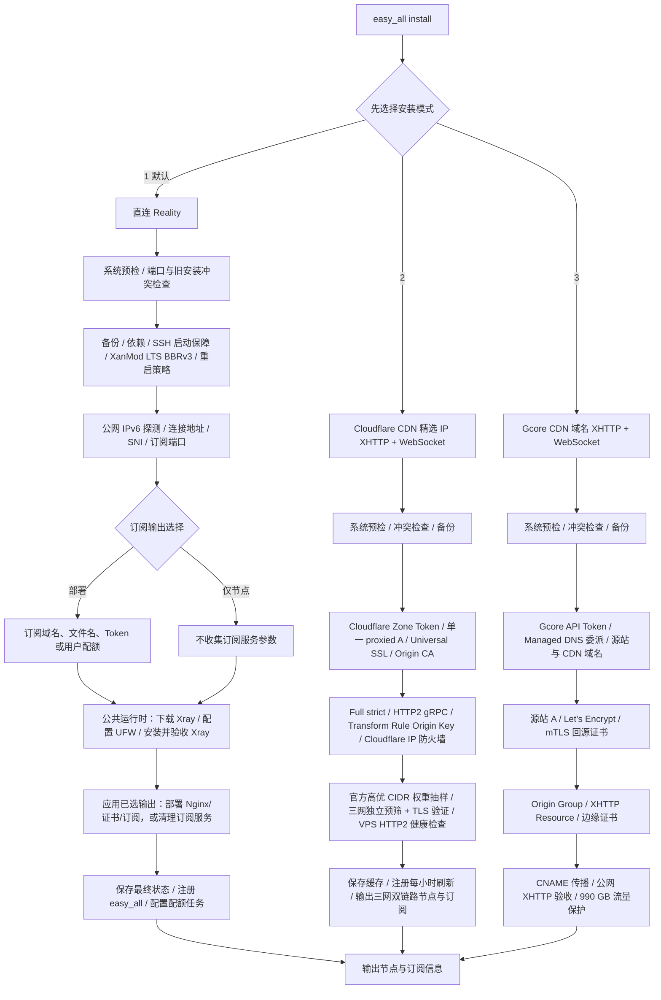

# easy_all

`easy_all` 是面向全新 Debian 12/13 amd64 VPS 的单节点安装器。一个项目、一个命令，
安装时只能选择一种模式。本文先给第一次使用的完整路径；协议、端口和配额等技术细节放在后文，
第一次安装不必先理解它们。

| 安装模式       | 协议                         | CDN Provider / 入口 |
| -------------- | ---------------------------- | ------------------- |
| 1. 直连 - Reality | VLESS TCP Reality Vision     | VPS TCP 443         |
| 2. Cloudflare CDN 精选 IP - XHTTP + WebSocket | VLESS XHTTP stream-up + WebSocket / TLS | Cloudflare + Globalping IPv4 |
| 3. Gcore CDN 域名 - XHTTP + WebSocket | VLESS XHTTP packet-up / WebSocket / TLS | Gcore CDN 域名 (Xray 核心) |
| 4. Gcore CDN 域名 - Sing-box (Trojan + VLESS WS) | Trojan WS / VLESS WS / TLS | Gcore CDN 域名 (Sing-box 核心) |
| 5. Cloudflare CDN 精选 IP - Sing-box (VLESS-WS + VLESS-gRPC) | VLESS WS + VLESS gRPC / TLS | Cloudflare + Globalping IPv4 (Sing-box 核心，严格 18 节点无域名兜底) |

Cloudflare 提供 XHTTP + WebSocket（Xray 核心）或 VLESS-WS + VLESS-gRPC（Sing-box 核心，三网精选 18 节点）；Gcore 提供 XHTTP + WebSocket（Xray 核心）或 Trojan + VLESS WebSocket（Sing-box 核心），由 Gcore DNS 调度域名；Reality 用于直连。

同一台 VPS 只能安装一种模式。脚本会管理 Xray/Sing-box、Nginx、证书、UFW、BBR 和订阅文件，
只适合不承载其他业务的专用 VPS。它不能承诺某条线路一定更快、更稳定或适合所有网络；请遵守
所在地区法律、VPS 服务商以及 Cloudflare 和 Gcore 的服务条款。

## 第一次安装：先看这里

### 1. 选择模式

| 你的情况 | 建议 | 需要额外准备 |
| --- | --- | --- |
| 第一次使用，或 VPS 直连已经可用 | 选择 `1`：Reality | 只需 VPS；如需自托管订阅，另需 Cloudflare 域名和 API Token。 |
| 明确要使用 Cloudflare CDN，并愿意维护域名、Token 和 gRPC 设置 | 选择 `2`：Cloudflare XHTTP | 域名、Cloudflare Active Zone、Cloudflare API Token、Globalping Token，并在控制台手动打开 gRPC。 |
| 需要 Gcore CDN 域名入口，并愿意维护 Gcore Managed DNS 和 API Token | 选择 `3`：Gcore XHTTP | Gcore Free CDN、Managed DNS Zone、源站/节点域名和 Gcore API Token；不需要 Globalping。 |
| 需要 Gcore CDN 域名入口，或有 iPhone 客户端需求（需要双节点简单自动切换） | 选择 `4`：Gcore Sing-box | 同模式 3 前置条件。若有 iPhone，推荐使用 Sing-box 后端及 iOS 客户端，开箱即支持 Trojan + VLESS 两节点自动测速与故障切换（urltest）；后端同时完全兼容 Mihomo 客户端。若已安装模式 3，可随时一键原地无缝切换为模式 4。 |
| 明确要使用 Cloudflare CDN，追求极致兼容或需要 Sing-box 服务端 + 三网自动测速策略组 | 选择 `5`：Cloudflare Sing-box | 同模式 2 前置条件。采用 Sing-box 服务端后端，同时监听 VLESS WS (10087) 与 VLESS gRPC (10086)；基于三网 Globalping 精选生成 9 个 IPv4 × 双协议 = 严格 18 个节点（无域名兜底）；Mihomo 与 Sing-box 订阅中内置三网独立测速组与全节点 AUTO 组。若已安装模式 2，可随时一键原地无缝切换为模式 5。 |

“优化线路”没有统一、可由脚本判断的标准。若不确定，先选择 Reality；只有直连体验不理想且你愿意
处理 Cloudflare 或 Gcore 前置准备时，再选择对应 CDN 模式。Gcore 模式下可在模式 3 与模式 4 之间通过 `easy_all switch-backend` 原地无缝迁移，无需重新创建云端资源。

### 2. 运行前检查清单

请逐项确认后再运行安装器：

- 你购买的是一台有**公网 IPv4** 的 VPS，系统为 **Debian 12 或 Debian 13**，CPU 架构为
  **amd64/x86_64/x64**；不要选择 ARM/aarch64，也不要使用 Docker、LXC 等容器。
- 你已经从自己的电脑登录到 VPS，且知道当前 SSH 登录用户、密码或密钥、端口和公网 IP。购买页面中的
  “Console / VNC / Web console” 也应能打开；它是 SSH 意外断开时的救援入口。
- 这是专用服务器：没有其他代理面板、Xray、Nginx 或业务占用相关端口。安装前建议在服务商控制台创建
  一份快照。
- 如果服务商还有 Security Group、云防火墙或网络 ACL，它与 VPS 内的 UFW 是两套规则。请勿让它拦截
  当前 SSH 端口、Reality 的 `443`，或 CDN 回源所需的 `443`；脚本无法修改服务商控制台规则。
- Cloudflare XHTTP 已按[前置准备手册](docs/preparation-guide.md)完成域名、Token 与 gRPC；不要提前创建
  `node.example.com` 或计划使用的独立订阅域名的 DNS 记录。
- Gcore XHTTP 已按[前置准备手册](docs/preparation-guide.md)完成根域名委派、源站/节点域名和 Gcore API Token；不要提前创建节点 CNAME。

> **安装会改动系统。** 它会安装 XanMod 内核和依赖、设置系统时区为 `Asia/Shanghai`、配置 UFW 和
> Fail2ban、额外让 SSH 监听 TCP `65533`、创建 systemd 定时任务，并管理 Xray/Nginx。请保留当前 SSH
> 会话直到安装、重启和重新登录均验证完成。

几个词的含义：VPS 是远程服务器；SSH 是从自己电脑连接它的终端方式；公网 IPv4 是别人可访问的
服务器 IP；Cloudflare Zone 就是已交给 Cloudflare 托管的根域名；橙云/Proxied 表示经过 Cloudflare，
灰云/DNS only 表示直连服务器。

### 3. 先登录 VPS，再运行安装命令

**下面的命令必须在 VPS 的 SSH 终端中运行，不是在自己的 Windows/macOS 终端、手机终端或 Cloudflare
网页中运行。**

例如，在 macOS/Linux 的 Terminal 或 Windows PowerShell/Windows Terminal 中，先按服务商提供的
登录信息连接（将尖括号内容替换为自己的值）：

```bash
ssh <登录用户>@<VPS公网IP> -p <SSH端口>
```

首次连接询问是否信任主机指纹时，先与服务商控制台显示的指纹核对；确认无误后输入 `yes`。看到类似
`root@...` 或 `<用户名>@...` 的提示符后，才表示已经进入 VPS。若服务商只提供网页终端，也可以在那里运行。

## 系统与安全保障

三种安装模式都会保留 sshd 已检测到的现有端口，并通过公共平台模块额外监听 TCP `65533`；
UFW 会在拒绝其他入站流量前同时放行现有 SSH 端口和 `65533`。安装与 `easy_all apply`
都会校验 sshd 配置、实际监听套接字和 UFW 规则，任一环节失败都会停止应用。三种模式还会
通过同一公共模块安装并启用 Fail2ban：任一来源在 3 分钟内失败 6 次，只封禁触发 IP
3 小时；重复来源递增封禁且最长 1 周；`sshd` jail
始终跟随实际 SSH 端口列表。
生成的 Mihomo 配置会把 TCP `22` 和 `65533` 直连规则固定在规则列表顶部，避免开启 TUN 后
SSH 管理流量再次进入代理节点。

## 安装

线路与费用提示：CDN 模式面向直连 VPS 体验不理想、且愿意维护域名和第三方账号的场景，并不保证一定更快。
Cloudflare Free Zone 与 Gcore Free CDN 的基础额度按 Provider 当前规则执行，域名注册费和 VPS 费用另计。

CDN 模式需要先准备对应 Provider 的域名、账号和 Token。请先阅读统一的
[前置准备手册](docs/preparation-guide.md)。Reality 只有在选择“部署订阅”时才需要 Cloudflare 域名和 API Token。

一条命令下载完整项目并进入交互安装：

```bash
bash <(curl -fsSL https://raw.githubusercontent.com/v2yiz/easy_all/main/bootstrap.sh)
```

请原样粘贴这条命令；不要改成 `curl ... | sudo bash`，安装器需要持续从当前终端读取选项。它会在
需要管理员权限时提示输入当前登录用户的 `sudo` 密码；输入密码时屏幕没有字符回显是正常的。

安装完成后，使用系统命令更新 easy_all 项目代码本身：

```bash
sudo easy_all self-update
```

`self-update` 只下载并原子替换 `/usr/local/lib/easy_all` 中的入口、三个 Profile、CDN 公共
运行时、公共支持模块和 Mihomo 模板，不修改 Xray、Nginx、订阅文件、系统参数或云端 CDN 资源。
代码包含配置生成变化时，再显式执行 `sudo easy_all apply` 将新代码应用到本机部署。

更新 Xray 核心请使用 `sudo easy_all update-core`。

安装引导脚本会：

1. 检查 `git`；缺失时先通过 APT 安装 `git` 和 CA 证书。
2. 浅克隆 `main` 分支完整项目到权限受限的临时目录。
3. 校验入口、三个 Profile、全部公共运行时模块和 Mihomo 模板均存在。
4. 通过 `sudo` 启动交互安装。
5. 安装结束后删除临时下载目录。

也可以克隆或下载完整项目后手动执行：

```bash
chmod 700 easy_all
sudo ./easy_all install
```

安装器只支持交互安装，不接受 `install reality` 或 `install xhttp` 参数：

```text
请选择安装模式：
  1. 直连 - Reality（优化线路推荐）
  2. Cloudflare CDN 精选 IP - XHTTP + WebSocket（三网独立优选 + 双链路）
  3. Gcore CDN 域名 - XHTTP + WebSocket（Gcore DNS 调度，不做 IP 精选）
  4. Gcore CDN 域名 - Sing-box（Trojan + VLESS WS 双链路，iPhone 推荐，自带两节点自动切换）
  5. Cloudflare CDN 精选 IP - Sing-box（VLESS-WS + VLESS-gRPC 双链路，三网精选 18 节点）
 请选择 [1]（直接回车使用默认值）:
```

### 4. 第一次输入时怎么选

下列建议面向“只自己使用、首次部署”的情况；不需要多用户配额时，遇到 JSON、Token 覆盖、UUID 和
Xray email 等问题都可以直接阅读后文的进阶章节，不必现在填写。

| 看到的选项 | 首次单用户建议 | 说明 |
| --- | --- | --- |
| 安装模式 | 不确定时选 `1` | `1` 是 Reality 直连，`2` 是 Cloudflare XHTTP + WebSocket 双链路，`3` 是 Gcore 域名 XHTTP，`4` 是 Gcore Sing-box（有 iPhone 时推荐，iOS Sing-box 开箱即享两节点自动切换，同时兼容 Mihomo）。 |
| 订阅输出 | 选 `1` 或直接回车 | 在本机部署订阅，之后可从客户端按链接导入。已有别的订阅服务器才选 `2`。 |
| 月度用户配额 | 选 `1` 或直接回车 | 单人通常不需要；启用后每个用户有独立凭据，适合之后再配置。 |
| 定时重启 | 希望每天凌晨短暂断线选 `1`；否则选 `3` | 默认每天 `04:00`（服务器时区 `Asia/Shanghai`）重启，会中断已有连接。 |
| Reality SNI/目标 | 直接回车 | 使用脚本验证过的默认值；不要随意填常见网站。 |
| Reality 动态端口 | 直接回车 | 这是**节点连接端口**的轮换策略，不是订阅下载端口。 |

所有提示中的 `[值]` 都表示直接按回车会采用该值；没有方括号且没有写“可留空”的输入必须填写。
输入 Cloudflare、Globalping 或 Gcore Token 时不会显示字符，粘贴后直接按回车即可。

### 5. 安装完成后：重启、验证、导入客户端

安装结束后不要立刻关闭终端。新 XanMod 内核需要重启才会生效：

```bash
sudo reboot
```

SSH 会断开。等待 VPS 启动后重新登录，运行：

```bash
sudo easy_all status
sudo easy_all subscription
```

`status` 显示 `BBRv3: active` 才表示新内核已生效；若显示 `pending-reboot`，说明还没有成功从新内核
启动。`subscription` 会显示每位用户的订阅地址。订阅地址与 UUID 都是访问凭据，不要截图、公开或发送给
不信任的人。

在电脑或手机上安装支持 Mihomo 配置的客户端，在其“从 URL 导入配置 / Import from URL”位置粘贴输出中带
`flag=clash` 的 **Mihomo** 地址，然后启用该配置并访问一个普通网站测试。Cloudflare 精选 IP 节点必须使用
支持独立 IP、TLS SNI、HTTP Host 和 XHTTP `stream-up` 字段的客户端；兼容性要求见
[Cloudflare 客户端说明](#精选-ip-的客户端要求)。不确定客户端是否兼容时，先用订阅中的“原始域名兜底”节点对照测试。

#### 客户端选择与导入

首次使用推荐以下客户端。下载时只从列出的官方项目或 App Store 页面选择与自己系统和 CPU 对应的安装包，
不要从网盘或不明网站下载，也不要因为急于使用而忽略操作系统的安全提示。

| 平台 | 推荐客户端 | 首次使用方式 |
| --- | --- | --- |
| Windows、macOS、Linux、Android | [Bettbox 官方发布页](https://github.com/appshubcc/Bettbox/releases) | Bettbox 使用 Mihomo 内核并声明支持 VLESS XHTTP/Reality。安装后选择导入订阅/配置链接，粘贴 `easy_all subscription` 输出的 Mihomo 地址，启用配置。 |
| iPhone、iPad | [Clash Mi 官方下载页](https://clashmi.app/download) | 安装后打开“我的配置”→右上角 `+`→“添加配置链接”，粘贴 `easy_all subscription` 输出的 Mihomo 地址；其[官方用户手册](https://clashmi.app/guide/)有配图说明。 |
| Shadowrocket（小火箭） | **不作为本项目推荐客户端** | 虽有 XHTTP 支持记录，但本项目所需的 IP/SNI/Host 分离和复用字段未逐项确认；请自行逐节点测试。 |

“能导入”不代表“全部节点都能连接”。Cloudflare 模式下，原始域名兜底节点可用于判断订阅和基础链路是否正常；
它不能证明客户端也支持精选 IP 节点。启用 TUN 或“全局代理”会改变设备的网络路由，首次使用前请先确认客户端
如何一键关闭或恢复网络。

若要在 Shadowrocket 中让普通节点订阅按延迟自动选择，请按带图例的
[Shadowrocket 自动选择节点指南](docs/shadowrocket-auto-node-guide.md)，导入项目维护者统一部署的规则
配置，再由用户把希望自动选节点的规则策略从 `PROXY` 改为 `AUTO`。用户不需要自行部署 Worker；节点订阅仍需在 Shadowrocket 中
单独添加。此功能不会改变上述
Cloudflare 精选 IP XHTTP 兼容性边界。

### 第一次安装常见问题

| 现象 | 先做什么 |
| --- | --- |
| 在本机运行后提示系统不支持 | 退出命令，在 VPS 的 SSH 或网页终端中重新运行。 |
| SSH 断开或重启后无法登录 | 不要反复猜端口；使用服务商网页 Console/VNC，确认当前 SSH 端口与 UFW/安全组规则。保留旧 SSH 会话直到新会话可登录。 |
| 提示 Zone 不是 Active 或找不到域名 | 回到 Cloudflare Overview，等待 Zone 变为 **Active**；检查注册商名称服务器是否完整替换。 |
| gRPC 检查返回 `403 text/html` | 在目标 Zone 的 **Network → gRPC** 手动开启 gRPC，等待设置生效后重新执行提示的命令。 |
| API Token 权限不足或同名 DNS 记录冲突 | 不要删除不认识的记录或扩大 Token 权限。按准备手册核对最小权限；为节点/订阅换一个未被占用的一级子域名。 |
| Globalping 额度不足或没有候选 IP | 等额度恢复后执行 `sudo easy_all refresh-cdn-ips`；已有缓存会继续使用，缓存过期时会回退到域名节点。 |
| 检测到 UEFI Secure Boot | 安装器不会安装无法确认启动的第三方内核。请改用满足要求的 VPS，或在完全理解风险后从服务商控制台处理 Secure Boot。 |
| 能下载订阅但客户端连接失败 | 先确认客户端支持 Mihomo XHTTP；Cloudflare 模式再检查 gRPC。使用原始域名兜底节点做对照，不要直接删除 Cloudflare 规则。 |

## 安装脑图



图中是安装器的实际执行顺序。三种模式都只询问一次订阅输出；后续步骤只应用已保存的选择，不会再次询问。部署 CDN 订阅时可直接复用节点域名，也可输入独立的完整订阅域名。Cloudflare 模式只使用单一 proxied 一级子域，由 VPS 预筛并由客户端最终测速选优；Gcore 模式只使用 CDN 域名，不做 IP 精选。

公共交互选项：

| 输入 | 选项/格式 | 默认值 | 直接回车 |
| --- | --- | --- | --- |
| Globalping Token | 仅 Cloudflare XHTTP 必填，隐藏输入 | 无 | 不允许为空；保存到 root-only 独立文件 |
| Cloudflare Zone Token | Cloudflare XHTTP 必填；Reality 选择“部署订阅”时也必填，隐藏输入 | 无 | 仅限目标 Zone 的最小权限；所需权限见前置准备手册 |
| Gcore API Token | 仅 Gcore XHTTP 必填，隐藏输入 | 无 | 用于 DNS/CDN/证书资源；仅当前进程使用 |
| Gcore 源站域名 | 仅 Gcore XHTTP 必填；脚本创建源站 A 记录 | 无 | 与 CDN 域名位于同一 Gcore Managed DNS 主域名 |
| Gcore CDN 节点域名 | 仅 Gcore XHTTP 必填 | 无 | 客户端连接地址、TLS SNI 和 HTTP Host 均使用该域名 |
| 订阅输出 | `1` 部署（仅当前服务器推荐） / `2` 仅输出节点（多节点聚合或已有订阅服务器推荐） | `1` | 部署当前模式对应的订阅服务 |
| CDN 订阅链接完整域名 | 仅 Cloudflare/Gcore XHTTP 部署订阅时出现；完整主机名，例如 `subscribe.example.com` | 当前 CDN 节点域名 | 复用节点域名；自定义值必须由当前 Provider 的同一 DNS 服务商托管 |
| 月度用户配额 | 仅选择“部署订阅”时出现；`1` 不启用 / `2` 启用 | `1` | 所有订阅用户共用当前节点 UUID |
| 配额 Token 覆盖 | `{用户: Token}` JSON 子集 | `{}` | 使用自动生成或已有 Token |
| VPS 开通日期 | `YYYY-MM-DD` | 当前 UTC 日期 | 以默认日期的“日”作为每月账期边界 |
| 安装模式 | `1` Reality / `2` Cloudflare / `3` Gcore | `1` | 安装 Reality |
| 定时重启 | `1` 每日 04:00 / `2` 自定义 / `3` 不配置 | `1` | 按服务器 `Asia/Shanghai` 时区写入每日 04:00 的 root crontab；重启会短暂断线 |
| 自定义重启小时 | `0-23` | 无 | 不允许为空 |

脚本提示中的 `[值]` 表示直接回车会采用该值；没有方括号且没有明确写“可留空”的输入必须填写。
UUID、Reality 密钥、XHTTP 路径和 Origin Key 属于自动生成项，不会作为交互选项询问。
所有需要用户输入的交互提示都会先显示中文，再在下一行显示英文；密码提示也保持双语并继续隐藏输入，
因此在中文乱码的 VNC 终端中仍可按英文提示完成操作。

服务器在初始化阶段通过 sysctl 完全禁用 IPv6，所有公网出站均天然使用稳定受控的 IPv4 出口，彻底避免因 IPv6 路由较差或双栈裂脑导致 Gemini 侧边栏及后台同步卡顿。同时服务端与客户端规则均默认阻断 UDP/443（QUIC），使 HTTP/3 流量直接快速回退至稳定 TCP。

内置 Mihomo 模板启用 `tcp-concurrent`，并发尝试节点域名解析出的候选地址以降低首次连接的
尾延迟，同时持久化 fake-IP 映射以减少客户端重启后的连接扰动。VPS 使用 `fq + XanMod BBRv3`，并关闭
`tcp_slow_start_after_idle`，避免复用的空闲 TCP 连接恢复传输时重新进入慢启动。

服务器把启用 `SO_KEEPALIVE` 的 TCP 套接字默认探测参数设为 `300/30/5`，并在三种 Xray 入站
显式启用相同的 300 秒空闲阈值与 30 秒探测间隔：空闲 300 秒后每 30 秒探测一次，连续 5 次无响应
后回收失效连接。它用于限制半开连接的资源占用，不能替代 XHTTP 自身的应用层保活。出站 TCP/UDP 临时端口范围设为
`13000-60999`（48,000 个端口），为代理出站连接增加容量，并避开 Reality 动态入口
`10000-12927`、本机 Xray/API 端口和 SSH `65533`；这项设置增加并发上限，不改善单连接延迟。

三种模式统一安装 XanMod LTS 内核；XanMod 官方将 Google BBRv3 内置为默认 `tcp_bbr`，因此
sysctl 中算法名称仍是 `bbr`，不能仅凭该名称把 Debian 官方内核的 BBRv1 当成 BBRv3。
安装器固定校验 XanMod APT 公钥指纹，通过 HTTPS 仓库安装，并按当前 CPU 能力选择
`linux-xanmod-lts-x64v1/v2/v3`；这里的 x64v1/v2/v3 是 CPU 指令集等级，不是 BBR 版本。
参考：[Google BBRv3 源码分支](https://github.com/google/bbr/tree/v3)、
[XanMod 官方 BBRv3 与 APT 安装说明](https://xanmod.org/)。

新内核安装后不会强制中断 SSH 自动重启；当前服务先继续运行，并显示 `pending-reboot`。完成安装后执行
`sudo reboot`，重新连接再运行 `sudo easy_all status`，只有输出 `BBRv3: active` 才表示已经进入
XanMod BBRv3。检测到 UEFI Secure Boot 时安装会提前停止，避免写入无法确认能够启动的第三方内核。

## 命令说明

安装成功后统一使用 `easy_all <命令>`：

| 命令 | 功能说明 |
| --- | --- |
| `show` | 显示当前 VLESS 链接和 Mihomo/Clash 节点片段。 |
| `subscription` | 显示节点、订阅部署状态和各 Token 对应的订阅地址。 |
| `status` | 显示 BBRv3、当前协议、本机服务、端口及订阅状态；Cloudflare 模式额外显示 Globalping 缓存，Gcore 模式额外显示全局流量保护状态，不调用云 API。 |
| `self-update` | 从 GitHub 下载并原子替换 easy_all 项目代码；不刷新部署，也不修改 Xray、Nginx、订阅或云端资源。 |
| `apply` | 使用 VPS 已安装的代码按当前状态重新生成并验收运行时和订阅；Reality 部署订阅时会同步其 Cloudflare DNS、Strict TLS 与 Origin CA。 |
| `apply-cloud` | CDN 模式可用；应用本机配置并同步当前 Provider 的 DNS、证书和 CDN 资源。 |
| `update-sub` | 重新选择订阅输出、订阅链接域名并管理用户/配额；同步重建本机 Xray、Nginx 和订阅文件。域名不变时不修改当前 Provider 资源，新增、更换或停用独立域名时同步对应 Provider。 |
| `refresh-cdn-ips` | Cloudflare 模式可用；立即运行一次 Globalping 测量，更新本地缓存并原子重建订阅。 |
| `cdn-traffic-sync` | Gcore 模式可用；同步 990 GB 全局流量保护状态。 |
| `update-core` | 下载并更新核心（Xray 或 Sing-box）；更新失败时恢复旧版本。 |
| `switch-backend` | Gcore 模式可用；在 Xray（模式 3）与 Sing-box（模式 4）后端间就地秒级平滑切换，保留全部 Gcore 云资产与 VLESS 凭据。 |
| `renew-cert` | 强制轮换当前模式的证书并重新验收；Reality 需已部署自托管订阅，CDN 模式轮换源站/Provider 证书。 |
| `quota-status` | 显示每用户月度配额和 Xray 本地统计。 |
| `quota-set <用户> <GB>` | 修改指定用户的月度额度，不清零本月已用流量；`0` 表示不限量。 |
| `quota-reset <用户>` | 清零指定用户的本月已用流量，不修改额度、Token、UUID 或 email。 |
| `uninstall` | 默认仅卸载本机资源。使用 `--purge-cloud` 时，仅删除所有权标记和当前值都匹配的本工具资源，永不删除 DNS Zone。 |
| `help` | 显示命令帮助。 |

项目脚本升级使用 `easy_all self-update`；部署配置应用使用 `easy_all apply`；只有确实需要同步
云资源时才使用 `easy_all apply-cloud`。

卸载与远端资源处理：默认 `easy_all uninstall` 只清理本机。三种模式执行
`easy_all uninstall --purge-cloud` 时，脚本会删除带 `easy_all xhttp origin` 标记的节点/订阅 A 记录、
按稳定 `ref` 定位的 Transform/Config Rules、删除规则后为空且名称匹配的 easy_all ruleset，以及
Origin CA 证书；Reality 使用自己的 `easy_all reality subscription origin` DNS 标记和 Strict TLS
规则，不会触碰 XHTTP 资源。脚本不会删除未带 easy_all 标记的 DNS 或包含其他规则的 ruleset。Zone 级 origin HTTP/2
设置和需要手动开启的 gRPC 开关不会自动还原，因为没有安全的方式判断它们是否仍被其他业务使用。
Cloudflare Origin CA 会通过 API 直接吊销。远端操作失败时会立即停止，
本机状态和证书不会删除；Zone 级设置和未带 easy_all 标记的资源会保留。

### `apply` 的具体操作

默认执行 `easy_all apply` 不会改变 Reality/CDN 模式、UUID、节点域名或传输路径，也不会
重新询问订阅模式。它读取 `/etc/easy_all/state.env` 中已有状态，以当前保存的参数重新生成配置。

| 当前模式 | `easy_all apply` 的执行步骤 |
| --- | --- |
| Reality | 1. 安装或验收 XanMod LTS BBRv3、重写 TCP 参数并注册当前 easy_all 代码。<br>2. 读取状态并备份 Xray/Nginx 配置、订阅文件、证书和 UFW 规则。<br>3. 保留订阅与端口模式；自托管模式同步 Cloudflare Proxied DNS、Origin CA 与 Strict TLS，8443 仅允许 Cloudflare 官方 IPv4 回源，并重建、验收订阅。<br>4. 生成、重启并验收 Xray，保存状态、恢复配额任务后显示输出。 |
| Cloudflare CDN XHTTP | 1. 读取状态，备份 Xray/Nginx 配置和订阅文件。<br>2. 安装或验收 XanMod LTS BBRv3、重写 TCP 参数，并按当前状态同步 SSH 监听、UFW 与 Fail2ban。<br>3. 生成并验收 Xray 与 Nginx。<br>4. 按已保存的选择重建并验收订阅，或删除订阅文件；使用现有 Globalping 缓存。<br>5. 保存状态、注册当前代码、恢复用户配额和 Globalping 刷新任务并显示输出。普通 `apply` 不读取云端凭证、不修改云资源。 |
| Gcore CDN XHTTP + WebSocket | 1. 读取状态，备份 Xray/Nginx 配置和订阅文件。<br>2. 安装或验收 XanMod LTS BBRv3、重写 TCP 参数，并按当前状态同步 SSH 监听、UFW 与 Fail2ban。<br>3. 使用已有证书和 mTLS 材料重建 Xray/Nginx，按 Gcore 域名验收 XHTTP 与 WebSocket。<br>4. 重建订阅、保存状态并恢复 990 GB 全局流量保护任务。普通 `apply` 不读取 Gcore 云端凭证；旧单链路安装需先执行一次 `apply-cloud` 原地迁移。 |

Reality 和 CDN 模式在订阅或运行时配置更新失败时，会恢复已备份的状态、
Xray/Nginx 配置和订阅文件。首次安装会恢复安装前记录的 TCP sysctl 运行值；普通 `apply` 会保留本次应用的
BBRv3/TCP 参数。已经成功创建或修改的云端资源不会自动回滚；已安装的内核包也不会在回滚或卸载时
自动删除，避免破坏当前启动项。

配置更新、核心更新和用户配额统计共用一把运行时写锁。同一时间只能执行一个写操作；检测到另一个
任务正在运行时会立即停止并提示稍后重试，避免并发写入覆盖最新配置。

### `apply-cloud` 的具体操作

`easy_all apply-cloud` 适用于 CDN 模式。它先读取状态与备份并更新本机 BBR/UFW，然后同步
当前 Provider 的 DNS、证书和 CDN 资源。已成功创建或变更的云资源不自动回滚，因此只有云端配置
确实需要同步时才应执行该命令。

### 轮换 UUID

`apply` 不会交互询问 UUID；需要轮换时，通过环境变量显式传入新值。以下命令会自动生成一个
新 UUID，重建当前模式的 Xray 和订阅配置，并将新 UUID 保存到状态文件：

```bash
sudo env VLESS_UUID="$(cat /proc/sys/kernel/random/uuid)" easy_all apply
```

也可将命令中的值替换为指定的标准 UUID。更新成功后，旧 UUID 立即失效；请从
`easy_all show` 获取新节点，或在已部署订阅服务时让客户端重新拉取订阅。CDN 模式的普通
`apply` 不要求云端凭证。

### 新增、删除或修改订阅用户

CDN 模式部署订阅时，“订阅链接完整域名”直接回车会复用节点域名。输入独立域名后，当前 Provider 会在
同一 DNS Zone 中管理它并配置对应证书。脚本只接受当前 Provider 已托管、已完成权威委派的 Zone。
若该完整域名已正确指向当前 CDN，脚本原样复用；没有记录才新增；已有其他 A、AAAA
或 CNAME 时停止，不接管也不覆盖。域名位于另一个托管 Zone 时，部署凭证必须同时拥有该 Zone 的
读写权限。

用户清单统一通过 `easy_all update-sub` 管理。该命令接收的是**完整用户清单**：保留的用户必须
继续写入，新增用户名会创建用户，省略已有用户名会删除用户。操作完成后运行
`sudo easy_all subscription` 查看每个用户名对应的新订阅地址。

#### 未启用月度配额

未启用配额时，用户由 `ALLOWED_TOKENS` JSON 定义。先运行 `sudo easy_all subscription` 找到
需要保留的现有 Token，再提交包含所有用户的完整字典。例如保留 `owner` 并新增 `user1`：

```bash
sudo env ALLOWED_TOKENS='{"owner":"existing-owner-token","user1":"new-user1-token"}' \
  easy_all update-sub
```

在订阅模式、下载文件名和配额提示中直接回车即可保留当前选择。若要删除 `user1`，再次执行命令
并从完整 JSON 中移除 `user1`。这种模式下每个用户有独立订阅 Token，但共享同一个 VLESS UUID；
如需独立 UUID 和独立流量统计，应启用月度配额，额度可设为 `0` 表示不限量。

用户名只能包含字母、数字、点、下划线和短横线，长度为 `1-64`。Token 只能使用 URL 安全字符
`A-Z`、`a-z`、`0-9`、`.`、`_`、`~`、`-`，长度为 `8-128`，且必须唯一。
`ALLOWED_TOKENS` 和 `QUOTA_TOKEN_OVERRIDES` 中的 Token 值必须是 JSON 字符串，不接受数字、布尔值或 `null`。环境变量中的 Token
可能进入 shell history；在共享服务器上应先关闭历史记录或改用安全的交互环境。

#### 已启用月度配额

运行 `sudo easy_all update-sub`，保留当前订阅选择，在“用户与月度配额 JSON”中提交完整用户
清单即可新增或删除用户。例如保留 `owner`、`user1`，并新增每月 `50 GB` 的 `user2`：

```bash
sudo env ENABLE_MONTHLY_QUOTA=2 \
  MONTHLY_QUOTAS_GB='{"owner":0,"user1":100,"user2":50}' \
  easy_all update-sub
```

脚本会为 `user2` 自动生成 Token、UUID 和 `easy_all.user2` email；同名已有用户会复用原 Token
和 UUID。需要指定新用户 Token 时增加
`QUOTA_TOKEN_OVERRIDES='{"user2":"new-user2-token"}'`。从完整配额 JSON 中省略用户会删除该用户。
`quota-set` 只能修改已有用户额度，不能新增用户。

### 可选的用户月度流量配额

部署订阅服务时，Reality 和 CDN XHTTP 都会询问是否启用按用户月度流量配额，默认不启用：

```text
是否启用按用户月度流量配额（按 VPS 开通日计算 UTC 月度账期）？
  1. 不启用（共用单个节点 UUID）
  2. 启用（每个订阅用户使用独立 UUID，超额自动停用）
请选择 [1]（直接回车使用默认值）:
```

选择启用后，只需填写“用户名到月度 GB 配额”的 JSON。这个 JSON 同时定义用户清单：

```json
{"owner": 0, "user1": 100, "user2": 250}
```

`0` 表示不限量。脚本会为每个新增用户名自动生成：

- 一个 URL 安全的订阅 Token；
- 一个独立的 VLESS UUID；
- 一个 `easy_all.<用户名>` 格式的 Xray `email`。

#### 覆盖自动生成的 Token

脚本生成或复用 Token 后会显示完整 Token 字典，并允许输入可选覆盖表。只填写需要覆盖的用户：

```text
已生成或复用用户 Token：{"owner":"自动Token1","user1":"自动Token2","user2":"自动Token3"}
可选 Token 覆盖 JSON（仅填写要覆盖的用户，直接回车不覆盖） [{}]:
```

例如只覆盖 `user1`：

```json
{"user1": "my-user1-token"}
```

最终结果中 `user1` 使用指定 Token，其他用户继续使用自动生成或原有 Token。覆盖表不能包含用户
清单之外的用户名；Token 必须使用 URL 安全字符且长度为 `8-128`，所有 Token 必须唯一。直接
回车采用 `{}`，即不覆盖。也可以非交互传入：

```bash
sudo env ENABLE_MONTHLY_QUOTA=2 \
  MONTHLY_QUOTAS_GB='{"owner":0,"user1":100}' \
  QUOTA_TOKEN_OVERRIDES='{"user1":"my-user1-token"}' \
  QUOTA_START_DATE='2026-08-15' \
  easy_all update-sub
```

不需要手工填写 UUID 或 email。安装完成后，`easy_all subscription` 会显示每个用户的最终
订阅地址。通过 `easy_all update-sub` 调整配额时，同名用户会复用原 Token 和 UUID；新增用户
名自动生成新凭据，删除用户名会移除对应凭据。`owner` 保留当前主 UUID，其他用户使用独立
UUID。启用或关闭配额会使受影响用户之前取得的共享节点配置失效，应重新拉取订阅。

#### VPS 开通日期与账期

启用配额时还会询问 VPS 开通日期：

```text
VPS 开通日期（YYYY-MM-DD，作为每月配额周期起点） [2026-08-19]（直接回车使用默认值）:
```

必须填写有效且不晚于当前 UTC 日期的日期。完整日期会保存到状态中，其中“日”作为以后每个月
的账期边界。例如开通日期为 `2026-01-15`：

```text
2026-08-15 至 2026-09-15
2026-09-15 至 2026-10-15
```

边界时间按 UTC 计算。若开通日为 29、30 或 31，而某个月没有该日期，则该月使用最后一天：
例如开通日为 31 日，2026 年 2 月的边界为 `2026-02-28`，下一个边界为 `2026-03-31`。
升级已有配额部署但状态中没有开通日期时，首次加载会使用升级当天，之后持久化保留。

#### 用户鉴权与流量归属

启用配额后，每个用户名对应一组 Token、UUID 和 Xray `email`，三者职责不同：

| 字段 | 使用位置 | 作用 |
| --- | --- | --- |
| Token | Nginx `/subscribe?token=...` | 鉴权订阅请求，并选择该用户专属的订阅文件。 |
| UUID | Xray VLESS `clients[].id` | 节点连接的实际认证凭据；每个用户必须不同。 |
| `email` | Xray VLESS `clients[].email` | Xray 内部的用户标识和流量计数器名称，不参与连接鉴权。 |

脚本根据用户名自动生成 Xray `email`，例如用户 `user1` 对应：

```json
{
  "id": "user1 的独立 UUID",
  "email": "easy_all.user1"
}
```

完整链路为：

```text
user1 的订阅 Token
  -> Nginx 只返回 user1 的订阅文件
  -> 客户端使用 user1 的独立 UUID 连接
  -> Xray 使用 UUID 完成 VLESS 鉴权
  -> Xray 将流量记入 email=easy_all.user1
```

Xray `StatsService` 生成以下计数器：

```text
user>>>easy_all.user1>>>traffic>>>uplink
user>>>easy_all.user1>>>traffic>>>downlink
```

因此，流量在 Xray 中是**按 email 标识统计**，但用户实际是**按 UUID 鉴权**。不能让多个用户
共用 UUID、只配置不同 email，否则 Xray 无法判断一次连接属于哪个用户。用户分享自己的 UUID
或订阅地址时，产生的流量仍全部计入该用户。

`StatsService` 仅监听 `127.0.0.1:10085`。systemd timer 每分钟累计各 email 的上下行流量到
`/etc/easy_all/quota-usage.json`。达到配额后，脚本从 Xray 客户端列表中移除该用户 UUID，
同时从 Nginx 订阅 Token 映射中移除该用户；进入下一个开通日账期后自动清零并恢复。状态文件
和统计文件权限均为 `0600`。

查看当前用量：

```bash
sudo easy_all quota-status
```

#### 单独修改用户额度

先通过 `quota-status` 确认用户名，再设置该用户的新月度额度：

```bash
sudo easy_all quota-set user1 200
```

该命令只把 `user1` 的月度额度改为 `200 GB`，不会清零本月已用量，也不会修改 Token、UUID
或 email。新额度立即参与判断：

- 新额度低于或等于本月已用量：用户立即停用；
- 调高额度后本月已用量低于新额度：用户立即恢复；
- 设置为 `0`：改为不限量并立即恢复。

用户名必须已经存在，额度必须是 `0-1000000` 的整数 GB。未知用户或未启用配额时命令会
fail-fast，不会隐式创建用户。新增或删除用户仍应使用 `easy_all update-sub` 修改完整用户清单。

#### 单独重置用户本月流量

需要保留额度和凭据、只把某个用户本月用量归零时执行：

```bash
sudo easy_all quota-reset user1
```

该命令会把 `user1` 的本月上下行累计值清零，但保持原月度额度、Token、UUID 和
`email=easy_all.user1` 不变。如果该用户因超额已停用，会立即重新加入 Xray 客户端列表和
Nginx Token 映射。重置只影响指定用户，不影响其他用户，也不会改变开通日账期。

重置是管理操作，执行后不会保留可恢复的旧累计值。执行前建议先运行
`easy_all quota-status` 记录当前用量。

通过 `easy_all update-sub` 可以重新选择是否启用配额或调整额度。非交互执行
`easy_all apply` 会保留当前配额配置。该机制按一分钟周期执行，属于近实时配额控制，不是
精确计费系统；定时任务执行间隔内可能有少量超额流量。CDN XHTTP 统计的是 Xray 看到的用户
载荷，不等同于 CDN 边缘侧的请求数、协议开销或总传输字节。

## 直连 Reality

Reality 使用 Xray 监听 TCP `443`，客户端节点包含：

- `security=reality`
- `flow=xtls-rprx-vision`
- `type=tcp`
- Chrome 指纹、Reality public key 和 short ID

安装时需要确认客户端连接地址和 Reality SNI/伪装目标。默认伪装目标为
`swdist.apple.com:443`。安装器会使用当前 Xray 执行带 SNI 的 TLS 1.3 握手验收；握手失败
会中止应用。随后通过 RIPE Stat 尝试比较 VPS 与目标 IPv4 的 ASN：同 ASN 会确认通过，不同
ASN 会给出警告但不会阻止安装，查询不可用时同样只警告。Reality 官方建议优先选择与 VPS
同 ASN、证书和 TLS 行为稳定的目标。

订阅支持固定 `443` 或动态端口。动态模式按上海时间每 3 小时固定生成一个端口，所有物理节点
共享该端口；端口范围为 `10000-12927`，按闰年预留共 `2,928` 个端口。UFW 的 `before.rules` 受管 NAT 区块
保留前面 `56` 个历史 3 小时窗口，同时预开放当天全天 `8` 个端口和次日凌晨 `00/03` 的
`2` 个端口，共 `66` 个端口，并将它们重定向到 Xray `443`；不会生成数万条 UFW allow 规则。
每天 `00:01` 会刷新这组端口；每日重启任务也会先刷新并清理，再执行重启。UFW 过滤规则默认拒绝入站与转发，始终放行检测到的 SSH
端口和 Reality TCP `443`；部署自托管订阅时，HTTPS `8443` 仅允许 Cloudflare 官方 IPv4 回源段，
不开放 HTTP `80`。

Reality 的订阅模式：

1. 部署 Nginx HTTPS `8443` 订阅。
2. 不部署，仅输出节点信息。

Reality 生成的 Mihomo/Clash 节点默认输出 `ip-version: ipv4`。只有 VPS 已启用公网 IPv6，
且客户端连接域名发布的全部 AAAA 都与该公网 IPv6 匹配时，节点才输出 `ip-version: dual`。
模板总开关和业务 DNS 仍使用 `ipv6: true`，不会因此关闭其他业务域名的 IPv6 能力。

Reality 服务端与 CDN XHTTP 均阻断 IPv4/IPv6 私网、链路本地、回环、组播及保留地址，
避免订阅凭据泄露后被用于访问 VPS 内网或云元数据。

Reality 交互选项：

| 输入 | 默认值 | 直接回车 |
| --- | --- | --- |
| 客户端连接地址 | 自动探测到的公网 IPv4 | 使用探测值；探测失败时必须手填 |
| Reality SNI/目标 | `swdist.apple.com:443` | 使用默认目标 |
| 订阅端口 | `dynamic` | 每 3 小时固定生成并共享一个 `10000-12927` 端口 |
| 订阅输出 | 部署 Nginx HTTPS `8443` | 部署订阅服务 |
| 自托管订阅域名 | 无 | 不允许为空 |
| Mihomo 下载文件名 | `EASY_ALL` | 使用 `EASY_ALL` |
| Token 字典 | 自动生成 `owner` Token | 使用屏幕显示的随机 Token |

安装器会先检查服务器是否具有全局 IPv6 地址、IPv6 默认路由和可用的公网 IPv6 出口：

- 检测成功时，Reality 入站使用 `::` 显式启用 IPv4/IPv6 双栈，UFW 启用 IPv6；动态订阅端口同时写入 IPv4 与 IPv6 NAT 转发规则。
- 使用域名作为连接地址时，A 记录必须解析到当前 VPS 公网 IPv4；系统 DNS 优先，公共 DNS 可用时会交叉校验。
- 使用域名作为连接地址时，AAAA 可以不发布；未发布时客户端暂时使用 A 记录。发布 AAAA 后，其地址必须与检测到的 VPS 公网 IPv6 一致。
- 未检测到可用公网 IPv6 时保持 IPv4 入站；此时连接域名不得发布 AAAA，避免客户端连接到不可用的 IPv6 地址。

Reality 入站根据服务器公网 IPv6 自动选择 IPv4 或双栈监听；生成节点默认使用 `ipv4`，仅当
VPS 公网 IPv6 与节点域名 AAAA 完整匹配时使用 `dual`。Xray 出站统一使用直接出站并默认拦截 UDP/443。

自托管订阅域名必须是 Cloudflare Active Zone 下的一级子域名。安装器创建 Proxied A 记录；
客户端由 Universal SSL 终止 TLS，Cloudflare 使用 Full (strict) 连接 VPS `8443` 上的 Origin CA：

```text
https://sub.example.com:8443/subscribe?token=owner-token
https://sub.example.com:8443/subscribe?token=owner-token&flag=clash
```

订阅域名不能与 Reality 节点连接域名相同：节点域名必须保持 DNS only/灰云以便直连，订阅域名则必须
保持 Proxied/橙云。

### Reality 维护与证书

`easy_all apply` 是 Reality 的幂等应用入口：它保留 UUID、Reality 密钥、订阅域名、Token
和 Cloudflare Origin CA 状态；现有证书仍匹配域名且至少剩余 30 天时不会重复签发。

Reality 数据链路仍由客户端直连 VPS `443`，不经过 Cloudflare，也不使用该证书。只有订阅 HTTPS
经过 Cloudflare。VPS 的 `8443` 仅放行 Cloudflare 官方 IPv4 回源段，TCP `80` 不再开放。

Origin CA 默认签发 5475 天（15 年），`renew-cert` 可手动轮换并在本机、公网验收通过后吊销旧证书。
API Token 只在当前进程使用，不写入状态。`uninstall` 默认保留远端资源；追加 `--purge-cloud`
才会删除带 easy_all 所有权标记的订阅 A 记录、Strict TLS 规则并吊销 Origin CA。

## Cloudflare CDN 精选 IP XHTTP + WebSocket

模式 2 使用一个 proxied 一级子域（例如 `node.example.com`）作为唯一节点入口，提供 **VLESS XHTTP stream-up + VLESS WebSocket** 双链路。Cloudflare
Universal SSL 终止客户端 TLS；VPS 使用 Origin CA 证书，SSL 模式固定为 Full (strict)。边缘开启
HTTP/2 与 gRPC，Transform Rule 为该节点名的回源请求注入 Origin Key，Nginx 同时校验 Host 与该密钥，分别转发至 Xray 的 XHTTP 和 WebSocket 独立回环入站。
VPS 防火墙只允许 Cloudflare 官方 IP 段访问 443，并随官方 IP 列表更新。
部署前必须在目标 Zone 的 **Network → gRPC** 中手动开启 gRPC；该开关没有可用 API。安装、
`apply-cloud` 和 `refresh-cdn-ips` 会执行边缘验收，发现 Cloudflare 返回 `403` 时立即停止。

模式 2 基于 Cloudflare 官方 IPv4 CIDR 构建候选池，集成高质量高优 CIDR 权重池（如 104.16/13、104.24/14、172.64/13、162.159/16 等占 70% 权重，其余网段占 30%），每轮扫描 120 个地址。VPS 先以
`node.example.com` 作为 SNI/Host，并发验证 HTTPS、HTTP/2 与 `/easy_all-health`，避免把官方
地址范围中未提供 CDN 入口的地址提交测量。随后根据 Globalping 当前剩余免费额度自动限制候选数，
通过两阶段验证：第一阶段使用中国电信 `AS4134`、中国联通 `AS4837`、中国移动 `AS9808` 的
`eyeball-network` 探针分别发送 4 包 TCP/443 进行零丢包测延迟；第二阶段对低延迟候选执行真实公网 HTTP/TLS 深度探测（HEAD `/easy_all-health`，校验 HTTP 200 且 Host/SNI 匹配），彻底剔除 SNI 假通与阻断节点。
系统按电信、联通、移动三大运营商独立筛选输出各 Top 3 优质候选 IP（命名为 `电信01-03`、`联通01-03`、`移动01-03`），每个候选 IP 搭配 XHTTP 与 WebSocket 双链路，共最多输出 18 个精选节点（有效缓存下不输出域名兜底节点）。
所有节点的 `servername` 与
`xhttp-opts.host`（或 WS `headers.Host`）仍必须是 `node.example.com`。

VPS 使用 systemd timer 每小时更新缓存；安装、`apply` 和手动 `refresh-cdn-ips` 都会自动修复
并验收该 timer。刷新失败时保留旧缓存；未生成缓存或缓存超过 24 小时只发布域名节点。Mihomo 每
300 秒在客户端网络运行一次 `url-test`；只有候选比当前节点快至少 50 ms 才切换，以减少抖动。
切换影响后续新连接，不会迁移已经建立的会话。

### 精选 IP 的客户端要求

本项目的精选 IP 订阅按 Mihomo 的配置格式和 XHTTP 能力生成，需要使用 Mihomo，或明确兼容
同等 Mihomo XHTTP 字段的客户端。它不是把节点域名简单替换成 IP：每个 IP 节点的 `server`
是筛选出的 Cloudflare IPv4，但 `servername` 和 `xhttp-opts.host` 仍然必须是节点域名，同时
依赖 XHTTP `stream-up`、路径以及独立的 TLS SNI/HTTP Host 字段。客户端如果不能分别保存 IP、TLS SNI 和 HTTP Host，
精选 IP 节点会连接失败；客户端是否兼容，最终仍需以实际生成订阅的导入测试为准。

“小火箭”通常指 Shadowrocket。其官方 App Store 更新记录已列出 XHTTP、XHTTP transport
options parsing，以及 `stream-up` 相关修复，但没有逐项确认本项目所需的 IP/SNI/Host 分离和
完整 Mihomo XHTTP 参数。因此当前不把 Shadowrocket 列为本项目的已验证客户端；如使用
小火箭，请升级到最新版并导入实际订阅逐个测试。不能确认兼容时，请使用 Mihomo；订阅中的
原始域名兜底节点只能作为兼容性对照，不能证明精选 IP 节点已被支持。

该模式只使用一枚限制到目标 Zone 的 API Token（Zone Read、DNS Edit、Transform Rules Edit、
Config Rules Edit、Zone Settings Edit、SSL and Certificates Edit）。完整的
DNS、证书、规则、防火墙和条款/100 MB/长连接风险说明见
[前置准备手册](docs/preparation-guide.md)。

## Gcore CDN 域名 XHTTP + WebSocket

模式 3 同时使用 `VLESS + XHTTP(packet-up) + TLS` 和 `VLESS + WebSocket + TLS`，客户端连接地址、TLS SNI 和 HTTP Host
始终使用 Gcore CDN 域名，由 Gcore DNS 调度边缘节点；不收集 Globalping Token、不生成精选 IP 缓存，
也不安装 IP 刷新任务。节点与订阅会同时输出 `PACKET_UP` 和 `WEBSOCKET` 两个入口，共用 UUID；
Mihomo 订阅每 300 秒测速，延迟差超过 20 ms 时切换，单次探测 3 秒超时。

安装器要求根域名已完整委派给 Gcore Managed DNS，并使用 Gcore API Token 自动创建源站 A 记录、
XHTTP + WebSocket CDN Resource、Origin Group、Origin SSL Validation、mTLS 回源证书和边缘证书。源站使用
Let's Encrypt 证书；已有 A/AAAA/CNAME 记录默认拒绝覆盖，只有显式设置 `GCORE_DNS_REPLACE=1`
才允许替换冲突记录。

Gcore CDN 链路生效可能很慢，创建或更新后请耐心等待，不要重复执行安装。当前源站 A 记录和 CDN
CNAME 的公共 DNS 传播各自最多约 5 分钟；边缘证书、CDN Resource 和公网双链路验收每个域名
的基础超时约 15 分钟（90 次检查、每次间隔 10 秒，实际还要加上 API 和 HTTPS 请求耗时）。配置
独立订阅域名时，两套域名会顺序验收，等待时间会相应增加。

Gcore Free CDN 的本地保护阈值固定为 `990 GB`。Xray 统计达到阈值后临时阻断节点，进入新的 UTC
自然月恢复；它只是本地第二道保护，仍需在 Gcore 控制台设置用量提醒。完整的域名委派、Token 权限、
双链路参数、证书和卸载说明见统一的[前置准备手册](docs/preparation-guide.md#8-gcore-cdn-域名-xhttp--websocket-准备)。

## Gcore CDN 域名 Sing-box (Trojan + VLESS WebSocket)

模式 4 采用 Sing-box 作为服务端后端，同时监听 Trojan WebSocket（端口 `10088`）与 VLESS WebSocket（端口 `10087`），完全对齐 Gcore CDN 链路规范：
- **云端资源 100% 复用**：与模式 3 完全一致，包含 Gcore Managed DNS、源站 A 记录、Origin Group、Let's Encrypt 边缘证书、mTLS 双向回源校验。
- **客户端全兼容（Sing-box 后端兼容 Mihomo 客户端）**：
  服务端虽采用 Sing-box 核心，但对外暴露标准 Trojan 与 VLESS 协议，**完全兼容 Mihomo (Clash) 客户端**与 Sing-box 客户端，无需担心客户端选型受限。
- **订阅全适配**：
  - 通用 Base64 订阅（包含 `trojan://` 与 `vless://` 两个节点链接）
  - Mihomo / Clash 订阅（`flag=clash`，自动注入 `_TROJAN_WS`、`_VLESS_WS` 以及 `_AUTO` url-test 测速分组，专为 Mihomo 客户端优化）
  - Sing-box 专属订阅（`flag=singbox`，生成完整的规则集、DNS 策略、Outbounds 分组与分流配置）

### iPhone / iOS 用户特别推荐：开箱即用的两节点自动切换

如果你的主力设备包含 **iPhone (iOS)**，在 Gcore 链路下强烈推荐安装 **模式 4（Sing-box 后端）** 并搭配 **iOS 官方 Sing-box 客户端**：
- **两节点自动测速与故障切换（urltest）**：
  Sing-box 订阅原生配置了 `_AUTO` 自动测速分组（基于 `urltest` 探测 Cloudflare 204 优选低延迟），并作为默认的 `PROXY` 出站。Gcore 上的 Trojan WS 与 VLESS WS 双链路会被自动健康检查；当其中一条链路断流或网络波动时，iOS 客户端会自动无缝切换至另一可用节点，完全无需手动干预。
- **开箱即用，避免繁琐配置**：
  在 iOS 上使用其他客户端（如 Shadowrocket）时，需要手动配置正则新建 AUTO 策略组并设置订阅绑定；而官方免费的 iOS Sing-box 客户端只需直接添加带有 `flag=singbox` 的订阅链接，就能开箱享受双链路自动故障转移。

### 从模式 3 就地无缝迁移至模式 4（Plan B）

如果你的 VPS 当前已经安装了模式 3（Gcore XHTTP + WebSocket），无需重新申请证书或等待 CDN 生效，可执行：

```bash
easy_all switch-backend
# 或运行 easy_all install 选择 4
```

迁移过程特点：
1. **零云端等待**：保留全部已生效的 Gcore CDN 资源、DNS 记录与证书，无需重新下发 CDN 或等待 DNS 传播。
2. **凭据无缝继承**：保留现有的 `VLESS_UUID` 与 `WEBSOCKET_PATH`，原客户端已配置的 VLESS WS 节点保持 100% 兼容、无感连接。
3. **本地原子切换**：自动拉取并安装 Sing-box 核心，生成 Trojan WS + VLESS WS 组合配置，停用旧 Xray 服务并重载 Nginx，秒级切换完成。
4. **订阅自动刷新**：自动重新渲染订阅目录，立刻支持使用 `flag=singbox` 获取 Sing-box 客户端完整配置。

## Cloudflare CDN 精选 IP Sing-box (VLESS WebSocket + gRPC 双链路)

模式 5 采用 Sing-box 作为服务端后端，同时监听 VLESS WebSocket（端口 `10087`）与 VLESS gRPC（端口 `10086`），严格遵循以下规范：

- **三网精选 18 节点**：通过 Globalping eyeball 探针挑选电信 Top 3、联通 Top 3、移动 Top 3（共 9 个独立 IP），每个 IP 分别生成 WS 与 gRPC 节点，严格输出 18 个节点，**绝不输出域名兜底节点**。
- **三网策略组自动调度**：
  - Mihomo 客户端订阅：内置 `AUTO`（全部 18 节点测速）以及 `电信优选`、`联通优选`、`移动优选`（各自 6 个节点测速）独立 `url-test` 策略组。
  - Sing-box 客户端订阅：内置 `AUTO` 与三网各运营商独立 `urltest` 策略组。
- **安全与边缘规则**：Nginx 强校验 `X-Easy-All-Origin-Key`；自动前置检查 Cloudflare 控制台 gRPC 开关；后端内置 `ip_is_private` 与 UDP 443 (QUIC) 快速阻断以避免队头阻塞。
- **模式 2 原地无缝平滑迁移**：若已安装模式 2（Xray Cloudflare），可通过 `easy_all install` 选择 5 或 `easy_all switch-backend` 进行一键原地升级：保留已有的 Cloudflare DNS、Origin CA 证书和规则集，无需等待 DNS 传播。

## 状态与边界

统一状态目录（不同模式只使用其中对应项）：

```text
/etc/easy_all/state.env
/etc/easy_all/quota-usage.json
/etc/easy_all/globalping.token
/etc/easy_all/cloudflare-cdn-ips.json
/etc/easy_all/cloudflare-origin-ipv4.txt
/etc/easy_all/cdn-traffic-usage.json
/etc/easy_all/xray/config.json
/etc/easy_all/certs/
/etc/easy_all/certs/gcore-client*.pem
/etc/easy_all/certs/gcore-client*.key
/etc/easy_all/certs/gcore-origin-issuer.pem
/var/www/easy_all/subscriptions/
/etc/nginx/conf.d/easy_all.conf
/etc/systemd/system/easy_all-xray.service
/etc/systemd/system/easy_all-quota.service
/etc/systemd/system/easy_all-quota.timer
/etc/systemd/system/easy_all-globalping-refresh.service
/etc/systemd/system/easy_all-globalping-refresh.timer
/etc/systemd/system/easy_all-cdn-traffic-guard.service
/etc/systemd/system/easy_all-cdn-traffic-guard.timer
/root/.acme-gcore.sh/
```

状态文件由安装器自动维护；仅接受当前新装生成的格式：

```text
STATE_VERSION=6  # Reality
STATE_VERSION=7  # Cloudflare XHTTP
STATE_VERSION=7  # Gcore XHTTP
PROTOCOL=reality|xhttp
CDN_PROVIDER=cloudflare|gcore
CDN_CLIENT_IP_FAMILY=ipv4|ipv6-prefer
```

Reality 的 `CDN_PROVIDER` 为空。Globalping Token 只在 Cloudflare 模式使用，单独保存在
`/etc/easy_all/globalping.token`，权限为 `root:root 0600`，不会写入状态文件。

默认 `uninstall` 只删除本机资源并保留远端资源。追加 `--purge-cloud` 时，Reality 清理带所有权标记的
Cloudflare 订阅 A 记录、Strict TLS 规则和 Origin CA；Cloudflare XHTTP 清理其受管 DNS、规则和 Origin CA；
Gcore XHTTP 清理受管 CDN Resource、Origin Group、证书和 DNS 记录。所有模式都先校验资源所有权与当前值，
永不删除 DNS Zone；远端操作完成后仍应在对应 Provider 控制台复核。

## 模块

用户始终只运行 `easy_all`。依赖方向固定为“统一入口 → Profile → 公共模块”：

```text
easy_all
├─ profiles/
│  ├─ reality.sh             Reality 编排与专属配置
│  ├─ xhttp-cloudflare.sh    Cloudflare Provider、状态与安装编排
│  └─ xhttp-gcore.sh           Gcore XHTTP Provider、状态与安装编排
├─ lib/
│  ├─ xhttp-runtime.sh       CDN Profile 复用的本机运行时骨架
│  ├─ cdn-traffic-guard.sh   Gcore 全局流量保护
│  ├─ globalping-cdn.sh      Cloudflare 精选 IPv4、缓存与每小时刷新任务
│  ├─ cloudflare-ip-pool.sh   Cloudflare 官方 IPv4 池抽样与三网候选筛选
│  ├─ quota.sh               用户配额与统计
│  ├─ platform.sh            root/systemd/SSH 启动保障
│  ├─ profile-common.sh      Profile 公共辅助、交互与字段校验
│  ├─ network.sh             公网 IPv4 探测、IPv4 直连与私网阻断
│  ├─ mihomo-template.sh     Mihomo 模板加载与校验
│  ├─ firewall.sh            SSH 端口发现与受管 UFW 过滤规则
│  ├─ xray-core.sh           Xray 下载、校验与安装
│  ├─ scheduled-maintenance.sh  可选定时重启
│  ├─ subscription-auth.sh   非配额订阅 Token 校验与映射
│  └─ tcp-tuning.sh          XanMod LTS BBRv3 内核与保守 TCP 参数
├─ templates/
│  └─ mihomo.yaml            服务器订阅使用的生产模板
└─ scripts/
   └─ debian-init.sh         独立 Debian 初始化实现
```

入口负责模式选择、命令分发和完整运行时的原子注册。Reality、Cloudflare 与 Gcore
Profile 只保留协议编排和 Provider 专属策略；公共模块不反向依赖 Profile。CDN Profile
加载 `xhttp-runtime.sh`，共享 Xray、Nginx、订阅、证书和本机回滚实现。

`profile-common.sh` 合并了公共交互、临时目录、统一命令注册和字段校验；
`scheduled-maintenance.sh` 统一管理可选定时重启。`network.sh` 负责公网 IPv4
探测和 Xray IPv4 直连策略，`firewall.sh` 负责具有系统副作用的 UFW 修改。

## 测试

```bash
npm test
```

测试覆盖统一入口、公共模块归属与安装完整性、Reality 目标验收、Cloudflare XHTTP、Gcore
XHTTP 域名链路、Globalping 严格零丢包筛选、用户凭据与月度配额、TCP 参数回滚、Xray 配置、
订阅渲染、Token 鉴权、Origin CA 轮换检查和更新顺序。

## Cloudflare 模式参考

模式 2 的 DNS、Universal SSL、Origin CA、Full (strict)、gRPC、Transform Rule、Zone-scoped Token、
Cloudflare IP 防火墙，以及 Globalping 缓存和长连接风险均见
[前置准备手册](docs/preparation-guide.md)。

## 独立工具：debian_init

`scripts/debian-init.sh` 是独立的个人服务器初始化工具，不是 `easy_all` 的组成部分或安装前置步骤，
也不会安装、更新或卸载代理节点。

它应在本地管理机交互运行，通过 SSH 初始化一台全新的 Debian 12/13 amd64、systemd、
非容器服务器。一条命令下载并执行：

```bash
bash <(curl -fsSL https://raw.githubusercontent.com/v2yiz/easy_all/main/scripts/debian-init.sh)
```

不要改成 `curl ... | bash`，脚本需要从当前终端持续读取服务器信息、密码和确认选项。
单文件入口会下载并校验项目的 `lib/platform.sh`，再将它与远端初始化脚本一起上传；因此
`scripts/debian-init.sh` 与直连、Cloudflare CDN 使用完全相同的 SSH 端口和 Fail2ban 实现。

本地需要 `ssh`、`scp` 和 `ssh-keygen`；安装 `sshpass` 后可自动提交首次 SSH 密码，
否则按 SSH 提示交互输入。脚本会明确询问服务器地址、初始登录用户、普通用户名及 sudo
密码、SSH key、本地 Host 别名、当前/最终 SSH 端口，以及需要由 UFW 额外放行的 TCP 端口。

`debian_init` 交互选项：

| 输入 | 默认值 | 直接回车 |
| --- | --- | --- |
| 服务器 IP/域名 | 无 | 不允许为空 |
| 初始 SSH 用户 | `root` | 使用 `root` |
| 初始用户密码 | 无 | 交给 SSH 自己交互询问 |
| 最终普通用户名 | 无 | 不允许为空 |
| 普通用户 sudo 密码 | 无 | 不允许为空，必须输入两次 |
| 本地 SSH Host 别名 | `<普通用户>-<服务器>` | 使用生成值 |
| 当前 SSH 端口 | `22` | 使用 `22` |
| 新增 SSH 端口 | 固定 `65533` | 保留当前端口；当前端口使用默认值时同时监听 `22` 和 `65533` |
| UFW 额外 TCP 端口 | 空 | 仅放行 SSH 相关端口 |
| SSH key 选择 | `g` | 生成新的 ed25519 key |
| 新 key 文件名 | `id_ed25519_<Host别名>` | 使用生成名称 |
| 新私钥 passphrase | 空 | 创建无 passphrase 私钥 |

远端操作包括：

- 执行 `apt-get upgrade` 并安装基础工具及 Fail2ban。
- 服务器初始化阶段使用 Debian 官方内核的 Google BBR，并沿用与 `easy_all` 相同的 TCP 参数；
  `scripts/debian-init.sh` 是独立的 SSH/系统初始化工具，不属于代理链，因此不会安装 XanMod。随后安装
  easy_all 或执行 `easy_all apply` 时，代理模式会统一换成 XanMod BBRv3。
- 配置并启用 UFW：默认拒绝入站和转发、允许出站，并为 SSH 当前/最终端口及用户显式输入的额外 TCP 端口添加受管规则；已有的其他 UFW 规则保持不变。
- 设置 `Asia/Shanghai` 时区并启用时间同步。
- 创建或更新普通用户、sudo 密码和 SSH 公钥。
- 为普通用户安装 `uv` 和 Python 3.12。
- 写入优先级明确的独立 `sshd_config.d` 配置，保留普通用户和 root 的密码登录，也保留密钥登录；
  同时缩短未认证连接宽限时间，限制单一来源与全局预认证连接，避免扫描占满 sshd 队列。
- 启用 Fail2ban 的 `sshd` jail：任一来源 3 分钟内失败 6 次后，只封禁触发 IP 3 小时；
  重复来源递增封禁，最长 1 周；Fail2ban 永久监控当前 SSH
  端口和新增的 `65533`，并通过 UFW 执行封禁。
- 在本地 `~/.ssh/config` 写入连接重试和保活参数的受管 Host 配置。

Reality 动态端口最高为 `12927`；新增 SSH 端口 `65533` 位于该范围之外，不会冲突。动态 NAT
按每日刷新策略保留历史端口并预开放当天及次日凌晨端口，旧端口会在凌晨刷新时移除；`80`、`443` 和 SSH
端口不受这个动态端口清理影响。
当前 SSH 端口不会删除；使用默认当前端口 `22` 时，sshd、UFW 和 Fail2ban 都会同时覆盖
`22` 与 `65533`。新增端口使用普通用户密钥登录验收成功后写入本地 Host 配置。
由于密码认证和 root 密码登录仍然开放，必须使用足够长且不复用的随机密码；Fail2ban 可以压制
重复失败来源，但不能代替强密码，也不能完全阻断分布式低频尝试。

BBR 配置写入 `/etc/sysctl.d/99-debian-init-bbr.conf`，模块加载配置写入
`/etc/modules-load.d/debian-init-bbr.conf`。UFW 规则使用 `debian-init-managed` 注释，
重复执行时只替换该工具管理的规则，不删除用户自己的其他 UFW 规则。

该工具没有完整卸载或系统回滚命令。执行前应确认目标是可由它接管 SSH、安全策略、软件包、
时区和用户配置的个人服务器，并保留当前 SSH 会话，直到新的普通用户密钥登录验证成功。
