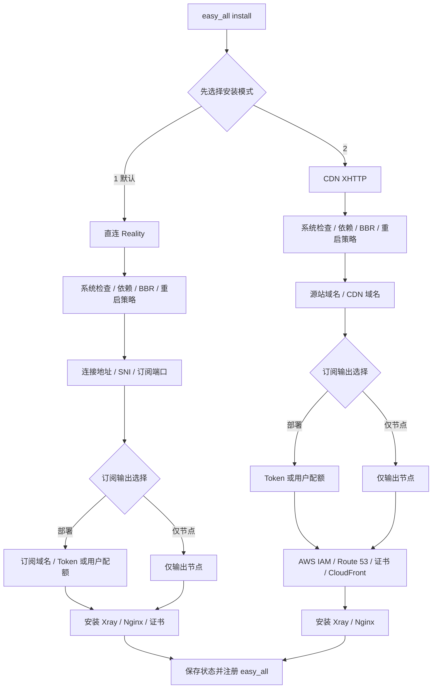

# easy_all

`easy_all` 是面向全新 Debian 12/13 amd64 VPS 的单节点安装器。一个项目、一个命令，
安装时只能选择一种模式：

| 安装模式       | 协议                         | 入口              |
| -------------- | ---------------------------- | ----------------- |
| 直连 - Reality | VLESS TCP Reality Vision     | VPS TCP 443       |
| CDN - XHTTP    | VLESS XHTTP stream-up / HTTP2 | CDN HTTPS 443     |

CDN XHTTP 当前使用 AWS Route 53、ACM 和 CloudFront。协议状态使用 `xhttp`，
Provider 单独记录为 `aws`，以后接入其他 CDN 时不改变安装模式和 XHTTP 实现。

同一台 VPS 只能安装一种模式。脚本会管理 Xray、Nginx、证书、UFW、BBR 和订阅文件，
只适合专用 VPS。

## 安装

一条命令下载完整项目并进入交互安装：

```bash
bash <(curl -fsSL https://raw.githubusercontent.com/v2yiz/easy_all/main/bootstrap.sh)
```

项目代码更新后，一条命令下载最新完整项目并更新现有部署：

```bash
bash <(curl -fsSL https://raw.githubusercontent.com/v2yiz/easy_all/main/update.sh)
```

该命令使用最新代码执行当前模式的 `easy_all update`，更新成功后会将最新入口、两个 Profile
和 Mihomo 模板注册到 `/usr/local/lib/easy_all`。CDN XHTTP 更新仍会在当前终端中询问
AWS 凭证。它不会切换 Reality/CDN 模式；更新 Xray 核心请使用 `easy_all update-core`。

不要改成 `curl ... | sudo bash`：安装器需要从当前终端读取模式、域名和订阅选项。引导脚本会：

1. 检查 `git`；缺失时先通过 APT 安装 `git` 和 CA 证书。
2. 浅克隆 `main` 分支完整项目到权限受限的临时目录。
3. 校验入口、两个 Profile 和 Mihomo 模板均存在。
4. 通过 `sudo` 启动交互安装。
5. 安装结束后删除临时下载目录。

也可以克隆或下载完整项目后手动执行：

```bash
chmod 700 easy_all
sudo ./easy_all install
```

安装器只支持交互安装，不接受 `install reality` 或 `install xhttp` 参数：

```text
请选择安装模式：
  1. 直连 - Reality（优化线路推荐）
  2. CDN - XHTTP（非优化线路推荐）
请选择 [1]（直接回车使用默认值）:
```

## 安装脑图



公共交互选项：

| 输入 | 选项/格式 | 默认值 | 直接回车 |
| --- | --- | --- | --- |
| 订阅输出 | `1` 部署（仅当前服务器推荐） / `2` 仅输出节点（多节点聚合或已有订阅服务器推荐） | `1` | 部署当前模式对应的订阅服务 |
| 月度用户配额 | `1` 不启用 / `2` 启用 | `1` | 所有订阅用户共用当前节点 UUID |
| 配额 Token 覆盖 | `{用户: Token}` JSON 子集 | `{}` | 使用自动生成或已有 Token |
| VPS 开通日期 | `YYYY-MM-DD` | 当前 UTC 日期 | 以默认日期的“日”作为每月账期边界 |
| 安装模式 | `1` Reality（优化线路推荐） / `2` CDN XHTTP（非优化线路推荐） | `1` | 安装 Reality |
| 定时重启 | `1` 每日 04:00 / `2` 自定义 / `3` 不配置 | `1` | 写入每日 04:00 的 root crontab |
| 自定义重启小时 | `0-23` | 无 | 不允许为空 |

脚本提示中的 `[值]` 表示直接回车会采用该值；没有方括号且没有明确写“可留空”的输入必须填写。
UUID、Reality 密钥、XHTTP 路径和 Origin Key 属于自动生成项，不会作为交互选项询问。

## 命令说明

安装成功后统一使用 `easy_all <命令>`：

| 命令 | 功能说明 |
| --- | --- |
| `show` | 显示当前 VLESS 链接和 Mihomo/Clash 节点片段。 |
| `subscription` | 显示节点、订阅部署状态和各 Token 对应的订阅地址。 |
| `status` | 显示当前协议、服务、端口及订阅状态；CDN XHTTP 额外显示 Route 53 与 CloudFront 状态摘要。 |
| `update` | 使用 VPS 已安装的脚本按当前状态重建并验收当前部署，不下载 GitHub 项目代码；具体步骤见下方。 |
| `update-sub` | 重新选择“部署订阅服务”或“仅输出节点”，并更新对应订阅配置。 |
| `update-core` | 下载并更新 Xray 核心；更新失败时恢复旧版本。 |
| `renew-cert` | 强制续期当前模式使用的证书：Reality 为自托管订阅证书，CDN XHTTP 为源站证书。 |
| `quota-status` | 显示启用月度配额后每个订阅用户的本月上下行总流量、额度和停用状态。 |
| `quota-set <用户> <GB>` | 修改指定用户的月度额度，不清零本月已用流量；`0` 表示不限量。 |
| `quota-reset <用户>` | 清零指定用户的本月已用流量，不修改额度、Token、UUID 或 email。 |
| `uninstall` | 卸载当前模式的本机资源。XHTTP 保留 CloudFront、ACM 和 Route 53 资源，需在 AWS Console 中自行确认是否清理。 |
| `help` | 显示命令帮助。 |

项目脚本升级请使用上方的 `update.sh` 一条命令，不要将 `easy_all update` 误认为代码下载更新。

### `update` 的具体操作

默认执行 `easy_all update` 不会改变 Reality/CDN 模式、UUID、节点域名或 XHTTP 路径，也不会
重新询问订阅模式。它读取 `/etc/easy_all/state.env` 中已有状态，以当前保存的参数重新生成配置。

| 当前模式 | `easy_all update` 的执行步骤 |
| --- | --- |
| Reality | 1. 重写并加载 Google BBR/TCP 参数。<br>2. 备份当前状态、Xray 配置、Nginx 配置、订阅文件、证书和 UFW 规则。<br>3. 依照已保存的订阅端口模式同步 UFW，重新生成 Xray 配置并重启、验收 Xray。<br>4. 按已保存的订阅方式重建订阅：自托管模式会校验 DNS、更新证书/Nginx 和订阅文件；仅节点模式会清理订阅服务。<br>5. 显示更新后的节点和订阅地址。 |
| CDN XHTTP | 1. 备份当前状态、Nginx 配置和订阅文件。<br>2. 重写并加载 Google BBR/TCP 参数，按当前状态同步 UFW。<br>3. 使用当前终端提供的 AWS 凭证校验/更新 Route 53 源站记录、ACM/CloudFront 配置和 CDN DNS 记录。<br>4. 重新生成并验收 Xray 与 Nginx 运行时配置。<br>5. 按已保存的订阅方式重建订阅文件，或在仅节点模式下删除订阅文件。<br>6. 保存状态，显示更新后的节点和订阅地址。 |

Reality 在订阅或运行时配置更新失败时会恢复备份；CDN XHTTP 在订阅文件或 Nginx 配置更新失败时
会恢复对应备份。AWS 已成功创建或变更的云资源不自动回滚，因此执行 CDN 更新前应确认 AWS
凭证和 Route 53 配置正确。

### 轮换 UUID

`update` 不会交互询问 UUID；需要轮换时，通过环境变量显式传入新值。以下命令会自动生成一个
新 UUID，重建当前模式的 Xray 和订阅配置，并将新 UUID 保存到状态文件：

```bash
sudo env VLESS_UUID="$(cat /proc/sys/kernel/random/uuid)" easy_all update
```

也可将命令中的值替换为指定的标准 UUID。更新成功后，旧 UUID 立即失效；请从
`easy_all show` 获取新节点，或在已部署订阅服务时让客户端重新拉取订阅。CDN XHTTP 执行该
命令仍会要求输入 AWS 凭证。

### 更新订阅 Token

通过 `update-sub` 可以重新设置整组订阅 Token。将下面 JSON 中的示例值替换为实际 Token；
用户名仅用于识别，客户端订阅地址使用对应的 Token 值：

```bash
sudo env ALLOWED_TOKENS='{"owner":"replace-with-owner-token","user1":"replace-with-user1-token"}' easy_all update-sub
```

命令会显示当前订阅模式；直接回车保留当前模式。Token 只能使用 URL 安全字符
`A-Z`、`a-z`、`0-9`、`.`、`_`、`~`、`-`，长度为 `8-128`，且每个用户和 Token 都必须唯一。
成功后旧 Token 立即失效；CDN XHTTP 仍会在当前终端要求 AWS 凭证。

### 可选的用户月度流量配额

部署订阅服务时，Reality 和 CDN XHTTP 都会询问是否启用按用户月度流量配额，默认不启用：

```text
是否启用按用户月度流量配额（按 VPS 开通日计算 UTC 月度账期）？
  1. 不启用（共用单个节点 UUID）
  2. 启用（每个订阅用户使用独立 UUID，超额自动停用）
请选择 [1]（直接回车使用默认值）:
```

选择启用后，只需填写“用户名到月度 GB 配额”的 JSON。这个 JSON 同时定义用户清单：

```json
{"owner": 0, "user1": 100, "user2": 250}
```

`0` 表示不限量。脚本会为每个新增用户名自动生成：

- 一个 URL 安全的订阅 Token；
- 一个独立的 VLESS UUID；
- 一个 `easy_all.<用户名>` 格式的 Xray `email`。

#### 覆盖自动生成的 Token

脚本生成或复用 Token 后会显示完整 Token 字典，并允许输入可选覆盖表。只填写需要覆盖的用户：

```text
已生成或复用用户 Token：{"owner":"自动Token1","user1":"自动Token2","user2":"自动Token3"}
可选 Token 覆盖 JSON（仅填写要覆盖的用户，直接回车不覆盖） [{}]:
```

例如只覆盖 `user1`：

```json
{"user1": "my-user1-token"}
```

最终结果中 `user1` 使用指定 Token，其他用户继续使用自动生成或原有 Token。覆盖表不能包含用户
清单之外的用户名；Token 必须使用 URL 安全字符且长度为 `8-128`，所有 Token 必须唯一。直接
回车采用 `{}`，即不覆盖。也可以非交互传入：

```bash
sudo env ENABLE_MONTHLY_QUOTA=2 \
  MONTHLY_QUOTAS_GB='{"owner":0,"user1":100}' \
  QUOTA_TOKEN_OVERRIDES='{"user1":"my-user1-token"}' \
  QUOTA_START_DATE='2026-08-15' \
  easy_all update-sub
```

不需要手工填写 UUID 或 email。安装完成后，`easy_all subscription` 会显示每个用户的最终
订阅地址。通过 `easy_all update-sub` 调整配额时，同名用户会复用原 Token 和 UUID；新增用户
名自动生成新凭据，删除用户名会移除对应凭据。`owner` 保留当前主 UUID，其他用户使用独立
UUID。启用或关闭配额会使受影响用户之前取得的共享节点配置失效，应重新拉取订阅。

#### VPS 开通日期与账期

启用配额时还会询问 VPS 开通日期：

```text
VPS 开通日期（YYYY-MM-DD，作为每月配额周期起点） [2026-08-19]（直接回车使用默认值）:
```

必须填写有效且不晚于当前 UTC 日期的日期。完整日期会保存到状态中，其中“日”作为以后每个月
的账期边界。例如开通日期为 `2026-01-15`：

```text
2026-08-15 至 2026-09-15
2026-09-15 至 2026-10-15
```

边界时间按 UTC 计算。若开通日为 29、30 或 31，而某个月没有该日期，则该月使用最后一天：
例如开通日为 31 日，2026 年 2 月的边界为 `2026-02-28`，下一个边界为 `2026-03-31`。
升级已有配额部署但状态中没有开通日期时，首次加载会使用升级当天，之后持久化保留。

#### 用户鉴权与流量归属

启用配额后，每个用户名对应一组 Token、UUID 和 Xray `email`，三者职责不同：

| 字段 | 使用位置 | 作用 |
| --- | --- | --- |
| Token | Nginx `/subscribe?token=...` | 鉴权订阅请求，并选择该用户专属的订阅文件。 |
| UUID | Xray VLESS `clients[].id` | 节点连接的实际认证凭据；每个用户必须不同。 |
| `email` | Xray VLESS `clients[].email` | Xray 内部的用户标识和流量计数器名称，不参与连接鉴权。 |

脚本根据用户名自动生成 Xray `email`，例如用户 `user1` 对应：

```json
{
  "id": "user1 的独立 UUID",
  "email": "easy_all.user1"
}
```

完整链路为：

```text
user1 的订阅 Token
  -> Nginx 只返回 user1 的订阅文件
  -> 客户端使用 user1 的独立 UUID 连接
  -> Xray 使用 UUID 完成 VLESS 鉴权
  -> Xray 将流量记入 email=easy_all.user1
```

Xray `StatsService` 生成以下计数器：

```text
user>>>easy_all.user1>>>traffic>>>uplink
user>>>easy_all.user1>>>traffic>>>downlink
```

因此，流量在 Xray 中是**按 email 标识统计**，但用户实际是**按 UUID 鉴权**。不能让多个用户
共用 UUID、只配置不同 email，否则 Xray 无法判断一次连接属于哪个用户。用户分享自己的 UUID
或订阅地址时，产生的流量仍全部计入该用户。

`StatsService` 仅监听 `127.0.0.1:10085`。systemd timer 每分钟累计各 email 的上下行流量到
`/etc/easy_all/quota-usage.json`。达到配额后，脚本从 Xray 客户端列表中移除该用户 UUID，
同时从 Nginx 订阅 Token 映射中移除该用户；进入下一个开通日账期后自动清零并恢复。状态文件
和统计文件权限均为 `0600`。

查看当前用量：

```bash
sudo easy_all quota-status
```

#### 单独修改用户额度

先通过 `quota-status` 确认用户名，再设置该用户的新月度额度：

```bash
sudo easy_all quota-set user1 200
```

该命令只把 `user1` 的月度额度改为 `200 GB`，不会清零本月已用量，也不会修改 Token、UUID
或 email。新额度立即参与判断：

- 新额度低于或等于本月已用量：用户立即停用；
- 调高额度后本月已用量低于新额度：用户立即恢复；
- 设置为 `0`：改为不限量并立即恢复。

用户名必须已经存在，额度必须是 `0-1000000` 的整数 GB。未知用户或未启用配额时命令会
fail-fast，不会隐式创建用户。新增或删除用户仍应使用 `easy_all update-sub` 修改完整用户清单。

#### 单独重置用户本月流量

需要保留额度和凭据、只把某个用户本月用量归零时执行：

```bash
sudo easy_all quota-reset user1
```

该命令会把 `user1` 的本月上下行累计值清零，但保持原月度额度、Token、UUID 和
`email=easy_all.user1` 不变。如果该用户因超额已停用，会立即重新加入 Xray 客户端列表和
Nginx Token 映射。重置只影响指定用户，不影响其他用户，也不会改变开通日账期。

重置是管理操作，执行后不会保留可恢复的旧累计值。执行前建议先运行
`easy_all quota-status` 记录当前用量。

通过 `easy_all update-sub` 可以重新选择是否启用配额或调整额度。非交互执行
`easy_all update` 会保留当前配额配置。该机制按一分钟周期执行，属于近实时配额控制，不是
精确计费系统；定时任务执行间隔内可能有少量超额流量。CDN XHTTP 统计的是 Xray 看到的用户
载荷，不等同于 CloudFront 账单中的请求、协议开销或总传输字节。

## 直连 Reality

Reality 使用 Xray 监听 TCP `443`，客户端节点包含：

- `security=reality`
- `flow=xtls-rprx-vision`
- `type=tcp`
- Chrome 指纹、Reality public key 和 short ID

安装时需要确认客户端连接地址和 Reality SNI/伪装目标。默认伪装目标为
`swdist.apple.com:443`。

订阅支持固定 `443` 或动态端口。动态模式从 `10000-65535` 生成订阅端口，并由本机
UFW 受管 NAT 区块转发到 Xray `443`。UFW 默认拒绝入站与转发，只放行 SSH、Reality
和已启用的订阅端口。

Reality 的订阅模式：

1. 部署 Nginx HTTPS `8443` 订阅。
2. 不部署，仅输出节点信息。

Reality 交互选项：

| 输入 | 默认值 | 直接回车 |
| --- | --- | --- |
| 客户端连接地址 | 自动探测到的公网 IPv4 | 使用探测值；探测失败时必须手填 |
| Reality SNI/目标 | `swdist.apple.com:443` | 使用默认目标 |
| 订阅端口 | `dynamic` | 随机生成 `10000-65535` 端口 |
| 订阅输出 | 部署 Nginx HTTPS `8443` | 部署订阅服务 |
| 自托管订阅域名 | 无 | 不允许为空 |
| Mihomo 下载文件名 | `EASY_ALL` | 使用 `EASY_ALL` |
| Token 字典 | 自动生成 `owner` Token | 使用屏幕显示的随机 Token |

Reality 入站只监听 IPv4。使用域名作为连接地址时不得发布 AAAA，否则安装会 fail-fast。

自托管订阅域名必须直接解析到 VPS：

```text
https://sub.example.com:8443/subscribe?token=owner-token
https://sub.example.com:8443/subscribe?token=owner-token&flag=clash
```

### Reality 重装与证书幂等

`easy_all update` 是 Reality 的幂等刷新入口：它保留 UUID、Reality 密钥、订阅域名、Token
和 acme.sh 证书状态；证书尚未到续期时间时 acme.sh 不会重复签发。不要通过反复卸载、安装
代替更新。

Reality 的 `uninstall` 默认彻底删除本机状态和专用 acme.sh 目录。若准备使用同一个订阅域名
重装，可显式保留 ACME 账户、订单和证书：

```bash
sudo env PRESERVE_ACME=1 easy_all uninstall
```

随后使用相同订阅域名安装，acme.sh 会复用尚有效的证书，避免再次占用 Let’s Encrypt
签发次数。该开关只保留 `/root/.acme-easy_all.sh`；Reality UUID、密钥和订阅 Token 仍会在
重装时重新生成。无需重装时应继续使用 `easy_all update`。

证书申请失败时脚本会保留并显示 acme.sh/Let’s Encrypt 原始输出。检测到 HTTP 429、
`rateLimited`、`too many certificates` 或 `retry after` 时，会提示按 CA 给出的时间等待。
只有明确属于“重复证书/相同域名集合”限流时，才可改用已经解析到当前 VPS 的全新订阅域名；
账户、IP 或失败验证次数限流不能靠换域名绕过，应停止重试并等待。

## CDN XHTTP

XHTTP 使用 `stream-up + HTTP/2 + XMUX`。当前链路为：
CDN 模式只输出一个 VLESS XHTTP 节点，不混入其他协议。

安装和 `easy_all update-sub` 都提供两个订阅选项：

1. 部署 CloudFront + Nginx 订阅服务，并输出节点信息。
2. 不部署订阅服务，仅输出节点信息。

CDN XHTTP 交互选项：

| 输入 | 默认值 | 直接回车 |
| --- | --- | --- |
| Route 53 源站域名 | 无 | 不允许为空 |
| CloudFront CDN 域名 | 无 | 不允许为空 |
| 订阅输出 | 部署 CloudFront + Nginx | 部署订阅服务 |
| Mihomo 下载文件名 | `EASY_ALL` | 使用 `EASY_ALL` |
| Token 字典 | 自动生成 `owner` Token | 使用屏幕显示的随机 Token |
| AWS Access Key ID | 无 | 不允许为空 |
| AWS Secret Access Key | 无 | 不允许为空 |

XHTTP 节点名默认 `VLESS_XHTTP_H2`，本机端口默认 `10086`，UUID、XHTTP 路径和 Origin Key
自动生成，不需要用户输入。

`easy_all update-sub` 会重新显示订阅菜单。Reality 的端口菜单和两种 Profile 的订阅菜单
都会把当前值显示在方括号中，直接回车沿用当前状态。

```text
客户端 -> CloudFront HTTPS 443 -> Nginx gRPC -> Xray 127.0.0.1:10086
```

需要两个位于 Route 53 Public Hosted Zone 的域名：

| 域名示例             | 用途                                      |
| -------------------- | ----------------------------------------- |
| `origin.example.com` | CloudFront HTTPS 源站，A 记录指向 VPS     |
| `node.example.com`   | 客户端和订阅入口，CNAME 指向 CloudFront   |

### CDN 重装与 AWS 幂等

卸载后使用相同的源站域名和 CDN 域名重装时，脚本会收敛到已有 AWS 资源：

| AWS 资源 | 重装行为 |
| --- | --- |
| Route 53 源站 A | 已准确指向当前 VPS 时直接复用；不存在时创建。指向其他地址或存在 AAAA/CNAME 时默认停止，确认后设置 `AWS_ORIGIN_DNS_REPLACE=1`。 |
| ACM 证书 | 复用覆盖 CDN 域名的已签发或待验证证书，优先已签发证书；支持复用单级通配符证书。找不到时才申请新证书。 |
| CloudFront | 按稳定标记 `easy_all:xhttp:<CDN域名>` 找回原分配，保留 Caller Reference 并更新为当前配置，不创建第二个分配。 |
| Route 53 CDN CNAME | 已指向找回的 CloudFront 分配时直接复用；其他同名记录默认停止，确认后设置 `AWS_DNS_REPLACE=1`。 |

没有 `easy_all` 标记但 CDN 别名完全一致的旧 CloudFront 分配，安装器会自动查找并展示其详情；
确认后直接接管并更新，无需手工查询分配 ID。若拒绝确认则不修改旧分配。非交互接管需设置
`AWS_ADOPT_DISTRIBUTION=1`。若同一 CDN 域名异常存在多个带相同管理标记或同名别名的分配，
脚本会停止并要求先消除歧义。重装会重新生成 UUID、XHTTP 路径、Origin Key 和订阅 Token；
需要保留这些节点参数时应使用 `easy_all update`，不要先卸载。

CloudFront + Nginx 订阅接口同时校验：

- CloudFront 注入的 `X-Easy-All-Origin-Key`
- URL 查询参数中的用户 Token

订阅响应设置 `Cache-Control: no-store`。所有客户端节点和订阅地址只使用 CDN 域名，
不会暴露源站域名。

AWS Access Key ID 与 Secret Access Key 仅在当前命令进程中使用，不写入状态文件。不要为根用户创建访问密钥，应创建
权限受限的专用 IAM 用户。完整 IAM 权限、CloudFront 参数和故障排查见
[CDN XHTTP 的 AWS 配置](docs/xhttp-aws.md)。
推荐创建 `easy_all_deploy_policy`，并通过“添加用户到组”授予专用部署用户。

## 状态与边界

统一状态目录：

```text
/etc/easy_all/state.env
/etc/easy_all/quota-usage.json
/etc/easy_all/xray/config.json
/var/www/easy_all/subscriptions/
/etc/nginx/conf.d/easy_all.conf
/etc/systemd/system/easy_all-xray.service
/etc/systemd/system/easy_all-quota.timer
```

状态字段包括：

```text
STATE_VERSION=2
PROTOCOL=reality|xhttp
CDN_PROVIDER=aws
```

Reality 的 `CDN_PROVIDER` 为空。XHTTP 当前固定为 `aws`。AWS Access Key 和 Secret
Access Key 不会持久化。

卸载 XHTTP 时只删除本机资源，保留 CloudFront、ACM 和 Route 53 资源，避免误删共享的
云资源。卸载完成后应在 AWS Console 中人工确认是否清理。

## 模块

用户始终只运行 `easy_all`。内部按粗粒度拆分：

```text
easy_all
lib/reality.sh
lib/xhttp.sh
lib/quota.sh
sample-mihomo.yaml
```

入口只负责模式选择和命令分发。两个 Profile 不互相调用；`quota.sh` 提供两种模式共用的可选
用户配额能力；XHTTP 状态通过 `CDN_PROVIDER` 与具体 CDN 实现解耦。

## 测试

```bash
npm test
```

测试覆盖统一入口、Reality、XHTTP、用户凭据与月度配额、Xray 配置、CloudFront JSON、
Route 53、订阅渲染、Token 鉴权、证书续期检查和更新顺序。

## 独立工具：debian_init

`debian_init.sh` 是独立的个人服务器初始化工具，不是 `easy_all` 的组成部分或安装前置步骤，
也不会安装、更新或卸载代理节点。

它应在本地管理机交互运行，通过 SSH 初始化一台全新的 Debian 12/13 amd64、systemd、
非容器服务器。一条命令下载并执行：

```bash
bash <(curl -fsSL https://raw.githubusercontent.com/v2yiz/easy_all/main/debian_init.sh)
```

不要改成 `curl ... | bash`，脚本需要从当前终端持续读取服务器信息、密码和确认选项。

本地需要 `ssh`、`scp` 和 `ssh-keygen`；安装 `sshpass` 后可自动提交首次 SSH 密码，
否则按 SSH 提示交互输入。脚本会明确询问服务器地址、初始登录用户、普通用户名及 sudo
密码、SSH key、本地 Host 别名、当前/最终 SSH 端口，以及需要由 UFW 额外放行的 TCP 端口。

`debian_init` 交互选项：

| 输入 | 默认值 | 直接回车 |
| --- | --- | --- |
| 服务器 IP/域名 | 无 | 不允许为空 |
| 初始 SSH 用户 | `root` | 使用 `root` |
| 初始用户密码 | 无 | 交给 SSH 自己交互询问 |
| 最终普通用户名 | 无 | 不允许为空 |
| 普通用户 sudo 密码 | 无 | 不允许为空，必须输入两次 |
| 本地 SSH Host 别名 | `<普通用户>-<服务器>` | 使用生成值 |
| 当前 SSH 端口 | `22` | 使用 `22` |
| 是否修改 SSH 端口 | `no` | 不修改 |
| 新 SSH 端口 | `2222` | 仅选择修改时采用 `2222` |
| UFW 额外 TCP 端口 | 空 | 仅放行 SSH 相关端口 |
| SSH key 选择 | `g` | 生成新的 ed25519 key |
| 新 key 文件名 | `id_ed25519_<Host别名>` | 使用生成名称 |
| 新私钥 passphrase | 空 | 创建无 passphrase 私钥 |
| 是否移除旧 SSH 端口 | `no` | 保留旧端口 |

远端操作包括：

- 执行 `apt-get upgrade` 并安装基础工具。
- 使用 Debian 官方内核的 Google BBR，TCP 参数与 `easy_all` 保持一致；拒绝 XanMod。
- 配置并启用 UFW：默认拒绝入站和转发、允许出站，并为 SSH 当前/最终端口及用户显式输入的额外 TCP 端口添加受管规则；已有的其他 UFW 规则保持不变。
- 设置 `Asia/Shanghai` 时区并启用时间同步。
- 创建或更新普通用户、sudo 密码和 SSH 公钥。
- 为普通用户安装 `uv` 和 Python 3.12。
- 写入独立的 `sshd_config.d` 配置，禁用密码及键盘交互认证，root 仅允许密钥登录。
- 在本地 `~/.ssh/config` 写入带保活参数的受管 Host 配置。

BBR 配置写入 `/etc/sysctl.d/99-debian-init-bbr.conf`，模块加载配置写入
`/etc/modules-load.d/debian-init-bbr.conf`。UFW 规则使用 `debian-init-managed` 注释，
重复执行时只替换该工具管理的规则，不删除用户自己的其他 UFW 规则。

该工具没有完整卸载或系统回滚命令。执行前应确认目标是可由它接管 SSH、安全策略、软件包、
时区和用户配置的个人服务器，并保留当前 SSH 会话，直到新的普通用户密钥登录验证成功。
