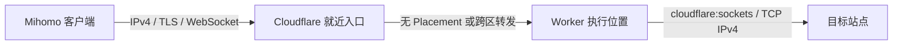
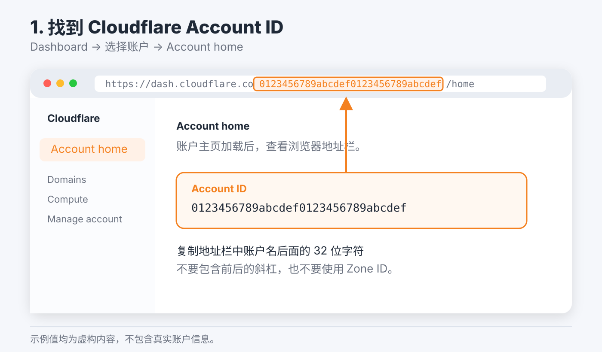
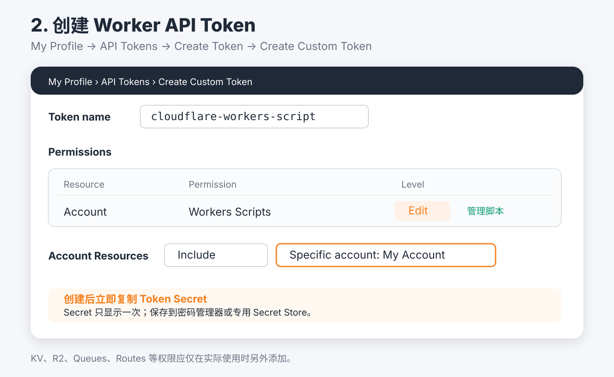
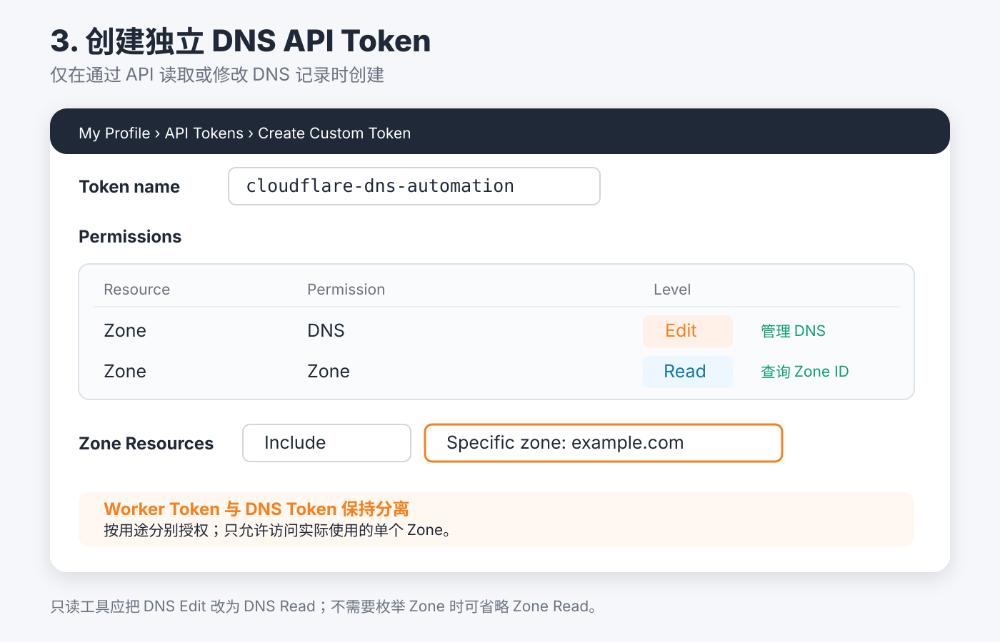
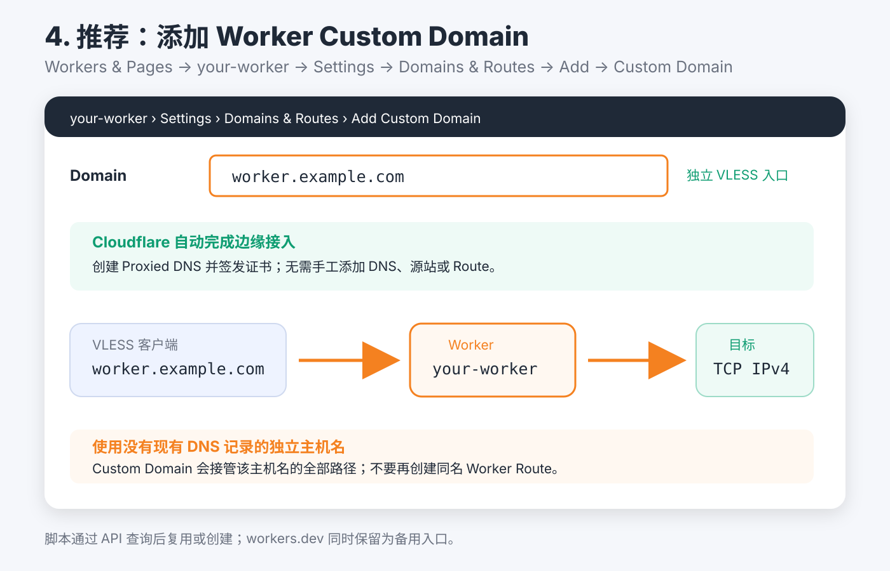

# 纯 Cloudflare Worker VLESS 本地部署指南

本指南用于从本地 macOS/Linux 一键部署 `VLESS over WebSocket + TLS` Worker。
部署脚本位于 `worker-vless/deploy.sh`，不会安装或依赖 VPS。

## 能力边界



- `auto`：Worker 默认在收到请求附近执行，通常端到端延迟最低。
- `japan`：设置 Placement Hint `aws:ap-northeast-1`，Cloudflare 尝试在东京区域附近执行。
- `us-west`：设置 Placement Hint `aws:us-west-2`，Cloudflare 尝试在美国俄勒冈区域附近执行。

Placement Hint 不是固定机房、固定出口 IP 或地区解锁服务。Cloudflare 仍使用全球 Anycast
入口，并可能因为维护或容量调整实际执行位置。目标站点看到的 TCP 来源也不能保证被识别为
日本或美国。因此它不能可靠解决 Gemini 等服务的 IP 地区风控。

## 准备条件

本地需要：

- Node.js 18 或更高版本；
- npm/npx；
- curl（仅用于部署后的健康检查）；
- 一个 Cloudflare 账户；
- 使用 Custom Domain 时，一个已经在该账户中处于 Active 状态的 Zone。

检查本地环境：

```bash
node --version
npm --version
curl --version
```

## 1. 获取 Account ID

推荐方法：

1. 登录 [Cloudflare Dashboard](https://dash.cloudflare.com/)。
2. 打开 **Workers & Pages**。
3. 在 **Account Details** 中复制 **Account ID**。

也可以在任意 Dashboard 页面按 `Command/Ctrl + K`，搜索
`Copy account ID`。Account ID 通常是 32 位十六进制字符串。



不要混用以下标识：

| 标识 | 用途 | 本脚本是否需要 |
| --- | --- | --- |
| Account ID | 指定部署 Worker 的账户 | 必须 |
| Zone ID | 指定某个 DNS Zone | Custom Domain 模式不需要 |
| Worker 名称 | Worker 服务名称 | 必须，脚本有默认值 |

官方说明：
[Find account and zone IDs](https://developers.cloudflare.com/fundamentals/account/find-account-and-zone-ids/)

## 2. 创建 Worker API Token

打开 [My Profile → API Tokens](https://dash.cloudflare.com/profile/api-tokens)，按以下步骤创建：

1. 选择 **Create Token**。
2. 选择 **Create Custom Token**。
3. Token 名称填写 `easy-all-worker-vless`。
4. 添加权限：**Account → Workers Scripts → Edit**。
5. Account Resources 选择 **Include → Specific account → 你的账户**。
6. 选择 **Continue to summary → Create Token**。
7. 立即保存生成的 Token Secret；它只显示一次。



Cloudflare API 将这个权限称为 `Workers Scripts Write`。它同时覆盖：

- 上传和更新 Worker；
- 上传 Worker Secret；
- 启用 `workers.dev`；
- 绑定 Worker Custom Domain。

也可以使用 **Edit Cloudflare Workers** 模板，但模板通常附带 KV、R2、Workers Routes、
Account Settings 和用户读取权限；本项目不需要这些额外权限。

不要使用 Global API Key。不要把 Token 写进源码、README、Git、截图或 shell 参数。

官方说明：

- [Create API token](https://developers.cloudflare.com/fundamentals/api/get-started/create-token/)
- [Worker Custom Domain API](https://developers.cloudflare.com/api/resources/workers/subresources/domains/methods/update/)

## 3. DNS API Token 是否需要

推荐的 Custom Domain 部署**不需要 DNS API Token**。脚本通过 Worker Custom Domain
配置让 Cloudflare 自动：

- 创建域名对应的代理 DNS；
- 签发边缘 TLS 证书；
- 将该主机名直接绑定到 Worker。

因此脚本不会询问、读取或保存 `CF_DNS_API_TOKEN`。这符合最小权限原则，也避免同时暴露
两个长期凭据。

只有打算绕过 Custom Domain、手工维护 DNS 记录或 Worker Route 时，才创建独立 DNS Token：

1. 进入 **My Profile → API Tokens → Create Token**。
2. 使用 **Edit zone DNS** 模板或创建 Custom Token。
3. 添加 **Zone → DNS → Edit**。
4. 如需通过 API 查询 Zone ID，再添加 **Zone → Zone → Read**。
5. Zone Resources 仅选择实际使用的单个 Zone。



这个 DNS Token 不应与 Worker Token 合并，也不要传给本部署脚本。

## 4. 准备 Custom Domain

推荐准备一个独立主机名，例如：

```text
worker.example.com
```

要求：

- `example.com` 已添加到同一个 Cloudflare 账户并处于 Active；
- `worker.example.com` 没有现有 A、AAAA 或 CNAME 记录；
- 不要提前创建占位 DNS；
- 不要再为同一主机名创建 Worker Route。

脚本会先通过 Cloudflare API 查询该主机名：

- 已绑定当前同名 Worker：直接复用，不重复创建；
- 已绑定其他 Worker：立即停止，不抢占；
- 尚未绑定：上传 Worker 后创建 Custom Domain；
- 创建请求发生并发冲突：再次查询，确认属于当前 Worker 即视为成功。

Cloudflare 会自动创建 DNS 和证书，同时保留 `workers.dev` 作为备用入口。若首次绑定暂时
失败，脚本会保存 UUID、路径和待绑定域名，先使用 `workers.dev`，下次同名部署继续重试。



## 5. 交互式一键部署

在项目根目录执行：

```bash
./worker-vless/deploy.sh deploy
```

脚本依次询问：

1. Worker 名称；
2. Account ID；
3. 执行位置：自动、日本或美国西海岸；
4. Custom Domain；
5. Worker API Token（输入不回显）。

所有带默认值的问题均可直接回车。UUID 和 WebSocket 路径自动生成，不需要输入。

建议选择：

| 使用目标 | 选择 |
| --- | --- |
| 客户端分散、追求通常最低延迟 | `auto` |
| 主要用户位于中国东部、日本或韩国附近 | `japan` |
| 希望链路经美国西海岸执行 | `us-west` |

部署命令只允许在交互式终端中运行，不接受环境变量或命令行参数注入部署配置。Worker Token
必须在无回显提示中输入。

## 6. 部署输出

脚本会输出：

- Account ID；
- Worker 名称；
- 地域策略和具体 Placement Hint；
- Custom Domain 主入口；
- `workers.dev` 备用入口；
- VLESS URI；
- 强制 IPv4 的 Mihomo 节点；
- 本次健康检查的入口 Colo 和 `cf-placement`；
- 本地状态文件路径。

状态文件位于：

```text
~/.config/easy_all/worker-vless/<worker-name>.json
```

文件权限固定为 `600`，包含 UUID 和私密路径，但不保存 Worker API Token。重新显示参数：

```bash
./worker-vless/deploy.sh show easy-all-vless-jp
```

查看线上位置观测：

```bash
curl -4fsS https://jp-worker.example.com/health
```

返回示例：

```json
{
  "status": "ok",
  "protocol": "vless",
  "transport": "websocket",
  "egress": "ipv4",
  "deploymentRegion": "japan",
  "placementRegion": "aws:ap-northeast-1",
  "ingressColo": "HKG",
  "cfPlacement": "remote-NRT"
}
```

`ingressColo` 是本次请求进入 Cloudflare 的边缘；`cfPlacement` 才是 Placement 的观测信息。
该响应反映单次请求，不能视为永久机房承诺。

## 7. 重复部署和轮换

重复执行并输入同名 Worker 后，脚本会把原 Account ID、域名和地域作为默认值显示。需要修改
地域时，在位置菜单中重新选择。检测到已有 UUID 和路径时，脚本会询问是否轮换；直接回车
保留原凭据，输入 `y` 才会生成新凭据。

轮换后旧客户端立即失效，需要重新导入脚本输出的 URI 或 Mihomo 节点。

## 8. 常见错误

### API authentication error 10000

确认：

- Account ID 属于 Token 授权的账户；
- Token 具有 **Account → Workers Scripts → Edit**；
- Account Resources 包含目标账户；
- Token 没有过期，且当前公网 IP 满足 Token 的 IP 过滤条件。

### Custom Domain 创建失败

确认：

- Zone 位于同一个 Account ID；
- Zone 状态是 Active；
- 目标主机名没有已有 A、AAAA、CNAME 或其他 Worker 绑定；
- Worker Token 具有 Workers Scripts Edit。

### `workers.dev` 无法访问

部分网络会阻断 `workers.dev`。使用 Custom Domain 作为主入口；备用地址只用于排障。

### 指定美国后目标仍判断为其他地区

Placement Hint 只影响 Worker 执行位置附近的 Cloudflare 数据中心，不提供固定或保证地理归属的
出口 IP。需要严格地区出口时，应使用该地区 VPS 的 Reality 节点或专用上游代理。

## 官方参考

- [Cloudflare Worker Placement](https://developers.cloudflare.com/workers/configuration/placement/)
- [Cloudflare Custom Domains](https://developers.cloudflare.com/workers/configuration/routing/custom-domains/)
- [Cloudflare API Token permissions](https://developers.cloudflare.com/fundamentals/api/reference/permissions/)
- [Cloudflare TCP Sockets](https://developers.cloudflare.com/workers/runtime-apis/tcp-sockets/)
