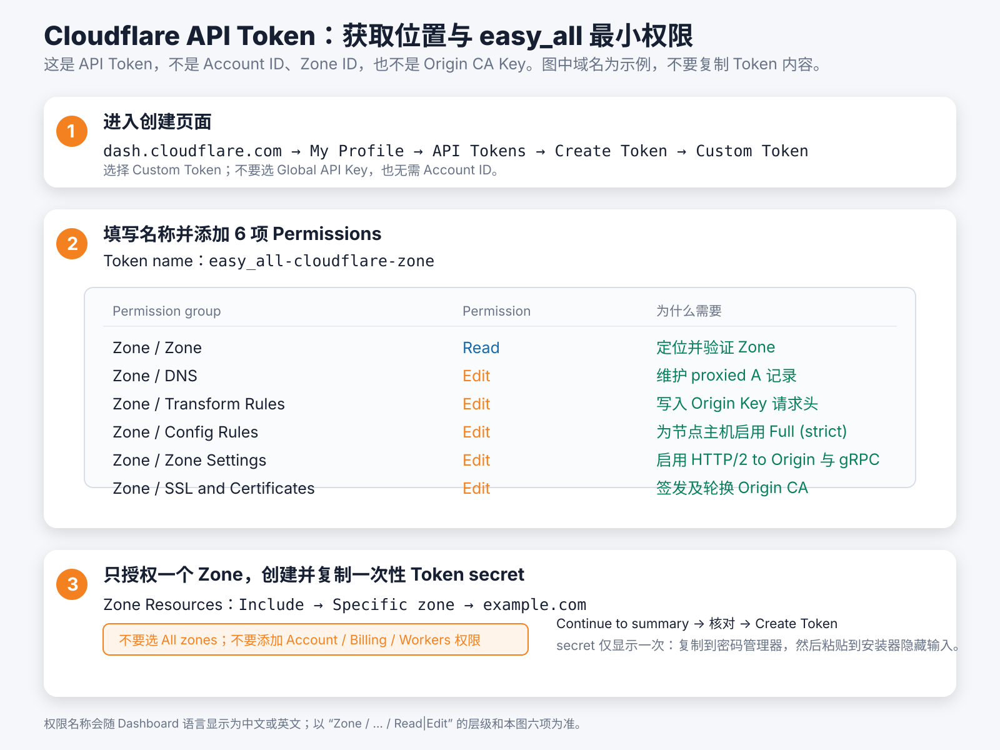

# Cloudflare CDN 精选 IP XHTTP

模式 2 使用一个 Cloudflare Zone、一个客户端连接的 CDN 节点域名和一个 Zone-scoped API Token。
Cloudflare 采用单域名架构：该域名同时用于客户端连接、Cloudflare 回源和 VPS 证书。安装器会自动完成
DNS、证书、TLS、origin HTTP/2、回源密钥规则、防火墙白名单和 Globalping 精选 IPv4 配置；gRPC
开关需按安装器提示在控制台手动开启。

## 安装前准备

1. 在 Cloudflare 添加根域名，例如 `example.com`，并等待 Zone 状态为 **Active**。
2. 在该 Zone 下准备客户端连接的 CDN 节点域名，例如 `node.example.com`。不要预先创建这个名称的 DNS 记录。
3. 如果部署独立订阅域名，它也必须是同一 Zone 下的一级子域名。

## 只创建一个 API Token

进入 **My Profile → API Tokens → Create Token → Custom Token**，资源选择：

```text
Include → Specific zone → example.com
```

仅添加以下六项权限：

| 权限 | 用途 |
| --- | --- |
| `Zone / Zone / Read` | 识别并验证目标 Zone |
| `Zone / DNS / Edit` | 管理节点和订阅 DNS 记录 |
| `Zone / Transform Rules / Edit` | 管理回源密钥规则 |
| `Zone / Config Rules / Edit` | 设置 Full (strict) |
| `Zone / Zone Settings / Edit` | 启用 origin HTTP/2 |
| `Zone / SSL and Certificates / Edit` | 签发、轮换和吊销 Origin CA 证书 |



创建后立即复制 Token，并粘贴到安装器的 `Cloudflare API Token` 输入框。Token 只在当前进程使用，
不会写入状态文件；请勿选择所有 Zone，也不要添加其他权限。

## 安装器会自动完成的事项

- 创建唯一的 proxied `A` 记录，指向 VPS 公网 IPv4。
- 签发 15 年 Origin CA 证书并配置 Full (strict)。
- 开启 origin HTTP/2，并写入 XHTTP 回源密钥规则。
- 提示在 Cloudflare 控制台 **Network → gRPC** 手动开启 gRPC（当前没有可用的 Zone Settings API）。
- 仅允许 Cloudflare 官方 IPv4 段访问 VPS 的 TCP 443。
- 每小时通过 Globalping 中国大陆探针筛选零丢包 IPv4，最多保留 10 个候选。
- 客户端 Mihomo 每 300 秒测速，候选快至少 50 ms 才切换；SNI 和 XHTTP Host 始终使用节点域名。
- 测量失败继续使用上次有效缓存；缓存超过 72 小时则回退到节点域名。

安装器不会覆盖其他 DNS 记录或规则。发现同名记录、规则歧义或权限不足时会停止并保留本机状态。

## 费用与使用边界

上述能力可在 Cloudflare Free Zone 使用；域名注册费和 VPS 费用另计。本项目不会自动启用任何
按量计费的增值产品，也不承诺固定的月度 CDN 流量额度。

| 项目 | 说明 |
| --- | --- |
| 基础 CDN 费用 | Free Zone 本身无月费；Token、proxied DNS、Universal SSL、Origin CA、HTTP/2、gRPC 和规则配置不单独收费。 |
| 可用流量 | 没有可据此保证的固定 GB 上限；实际受 Cloudflare 服务条款、账户风控、VPS 带宽和连接质量共同限制。 |
| 单次请求 | Free/Pro 的请求体上限为 **100 MB**；长连接或大流量不等于获得无限制隧道能力。 |
| 额外费用 | 只有自行启用 Argo、WAF、Bot Management 等增值产品时，相关流量才可能产生额外费用；本项目不启用它们。 |

本链路是实时 XHTTP 转发，数据不会因为 CDN 缓存而减少 VPS 出口流量。建议先按目标用户数、峰值并发、
VPS 出口带宽和每用户配额估算容量，再进行低速、长连接和持续传输测试。Cloudflare 的条款、流量限制
和风控优先于本说明。

## 卸载

`sudo easy_all uninstall` 只清理本机。`sudo easy_all uninstall --purge-cloud` 会先使用同一枚
Token 吊销 Origin CA 证书，成功后才清理本机；远端 DNS 和规则仍需按需在控制台处理。

官方参考：[Origin CA](https://developers.cloudflare.com/ssl/origin-configuration/origin-ca/)、
[Full (strict)](https://developers.cloudflare.com/ssl/origin-configuration/ssl-modes/full-strict/)、
[gRPC](https://developers.cloudflare.com/network/grpc-connections/)、
[Transform Rules](https://developers.cloudflare.com/rules/transform/)、
[Cloudflare IP 地址](https://www.cloudflare.com/ips/)。
