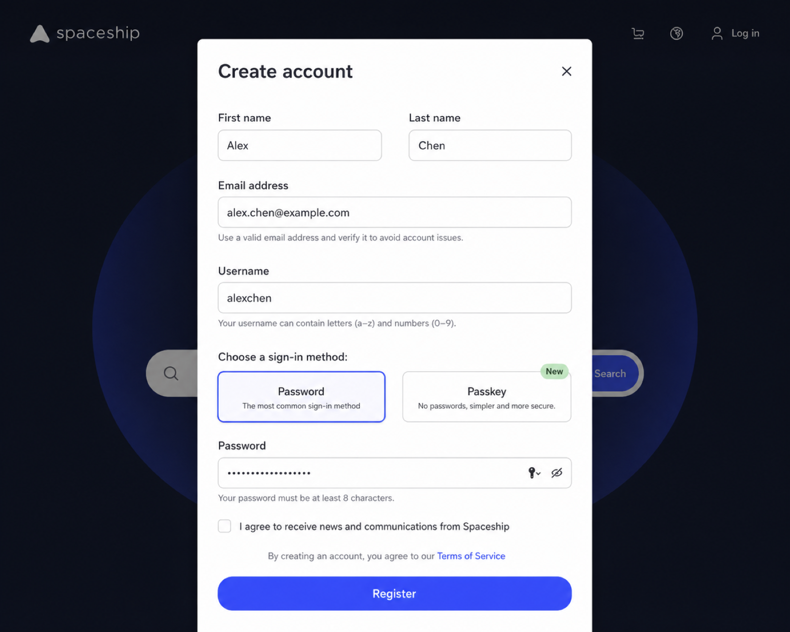
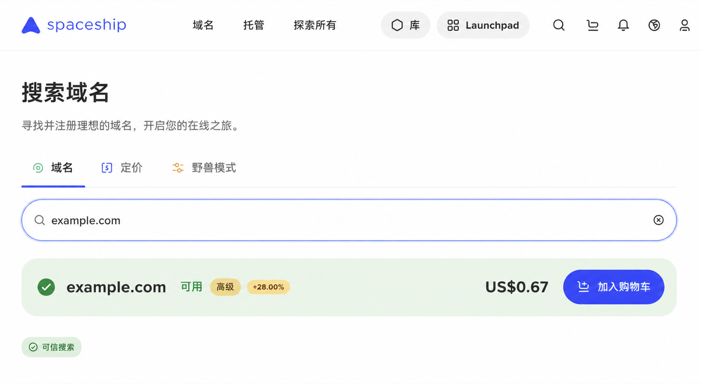
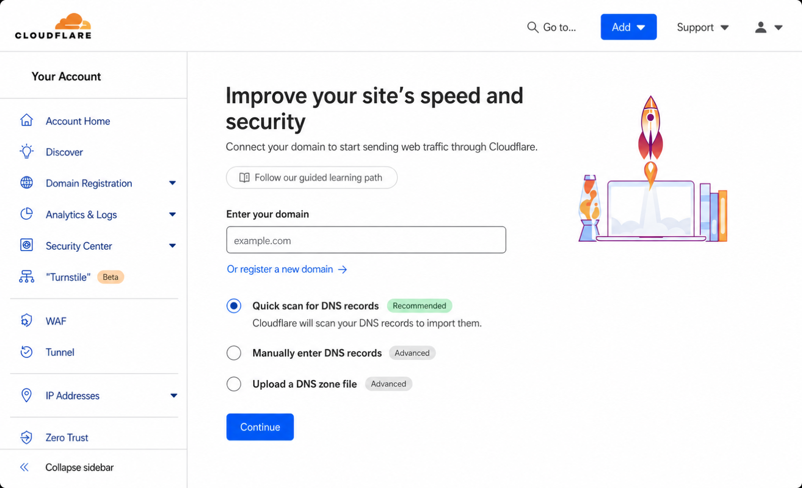
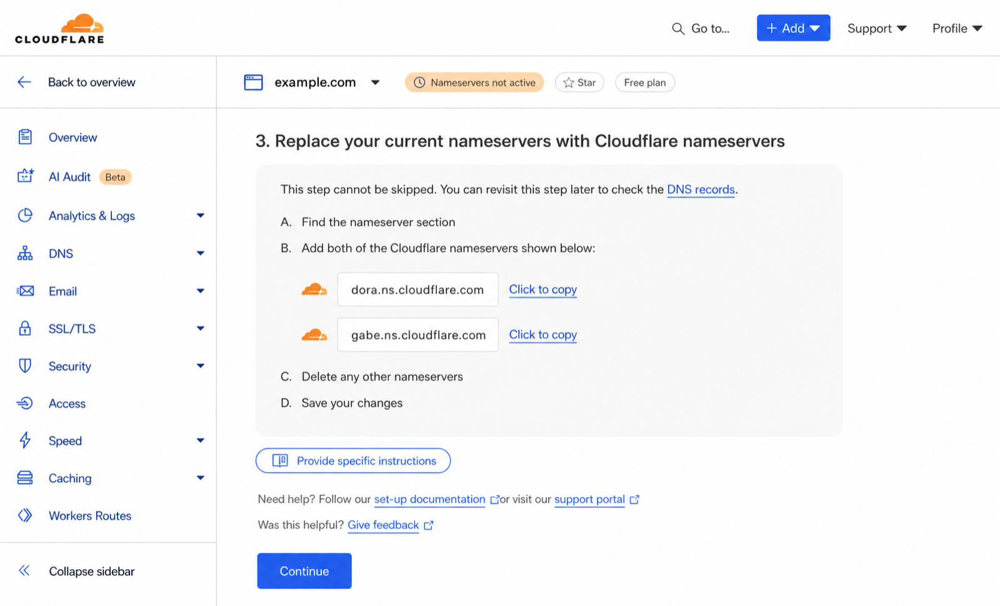
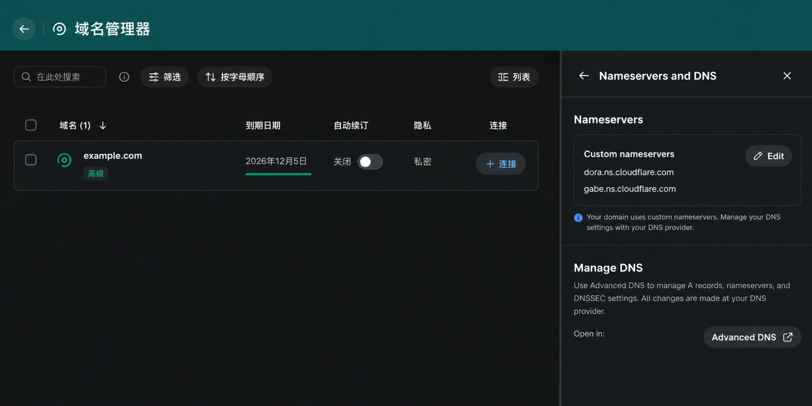
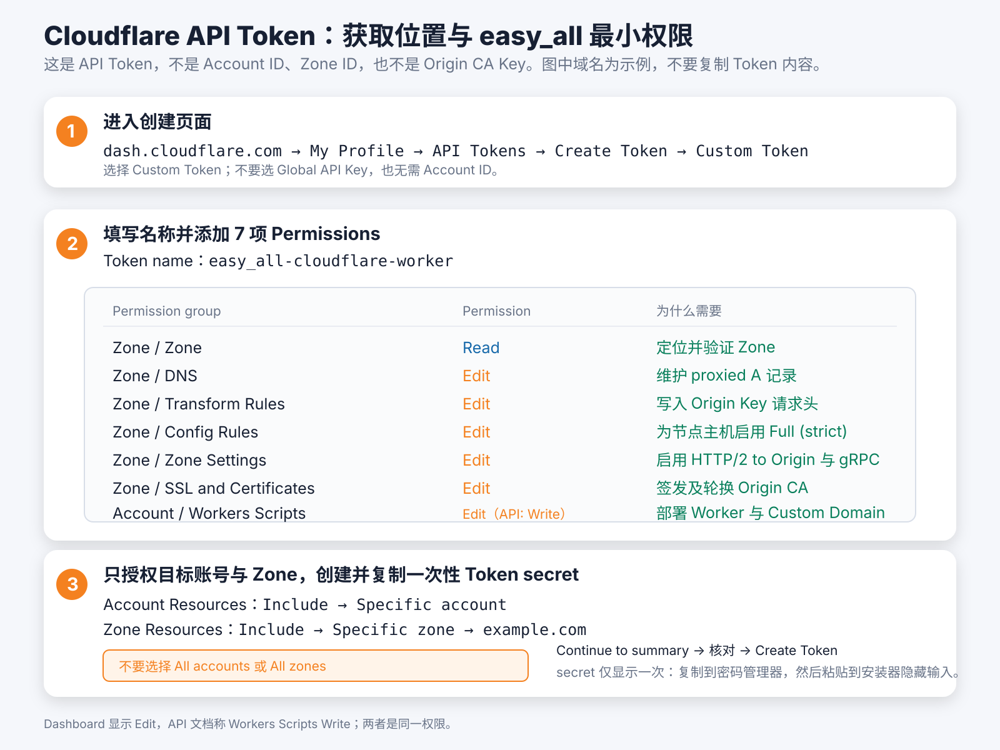
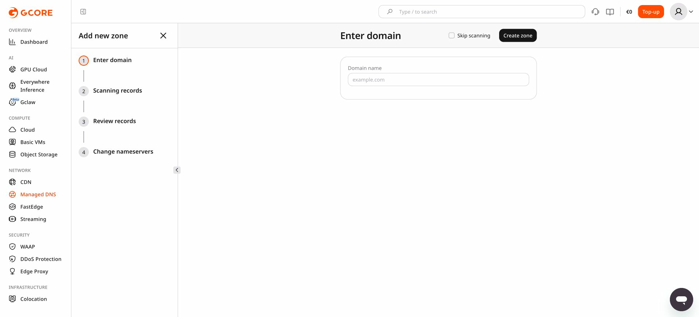
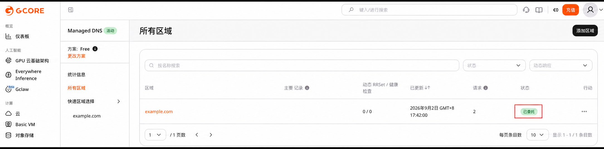
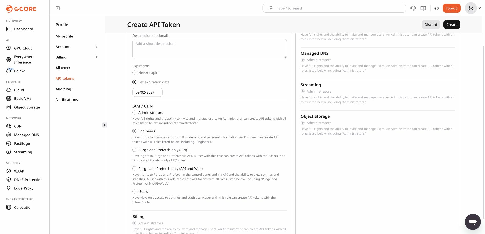

# 前置准备手册

本手册覆盖 Reality、Cloudflare 和 Gcore 三种模式所需的域名、账号、DNS 和 Token 准备。Reality 节点数据仍然直连，
但选择“部署订阅”时，订阅服务会使用 Cloudflare Universal SSL 与 Origin CA。

Cloudflare CDN 精选 IP XHTTP 模式阅读第 1–7 节；Gcore XHTTP 模式阅读第 1.1、8 节；Reality **只有选择部署订阅**时才阅读第 1、3.1、4 节。
Reality 不需要 Globalping，也不需要开启 gRPC。本手册只在浏览器和账号侧操作；VPS 登录、安装、重启和
客户端导入请回到 [README 的第一次安装路径](../README.md#第一次安装先看这里)。

先区分三个容易混淆的概念：域名注册商是你购买/续费域名的地方；Cloudflare 或 Gcore 是管理该域名 DNS 和代理的
地方；VPS 是实际运行 easy_all 的远程服务器。把名称服务器改为 Cloudflare 并不等于把域名转移到
Cloudflare，注册商仍负责续费。

线路与费用提示：CDN 模式面向直连 VPS 体验不理想、且愿意维护域名和第三方账号的场景，并不保证一定更快。
Cloudflare Free Zone 与 Gcore Free CDN 的基础额度按 Provider 当前规则执行；域名注册费和 VPS 费用另计。

## 0. 按链路选择准备内容

先确定只安装其中一种链路，再准备对应资源。同一台 VPS 只能安装一种模式；同一个 DNS Zone
也只能委派给一组权威名称服务器，因此一个 Zone 不能同时委派给多组权威名称服务器。
需要并行测试不同 CDN 时，请使用不同根域名或分别正确委派的独立 Zone。

| 链路                     | 必须准备                                                                                                                                                                       | 不需要准备                                         | 继续阅读                                                                      |
| ------------------------ | ------------------------------------------------------------------------------------------------------------------------------------------------------------------------------ | -------------------------------------------------- | ----------------------------------------------------------------------------- |
| 模式 1：Reality 直连     | Debian 12/13 amd64 专用 VPS、公网 IPv4；节点可直接使用 IP，也可准备 DNS only/灰云域名；部署订阅时还需 Cloudflare Active Zone、一级订阅子域名和 API Token                       | Globalping Token、gRPC 设置                        | 不部署订阅：直接看 README；部署订阅：第 1、3.1、4 节及 README 的 Reality 章节 |
| 模式 2：Cloudflare XHTTP | 根域名、Cloudflare Free 账号、已变为**Active** 的 Zone、一个节点子域名、Cloudflare API Token、Globalping Token；控制台手动开启 **Network → gRPC**；预期 `$0/月` | 付费 Cloudflare 增值产品                           | 第 1–7 节                                                                    |
| 模式 3：Gcore XHTTP      | Gcore Free CDN 账号、已完整委派的 Managed DNS Zone、源站和节点子域名、具备 CDN/DNS 权限的 Gcore API Token、控制台用量提醒；额度内预期`$0/月`                                 | Globalping、Cloudflare gRPC 等 Cloudflare 专属准备 | 第 1.1、8 节                                                                  |

各链路建议使用的域名如下：

```text
Reality:    node.example.com（可选）；sub.example.com（仅自托管订阅需要）
Cloudflare: node.example.com；sub.example.com（可选独立订阅域名）
Gcore:      origin.example.com；node.example.com；sub.example.com（可选）
```

所有模式都需要一台没有其他代理面板占用端口和配置的专用 VPS。Cloudflare 模式使用
Globalping 中国大陆探针预筛 IPv4；Gcore 模式直接使用 CDN 域名。

## 1. 先注册域名并交给 Provider 托管

### 1.1 注册域名

域名注册商可以自行选择。参考文章使用 [Spaceship](https://www.spaceship.com/) 演示购买
`.xyz` 域名；本项目并不要求使用 Spaceship 或 `.xyz`，也不保证文章中的活动价格。注册前请同时
确认首年价格、续费价格、隐私保护、付款方式以及是否满足你所在地区的合规要求。

按参考文章第 1 节整理后的通用流程如下：

1. 打开 [Spaceship](https://www.spaceship.com/) 或你选定的注册商，注册账号并完成邮箱验证。
   如果注册商当前要求手机号、实名或其他验证，以注册商页面为准。
2. 搜索一个自己能长期使用的根域名，例如 `example.com`。本项目需要根域名控制权，后续会在
   它下面使用 `node.example.com` 这样的一级子域名。
3. 在 Spaceship 的优惠场景下，建议先注册 **1 年**，再续费 **9 年**；按 10 年总价计算，平均每年
   价格通常更便宜。下单前必须在当前结算页核对首年价、9 年续费价和 10 年总价，活动和价格可能变化。
4. 保存注册商账号、域名到期日和恢复邮箱。不要把注册商密码、付款信息或后续 API Token 写入
   仓库。

下面的截图是参考文章中的界面示例；Spaceship 的页面、价格和中文文案可能已经变化。





### 1.2 在 Cloudflare 注册账号并添加域名

1. 打开 [Cloudflare 注册页](https://dash.cloudflare.com/sign-up)，使用邮箱和密码创建账号，并按提示
   完成邮箱验证。
2. 进入 [Cloudflare Dashboard](https://dash.cloudflare.com/)，选择 **Add a domain**，输入刚注册的
   根域名，例如 `example.com`。
3. 选择 **Free** 计划即可。本项目的 Cloudflare 配置不要求购买付费计划。



Cloudflare 会为这个 Zone 分配两条名称服务器（Nameservers）。先完整复制并保存这两条值；不要把
`node.example.com` 的 DNS 记录提前建好，安装器需要检查并创建唯一的 proxied `A` 记录。

### 1.3 在注册商修改名称服务器

回到域名注册商的 DNS/Nameservers 页面，把根域名现有的权威名称服务器完整替换为 Cloudflare 显示的
两条名称服务器，然后保存。



下面是注册商侧 Nameservers 页面的脱敏示意图；域名和名称服务器均为示例值。



等待注册商和公共 DNS 更新，直到 Cloudflare 中该 Zone 的状态变为 **Active**。名称服务器切换期间，
如果域名还承载网站或邮件，请先记录原有的 `A`、`AAAA`、`CNAME`、`MX`、`TXT`、SPF、DKIM、DMARC
和 CAA 记录；遗漏邮件记录可能导致收发信中断。

托管成功后，打开该 Zone 的 **Overview** 页面，确认出现绿色勾选和提示
**Your domain is now protected by Cloudflare**。同时应看到 **Your web traffic is proxying through
Cloudflare**，这表示该域名的流量已经通过 Cloudflare 代理。只有看到这个成功标记，才算完成域名托管；
仅能进入 Cloudflare 控制台、看到 **Free** 计划或拿到 Nameservers 并不代表托管已经生效。


参考文章：[48元撸10年xyz域名，搭配Cloudflare有N王炸玩法](https://post.smzdm.com/p/ae5rg7nk/)
（第 1、2 节）。文中截图仅用于说明操作位置，最终以注册商和 Cloudflare 当前页面为准。

### 1.4 本项目对域名的要求

- Cloudflare 模式使用一个 Zone 和一个一级子域名，例如 `node.example.com`；根域名本身只用于
  托管 Zone，不作为客户端节点名。
- `node.example.com` 不要预先创建 DNS 记录；独立订阅域名（如使用）也必须位于同一个 Zone 下。
- 注册商可以留在原处；Cloudflare 需要的是整个根域名的权威 DNS 委派，而不是把域名所有权转入
  Cloudflare。
- 如果 Cloudflare Zone 尚未 **Active**，先完成名称服务器切换，不要继续创建 Token 或运行安装器。

## 2. 注册 Globalping 并创建 Access Token

Globalping 用于从中国大陆的电信、联通和移动探针筛选可用的 CDN IPv4。注册 Globalping 不需要
单独填写一套账号密码：打开 [Globalping Dashboard](https://dash.globalping.io/)，点击
**Sign in with GitHub**；如果还没有 GitHub 账号，可先在 [GitHub 注册页](https://github.com/signup)
创建账号。

### 2.1 注册/登录

1. 打开 [Globalping Dashboard](https://dash.globalping.io/)。
2. 选择 **Sign in with GitHub**，在 GitHub 页面完成登录和授权。
3. 返回 Dashboard，确认能够看到自己的账号和用量信息。

### 2.2 创建 Access Token

1. 登录后打开 [Dashboard Tokens](https://dash.globalping.io/tokens)。
2. 选择 **Generate a new token**，填写用途名称，例如 `easy_all_cloudflare_cdn`。
3. 创建后立即复制 Token；完整 Token 通常只在创建时显示。
4. 安装 Cloudflare 精选 IP 模式时，把它粘贴到安装器的 `Globalping Token` 输入框。

### 2.3 安全保管

- 不要把 Token 提交到 Git、写进 README、截图或公开日志。
- 不要在聊天、Issue 或其他公开渠道发送 Token。
- 怀疑泄露时，立即在 [Globalping Tokens](https://dash.globalping.io/tokens) 撤销并重新创建。

安装器会把 Globalping Token 仅保存到 VPS 上 root 可读的凭据文件，用于每小时刷新候选 IP。若控制台提示
本小时额度不足，不要反复执行刷新；等待额度恢复后再运行 `sudo easy_all refresh-cdn-ips`。刷新失败时，
已有有效缓存仍会保留；缓存过期后订阅会退回原始域名节点。

## 3. 域名准备：Reality 订阅与 Cloudflare XHTTP

### 3.1 Reality：只在部署订阅时阅读

如果 Reality 安装时选择“部署订阅”，准备一个位于 **Active** Cloudflare Zone 下的一级子域名，例如
`sub.example.com`。不要提前创建该名称的 DNS 记录；安装器会创建橙云/Proxied 记录并配置证书。

Reality 的节点连接域名（例如 `node.example.com`）如有使用，必须保持灰云/DNS only 以便客户端直连 VPS；
它不能与橙云订阅域名相同。Reality 不需要 gRPC，也不会把节点数据流量经过 Cloudflare。

### 3.2 Cloudflare XHTTP：必须完成

1. 在已经 **Active** 的 Zone 下准备客户端连接的节点域名，例如 `node.example.com`。不要预先创建这个名称的 DNS 记录。
2. 进入目标 Zone 的 **Network → gRPC**，将 **gRPC** 手动切换为 **On**。这是 XHTTP
   `stream-up` 的必需条件，Cloudflare 当前没有可用于该开关的 Zone Settings API，安装器无法代办。
3. 如果部署独立订阅域名，它也必须是同一 Zone 下的一级子域名。


XHTTP 的安装、`apply-cloud` 和 `refresh-cdn-ips` 会主动发送 gRPC 形态的边缘请求检查该开关。若收到
`403 text/html`，命令会停止并明确提示开启 gRPC。普通 `/easy_all-health` 返回 HTTP 200
不能证明 gRPC 已开启；若订阅可以下载、所有 XHTTP 节点却同时超时，应首先复查此开关。

## 4. 只创建一个 Cloudflare API Token

进入 **My Profile → API Tokens → Create Token → Custom Token**，资源选择：

```text
Include → Specific zone → example.com
```

XHTTP 模式添加以下六项权限；Reality 仅部署订阅时只需其中 `Zone / Zone / Read`、
`Zone / DNS / Edit`、`Zone / Config Rules / Edit` 和 `Zone / SSL and Certificates / Edit`：

| 权限                                   | 用途                            |
| -------------------------------------- | ------------------------------- |
| `Zone / Zone / Read`                 | 识别并验证目标 Zone             |
| `Zone / DNS / Edit`                  | 管理节点和订阅 DNS 记录         |
| `Zone / Transform Rules / Edit`      | 管理回源密钥规则                |
| `Zone / Config Rules / Edit`         | 设置 Full (strict)              |
| `Zone / Zone Settings / Edit`        | 启用 origin HTTP/2              |
| `Zone / SSL and Certificates / Edit` | 签发、轮换和吊销 Origin CA 证书 |



创建后立即复制 Token，并保存到可信的密码管理器；把它粘贴到安装器的 `Cloudflare API Token` 输入框。
Token 只在当前进程使用，不会写入 VPS 状态文件，因此后续需要同步云端资源时仍会要求提供。请勿选择所有
Zone，也不要添加其他权限。

通常 `easy_all apply` 不需要 Cloudflare Token；`apply-cloud`、证书轮换、Reality 自托管订阅的云端同步，
以及 `uninstall --purge-cloud` 等操作可能会要求它。Token 遗失时可在 Cloudflare 新建一枚相同最小权限的
Token，再撤销旧 Token；不要尝试从 VPS 状态文件中找回它。

## 5. 安装器会自动完成的事项

- 创建唯一的 proxied `A` 记录，指向 VPS 公网 IPv4。
- 签发 15 年 Origin CA 证书并配置 Full (strict)。
- 开启 origin HTTP/2，并写入 XHTTP 回源密钥规则。
- 验收 Cloudflare gRPC 边缘请求；开关未开启时立即停止并提示前往控制台处理。
- 仅允许 Cloudflare 官方 IPv4 段访问 VPS 的 TCP 443。
- 每小时读取 Cloudflare 官方 IPv4 CIDR，拆分为 `/24` 后轮换抽样 120 个地址。
- VPS 先并发验证候选的 SNI、HTTPS、HTTP/2 和 `/easy_all-health`，排除官方地址范围中未提供
  CDN 入口的地址；再按 Globalping 当前剩余免费额度限制本轮测量规模，避免耗尽额度。
- 使用中国电信 `AS4134`、中国联通 `AS4837`、中国移动 `AS9808` 的 Globalping
  `eyeball-network` 探针分别发送 10 包 TCP/443，执行零丢包预筛；每个运营商先按 RTT 取前 10，再合并去重并
  按三网覆盖数、平均 RTT 排序。
- 最终最多发布 12 个 IP 节点。
- 订阅始终额外保留一个原始域名兜底节点。客户端 Mihomo 每 600 秒测速，候选快至少
  50 ms 才切换；所有节点的 SNI 和 XHTTP Host 始终使用节点域名。
- 测量失败继续使用上次有效缓存；缓存超过 72 小时则回退到节点域名。

### 5.1 精选 IP 的客户端要求

精选 IP 订阅需要使用 Mihomo，或明确兼容同等 Mihomo XHTTP 字段的客户端。本项目按 Mihomo
配置格式生成节点：`server` 是筛选出的 Cloudflare IPv4，而 TLS SNI、XHTTP Host、路径、
`stream-up` 和复用参数仍需保持正确。客户端若不能分别保存 IP、TLS SNI 和 HTTP Host，精选
IP 节点会连接失败；请以实际生成订阅的导入测试确认兼容性。

“小火箭”通常指 Shadowrocket。它的官方版本记录已说明支持 XHTTP 和 XHTTP transport options，
但没有逐项确认本项目所需的 IP/SNI/Host 分离及完整 Mihomo XHTTP 复用参数。因此本项目暂不把
Shadowrocket 列为已验证客户端。若使用小火箭，请升级到最新版后导入实际订阅逐个测试；不能
确认时使用 Mihomo。原始域名兜底节点只能作为对照，不能证明精选 IP 节点已被支持。

安装器不会覆盖其他 DNS 记录或规则。发现同名记录、规则歧义或权限不足时会停止并保留本机状态。

## 6. 费用与使用边界

上述能力可在 Cloudflare Free Zone 使用；域名注册费和 VPS 费用另计。本项目不会自动启用任何
按量计费的增值产品，也不承诺固定的月度 CDN 流量额度。

| 项目          | 说明                                                                                                    |
| ------------- | ------------------------------------------------------------------------------------------------------- |
| 基础 CDN 费用 | Free Zone 本身无月费；Token、proxied DNS、Universal SSL、Origin CA、HTTP/2、gRPC 和规则配置不单独收费。 |
| 可用流量      | 没有可据此保证的固定 GB 上限；实际受 Cloudflare 服务条款、账户风控、VPS 带宽和连接质量共同限制。        |
| 单次请求      | Free/Pro 的请求体上限为**100 MB**；长连接或大流量不等于获得无限制隧道能力。                       |
| 额外费用      | 只有自行启用 Argo、WAF、Bot Management 等增值产品时，相关流量才可能产生额外费用；本项目不启用它们。     |

本链路是实时 XHTTP 转发，数据不会因为 CDN 缓存而减少 VPS 出口流量。建议先按目标用户数、峰值并发、
VPS 出口带宽和每用户配额估算容量，再进行低速、长连接和持续传输测试。Cloudflare 的条款、流量限制
和风控优先于本说明。

## 7. 卸载

`sudo easy_all uninstall` 只清理本机。`sudo easy_all uninstall --purge-cloud` 会先使用同一枚
Token 删除 easy_all 标记的节点/订阅 DNS、按稳定 `ref` 定位的 Transform/Config Rules、删除规则后
为空且名称匹配的 easy_all ruleset，并吊销 Origin CA 证书；全部完成后才清理本机。未带 easy_all
标记的 DNS、包含其他规则的 ruleset、Zone 级 origin HTTP/2 设置和手动 gRPC 开关都会保留。

官方参考：[Origin CA](https://developers.cloudflare.com/ssl/origin-configuration/origin-ca/)、
[Full (strict)](https://developers.cloudflare.com/ssl/origin-configuration/ssl-modes/full-strict/)、
[gRPC](https://developers.cloudflare.com/network/grpc-connections/)、
[Transform Rules](https://developers.cloudflare.com/rules/transform/)、
[Cloudflare IP 地址](https://www.cloudflare.com/ips/)。

## 8. Gcore CDN 域名 XHTTP + WebSocket 准备

模式 3 同时使用 `VLESS + XHTTP(packet-up) + TLS` 和 `VLESS + WebSocket + TLS`。Gcore CDN 支持 HTTP/2，XHTTP 使用普通的
HTTPS 请求承载代理流量，同时开启 Gcore 的 WebSocket 选项；客户端始终使用 Gcore CDN
域名，**不做 IP 精选**，由 Gcore DNS 负责边缘调度。XHTTP 的下行是独立的 `GET`；
packet-up 会把上行拆成多个 `POST` 请求，因此 CDN 资源必须同时放行
`GET/HEAD/POST`。

安装器需要以下凭证：

```text
GCORE_API_TOKEN   # 仅在当前云端操作进程中使用，不落盘
```

不要把 Token 写入脚本、Git、截图或聊天记录。

### 8.1 费用边界

Gcore Free CDN 当前标明每月包含 1 TB（十进制 1000 GB）流量；超额流量和请求可能计费，
标价未含 VAT。

模式 3 使用 `990 GB` 本地保护值：Xray 统计达到阈值后移除全部节点用户，进入下一个 UTC
自然月再恢复。该配置只留下约 10 GB 缓冲，只能作为第二道保护，不能代替 Gcore 控制台报表，
因为协议开销、请求数、统计延迟和 Gcore 实际计量均不在 Xray 本地统计中。建议同时开启
Gcore 控制台用量提醒。

官方参考：[Gcore Edge Network 定价](https://gcore.com/pricing/edge-network)、
[CDN 计费规则](https://docs.gcore.com/cdn/how-the-cdn-service-and-its-additional-options-are-billed.md)。

### 8.2 委派域名到 Gcore Managed DNS

本实现只支持整个 Zone 已委派给 Gcore Managed DNS 的自动化路径。**域名托管这一步需要先在
Gcore 控制台完成**；安装器随后只管理节点所需记录，不会创建或删除 Zone，也不会修改注册商的
Nameservers。

```text
origin.example.com  源站 A，指向 VPS IPv4
node.example.com    CDN CNAME，指向账户专属 *.gcdn.co
sub.example.com     可选订阅域名，作为同一 CDN Resource 的 secondary hostname
```

#### 在 Gcore 控制台托管域名

当前控制台路径是 **网络 → Managed DNS → 所有区域 → 添加区域**。点击后会进入四步流程：
**输入域 → 正在扫描记录 → 检查记录 → 更改域名服务器**。

下面是当前控制台英文界面的定位图；中文版的菜单和步骤位置相同。图中只是打开向导，未提交任何域名：



重点看左侧四步：先在 Gcore 创建 Zone，再到注册商替换根域名的权威 NS，最后等 Zone 状态变为
**Active/已委托**。不要把 `node.example.com` 填成 Zone；这里应填写 `example.com` 这样的根域名。

1. 在“输入域”填入要托管的根域，例如 `example.com`，不要填写 `node.example.com` 这样的节点子域。
2. 保持 **Skip scanning** 未勾选，让 Gcore 扫描现有 DNS。只有确认根域从未承载网站、邮箱或其他
   DNS 业务时，才可跳过扫描。
3. 点击 **Create zone** 后，在“检查记录”逐项核对导入的 A、AAAA、CNAME、MX、TXT、CAA、SPF、DKIM
   和 DMARC。遗漏 MX/TXT/SPF/DKIM/DMARC 会影响邮件；遗漏 CAA 可能影响证书签发。
4. 在“更改域名服务器”复制 Gcore 给出的全部权威 NS；回到注册商的 Nameservers 页面，完整替换当前 NS
   并保存。不要只新增一条，也不要同时保留旧 DNS 服务商的 NS。
5. 回到 **网络 → Managed DNS → 所有区域**。目标 Zone 在列表的 **“状态”** 列必须显示绿色
   **“已委托”**，才可以开始模式 3 安装；“Managed DNS 活动”只是产品已开通，不能代替 Zone 的“已委托”状态。
6. “已委托”表示 Gcore 的 Delegation Status 已通过：Zone 存在、至少一个 Gcore 权威 NS，且没有非 Gcore
   权威 NS。NS 传播可能需要数分钟到 48 小时。
7. Zone 尚未显示“已委托”时不要运行模式 3；也不要预先创建 `origin`、`node` 或独立订阅记录，安装器会在确认无冲突
   后创建。

下面是 Gcore 控制台显示委派成功的示例；截图中的域名已脱敏为 `example.com`，绿色“已委托”状态表示可以继续模式 3 安装。



#### 安装前与自行确认委派状态

安装器会在 **第 4/9 步、创建源站 A 记录之前**调用 Gcore 的 Delegation Status 接口。它是控制台“已委托”
状态的自动化复核；只有同时满足
`zone_exists=true`、Gcore 权威 NS 数量大于 `0`、非 Gcore 权威 NS 数量为 `0` 才继续；否则立即停止，
不会创建或覆盖任何 DNS/CDN 资源。委派刚改完时可直接尝试安装，未生效便按提示安全退出，稍后重试即可。

也可以在自己的电脑或 VPS 上检查。以下示例以 `example.com` 为例：

```bash
# 查看常用递归解析器当前看到的权威 NS；结果必须全部是 Gcore 控制台“更改域名服务器”页面给出的 NS。
dig @1.1.1.1 NS example.com +short
dig @8.8.8.8 NS example.com +short

# 沿 DNS 委派链追踪，适合在不同公共解析器结果不一致时排查。
dig +trace NS example.com

# 确认域名可被启用 DNSSEC 校验的公共解析器正常解析；不得返回 SERVFAIL。
dig @1.1.1.1 SOA example.com +dnssec
```

若命令不可用，安装 `dnsutils`（Debian/Ubuntu）或 `bind-utils`（RHEL 系）后再试。Gcore 控制台的
**Delegation Status 已通过**说明 NS 委派完成；公共递归解析器的 `SOA` 查询正常返回、而非 `SERVFAIL`，才表示
域名在互联网中可正常使用。公共递归解析器可能仍保留旧 NS 缓存。若 `dig` 输出同时包含旧服务商和 Gcore 的 NS，
说明注册商处没有完整替换，或委派尚未传播完成；不要开始安装。

> **从已启用 DNSSEC 的旧 DNS 服务商迁移时**：在注册商处先关闭旧 DNSSEC 或删除旧的 `DS` 记录，再更换 NS。
> 否则注册局仍会要求新权威 DNS 使用旧密钥签名，开启 DNSSEC 校验的公共解析器会返回 `SERVFAIL`，即使新 NS
> 本身已经正确。可用 `dig DS example.com +short` 检查；计划继续使用 DNSSEC 时，先在 Gcore 为 Zone 启用 DNSSEC，
> 再将 **Gcore 当前生成的 DS** 写入注册商，绝不能沿用 Cloudflare 或其他旧服务商的 DS。

Gcore Free Managed DNS 当前可用于此流程；若当前账户的 Managed DNS 显示未激活或并非 Free 方案，先在
该产品页完成启用，再创建 Zone。

节点域名不能是 Zone 根域，因为它需要使用 CNAME。已有 A、AAAA 或其他 CNAME 时，脚本默认停止，
不会静默覆盖。只有明确设置 `GCORE_DNS_REPLACE=1` 才允许替换冲突记录。

### 8.3 Gcore API Token 权限

Token 是安装器访问 Gcore CDN 和 Managed DNS API 的唯一凭证。当前控制台路径是 **头像 → Profile →
API tokens → Create token**。Gcore 的永久 Token 只在创建完成时显示一次，关闭弹窗后不能再次查看。



按下面填写，不要把真实 Token 放进仓库、截图、聊天记录或命令历史：

1. **Token name** 填 `easy_all-gcore`；**Description** 可填 `easy_all Gcore CDN XHTTP`，方便日后识别。
2. **Expiration** 建议设置到期日并在到期前轮换；需要长期无人值守时才选 **Never expire**，但仍应记录轮换计划。
3. 在 **IAM / CDN** 中优先选择 `Engineers`。当前实现只管理 CDN/DNS 资源，不管理用户、Token、账单或账号设置，
   因此不需要把整个 Token 提升到 `Administrators`。**Purge and Prefetch only** 只够清缓存/预取，不能创建
   Origin Group、CDN Resource、证书或 DNS 记录，不能用于本项目安装。
4. **Managed DNS** 必须使用能创建/修改 Zone RRset 的角色。若控制台把 Managed DNS 写权限单独固定为
   `Administrators`，只在该产品卡保留管理员角色即可，不代表 **IAM / CDN** 也必须选择管理员；如果能选择更低角色，
   先确认角色说明包含 Managed DNS 写权限。Cloud、Storage、Streaming、WAAP 等本项目不使用的产品不需要额外授权。
5. 点击 **Create** 后，立即复制弹窗中的完整 Token，保存到密码管理器或本次安装的环境变量，再确认
   **OK, I’ve copied token**。不要截图保存 Token；丢失后只能删除旧 Token 并重新创建。

API 使用：

```http
Authorization: APIKey <token>
```

安装器实际会读取/修改：

- CDN Client、Origin Group、CDN Resource；
- CDN SSL Certificate 与 Trusted CA Certificate；
- Managed DNS Zone、Delegation Status 和 RRset。

创建前让账户管理员确认 Token 的角色同时覆盖 CDN 和 Managed DNS 写操作。角色名称以当前控制台的
说明为准；通常结论是 **Engineers 足够，Administrators 不必需**。仅有 `Purge and Prefetch only` 或 `Users` 时，
Token 会在安装器进入写操作时被拒绝；若 `Engineers` 在你的账号上对某个写接口返回 HTTP 403，再按 Gcore 当前角色
说明决定是否只提升对应产品权限，不要默认扩大到整个账号管理员。

创建后可先做一次不改数据的认证检查（Token 中若含 `$`，请保留单引号）：

```bash
export GCORE_API_TOKEN='粘贴完整 Token'
curl -fsS \
  -H "Authorization: APIKey ${GCORE_API_TOKEN}" \
  https://api.gcore.com/cdn/clients/me | jq .
unset GCORE_API_TOKEN
```

能返回 JSON 才表示认证有效；权限是否足够，还要由安装器继续检查 Managed DNS 委派并执行后续 CDN/DNS
写操作。Token 只在当前安装进程需要时提供给 `GCORE_API_TOKEN`，脚本不会把它写入配置文件。

安装器会访问的主要接口：

```text
GET    /cdn/clients/me
GET    /cdn/resources
POST   /cdn/origin_groups
POST   /cdn/sslCertificates
POST   /cdn/sslData
GET    /dns/v2/zones
GET    /dns/v2/analyze/<zone>/delegation-status
PUT    /dns/v2/zones/<zone>/<name>/<type>
```

官方参考：[API 认证](https://docs.gcore.com/developer-tools/rest-api/authentication.md)、
[API Token](https://gcore.mintlify.dev/docs/account-settings/api-tokens)。

### 8.4 安装器创建的链路与固定参数

```text
客户端 VLESS
  -> XHTTP packet-up + TLS（ALPN h2）或 WebSocket + TLS（ALPN http/1.1）
  -> Gcore CDN 域名，由 Gcore DNS 调度边缘节点
  -> Gcore CDN HTTP/2 或 WebSocket / HTTPS
  -> HTTPS + Origin SSL Validation + Gcore 客户端证书
  -> Nginx mTLS 按路径分流
  -> 127.0.0.1 上的 Xray VLESS XHTTP 或 WebSocket
```

| 参数                     | 值                               | 原因                                                       |
| ------------------------ | -------------------------------- | ---------------------------------------------------------- |
| `mode`                 | `packet-up`                    | 将上行拆成多个 POST 请求，避免 CDN 必须支持流式请求体       |
| `uplinkHTTPMethod`     | `POST`                         | XHTTP packet-up 的上行方法，Gcore 必须放行 POST             |
| `ALPN`                 | `h2`                           | Gcore 支持 HTTP/2；避免退回 WebSocket 的 HTTP/1.1 Upgrade  |
| WebSocket `ALPN`       | `http/1.1`                     | 使用标准 WebSocket Upgrade                                 |
| WebSocket 路径         | 独立随机 `/ws-*`               | 与 XHTTP 路径分流                                           |
| `xPaddingBytes`        | `100-1000`                     | 使用 XHTTP 默认范围，减少固定请求头特征                    |
| `scMaxBufferedPosts`   | `30`                           | 限制服务端等待中的上行 POST 数，避免无界缓存                 |
| `xmux`                 | 不显式配置，使用 Xray 原生默认值 | 避免把未经 Gcore 免费节点实测的连接数和复用周期写死        |
| VLESS flow               | 空                               | XHTTP 不使用 Vision flow                                   |
| 证书校验                 | 开启                             | 客户端使用 CDN 域名作为连接地址、SNI 和 Host               |

Gcore Resource 开启 `websockets`，不提交免费套餐不可用的 `grpc_passthrough` 选项；使用 HTTPS
回源并固定 Host/SNI；允许 `GET/HEAD/POST`；Edge cache 和 browser cache 均为 `0s`；不忽略查询参数，
避免 XHTTP 的会话字段被错误合并；Nginx 到本机 Xray 使用 HTTP/1.1
`proxy_pass`，并关闭请求/响应缓冲；使用 DNS-01 自动边缘证书，并开启 Origin SSL Validation。
首次创建 Resource 时先关联边缘证书，再单独开启 HTTP 到 HTTPS 重定向。CNAME 目标只读取
`GET /cdn/clients/me` 返回的账户专属 `cname`。

### 8.5 Origin SSL Validation 与 mTLS

源站使用独立 Let's Encrypt 证书。安装器从 `fullchain.pem` 提取签发 CA，上传到
`/cdn/sslCertificates`；同时在 VPS 生成专用客户端 CA 和客户端证书，把客户端证书与私钥上传到
`/cdn/sslData`。Gcore 验证源站证书并出示客户端证书；Nginx 使用 `ssl_verify_client on`，所以直接
访问源站 443 即使知道 Origin Key，也无法通过 TLS 客户端证书验证。

如果源站证书续期后签发 CA 发生变化，普通 `easy_all apply` 会停止并提示运行
`easy_all apply-cloud`。`easy_all renew-cert` 会要求 Gcore Token，在续期后同步 Trusted CA 并重新验收。

官方参考：[Origin SSL Validation](https://docs.gcore.com/cdn/cdn-resource-options/general/enable-origin-ssl-validation.md)。

### 8.6 CDN 域名与验收

模式 3 始终使用 `node.example.com` 作为客户端连接地址、TLS SNI 和 HTTP Host，由 Gcore DNS
调度边缘节点。安装器不要求 Globalping Token，也不创建候选 IP 缓存或每小时刷新任务。

Gcore CDN 链路的生效可能很慢，创建或更新后请耐心等待，不要因为终端暂时没有成功就重复执行安装。
当前源站 A 记录和 CDN CNAME 的公共 DNS 传播各自最多等待约 5 分钟；边缘证书、CDN Resource 和公网
XHTTP 与 WebSocket 双链路验收每个域名最多轮询 90 次、每次间隔 10 秒，基础超时约 15 分钟，实际还要加上 Gcore API
和 HTTPS 请求耗时。若同时配置独立订阅域名，两套域名会顺序验收，最长等待时间还会相应增加。

首次上线仍应在实际移动、联通、电信网络测试锁屏/空闲、Wi-Fi/蜂窝切换、至少 2 小时连续传输、
Early Data 开关对照，以及不同网络下的 Gcore DNS 调度效果。

### 8.7 云资源清理

`easy_all uninstall` 默认只删除 VPS 本机内容并保留 Gcore 资源。

`easy_all uninstall --purge-cloud` 会先验证状态中的 ID、域名和 `easy_all` 名称标记，再依次删除
CDN Resource、边缘证书、回源客户端证书、Trusted CA、Origin Group，以及仅由本次安装创建且内容
仍与状态一致的 CNAME/A 记录。任何所有权或记录内容不匹配都会停止；脚本永不删除 Managed DNS Zone。
