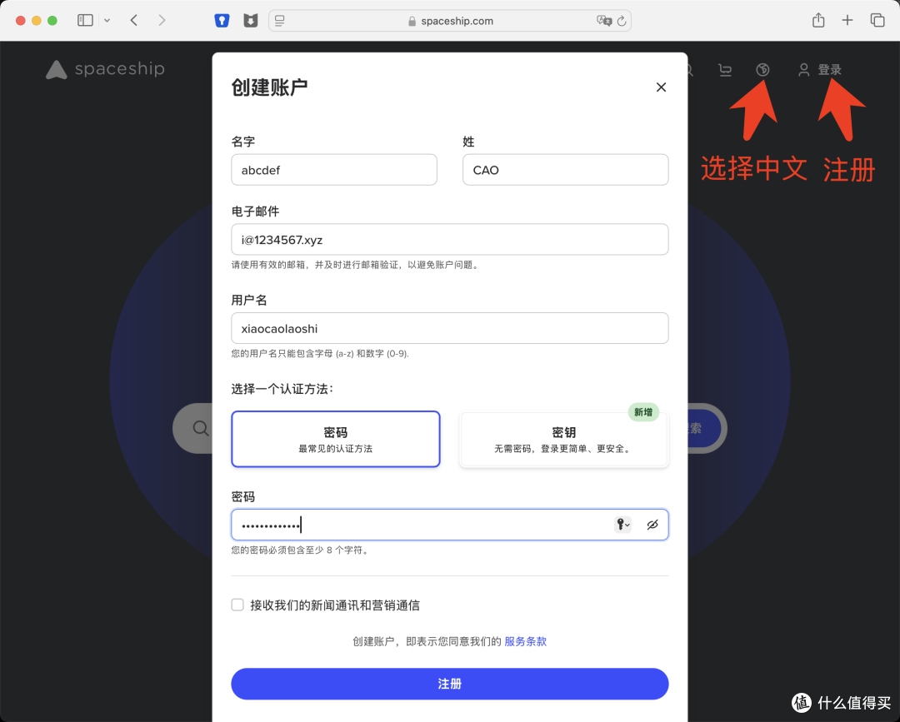
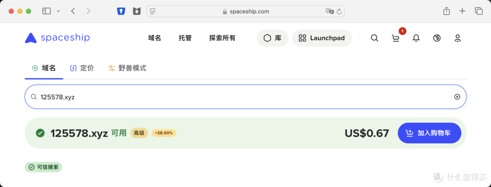
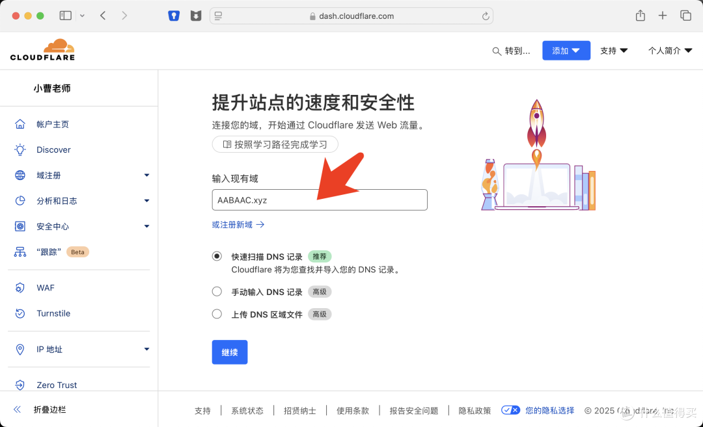
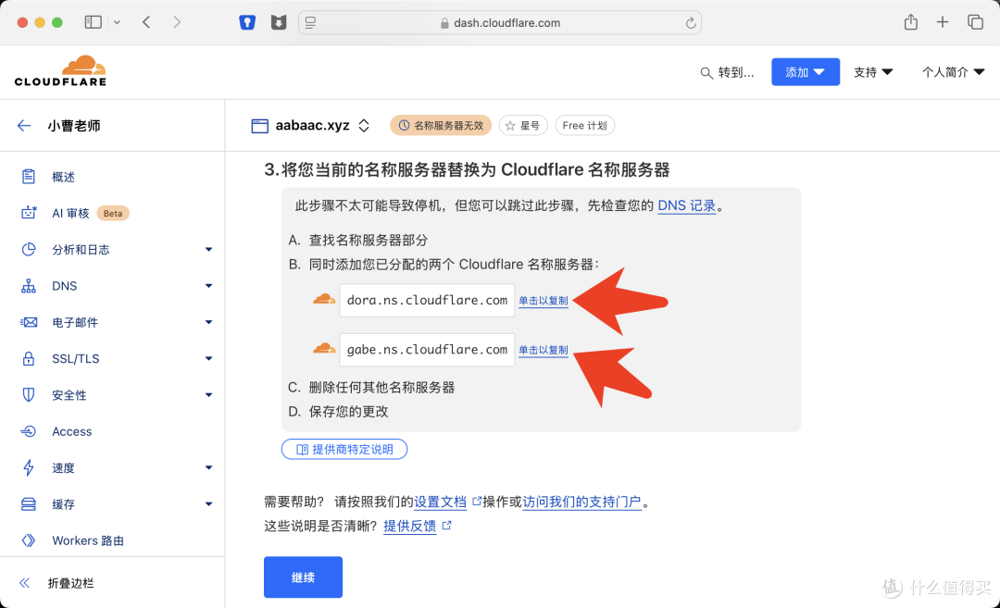
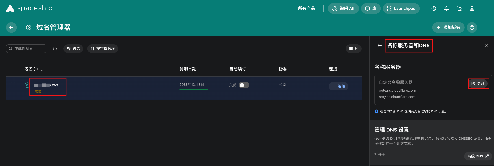
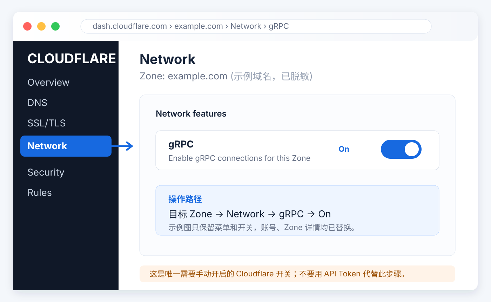
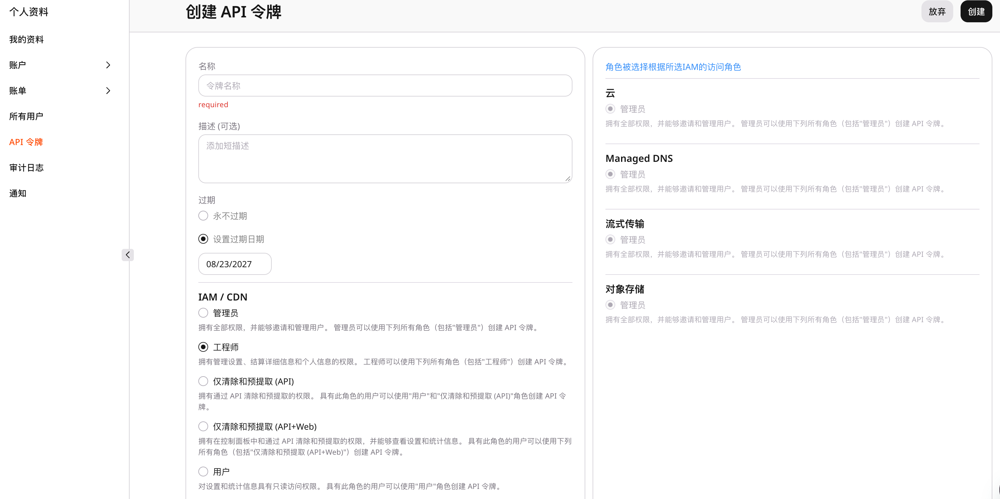

# 前置准备手册

本手册统一覆盖 Cloudflare、AWS、Gcore 三种 CDN 精选 IP 模式所需的域名、账号、DNS 和 Token 准备。

Cloudflare CDN 精选 IP XHTTP 模式（模式 2）阅读第 1–7 节；AWS 模式（模式 3）阅读第 2 节和
[AWS 一次性准备指南](aws-guide.md)；Gcore WebSocket 模式（模式 4）阅读第 1.1、2、8 节。
手册只覆盖注册、DNS、账号权限和 Token 准备，不包含 VPS 命令。完成后再回到
[README 的安装说明](../README.md) 执行安装。

线路与费用提示：只有非优化线路才推荐使用 CDN。Cloudflare Free 和 Gcore Free 链路预期为
`$0/月`；AWS 默认按量链路在免费 CloudFront 额度内常规预期约 `$0.60/月`，主要来自一个
Route 53 Hosted Zone 和少量标准 DNS 查询。具体边界见 [AWS 一次性准备指南](aws-guide.md)。

## 0. 按链路选择准备内容

先确定只安装其中一种链路，再准备对应资源。同一台 VPS 只能安装一种模式；同一个 DNS Zone
也只能委派给一组权威名称服务器，因此 Cloudflare、Route 53 和 Gcore Managed DNS 不能同时托管同一个 Zone。
需要并行测试不同 CDN 时，请使用不同根域名或分别正确委派的独立 Zone。

| 链路 | 必须准备 | 不需要准备 | 继续阅读 |
| --- | --- | --- | --- |
| 模式 1：Reality 直连 | Debian 12/13 amd64 专用 VPS、公网 IPv4；可直接使用 IP，也可准备 DNS only/灰云节点域名；如部署自托管订阅，再准备一个直接解析到 VPS 的域名 | CDN Provider 账号、CDN API Token、Globalping Token | README 的 Reality 章节；本手册无需继续 |
| 模式 2：Cloudflare XHTTP | 根域名、Cloudflare Free 账号、已变为 **Active** 的 Zone、一个节点子域名、Cloudflare API Token、Globalping Token；控制台手动开启 **Network → gRPC**；预期 `$0/月` | AWS/Gcore 账号与凭证、付费 Cloudflare 增值产品 | 第 1–7 节 |
| 模式 3：AWS CloudFront XHTTP | AWS 全球商业区账号及 MFA、费用提醒、Route 53 Public Hosted Zone、源站和节点子域名、最小权限 IAM Access Key、Globalping Token；默认按量模式常规预期约 `$0.60/月` | Cloudflare/Gcore Token、EC2、AWS 中国区账号 | 第 2 节和 [AWS 一次性准备指南](aws-guide.md) |
| 模式 4：Gcore WebSocket | Gcore Free CDN 账号、Gcore Managed DNS Free Zone、源站和节点子域名、具备 CDN/DNS 权限的 Gcore API Token、Globalping Token、控制台用量提醒；额度内预期 `$0/月` | XHTTP、Cloudflare gRPC、AWS 凭证 | 第 1.1、2、8 节 |

各链路建议使用的域名如下：

```text
Reality:    node.example.com（可选）；sub.example.com（仅自托管订阅需要）
Cloudflare: node.example.com；sub.example.com（可选独立订阅域名）
AWS:        origin.example.com；node.example.com；sub.example.com（可选）
Gcore:      origin.example.com；node.example.com；sub.example.com（可选）
```

所有模式都需要一台没有其他代理面板占用端口和配置的专用 VPS。CDN 三种模式都固定使用
Globalping 中国大陆探针预筛 IPv4；Globalping Token 的创建方法统一见第 2 节。

## 1. 先注册域名并交给 Cloudflare 托管

### 1.1 注册域名

域名注册商可以自行选择。参考文章使用 [Spaceship](https://www.spaceship.com/) 演示购买
`.xyz` 域名；本项目并不要求使用 Spaceship 或 `.xyz`，也不保证文章中的活动价格。注册前请同时
确认首年价格、续费价格、隐私保护、付款方式以及是否满足你所在地区的合规要求。

按参考文章第 1 节整理后的通用流程如下：

1. 打开 [Spaceship](https://www.spaceship.com/) 或你选定的注册商，注册账号并完成邮箱验证。
   如果注册商当前要求手机号、实名或其他验证，以注册商页面为准。
2. 搜索一个自己能长期使用的根域名，例如 `example.com`。本项目需要根域名控制权，后续会在
   它下面使用 `node.example.com` 这样的一级子域名。
3. 在 Spaceship 的优惠场景下，建议先注册 **1 年**，再续费 **9 年**；按 10 年总价计算，平均每年
   价格通常更便宜。下单前必须在当前结算页核对首年价、9 年续费价和 10 年总价，活动和价格可能变化。
4. 保存注册商账号、域名到期日和恢复邮箱。不要把注册商密码、付款信息或后续 API Token 写入
   仓库。

下面的截图是参考文章中的界面示例；Spaceship 的页面、价格和中文文案可能已经变化。





### 1.2 在 Cloudflare 注册账号并添加域名

1. 打开 [Cloudflare 注册页](https://dash.cloudflare.com/sign-up)，使用邮箱和密码创建账号，并按提示
   完成邮箱验证。
2. 进入 [Cloudflare Dashboard](https://dash.cloudflare.com/)，选择 **Add a domain**，输入刚注册的
   根域名，例如 `example.com`。
3. 选择 **Free** 计划即可。本项目的 Cloudflare 配置不要求购买付费计划。



Cloudflare 会为这个 Zone 分配两条名称服务器（Nameservers）。先完整复制并保存这两条值；不要把
`node.example.com` 的 DNS 记录提前建好，安装器需要检查并创建唯一的 proxied `A` 记录。

### 1.3 在注册商修改名称服务器

回到域名注册商的 DNS/Nameservers 页面，把根域名现有的权威名称服务器完整替换为 Cloudflare 显示的
两条名称服务器，然后保存。



下面是注册商侧 Nameservers 页面的脱敏示意图；域名和名称服务器均为示例值。



等待注册商和公共 DNS 更新，直到 Cloudflare 中该 Zone 的状态变为 **Active**。名称服务器切换期间，
如果域名还承载网站或邮件，请先记录原有的 `A`、`AAAA`、`CNAME`、`MX`、`TXT`、SPF、DKIM、DMARC
和 CAA 记录；遗漏邮件记录可能导致收发信中断。

参考文章：[48元撸10年xyz域名，搭配Cloudflare有N王炸玩法](https://post.smzdm.com/p/ae5rg7nk/)
（第 1、2 节）。文中截图仅用于说明操作位置，最终以注册商和 Cloudflare 当前页面为准。

### 1.4 本项目对域名的要求

- Cloudflare 模式使用一个 Zone 和一个一级子域名，例如 `node.example.com`；根域名本身只用于
  托管 Zone，不作为客户端节点名。
- `node.example.com` 不要预先创建 DNS 记录；独立订阅域名（如使用）也必须位于同一个 Zone 下。
- 注册商可以留在原处；Cloudflare 需要的是整个根域名的权威 DNS 委派，而不是把域名所有权转入
  Cloudflare。
- 如果 Cloudflare Zone 尚未 **Active**，先完成名称服务器切换，不要继续创建 Token 或运行安装器。

## 2. 注册 Globalping 并创建 Access Token

Globalping 用于从中国大陆的电信、联通和移动探针筛选可用的 CDN IPv4。注册 Globalping 不需要
单独填写一套账号密码：打开 [Globalping Dashboard](https://dash.globalping.io/)，点击
**Sign in with GitHub**；如果还没有 GitHub 账号，可先在 [GitHub 注册页](https://github.com/signup)
创建账号。

### 2.1 注册/登录

1. 打开 [Globalping Dashboard](https://dash.globalping.io/)。
2. 选择 **Sign in with GitHub**，在 GitHub 页面完成登录和授权。
3. 返回 Dashboard，确认能够看到自己的账号和用量信息。

### 2.2 创建 Access Token

1. 登录后打开 [Dashboard Tokens](https://dash.globalping.io/tokens)。
2. 选择 **Generate a new token**，填写用途名称，例如 `easy_all_cloudflare_cdn`。
3. 创建后立即复制 Token；完整 Token 通常只在创建时显示。
4. 安装 Cloudflare 精选 IP 模式时，把它粘贴到安装器的 `Globalping Token` 输入框。

### 2.3 安全保管

- 不要把 Token 提交到 Git、写进 README、截图或公开日志。
- 不要在聊天、Issue 或其他公开渠道发送 Token。
- 怀疑泄露时，立即在 [Globalping Tokens](https://dash.globalping.io/tokens) 撤销并重新创建。

## 3. Cloudflare 安装前准备

1. 在已经 **Active** 的 Zone 下准备客户端连接的 CDN 节点域名，例如 `node.example.com`。不要预先创建这个名称的 DNS 记录。
2. 进入目标 Zone 的 **Network → gRPC**，将 **gRPC** 手动切换为 **On**。这是 XHTTP
   `stream-up` 的必需条件，Cloudflare 当前没有可用于该开关的 Zone Settings API，安装器无法代办。
3. 如果部署独立订阅域名，它也必须是同一 Zone 下的一级子域名。



安装、`apply-cloud` 和 `refresh-cdn-ips` 会主动发送 gRPC 形态的边缘请求检查该开关。若收到
`403 text/html`，命令会停止并明确提示开启 gRPC。普通 `/easy_all-health` 返回 HTTP 200
不能证明 gRPC 已开启；若订阅可以下载、所有 XHTTP 节点却同时超时，应首先复查此开关。

## 4. 只创建一个 Cloudflare API Token

进入 **My Profile → API Tokens → Create Token → Custom Token**，资源选择：

```text
Include → Specific zone → example.com
```

仅添加以下六项权限：

| 权限 | 用途 |
| --- | --- |
| `Zone / Zone / Read` | 识别并验证目标 Zone |
| `Zone / DNS / Edit` | 管理节点和订阅 DNS 记录 |
| `Zone / Transform Rules / Edit` | 管理回源密钥规则 |
| `Zone / Config Rules / Edit` | 设置 Full (strict) |
| `Zone / Zone Settings / Edit` | 启用 origin HTTP/2 |
| `Zone / SSL and Certificates / Edit` | 签发、轮换和吊销 Origin CA 证书 |


创建后立即复制 Token，并粘贴到安装器的 `Cloudflare API Token` 输入框。Token 只在当前进程使用，
不会写入状态文件；请勿选择所有 Zone，也不要添加其他权限。

## 5. 安装器会自动完成的事项

- 创建唯一的 proxied `A` 记录，指向 VPS 公网 IPv4。
- 签发 15 年 Origin CA 证书并配置 Full (strict)。
- 开启 origin HTTP/2，并写入 XHTTP 回源密钥规则。
- 验收 Cloudflare gRPC 边缘请求；开关未开启时立即停止并提示前往控制台处理。
- 仅允许 Cloudflare 官方 IPv4 段访问 VPS 的 TCP 443。
- 每小时读取 Cloudflare 官方 IPv4 CIDR，拆分为 `/24` 后轮换抽样 120 个地址。
- VPS 先并发验证候选的 SNI、HTTPS、HTTP/2 和 `/easy_all-health`，排除官方地址范围中未提供
  CDN 入口的地址；再按 Globalping 当前剩余免费额度限制本轮测量规模，避免耗尽额度。
- 使用中国电信 `AS4134`、中国联通 `AS4837`、中国移动 `AS9808` 的 Globalping
  `eyeball-network` 探针分别发送 10 包 TCP/443，执行零丢包预筛；每个运营商先按 RTT 取前 10，再合并去重并
  按三网覆盖数、平均 RTT 排序。
- 最终最多发布 12 个 IP 节点。
- 订阅始终额外保留一个原始域名兜底节点。客户端 Mihomo 每 600 秒测速，候选快至少
  50 ms 才切换；所有节点的 SNI 和 XHTTP Host 始终使用节点域名。
- 测量失败继续使用上次有效缓存；缓存超过 72 小时则回退到节点域名。

安装器不会覆盖其他 DNS 记录或规则。发现同名记录、规则歧义或权限不足时会停止并保留本机状态。

## 6. 费用与使用边界

上述能力可在 Cloudflare Free Zone 使用；域名注册费和 VPS 费用另计。本项目不会自动启用任何
按量计费的增值产品，也不承诺固定的月度 CDN 流量额度。

| 项目 | 说明 |
| --- | --- |
| 基础 CDN 费用 | Free Zone 本身无月费；Token、proxied DNS、Universal SSL、Origin CA、HTTP/2、gRPC 和规则配置不单独收费。 |
| 可用流量 | 没有可据此保证的固定 GB 上限；实际受 Cloudflare 服务条款、账户风控、VPS 带宽和连接质量共同限制。 |
| 单次请求 | Free/Pro 的请求体上限为 **100 MB**；长连接或大流量不等于获得无限制隧道能力。 |
| 额外费用 | 只有自行启用 Argo、WAF、Bot Management 等增值产品时，相关流量才可能产生额外费用；本项目不启用它们。 |

本链路是实时 XHTTP 转发，数据不会因为 CDN 缓存而减少 VPS 出口流量。建议先按目标用户数、峰值并发、
VPS 出口带宽和每用户配额估算容量，再进行低速、长连接和持续传输测试。Cloudflare 的条款、流量限制
和风控优先于本说明。

## 7. 卸载

`sudo easy_all uninstall` 只清理本机。`sudo easy_all uninstall --purge-cloud` 会先使用同一枚
Token 删除 easy_all 标记的节点/订阅 DNS、按稳定 `ref` 定位的 Transform/Config Rules、删除规则后
为空且名称匹配的 easy_all ruleset，并吊销 Origin CA 证书；全部完成后才清理本机。未带 easy_all
标记的 DNS、包含其他规则的 ruleset、Zone 级 origin HTTP/2 设置和手动 gRPC 开关都会保留。

官方参考：[Origin CA](https://developers.cloudflare.com/ssl/origin-configuration/origin-ca/)、
[Full (strict)](https://developers.cloudflare.com/ssl/origin-configuration/ssl-modes/full-strict/)、
[gRPC](https://developers.cloudflare.com/network/grpc-connections/)、
[Transform Rules](https://developers.cloudflare.com/rules/transform/)、
[Cloudflare IP 地址](https://www.cloudflare.com/ips/)。

## 8. Gcore CDN 精选 IP WebSocket 准备

模式 4 使用 `VLESS + WebSocket + TLS`。这是 Gcore 明确支持的 CDN 协议，Gcore 也发布了
[V2Ray via WebSocket 教程](https://gcore.com/learning/v2ray-websocket)。本模式不使用 XHTTP、
gRPC 或 HTTP/3 WebSocket。

安装器需要两项彼此独立的凭证：

```text
GCORE_API_TOKEN   # 仅在当前云端操作进程中使用，不落盘
Globalping Token  # 保存到 VPS 的 root-only 文件，用于中国大陆测量
```

不要把 Token 写入脚本、Git、截图或聊天记录。

### 8.1 费用边界

Gcore Free CDN 当前标明每月包含 1 TB（十进制 1000 GB）流量；超额流量和请求可能计费，
标价未含 VAT。

模式 4 使用 `990 GB` 本地保护值：Xray 统计达到阈值后移除全部节点用户，进入下一个 UTC
自然月再恢复。该配置只留下约 10 GB 缓冲，只能作为第二道保护，不能代替 Gcore 控制台报表，
因为协议开销、请求数、统计延迟和 Gcore 实际计量均不在 Xray 本地统计中。建议同时开启
Gcore 控制台用量提醒。

官方参考：[Gcore Edge Network 定价](https://gcore.com/pricing/edge-network)、
[CDN 计费规则](https://docs.gcore.com/cdn/how-the-cdn-service-and-its-additional-options-are-billed.md)。

### 8.2 委派域名到 Gcore Managed DNS

本实现只支持整个 Zone 已委派给 Gcore Managed DNS 的自动化路径。**域名托管这一步需要先在
Gcore 控制台完成**；安装器随后只管理节点所需记录，不会创建或删除 Zone，也不会修改注册商的
Nameservers。

```text
origin.example.com  源站 A，指向 VPS IPv4
node.example.com    CDN CNAME，指向账户专属 *.gcdn.co
sub.example.com     可选订阅域名，作为同一 CDN Resource 的 secondary hostname
```

#### 在 Gcore 控制台托管域名

当前控制台路径是 **网络 → Managed DNS → 所有区域 → 添加区域**。点击后会进入四步流程：
**输入域 → 正在扫描记录 → 检查记录 → 更改域名服务器**。

1. 在“输入域”填入要托管的根域，例如 `example.com`，不要填写 `node.example.com` 这样的节点子域。
2. 保持 **Skip scanning** 未勾选，让 Gcore 扫描现有 DNS。只有确认根域从未承载网站、邮箱或其他
   DNS 业务时，才可跳过扫描。
3. 点击 **Create zone** 后，在“检查记录”逐项核对导入的 A、AAAA、CNAME、MX、TXT、CAA、SPF、DKIM
   和 DMARC。遗漏 MX/TXT/SPF/DKIM/DMARC 会影响邮件；遗漏 CAA 可能影响证书签发。
4. 在“更改域名服务器”复制 Gcore 给出的全部权威 NS；回到注册商的 Nameservers 页面，完整替换当前 NS
   并保存。不要只新增一条，也不要同时保留旧 DNS 服务商的 NS。
5. 等待 Gcore 控制台中的 Delegation Status 通过：Zone 存在、至少一个 Gcore 权威 NS，且没有非 Gcore
   权威 NS。NS 传播可能需要数分钟到 48 小时。
6. 委派完成前不要运行模式 4；也不要预先创建 `origin`、`node` 或独立订阅记录，安装器会在确认无冲突
   后创建。

#### 安装前与自行确认委派状态

安装器会在 **第 4/9 步、创建源站 A 记录之前**调用 Gcore 的 Delegation Status 接口。只有同时满足
`zone_exists=true`、Gcore 权威 NS 数量大于 `0`、非 Gcore 权威 NS 数量为 `0` 才继续；否则立即停止，
不会创建或覆盖任何 DNS/CDN 资源。委派刚改完时可直接尝试安装，未生效便按提示安全退出，稍后重试即可。

也可以在自己的电脑或 VPS 上检查。以下示例以 `1988088.xyz` 为例：

```bash
# 查看常用递归解析器当前看到的权威 NS；结果必须全部是 Gcore 控制台“更改域名服务器”页面给出的 NS。
dig @1.1.1.1 NS 1988088.xyz +short
dig @8.8.8.8 NS 1988088.xyz +short

# 沿 DNS 委派链追踪，适合在不同公共解析器结果不一致时排查。
dig +trace NS 1988088.xyz

# 确认域名可被启用 DNSSEC 校验的公共解析器正常解析；不得返回 SERVFAIL。
dig @1.1.1.1 SOA 1988088.xyz +dnssec
```

若命令不可用，安装 `dnsutils`（Debian/Ubuntu）或 `bind-utils`（RHEL 系）后再试。Gcore 控制台的
**Delegation Status 已通过**说明 NS 委派完成；公共递归解析器的 `SOA` 查询正常返回、而非 `SERVFAIL`，才表示
域名在互联网中可正常使用。公共递归解析器可能仍保留旧 NS 缓存。若 `dig` 输出同时包含旧服务商和 Gcore 的 NS，
说明注册商处没有完整替换，或委派尚未传播完成；不要开始安装。

> **从已启用 DNSSEC 的旧 DNS 服务商迁移时**：在注册商处先关闭旧 DNSSEC 或删除旧的 `DS` 记录，再更换 NS。
> 否则注册局仍会要求新权威 DNS 使用旧密钥签名，开启 DNSSEC 校验的公共解析器会返回 `SERVFAIL`，即使新 NS
> 本身已经正确。可用 `dig DS example.com +short` 检查；计划继续使用 DNSSEC 时，先在 Gcore 为 Zone 启用 DNSSEC，
> 再将 **Gcore 当前生成的 DS** 写入注册商，绝不能沿用 Cloudflare 或其他旧服务商的 DS。

Gcore Free Managed DNS 当前可用于此流程；若当前账户的 Managed DNS 显示未激活或并非 Free 方案，先在
该产品页完成启用，再创建 Zone。

节点域名不能是 Zone 根域，因为它需要使用 CNAME。已有 A、AAAA 或其他 CNAME 时，脚本默认停止，
不会静默覆盖。只有明确设置 `GCORE_DNS_REPLACE=1` 才允许替换冲突记录。

### 8.3 Gcore API Token 权限

新建一枚 easy_all 专用 Token。API 使用：



```http
Authorization: APIKey <token>
```

Token 所属身份必须能读取和修改：

- CDN Client、Origin Group、CDN Resource；
- CDN SSL Certificate 与 Trusted CA Certificate；
- Managed DNS Zone、Delegation Status 和 RRset。

创建 Token 前应让账户管理员确认该身份具备 CDN 和 Managed DNS 写权限；不要授予 Cloud、Storage、
Streaming、WAAP 或 IAM 用户管理权限。

安装器会访问的主要接口：

```text
GET    /cdn/clients/me
GET    /cdn/resources
POST   /cdn/origin_groups
POST   /cdn/sslCertificates
POST   /cdn/sslData
GET    /dns/v2/zones
GET    /dns/v2/analyze/<zone>/delegation-status
PUT    /dns/v2/zones/<zone>/<name>/<type>
```

官方参考：[API 认证](https://docs.gcore.com/developer-tools/rest-api/authentication.md)、
[API Token](https://docs.gcore.com/account-settings/api-tokens.md)。

### 8.4 安装器创建的链路与固定参数

```text
客户端 VLESS
  -> WebSocket + TLS，ALPN http/1.1
  -> Gcore 精选边缘 IPv4，SNI/Host 仍为 node.example.com
  -> Gcore CDN WebSocket
  -> HTTPS + Origin SSL Validation + Gcore 客户端证书
  -> Nginx mTLS + Origin Key
  -> 127.0.0.1 上的 Xray VLESS WebSocket
```

| 参数 | 值 | 原因 |
| --- | --- | --- |
| `heartbeatPeriod` | `55` 秒 | 在移动端续航与常见 NAT 空闲回收之间取平衡 |
| Early Data | `2560` | 通过 `Sec-WebSocket-Protocol` 携带 |
| ALPN | `http/1.1` | 标准 WebSocket 使用 HTTP/1.1 Upgrade，不混入 RFC 8441 `h2` |
| Mux | 关闭 | 避免单个 WebSocket 故障影响多条逻辑连接 |
| VLESS flow | 空 | WebSocket 不使用 Vision flow |
| 证书校验 | 开启 | 精选 IP 不改变 SNI，也不跳过证书校验 |

Gcore Resource 开启 `websockets`，显式关闭 `grpc_passthrough`；使用 HTTPS 回源并固定 Host/SNI；
只允许 `GET/HEAD`；Edge cache 和 browser cache 均为 `0s`；保留查询参数以支持 `?ed=2560`；
注入随机 Origin Key；不覆盖 Gcore WebSocket 的回源读取超时；使用 DNS-01 自动边缘证书，并开启
Origin SSL Validation。CNAME 目标只读取 `GET /cdn/clients/me` 返回的账户专属 `cname`。

### 8.5 Origin SSL Validation 与 mTLS

源站使用独立 Let's Encrypt 证书。安装器从 `fullchain.pem` 提取签发 CA，上传到
`/cdn/sslCertificates`；同时在 VPS 生成专用客户端 CA 和客户端证书，把客户端证书与私钥上传到
`/cdn/sslData`。Gcore 验证源站证书并出示客户端证书；Nginx 使用 `ssl_verify_client on`，所以直接
访问源站 443 即使知道 Origin Key，也无法通过 TLS 客户端证书验证。

如果源站证书续期后签发 CA 发生变化，普通 `easy_all apply` 会停止并提示运行
`easy_all apply-cloud`。`easy_all renew-cert` 会要求 Gcore Token，在续期后同步 Trusted CA 并重新验收。

官方参考：[Origin SSL Validation](https://docs.gcore.com/cdn/cdn-resource-options/general/enable-origin-ssl-validation.md)。

### 8.6 精选 IP 与验收

Globalping 对 `node.example.com:443` 使用中国大陆探针发送 10 包 TCP 测量，只保留零丢包 IPv4。
VPS 随后使用候选 IP 建立 TLS（SNI/Host 保持业务域名），验证健康检查和标准 WebSocket HTTP `101`。
最多保存 10 个候选，每小时刷新；刷新失败保留旧缓存，超过 72 小时回退 CDN 域名。

首次上线仍应在实际移动、联通、电信网络测试锁屏/空闲、Wi-Fi/蜂窝切换、至少 2 小时连续传输、
Early Data 开关对照，以及精选 IP 与业务域名入口对照。

### 8.7 云资源清理

`easy_all uninstall` 默认只删除 VPS 本机内容并保留 Gcore 资源。

`easy_all uninstall --purge-cloud` 会先验证状态中的 ID、域名和 `easy_all` 名称标记，再依次删除
CDN Resource、边缘证书、回源客户端证书、Trusted CA、Origin Group，以及仅由本次安装创建且内容
仍与状态一致的 CNAME/A 记录。任何所有权或记录内容不匹配都会停止；脚本永不删除 Managed DNS Zone。
