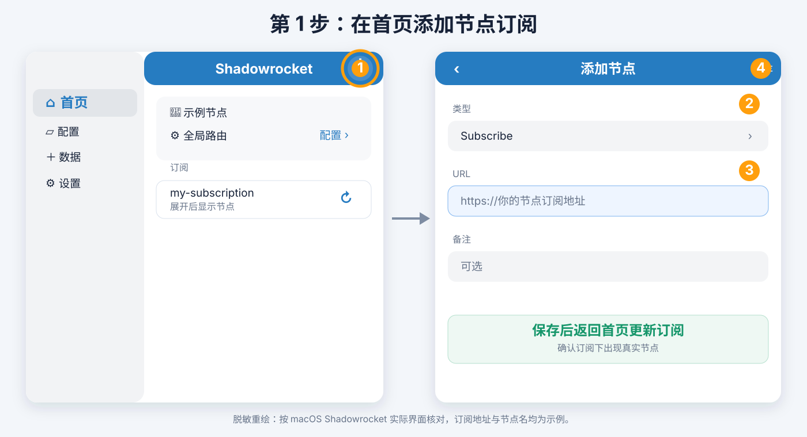
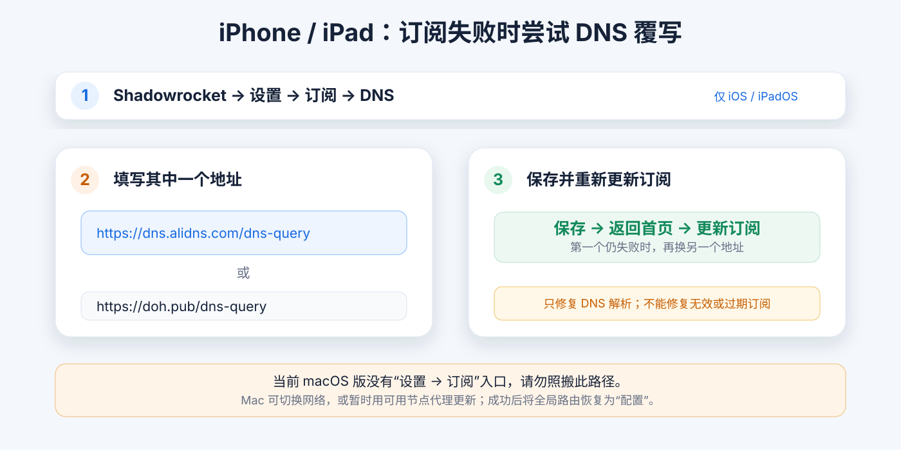
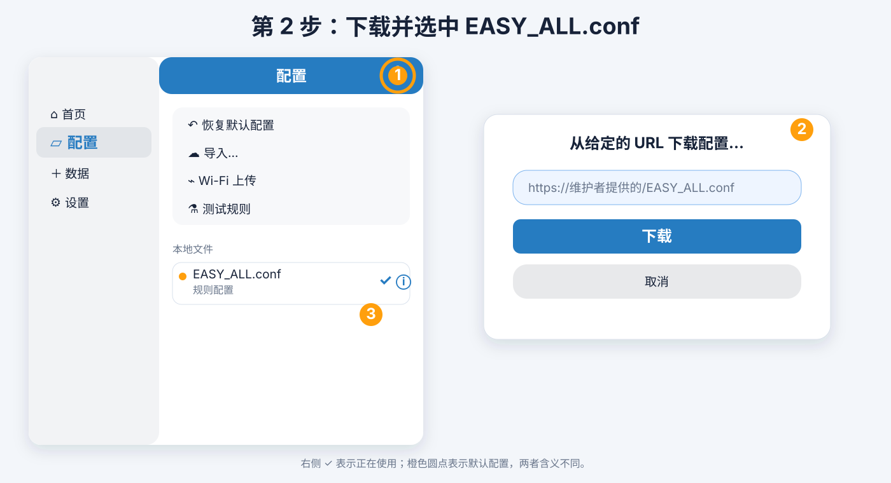
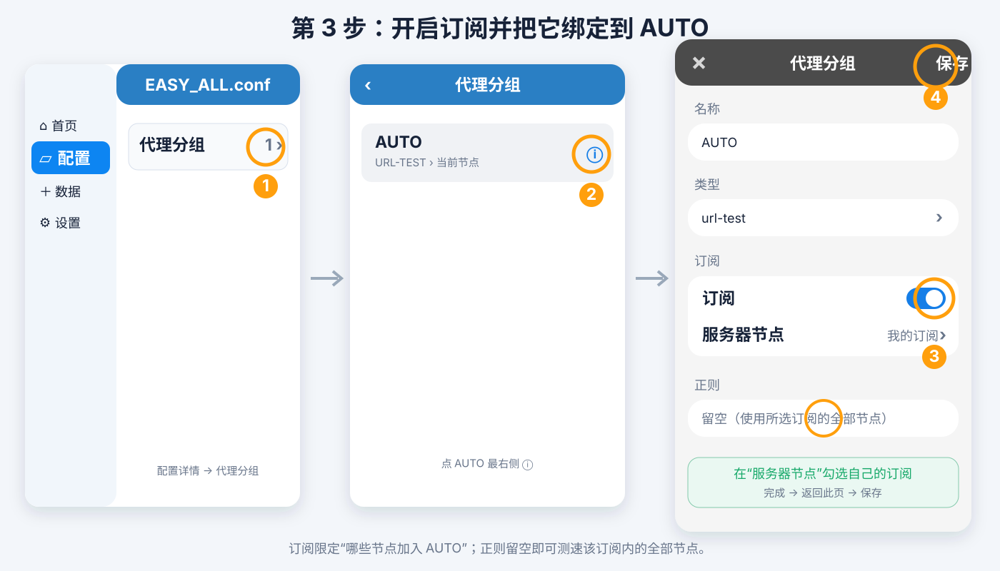
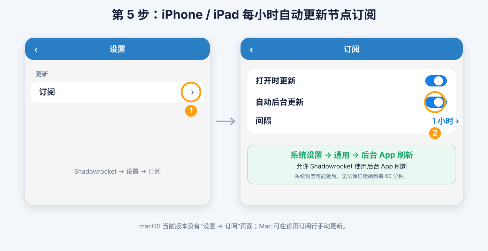
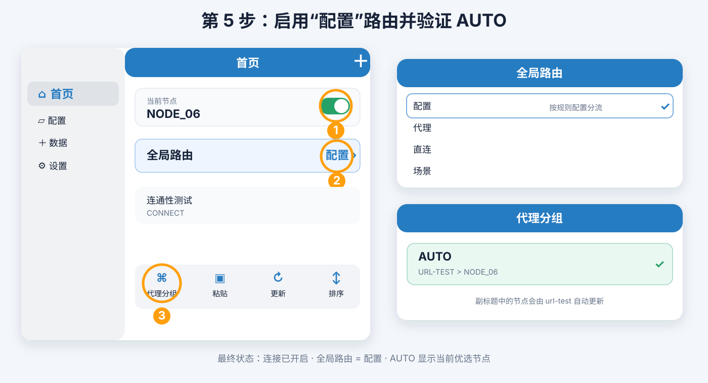

# Shadowrocket AUTO 自动选节点指南

本指南按 Shadowrocket 当前实际界面和操作截图重绘。`EASY_ALL.conf` 提供一个 `AUTO` 代理分组；用户不需要部署 Worker，但需要把自己的节点订阅绑定到该分组。之后 Shadowrocket 会在这个订阅的全部节点中测速并选优。

> **先分清两种更新：** 每小时更新的是“节点订阅”，用于取得新增、删除或变更的节点；它不会重新下载 `EASY_ALL.conf`，也不会覆盖你为 `AUTO` 保存的订阅选择。规则配置只在维护者发布更新或需要修复时再手动下载。

## AUTO 的工作方式

```text
节点订阅（所有节点）
        ↓ 每小时更新订阅
AUTO（url-test，每 300 秒测速）
        ↓
当前优选节点
        ↓
规则策略 = AUTO 的流量
```

| AUTO 参数 | 当前值                                     | 含义                             |
| --------- | ------------------------------------------ | -------------------------------- |
| 类型      | `url-test`                               | 周期性测试并选出响应更好的节点   |
| 测试 URL  | `https://cp.cloudflare.com/generate_204` | 轻量连通性测试                   |
| 测试间隔  | `300` 秒                                 | 每 5 分钟重新测速                |
| 超时      | `5` 秒                                   | 节点超过 5 秒视为本轮失败        |
| 公差      | `30` 毫秒                                | 新节点明显更好时才切换，减少抖动 |
| 正则      | 留空                                       | 使用所选订阅中的全部节点         |

## 第 1 步：添加并更新节点订阅

1. 在 **首页** 点击右上角 `＋`，类型选择 **Subscribe**。
2. 填入自己的节点订阅 URL，保存后点击订阅行右侧的更新图标。
3. 展开订阅，确认里面出现真实节点。



节点订阅地址填在“首页 → ＋ → Subscribe”；不要把 `EASY_ALL.conf` 规则配置地址填到这里。使用 easy_all 自托管订阅时，可先在 VPS 运行：

```bash
sudo easy_all subscription
```

### 订阅拉取失败时的 DNS 覆写

iPhone/iPad 可在 `Shadowrocket → 设置 → 订阅 → DNS` 填入其中一个地址，然后手动更新订阅：

```text
https://dns.alidns.com/dns-query
```

或：

```text
https://doh.pub/dns-query
```



当前 macOS 版“设置”页没有“订阅”项目。Mac 更新失败时可切换网络，或先用可用节点把“全局路由”暂时设为“代理”后重试；成功后恢复“配置”。DNS 覆写只能处理解析问题，不能修复失效订阅或错误 Token。

## 第 2 步：导入一次 EASY_ALL.conf

1. 左侧选择 **配置**，点击右上角 `＋` 。
2. 在“从给定的 URL 下载配置…”中粘贴以下完整 `EASY_ALL.conf` 地址，然后点击 **下载**。代码块右上角的复制按钮可直接复制：

```text
https://shadowrocket.tiandi.party/EASY_ALL.conf
```

3. 在“本地文件”中点击 `EASY_ALL.conf`，看到 `✓` 即为当前使用的配置；橙色圆点只是默认配置标记。



## 第 3 步：把指定订阅绑定到 AUTO

这是 AUTO 设置的关键步骤。它会让 `AUTO` 只测速你的节点订阅，而不是依赖正则从所有节点中猜测。

1. 在 **配置 → 本地文件** 找到 `EASY_ALL.conf`，点它最右侧的 `ⓘ`。
2. 点 **代理分组**（数量为 `1`），在列表中点 `AUTO` 右侧的 `ⓘ`。
3. 确认名称为 `AUTO`、类型为 `url-test`。
4. 打开 **订阅** 开关。
5. 点 **服务器节点**，在列表底部勾选自己的订阅名称；点右上角 **完成** 返回。
6. **正则留空**。这样 AUTO 会使用该订阅里的全部节点。
7. 点右上角 **保存**。



保存后，代理分组列表会显示 `AUTO` 以及 `URL-TEST > 当前节点名`。当前节点刚开始可能是订阅中第一个；Shadowrocket 完成测速后，只要其他节点快超过 30ms，就会自动切换。

> **配置更新边界：** 重新下载 `EASY_ALL.conf` 可能覆盖这一步的本地修改。日常只让节点订阅自动更新；重新下载规则配置后，检查一次“AUTO → 订阅 → 服务器节点”是否仍选中你的订阅。

## 第 4 步：规则已自动使用 AUTO

不需要再逐条修改规则。Worker 生成 `EASY_ALL.conf` 时，会把上游 `lazy.conf` 中所有生效的 `PROXY` 规则自动改为 `AUTO`；`DIRECT` 规则和被注释的规则不变。

导入新版配置后，可在 `配置 → EASY_ALL.conf → 规则` 中抽查：原来显示 `PROXY` 的 AI、YouTube、Netflix 与 `FINAL` 规则应显示为 `AUTO`。首页固定节点只会用于你自行新增的 `PROXY` 规则，或将全局路由切到“代理”时。

## 第 5 步：建议每小时自动更新节点订阅

此项适用于 **iPhone/iPad**：

1. 进入 `Shadowrocket → 设置 → 订阅`。
2. 打开 **打开时更新**。
3. 打开 **自动后台更新**，将 **间隔** 设为 **1 小时**。
4. 在 iOS/iPadOS 系统设置中进入 `通用 → 后台 App 刷新`，允许 Shadowrocket 使用后台 App 刷新。



后台刷新由系统调度，不保证恰好每 60 分钟执行；低电量模式、后台 App 刷新关闭或系统限制会延后它。打开 App 时更新可作为补充。macOS 当前版本没有这组“订阅”设置，仍可在首页的订阅行手动点击更新。

## 第 6 步：启用配置模式并检查

1. 返回首页，打开连接开关。
2. 点 **全局路由**，选择 **配置**；“代理”和“直连”会绕过规则配置。
3. 从首页工具栏打开 **代理分组**，确认 `AUTO` 的副标题为 `URL-TEST > 当前优选节点`。



检查清单：

```text
[✓] 节点订阅中已有真实节点
[✓] EASY_ALL.conf 正在使用
[✓] AUTO 类型为 url-test
[✓] AUTO 的“订阅”已开启，服务器节点已选自己的订阅
[✓] AUTO 的“正则”为空
[✓] 配置中的原 PROXY 规则已自动显示为 AUTO
[✓] iPhone/iPad 的订阅后台更新间隔为 1 小时
[✓] 全局路由 = 配置
```

## 常见问题

| 现象                         | 处理                                                                                                        |
| ---------------------------- | ----------------------------------------------------------------------------------------------------------- |
| `AUTO` 仍使用别的订阅节点  | 进入`AUTO → 订阅 → 服务器节点`，只勾选自己的订阅后保存。                                                |
| `AUTO` 分组显示首个节点    | 正常。首次载入会先使用默认节点，等待一次测速；新节点需快超过 30ms 才会切换。                                |
| AUTO 节点列表未更新          | 在首页手动更新节点订阅；iPhone/iPad 检查后台 App 刷新和 1 小时间隔。                                        |
| 流量仍走首页固定节点         | 检查是否正在使用新版`EASY_ALL.conf`，且“全局路由”为“配置”。新版配置会自动把上游 PROXY 规则改为 AUTO。 |
| 重新下载规则后 AUTO 设置消失 | 配置下载覆盖本地修改。重新完成第 3 步；日常不需要重新下载规则，只更新节点订阅。                             |
| 所有 AUTO 节点超时           | 先在首页测试节点，并检查网络是否能访问测试 URL；AUTO 无法修复失效节点或协议不兼容。                         |

`url-test` 选的是测试响应较好的节点，不等同于下载测速，也不会让已建立的连接无缝迁移。

参考资料：

- [Shadowrocket App Store 页面](https://apps.apple.com/app/shadowrocket/id932747118)
- [Shadowrocket Wiki：更新订阅节点](https://github.com/LOWERTOP/Shadowrocket/wiki/)
- [统一规则配置使用的上游 lazy.conf](https://johnshall.github.io/Shadowrocket-ADBlock-Rules-Forever/lazy.conf)
