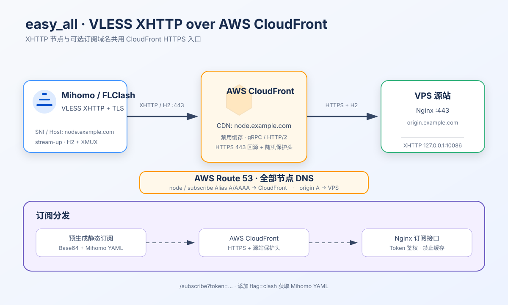
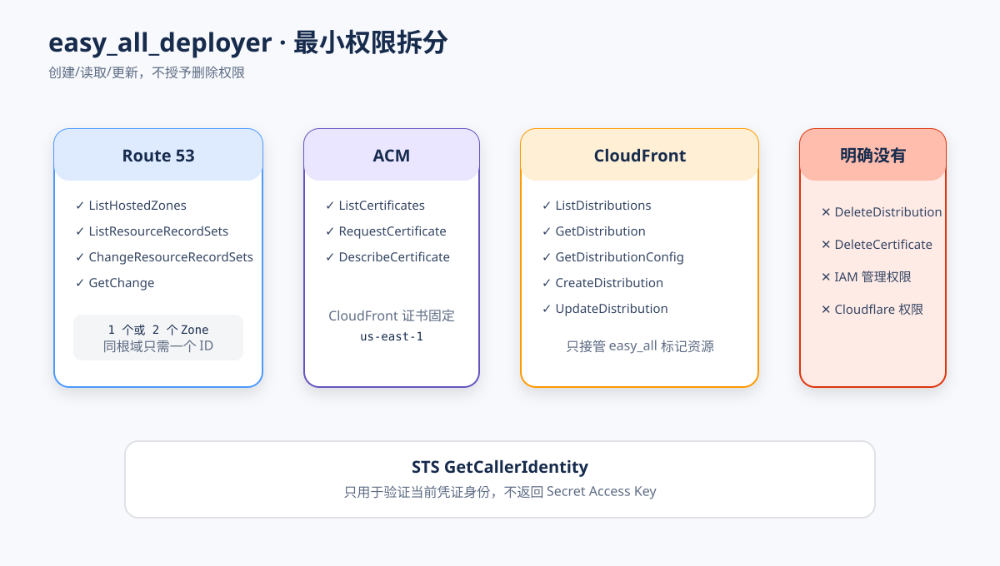
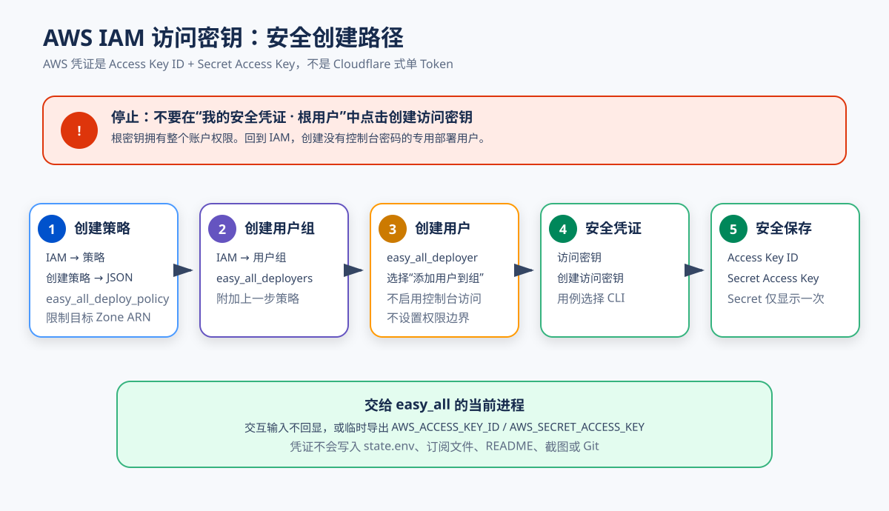
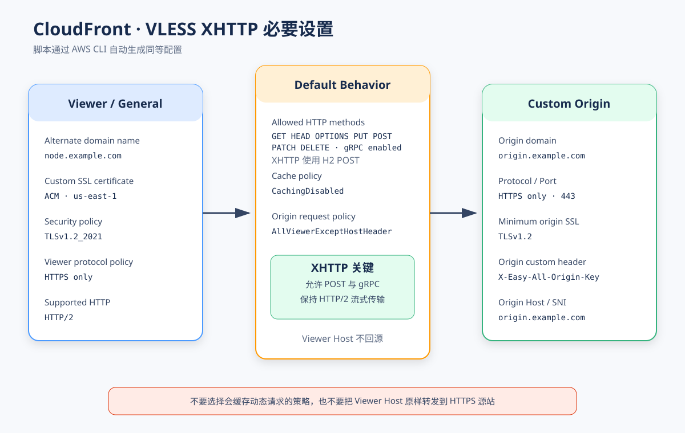

# CDN XHTTP：AWS Provider

本文说明 `easy_all` 的 CDN XHTTP 模式当前使用的 AWS Provider：

它只输出一个 VLESS XHTTP 节点，通过 AWS CloudFront 连接到 Xray。

- DNS 使用 AWS Route 53，CDN 使用 AWS CloudFront；节点链路不使用 Cloudflare DNS/CDN。
- XHTTP 使用 `stream-up`、HTTP/2、gRPC header 与 XMUX；服务端固定 `mode: stream-up`。
- 服务端每 `20-40` 秒发送流式保活数据，短于 CloudFront 60 秒回源空闲超时。
- XMUX 使用 `4-8` 并发、按连接存活时间轮换 H2 连接和 Chrome 风格 H2 保活，适配多用户与移动网络。
  Mihomo 订阅不设置计数不严格且官方不建议填写的 `h-max-request-times`。
- 不安装其他代理协议。
- 可选择部署 CloudFront + Nginx 订阅，或只输出节点信息。
- AWS 侧自动配置源站 A 记录、ACM、CloudFront 和 CDN CNAME，使用 HTTPS 443 回源。



```text
AWS Route 53 DNS:
  node.example.com   CNAME -> CloudFront
  origin.example.com A     -> VPS

节点数据链路:
  Mihomo / FLClash
        -> VLESS XHTTP stream-up/H2 :443
        -> AWS CloudFront (AWS CDN)
        -> HTTPS :443 + X-Easy-All-Origin-Key
        -> Nginx -> Xray XHTTP 127.0.0.1:10086

订阅链路:
  客户端 -> CloudFront /subscribe?token=... -> Nginx -> 静态订阅文件
```

## 部署前准备

需要两个不同的域名，其中 CDN 入口必须使用子域名：

| 域名                   | 用途                  | 安装前状态                                                         |
| ---------------------- | --------------------- | ------------------------------------------------------------------ |
| `origin.example.com` | CloudFront HTTPS 源站 | 位于 Route 53 Public Hosted Zone；脚本创建直连 VPS 的 A 记录       |
| `node.example.com`   | VLESS 客户端入口      | 位于 Route 53 Public Hosted Zone；脚本创建指向 CloudFront 的 CNAME |

还需要：

- Debian 12/13 amd64 专用 VPS，使用 root、systemd，TCP 80/443 未被其他程序占用。
- 两个域名所在父域都已托管到 Route 53 的 **Public Hosted Zone**；可以位于同一个或不同 Zone。
- AWS IAM 专用部署用户的访问密钥；不要使用根用户密钥。
- AWS 账户可创建 ACM 公有证书和 CloudFront 分配，并已了解相应费用。
- 不需要 Cloudflare 账户、Cloudflare API Token 或 Worker。

安装器会升级系统包、启用 Debian 官方内核中的 Google BBR、配置 UFW，并管理 root 定时重启任务。
它只适合专用 VPS，不应与其他代理安装器共存。

例如源站使用 `direct.1988088.xyz`、CDN 入口使用 `node.1988088.xyz` 时，两者都属于
`1988088.xyz` 这一个 Hosted Zone，因此只需要一个 Hosted Zone ID。安装前没有
`node.1988088.xyz` 记录是正常状态：脚本会先创建 CloudFront，再自动创建它的 CNAME；不要
提前随意填写一个 CNAME 目标。

## AWS 的“API Token”是什么

AWS 没有与 Cloudflare Bearer Token 完全对应的一串通用 API Token。这里使用的是 AWS IAM
程序化访问凭证：

- `AWS_ACCESS_KEY_ID`：Access Key ID。
- `AWS_SECRET_ACCESS_KEY`：Secret Access Key，只在创建时显示一次。
- `AWS_SESSION_TOKEN`：只有临时 STS 凭证才需要；普通 IAM 用户访问密钥没有这一项。

访问密钥可以签名 AWS CLI/API 请求。AWS 官方建议优先使用短期凭证；本脚本也支持
`AWS_USE_DEFAULT_CREDENTIAL_CHAIN=1`，让 EC2 IAM Role 或已配置的短期凭证接管认证。
如果必须使用长期密钥，请只给专用 IAM 用户创建，并定期轮换。

> **不要为根用户创建访问密钥。** Chrome 只读核对时，当前控制台显示的是根用户的
> “我的安全凭证”页面；这里的“创建访问密钥”按钮不应使用。请先进入 IAM → IAM 用户，
> 创建专用的 `easy_all_deployer`。脚本和文档都不会记录、截图或输出真实密钥。

AWS 官方参考：

- [根用户安全最佳实践](https://docs.aws.amazon.com/IAM/latest/UserGuide/root-user-best-practices.html)
- [IAM 用户访问密钥](https://docs.aws.amazon.com/IAM/latest/UserGuide/id_credentials_access-keys.html)
- [CloudFront gRPC 要求](https://aws.amazon.com/cloudfront/faqs/)
- [ACM DNS 验证](https://docs.aws.amazon.com/acm/latest/userguide/dns-validation.html)

## 1. 创建专用 IAM 用户与访问密钥

AWS 当前的用户创建向导不能直接粘贴下面的 JSON。需要按
**客户托管策略 → 用户组 → IAM 用户 → 访问密钥**的顺序创建。

> **如果你正停在“创建用户 → 设置权限”页面：**保持“添加用户到组”，但不要点击
> “创建组”，也不要改选“复制权限”或“直接附加策略”。如果下面的策略和组尚未创建，
> 请先取消当前向导，完成 1.1 和 1.2 后再回来创建用户。“设置权限边界”保持不勾选。

### 1.1 创建客户托管策略

先在 Route 53 → Hosted zones 中确认源站与 CDN 域名属于哪个 Public Hosted Zone，并复制
Hosted Zone ID。最常见的情况是两个子域名位于同一个根域，例如
`direct.1988088.xyz` 和 `node.1988088.xyz` 都属于 `1988088.xyz`；这时把下面唯一的
`YOUR_ZONE_ID` 替换成 `1988088.xyz` 的 Hosted Zone ID 即可。这份策略允许脚本：

- 查询目标 Public Hosted Zone；
- 在指定 Zone 中写入源站 A、ACM 验证 CNAME 与 CloudFront CNAME；
- 申请/读取 ACM 公有证书；
- 创建、读取和更新 CloudFront 分配；
- 不允许删除 CloudFront、ACM 或 Route 53 资源。

```json
{
  "Version": "2012-10-17",
  "Statement": [
    {
      "Sid": "IdentityCheck",
      "Effect": "Allow",
      "Action": "sts:GetCallerIdentity",
      "Resource": "*"
    },
    {
      "Sid": "DiscoverRoute53",
      "Effect": "Allow",
      "Action": [
        "route53:ListHostedZones",
        "route53:ListHostedZonesByName",
        "route53:GetChange"
      ],
      "Resource": "*"
    },
    {
      "Sid": "Route53HostedZones",
      "Effect": "Allow",
      "Action": [
        "route53:ListResourceRecordSets",
        "route53:ChangeResourceRecordSets"
      ],
      "Resource": "arn:aws:route53:::hostedzone/YOUR_ZONE_ID"
    },
    {
      "Sid": "ManageViewerCertificate",
      "Effect": "Allow",
      "Action": [
        "acm:ListCertificates",
        "acm:RequestCertificate",
        "acm:DescribeCertificate"
      ],
      "Resource": "*"
    },
    {
      "Sid": "CloudFrontDistribution",
      "Effect": "Allow",
      "Action": [
        "cloudfront:ListDistributions",
        "cloudfront:GetDistribution",
        "cloudfront:GetDistributionConfig",
        "cloudfront:CreateDistribution",
        "cloudfront:UpdateDistribution"
      ],
      "Resource": "*"
    }
  ]
}
```

只有当源站与 CDN 确实分属两个不同的 Hosted Zone 时，才把上面的单个 `Resource` 改成：

```json
"Resource": [
  "arn:aws:route53:::hostedzone/YOUR_ORIGIN_ZONE_ID",
  "arn:aws:route53:::hostedzone/YOUR_CDN_ZONE_ID"
]
```



> IAM 的部分 `List*`、`Create*` 操作不能预先绑定到尚不存在的资源，因此策略中仍有
> `Resource: "*"`；真正的 DNS 写权限只限源站和 CDN 对应的 Hosted Zone。脚本不请求删除权限。

在 AWS Console 中执行：

1. 打开 **IAM → 访问管理 → 策略**，选择 **创建策略**。
2. 进入 **JSON** 编辑器，用上面的完整 JSON 替换示例内容。
3. 选择 **下一步**，策略名称填写 `easy_all_deploy_policy`。
4. 检查一个或两个 Hosted Zone ID 已正确替换且没有多余权限，然后选择 **创建策略**。

### 1.2 创建用户组并附加策略

1. 打开 **IAM → 访问管理 → 用户组**，选择 **创建组**。
2. 用户组名称填写 `easy_all_deployers`。
3. 在“将权限策略附加到组”中搜索并勾选刚创建的 `easy_all_deploy_policy`。
4. 选择 **创建组**。

### 1.3 创建专用 IAM 用户

1. 打开 **IAM → 访问管理 → IAM 用户**，选择 **创建用户**。
2. 用户名填写 `easy_all_deployer`，不要勾选“提供对 AWS 管理控制台的用户访问权限”。
3. 在你截图的 **设置权限** 页面保持 **添加用户到组**。
4. 在下方用户组表格中勾选 `easy_all_deployers`；“设置权限边界”保持不勾选。
5. 选择 **下一步 → 创建用户**。

“复制权限”会继承其他用户的全部权限；“直接附加策略”主要用于选择已经存在的托管策略。
本项目采用用户组，是为了让界面步骤、权限来源和后续撤销都更清楚。

### 1.4 创建 CLI 访问密钥

1. 打开 `easy_all_deployer` 用户详情 → **安全凭证**。
2. 在“访问密钥”区域选择 **创建访问密钥**。
3. 用例选择 **命令行界面 (CLI)**，确认提示并继续。
4. 创建后立即复制或下载 Access Key ID 和 Secret Access Key。
5. Secret Access Key 关闭页面后无法再次查看；丢失时应停用旧密钥并重新创建。



## 2. CloudFront 会自动采用的设置

脚本自动请求或复用 `us-east-1` 的 ACM 证书，然后创建带有
`easy_all:xhttp:<CDN 域名>` 标记的 CloudFront 分配：

| 项目                  | 值                                                     |
| --------------------- | ------------------------------------------------------ |
| Alternate domain name | `node.example.com`                                   |
| Origin domain         | `origin.example.com`                                 |
| Origin protocol       | HTTPS only，端口 443，最低 TLS 1.2                     |
| Viewer protocol       | HTTPS only                                             |
| Allowed methods       | GET、HEAD、OPTIONS、PUT、POST、PATCH、DELETE            |
| gRPC                  | 启用；XHTTP stream-up 使用 HTTP/2 POST                  |
| Cache policy          | AWS Managed`CachingDisabled`                         |
| Origin request policy | AWS Managed`AllViewerExceptHostHeader`               |
| Viewer certificate    | ACM`us-east-1`，SNI only，TLSv1.2_2021               |
| HTTP versions         | Viewer 与回源均使用 HTTP/2                              |
| Origin protection     | CloudFront 自动添加随机`X-Easy-All-Origin-Key`  |
| Origin retry          | 连接尝试 2 次，每次超时 3 秒                            |

`AllViewerExceptHostHeader` 会转发除 Viewer `Host` 外的请求头，并把回源 `Host` 改成
源站域名，使 Nginx 证书和 SNI 保持一致。Nginx 再把 gRPC `Host` 设置为 CDN 域名，
与 Xray 的 XHTTP `host` 校验一致。`CachingDisabled` 避免 XHTTP 流或健康检查被边缘缓存。CloudFront 的
gRPC 支持要求 HTTP/2、HTTPS 回源和包含 POST 的完整方法集，脚本会一次性配置。



如果 CDN 域名已经绑定一个旧 CloudFront 分配，脚本会按别名自动查找并直接复用它，输出 ID、
CloudFront 域名和状态。该分配会被**完整改写**为 easy_all XHTTP 配置，覆盖源站、行为、证书、
缓存、日志和 WAF 配置；无需手动查询、传入分配 ID 或二次确认。

如果 CDN 域名已有其他 Route 53 记录，脚本会拒绝覆盖。请先确认旧记录可以移除；
`AWS_DNS_REPLACE=1` 会替换同名 CNAME，或删除其他同名记录后创建 CNAME，只能在你已经
逐条核对冲突记录后使用。

源站域名也遵循相同的保护规则：没有记录时脚本创建 A 记录，已正确指向当前 VPS 时复用；
存在其他 A、AAAA 或 CNAME 时默认停止。只有逐条核对后才可用
`AWS_ORIGIN_DNS_REPLACE=1` 删除这些冲突记录并创建新的 A 记录。TXT、CAA 等非冲突记录会保留。

### 卸载后重装

使用相同源站域名和 CDN 域名重装是幂等的：正确的源站 A 记录会直接复用；ACM 会优先复用
覆盖 CDN 域名的已签发证书（包括单级通配符证书）；CloudFront 会通过稳定的
`easy_all:xhttp:<CDN域名>` Comment 找回并更新原分配；正确的 CDN CNAME 也不会重复写入。
因此正常重装不会创建第二个 ACM 证书或 CloudFront 分配。

保护规则仍然生效。源站 IP 已改变时需确认后设置 `AWS_ORIGIN_DNS_REPLACE=1`；CDN 域名指向
其他目标时需确认后设置 `AWS_DNS_REPLACE=1`。没有 easy_all 管理标记、但别名与 CDN 域名
完全一致的 CloudFront 分配会被自动复用。发现多个相同管理标记或多个同名别名时脚本会停止，
不会猜测应使用哪一个。

AWS 资源会复用，但卸载已删除了本机状态。重装仍会生成新的 UUID、XHTTP 路径、Origin Key
和订阅 Token。仅需刷新配置时应使用 `easy_all update`，它会保留这些节点参数。

## 3. 快速安装

先确认 `origin.example.com` 和 `node.example.com` 的权威 DNS 都是 AWS Route 53。无需预建
A 或 CNAME；安装器会探测 VPS 公网 IPv4，创建源站 A，等待公共 DNS 生效，再继续申请证书。
然后在 VPS 上执行并选择“CDN - XHTTP”：

```bash
git clone https://github.com/v2yiz/easy_all.git
cd easy_all
chmod 700 easy_all
sudo ./easy_all install
```

交互安装依次询问：

- 定时重启策略；
- 源站域名与 CloudFront CDN 域名；
- 是否部署订阅服务；
- 选择部署时询问 Mihomo 下载文件名，默认 `EASY_ALL`，直接回车采用默认值；
- 选择部署时再询问订阅访问 Token 字典；
- AWS IAM Access Key ID 与 Secret Access Key，输入不回显。

不要把真实密钥写进 shell history、脚本、README、截图或 Git。更安全的做法是在当前 shell
中使用 EC2 IAM Role 或短期凭证。

AWS 凭证不会写入 `/etc/easy_all/state.env`。状态文件保存 VLESS UUID、XHTTP 随机路径、Route 53
Zone ID、CloudFront 资源 ID、订阅 Token 和源站防直连随机请求头，权限为 `0600`。

源站域名、CDN 域名和 CloudFront 分配属于基础设施标识，建议通过重新安装修改。

## 4. Nginx 订阅接口

选择 `1. 部署订阅服务` 后会生成两个静态订阅文件：

```text
/var/www/easy_all/subscriptions/base64.txt
/var/www/easy_all/subscriptions/mihomo.yaml
```

订阅通过现有 CloudFront CDN 域名访问：

```text
https://node.example.com/subscribe?token=owner-token-123
https://node.example.com/subscribe?token=owner-token-123&flag=clash
```

Nginx 同时校验 CloudFront 注入的源站密钥和查询参数中的订阅 Token。直接访问源站返回
`404`，Token 缺失或无效返回 `403`。响应禁止缓存；Mihomo 订阅使用配置的下载文件名。
`easy_all update-sub` 会重新询问 Mihomo 下载文件名，默认沿用当前值；随后重新生成两个文件、
刷新 Nginx 并执行本机验收，不修改 AWS 资源。
该命令也会重新显示以下两个选择：

1. 部署订阅服务。
2. 不部署，仅输出节点信息。

选择第二项会删除已有静态订阅文件和 Nginx `/subscribe` 路由，但保留 XHTTP 节点服务。

## 常用命令

```bash
easy_all help
easy_all show
easy_all subscription
easy_all status
easy_all update
easy_all update-sub
easy_all update-core
easy_all renew-cert
easy_all register-command
easy_all uninstall
```

- `show`：显示 VLESS XHTTP 链接和 Mihomo 节点片段。
- `subscription`：显示节点和每个 Token 对应的两种订阅地址。
- `update`：校验/刷新 Route 53、本机配置、CloudFront 和静态订阅；会重新要求 AWS 凭证。
- `update-sub`：不修改 AWS 资源，只重新生成订阅并刷新 Nginx。
- `uninstall`：删除本机服务、证书、状态和备份，但不删除 CloudFront、ACM 或 Route 53 记录。

卸载后应在 AWS Console 手动确认并清理不再使用的 CloudFront 分配、ACM 证书及 Route 53
记录，否则可能继续计费或把流量指向已经下线的源站。

## 故障排查

- **ACM 一直 Pending validation**：确认 CDN 域名使用 Route 53 Public Hosted Zone；检查 CAA
  是否允许 Amazon 签发证书，并保留 `_...acm-validations.aws` CNAME 供自动续期。
- **源站 A 记录等待超时**：确认域名的 NS 已委派给脚本找到的 Route 53 Public Hosted Zone，
  并检查 VPS 探测到的公网 IPv4 是否正确。
- **CloudFront 返回 502**：检查 Route 53 源站 A 直连 VPS、443 可达、源站证书覆盖源站域名；
  CloudFront 回源必须是 HTTPS only + TLS 1.2。
- **CloudFront 返回 404**：通常是源站保护请求头未同步。执行 `easy_all update`，不要手动移除
  CloudFront Origin Custom Header。
- **XHTTP 返回 403、EOF 或超时**：确认 CloudFront Behavior 已启用 gRPC，允许 POST，
  客户端使用最新 Mihomo/Xray 内核，网络为 `xhttp`、模式为 `stream-up`、ALPN 只有 `h2`。
  同时确认 Xray 服务端 `scStreamUpServerSecs` 最大值小于 CloudFront `OriginReadTimeout`。
- **创建分配提示 CNAMEAlreadyExists**：该 CDN 域名仍绑定其他 CloudFront 分配；不要盲目覆盖，
  先在控制台确认所有权，再解除旧关联或使用显式 adopt 参数。
- **IAM AccessDenied**：核对策略中的 Hosted Zone ID；同一根域只需一个，不同 Zone 才需两个。
  不要临时改用根访问密钥。
- **订阅返回 403**：确认 URL 中使用的是 `ALLOWED_TOKENS` 的值，而不是用户名。
- **订阅返回 404**：必须通过 CloudFront CDN 域名访问；源站域名会因缺少 CloudFront 密钥而拒绝。

## 测试

```bash
cd easy_all
bash test/test_xhttp.sh
```

测试会校验 VLESS XHTTP 单节点、流式保活与 XMUX、CloudFront gRPC JSON、静态订阅渲染、
Nginx Token 映射、脚本语法和文档安全约束，不会调用真实 AWS API。
