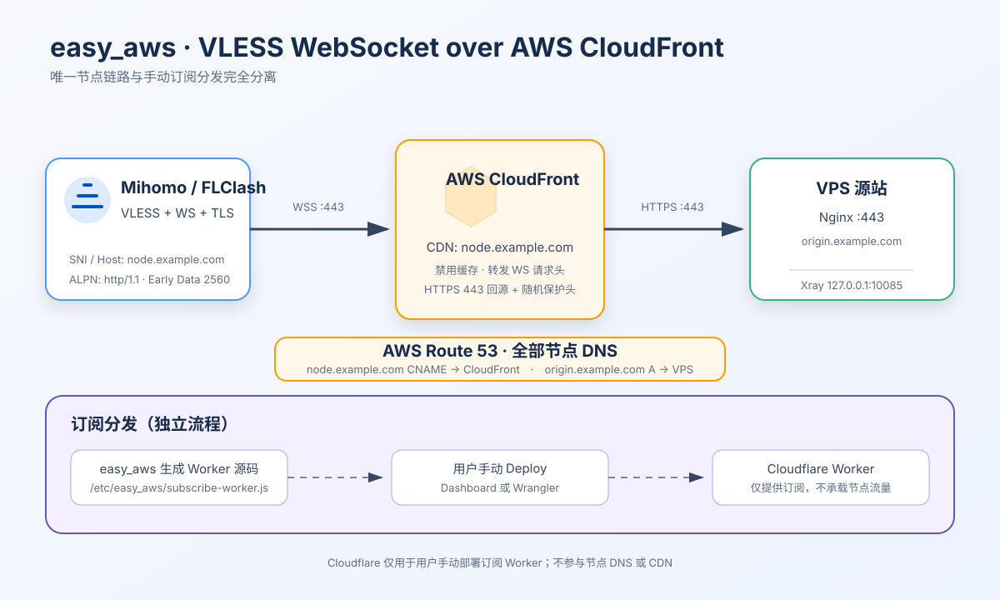
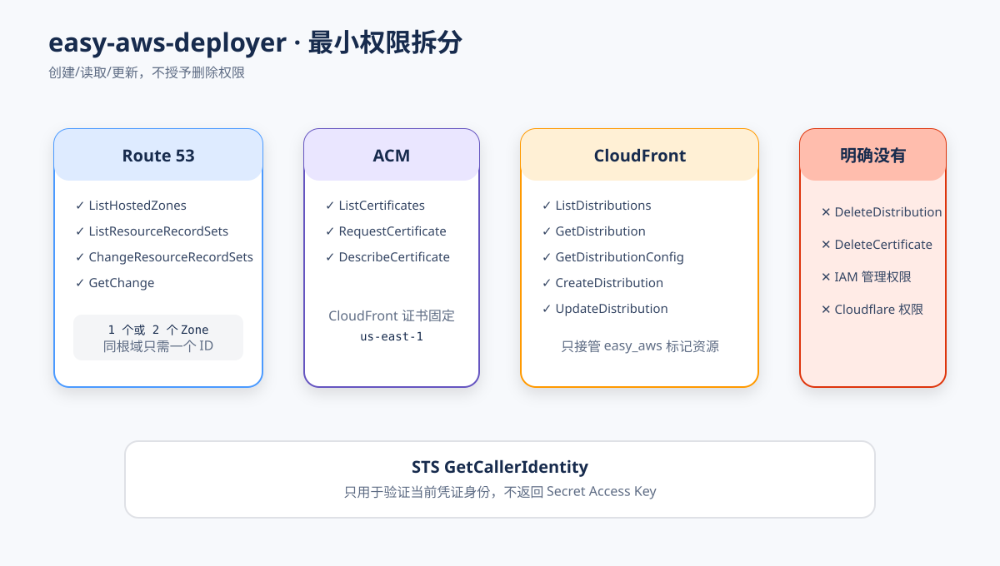
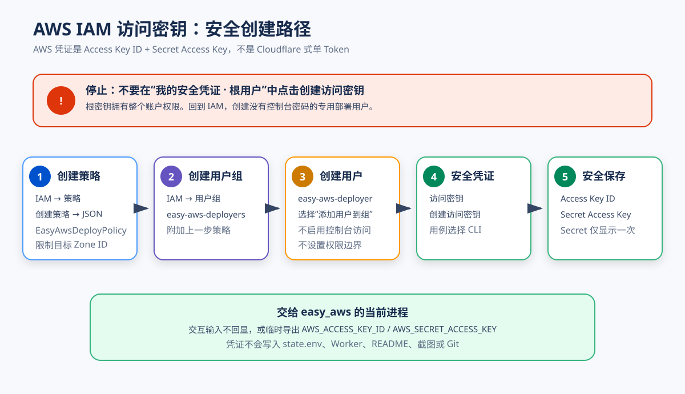
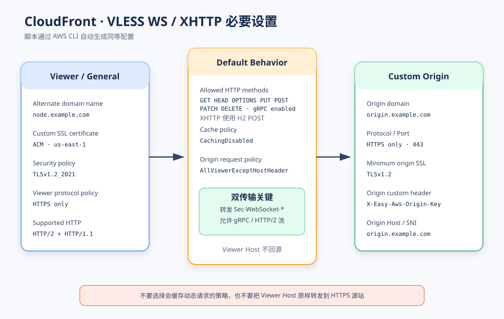

# easy_aws

`easy_aws` 是仿照 `easy_cmcc` 拆出的独立安装器，但边界不同：

它只输出一个 VLESS + WebSocket 节点，避免订阅中混入其他传输协议。

- DNS 使用 AWS Route 53，CDN 使用 AWS CloudFront；节点链路不使用 Cloudflare DNS/CDN。
- 服务端和订阅只输出一个 **VLESS + WebSocket + TLS** 节点。
- 不安装 XHTTP、gRPC、Trojan、Reality 或 AnyTLS。
- 生成完整 Cloudflare Worker 订阅源码，但**不会调用 Cloudflare Worker API**；由用户手动粘贴或使用 Wrangler 部署。
- AWS 侧自动配置源站 A 记录、ACM、CloudFront 和 CDN CNAME，使用 HTTPS 443 回源。



```text
AWS Route 53 DNS:
  node.example.com   CNAME -> CloudFront
  origin.example.com A     -> VPS

节点数据链路:
  Mihomo / FLClash
        -> VLESS + WebSocket + TLS :443
        -> AWS CloudFront (AWS CDN)
        -> HTTPS :443 + X-Easy-Aws-Origin-Key
        -> Nginx -> Xray 127.0.0.1:10085

Cloudflare Worker：只生成源码，手动部署，仅用于订阅分发
```

## 部署前准备

需要两个不同的域名，其中 CDN 入口必须使用子域名：

| 域名                   | 用途                  | 安装前状态                                                         |
| ---------------------- | --------------------- | ------------------------------------------------------------------ |
| `origin.example.com` | CloudFront HTTPS 源站 | 位于 Route 53 Public Hosted Zone；脚本创建直连 VPS 的 A 记录       |
| `node.example.com`   | VLESS 客户端入口      | 位于 Route 53 Public Hosted Zone；脚本创建指向 CloudFront 的 CNAME |

还需要：

- Debian 12/13 amd64 专用 VPS，使用 root、systemd，TCP 80/443 未被其他程序占用。
- 两个域名所在父域都已托管到 Route 53 的 **Public Hosted Zone**；可以位于同一个或不同 Zone。
- AWS IAM 专用部署用户的访问密钥；不要使用根用户密钥。
- AWS 账户可创建 ACM 公有证书和 CloudFront 分配，并已了解相应费用。
- Cloudflare 账户只用于你之后手动部署订阅 Worker；本脚本不需要 Cloudflare Account ID 或 API Token，也不让 Cloudflare 管理节点 DNS/CDN。

安装器会升级系统包、安装 XanMod LTS、启用 BBR、管理 root 定时重启任务，并接管
`/etc/nftables.conf`。它只适合专用 VPS，不应与 `easy_all` 或 `easy_cmcc` 共存。

例如源站使用 `direct.1988088.xyz`、CDN 入口使用 `node.1988088.xyz` 时，两者都属于
`1988088.xyz` 这一个 Hosted Zone，因此只需要一个 Hosted Zone ID。安装前没有
`node.1988088.xyz` 记录是正常状态：脚本会先创建 CloudFront，再自动创建它的 CNAME；不要
提前随意填写一个 CNAME 目标。

## AWS 的“API Token”是什么

AWS 没有与 Cloudflare Bearer Token 完全对应的一串通用 API Token。这里使用的是 AWS IAM
程序化访问凭证：

- `AWS_ACCESS_KEY_ID`：Access Key ID。
- `AWS_SECRET_ACCESS_KEY`：Secret Access Key，只在创建时显示一次。
- `AWS_SESSION_TOKEN`：只有临时 STS 凭证才需要；普通 IAM 用户访问密钥没有这一项。

访问密钥可以签名 AWS CLI/API 请求。AWS 官方建议优先使用短期凭证；本脚本也支持
`AWS_USE_DEFAULT_CREDENTIAL_CHAIN=1`，让 EC2 IAM Role 或已配置的短期凭证接管认证。
如果必须使用长期密钥，请只给专用 IAM 用户创建，并定期轮换。

> **不要为根用户创建访问密钥。** Chrome 只读核对时，当前控制台显示的是根用户的
> “我的安全凭证”页面；这里的“创建访问密钥”按钮不应使用。请先进入 IAM → IAM 用户，
> 创建专用的 `easy-aws-deployer`。脚本和文档都不会记录、截图或输出真实密钥。

AWS 官方参考：

- [根用户安全最佳实践](https://docs.aws.amazon.com/IAM/latest/UserGuide/root-user-best-practices.html)
- [IAM 用户访问密钥](https://docs.aws.amazon.com/IAM/latest/UserGuide/id_credentials_access-keys.html)
- [CloudFront WebSocket 要求](https://docs.aws.amazon.com/AmazonCloudFront/latest/DeveloperGuide/distribution-working-with.websockets.html)
- [ACM DNS 验证](https://docs.aws.amazon.com/acm/latest/userguide/dns-validation.html)

## 1. 创建专用 IAM 用户与访问密钥

AWS 当前的用户创建向导不能直接粘贴下面的 JSON。需要按
**客户托管策略 → 用户组 → IAM 用户 → 访问密钥**的顺序创建。

> **如果你正停在“创建用户 → 设置权限”页面：**保持“添加用户到组”，但不要点击
> “创建组”，也不要改选“复制权限”或“直接附加策略”。如果下面的策略和组尚未创建，
> 请先取消当前向导，完成 1.1 和 1.2 后再回来创建用户。“设置权限边界”保持不勾选。

### 1.1 创建客户托管策略

先在 Route 53 → Hosted zones 中确认源站与 CDN 域名属于哪个 Public Hosted Zone，并复制
Hosted Zone ID。最常见的情况是两个子域名位于同一个根域，例如
`direct.1988088.xyz` 和 `node.1988088.xyz` 都属于 `1988088.xyz`；这时把下面唯一的
`YOUR_ZONE_ID` 替换成 `1988088.xyz` 的 Hosted Zone ID 即可。这份策略允许脚本：

- 查询目标 Public Hosted Zone；
- 在指定 Zone 中写入源站 A、ACM 验证 CNAME 与 CloudFront CNAME；
- 申请/读取 ACM 公有证书；
- 创建、读取和更新 CloudFront 分配；
- 不允许删除 CloudFront、ACM 或 Route 53 资源。

```json
{
  "Version": "2012-10-17",
  "Statement": [
    {
      "Sid": "IdentityCheck",
      "Effect": "Allow",
      "Action": "sts:GetCallerIdentity",
      "Resource": "*"
    },
    {
      "Sid": "DiscoverRoute53",
      "Effect": "Allow",
      "Action": [
        "route53:ListHostedZones",
        "route53:ListHostedZonesByName",
        "route53:GetChange"
      ],
      "Resource": "*"
    },
    {
      "Sid": "ManageEasyAwsHostedZones",
      "Effect": "Allow",
      "Action": [
        "route53:ListResourceRecordSets",
        "route53:ChangeResourceRecordSets"
      ],
      "Resource": "arn:aws:route53:::hostedzone/YOUR_ZONE_ID"
    },
    {
      "Sid": "ManageViewerCertificate",
      "Effect": "Allow",
      "Action": [
        "acm:ListCertificates",
        "acm:RequestCertificate",
        "acm:DescribeCertificate"
      ],
      "Resource": "*"
    },
    {
      "Sid": "ManageEasyAwsDistribution",
      "Effect": "Allow",
      "Action": [
        "cloudfront:ListDistributions",
        "cloudfront:GetDistribution",
        "cloudfront:GetDistributionConfig",
        "cloudfront:CreateDistribution",
        "cloudfront:UpdateDistribution"
      ],
      "Resource": "*"
    }
  ]
}
```

只有当源站与 CDN 确实分属两个不同的 Hosted Zone 时，才把上面的单个 `Resource` 改成：

```json
"Resource": [
  "arn:aws:route53:::hostedzone/YOUR_ORIGIN_ZONE_ID",
  "arn:aws:route53:::hostedzone/YOUR_CDN_ZONE_ID"
]
```



> IAM 的部分 `List*`、`Create*` 操作不能预先绑定到尚不存在的资源，因此策略中仍有
> `Resource: "*"`；真正的 DNS 写权限只限源站和 CDN 对应的 Hosted Zone。脚本不请求删除权限。

在 AWS Console 中执行：

1. 打开 **IAM → 访问管理 → 策略**，选择 **创建策略**。
2. 进入 **JSON** 编辑器，用上面的完整 JSON 替换示例内容。
3. 选择 **下一步**，策略名称填写 `EasyAwsDeployPolicy`。
4. 检查一个或两个 Hosted Zone ID 已正确替换且没有多余权限，然后选择 **创建策略**。

### 1.2 创建用户组并附加策略

1. 打开 **IAM → 访问管理 → 用户组**，选择 **创建组**。
2. 用户组名称填写 `easy-aws-deployers`。
3. 在“将权限策略附加到组”中搜索并勾选刚创建的 `EasyAwsDeployPolicy`。
4. 选择 **创建组**。

### 1.3 创建专用 IAM 用户

1. 打开 **IAM → 访问管理 → IAM 用户**，选择 **创建用户**。
2. 用户名填写 `easy-aws-deployer`，不要勾选“提供对 AWS 管理控制台的用户访问权限”。
3. 在你截图的 **设置权限** 页面保持 **添加用户到组**。
4. 在下方用户组表格中勾选 `easy-aws-deployers`；“设置权限边界”保持不勾选。
5. 选择 **下一步 → 创建用户**。

“复制权限”会继承其他用户的全部权限；“直接附加策略”主要用于选择已经存在的托管策略。
本项目采用用户组，是为了让界面步骤、权限来源和后续撤销都更清楚。

### 1.4 创建 CLI 访问密钥

1. 打开 `easy-aws-deployer` 用户详情 → **安全凭证**。
2. 在“访问密钥”区域选择 **创建访问密钥**。
3. 用例选择 **命令行界面 (CLI)**，确认提示并继续。
4. 创建后立即复制或下载 Access Key ID 和 Secret Access Key。
5. Secret Access Key 关闭页面后无法再次查看；丢失时应停用旧密钥并重新创建。



## 2. CloudFront 会自动采用的设置

脚本自动请求或复用 `us-east-1` 的 ACM 证书，然后创建带有
`easy_aws:<CDN 域名>` 标记的 CloudFront 分配：

| 项目                  | 值                                                     |
| --------------------- | ------------------------------------------------------ |
| Alternate domain name | `node.example.com`                                   |
| Origin domain         | `origin.example.com`                                 |
| Origin protocol       | HTTPS only，端口 443，最低 TLS 1.2                     |
| Viewer protocol       | HTTPS only                                             |
| Allowed methods       | GET、HEAD（WebSocket 握手只需要 GET）                  |
| Cache policy          | AWS Managed`CachingDisabled`                         |
| Origin request policy | AWS Managed`AllViewerExceptHostHeader`               |
| Viewer certificate    | ACM`us-east-1`，SNI only，TLSv1.2_2021               |
| HTTP versions         | HTTP/2 + HTTP/1.1；客户端 WS 节点固定 ALPN`http/1.1` |
| Origin protection     | CloudFront 自动添加随机`X-Easy-Aws-Origin-Key`       |

`AllViewerExceptHostHeader` 会转发除 Viewer `Host` 外的请求头，包括 WebSocket 握手与
`Sec-WebSocket-Protocol` Early Data，并把回源 `Host` 改成源站域名，使 Nginx 证书和 SNI
保持一致。`CachingDisabled` 避免升级请求或健康检查被边缘缓存。



如果已经有手动创建的 CloudFront 分配，脚本默认拒绝接管，防止覆盖别人的源、行为、日志或
WAF。确定要把某个分配**完整改写**成 easy_aws 配置时才使用：

```bash
AWS_CLOUDFRONT_DISTRIBUTION_ID='E123456789EXAMPLE' \
AWS_ADOPT_DISTRIBUTION=1 \
/root/easy_aws install
```

如果 CDN 域名已有其他 Route 53 记录，脚本会拒绝覆盖。请先确认旧记录可以移除；
`AWS_DNS_REPLACE=1` 会替换同名 CNAME，或删除其他同名记录后创建 CNAME，只能在你已经
逐条核对冲突记录后使用。

源站域名也遵循相同的保护规则：没有记录时脚本创建 A 记录，已正确指向当前 VPS 时复用；
存在其他 A、AAAA 或 CNAME 时默认停止。只有逐条核对后才可用
`AWS_ORIGIN_DNS_REPLACE=1` 删除这些冲突记录并创建新的 A 记录。TXT、CAA 等非冲突记录会保留。

## 3. 快速安装

先确认 `origin.example.com` 和 `node.example.com` 的权威 DNS 都是 AWS Route 53。无需预建
A 或 CNAME；安装器会探测 VPS 公网 IPv4，创建源站 A，等待公共 DNS 生效，再继续申请证书。
然后在 VPS 上执行：

```bash
wget -qO /root/easy_aws.new \
  "https://raw.githubusercontent.com/v2yiz/easy_all/main/easy_aws/easy_aws" \
  && chmod 700 /root/easy_aws.new \
  && mv -f /root/easy_aws.new /root/easy_aws \
  && /root/easy_aws install
```

交互安装依次询问：

- 定时重启策略；
- 源站域名与 CloudFront CDN 域名；
- 订阅访问 Token 字典；
- AWS IAM Access Key ID 与 Secret Access Key，输入不回显。

非交互示例：

```bash
AWS_ORIGIN_DOMAIN='origin.example.com' \
VLESS_CDN_DOMAIN='node.example.com' \
ALLOWED_TOKENS='{"owner":"owner-token-123"}' \
AWS_ACCESS_KEY_ID='AKIA_REPLACE_ME' \
AWS_SECRET_ACCESS_KEY='REPLACE_ME' \
REBOOT_SCHEDULE_MODE=none \
/root/easy_aws install
```

不要把真实密钥写进 shell history、脚本、README、截图或 Git。更安全的做法是在当前 shell
临时 `read -s` 后导出，或使用 EC2 IAM Role / 短期凭证和
`AWS_USE_DEFAULT_CREDENTIAL_CHAIN=1`。

AWS 凭证不会写入 `/etc/easy_aws/state.env`。状态文件保存 VLESS UUID、随机路径、Route 53
Zone ID、CloudFront 资源 ID、订阅 Token 和源站防直连随机请求头，权限为 `0600`。

## 4. 手动部署 Cloudflare Worker

安装完成后，脚本会把完整 Worker 源码输出到终端并保存为：

```text
/etc/easy_aws/subscribe-worker.js
```

它只包含一个 `VLESS_AWS_WS` 节点。可以选择以下任一手动方式：

### Cloudflare Dashboard

1. Workers & Pages → Create → Worker。
2. 进入 Edit code。
3. 用 `/etc/easy_aws/subscribe-worker.js` 的完整内容替换示例代码。
4. 手动 Deploy。
5. 可直接使用 Worker 的 `workers.dev` 地址；它与 AWS 节点域名和 CDN 链路相互独立。

### Wrangler

```bash
npx wrangler deploy /etc/easy_aws/subscribe-worker.js --name easy-aws
```

部署后的订阅地址格式：

```text
https://<你的 Worker 域名>/subscribe?token=owner-token-123
https://<你的 Worker 域名>/subscribe?token=owner-token-123&flag=clash
```

`easy_aws update-sub` 只重新生成并显示 Worker 源码；它不会创建、更新或删除任何远端
Cloudflare Worker、Route 或 Custom Domain。

## 常用命令

```bash
easy_aws help
easy_aws show
easy_aws subscription
easy_aws status
easy_aws update
easy_aws update-sub
easy_aws update-core
easy_aws renew-cert
easy_aws register-command
easy_aws uninstall
```

- `show`：显示唯一的 VLESS WS 链接和 Mihomo 节点片段。
- `subscription`：显示节点、本地 Worker 文件和手动 Wrangler 命令。
- `update`：校验/刷新 Route 53 记录、本机配置、CloudFront 分配和 Worker 源码；会重新要求 AWS 凭证。
- `update-sub`：不碰 AWS/Cloudflare 远端资源，只刷新 Worker 源码。
- `uninstall`：删除本机服务、证书、状态和备份，但不删除 CloudFront、ACM 或 Route 53 记录。

卸载后应在 AWS Console 手动确认并清理不再使用的 CloudFront 分配、ACM 证书及 Route 53
记录，否则可能继续计费或把流量指向已经下线的源站。

## 故障排查

- **ACM 一直 Pending validation**：确认 CDN 域名使用 Route 53 Public Hosted Zone；检查 CAA
  是否允许 Amazon 签发证书，并保留 `_...acm-validations.aws` CNAME 供自动续期。
- **源站 A 记录等待超时**：确认域名的 NS 已委派给脚本找到的 Route 53 Public Hosted Zone，
  并检查 VPS 探测到的公网 IPv4 是否正确。
- **CloudFront 返回 502**：检查 Route 53 源站 A 直连 VPS、443 可达、源站证书覆盖源站域名；
  CloudFront 回源必须是 HTTPS only + TLS 1.2。
- **CloudFront 返回 404**：通常是源站保护请求头未同步。执行 `easy_aws update`，不要手动移除
  CloudFront Origin Custom Header。
- **普通 HTTPS 健康检查成功但 WS 失败**：确认 Behavior 使用 `CachingDisabled` 和
  `AllViewerExceptHostHeader`，客户端网络为 `ws`、ALPN 为 `http/1.1`、路径完全一致。
- **创建分配提示 CNAMEAlreadyExists**：该 CDN 域名仍绑定其他 CloudFront 分配；不要盲目覆盖，
  先在控制台确认所有权，再解除旧关联或使用显式 adopt 参数。
- **IAM AccessDenied**：核对策略中的 Hosted Zone ID；同一根域只需一个，不同 Zone 才需两个。
  不要临时改用根访问密钥。
- **Worker 地址不可用**：本脚本从不部署 Worker；必须按上一节在 Cloudflare 手动 Deploy。

## 测试

```bash
cd easy_aws
npm test
```

测试会校验单一 VLESS/WS 输出、Mihomo 节点、CloudFront JSON、Worker 注入、脚本语法和文档
安全约束，不会调用真实 AWS 或 Cloudflare API。
