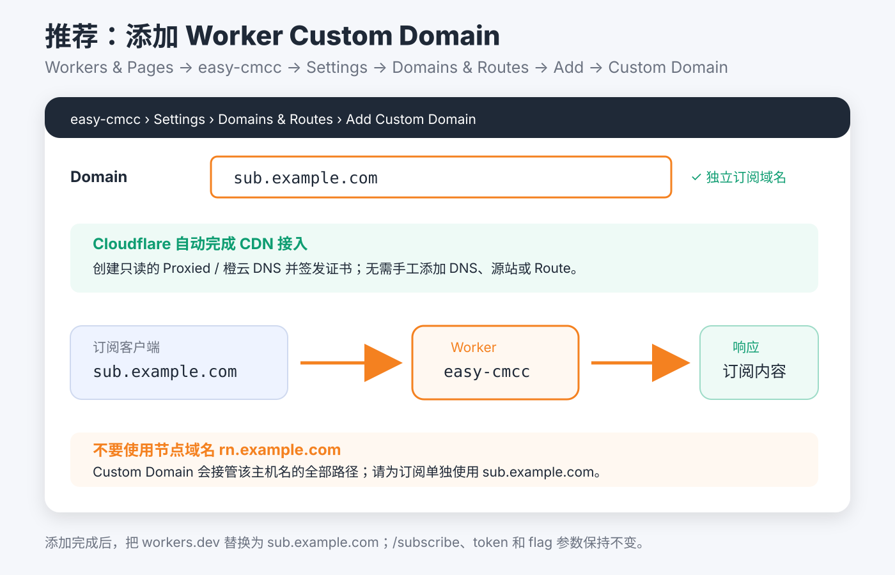

# easy_cmcc

`easy_cmcc` 是面向中国移动访问美西普通线路、需要经过 Cloudflare CDN 的独立单文件安装器。它固定安装 VLESS XHTTP `stream-one`，不提供 Reality、AnyTLS、WSS、其他 XHTTP 模式或协议切换。客户端只发布一个名为 `VLESS_XHTTP` 的节点，优先降低手机蜂窝网络的后台连接、CPU 和耗电：

| 客户端节点 | 定位 | 公网链路 | Cloudflare 要求 |
|---|---|---|---|
| XHTTP `stream-one` | 唯一节点，兼顾移动端省电、交互和下载 | HTTPS / HTTP/2 / TCP 443 | gRPC 开启，XHTTP 路径双向不缓冲 |

节点使用一个随机 XHTTP 路径，客户端和服务端都固定为 `stream-one`。相比持续维护上下行分离连接的 `stream-up`，该模式更适合手机蜂窝网络。实际速度仍取决于中国移动到 Cloudflare 边缘、Cloudflare 回源和 VPS 当时的线路质量。

```text
客户端 -> Cloudflare CDN -> Nginx :443 -> XHTTP stream-one -> Xray 127.0.0.1:10085
```

公网接入始终是 TLS/TCP，不依赖 QUIC。订阅中的 `udp: true` 和 `packet-encoding: xudp` 表示代理内部可以承载 UDP，不代表客户端使用 UDP 连接 Cloudflare。

## 部署对象与准备清单

一套完整部署使用两个不同用途的域名。以下用 `node.example.com` 和 `sub.example.com` 举例：

| 域名 | 用途 | 安装前 | 安装后 |
|---|---|---|---|
| `node.example.com` | XHTTP 节点入口 | 自己创建 A；有可用公网 IPv6 时再创建 AAAA；全部保持灰云并指向 VPS | 本机验收通过后把 A、AAAA 一起切为橙云 |
| `sub.example.com` | Worker 订阅入口 | 推荐使用没有现有 A/AAAA/CNAME 的新主机名，不要提前创建解析 | 选择自动部署后，由 Worker Custom Domain 自动创建橙云 DNS 和边缘证书 |

两个域名不能相同。节点域名连接 VPS，订阅域名只提供配置文件；把它们混用会导致 Custom Domain 接管节点请求。

开始前准备：

- 一台可使用 root 登录的独立 VPS，系统为 Debian 12/13 amd64；TCP 80、443 未被其他服务占用。
- 一个已接入 Cloudflare、状态为 Active 的 Zone，以及节点域名和独立订阅域名。最简单的是放在同一个 Zone；订阅域名也可以位于同一账户下的另一个 Active Zone。
- VPS 公网 IPv4；只有 VPS 确实拥有可用公网 IPv6 和默认 IPv6 路由时才创建 AAAA。
- Cloudflare DNS API Token；推荐自动部署时还要准备 Account ID 和 Worker API Token。三者的用途与最小权限见下文“Cloudflare 凭据”。
- 支持 VLESS、TLS 和 XHTTP `stream-one` 的近期 Mihomo/Clash Meta 客户端。
- 在安装过程中保持当前 SSH 会话，不要提前切换节点域名为橙云。

## 安装前须知

- 只支持 Debian 12/13、amd64、systemd 和 root，不支持容器。
- 脚本面向专用 VPS，会升级系统软件包、安装 XanMod LTS、启用 BBR、管理 root 每日重启任务，并接管完整 `/etc/nftables.conf`。
- TCP 使用 `fq + BBR`，收发自动调优上限为 32 MiB，接收积压为 16384，并启用 MTU 黑洞探测；Nginx TCP 443 的监听 backlog 与 `somaxconn=4096` 对齐。
- TCP 80 和 443 必须可用。80 用于 Nginx 伪装站点，443 用于 XHTTP TLS 入口。
- 安装前，节点域名的 A 记录必须为 DNS only / 灰云并直接指向 VPS 公网 IPv4；脚本会使用本机 DNS、`1.1.1.1` 和 `8.8.8.8` 强制校验。
- 如果存在 AAAA，安装前也必须保持灰云并指向当前 VPS 公网 IPv6。安装成功后应将 A、AAAA 一起切为 Proxied / 橙云，避免 IPv6 绕过 CDN。
- Cloudflare SSL/TLS 模式必须使用 Full 或 Full (Strict)，推荐 Full (Strict)，不能使用 Flexible。
- Cloudflare Network 必须开启 gRPC；XHTTP 路径还需要 Request/Response body buffering 均为 `None`。
- `easy_cmcc` 与根目录的 `easy_all` 使用不同状态、服务和命令，但仍会争用 Nginx、TCP 80/443 和 `/etc/nftables.conf`，不能在同一台 VPS 上同时安装。

## 快速安装

先把域名切为灰云并指向 VPS，然后下载单文件：

```bash
wget -qO /root/easy_cmcc.new "https://raw.githubusercontent.com/v2yiz/easy_all/main/for_cmcc/easy_cmcc" && chmod 700 /root/easy_cmcc.new && mv -f /root/easy_cmcc.new /root/easy_cmcc && /root/easy_cmcc install
```

交互安装先询问节点域名和 Cloudflare DNS Token；配置订阅时先选择 Worker 部署方式。选择自动或手动部署后才会询问订阅 Token；选择只输出节点链接时不需要订阅 Token。自动部署还会询问独立的 Worker Custom Domain，填写后脚本会自动绑定，并由 Cloudflare 创建橙云 DNS 与证书。安装成功后会注册 `/usr/local/bin/easy_cmcc`。

交互项按以下方式选择即可完成推荐部署：

| 交互项 | 推荐选择 | 说明 |
|---|---|---|
| 定时重启 | `1`，每天凌晨 4 点 | 也可选择自定义小时或不配置；只管理带有 `easy_cmcc-managed-reboot` 标记的 root crontab 项 |
| VLESS XHTTP 域名 | `node.example.com` | 安装时必须灰云，A 必须解析到当前 VPS 公网 IPv4 |
| Cloudflare DNS API Token | 输入准备好的 Zone Token | 输入不回显，用于 DNS-01 证书和节点 Zone 配置 |
| 订阅输出方式 | `1`，自动部署 Worker | 提示的默认值是手动输出；要使用 Custom Domain 必须主动选择 `1` |
| 订阅用户 Token 字典 | 使用自动生成值或填写自己的 JSON | 仅自动/手动 Worker 模式询问；URL 中使用的是 JSON 的 value，不是用户名 key |
| Worker 独立自定义订阅域名 | `sub.example.com` | 不得与节点域名相同，推荐使用没有现有 DNS 记录的新主机名 |
| Cloudflare Account ID | 当前 Zone 所属账户的 Account ID | 不是 Zone ID |
| Cloudflare Worker API Token | 输入准备好的 Account Token | 输入不回显，只用于部署 `easy-cmcc` Worker 和绑定 Custom Domain |

安装和本机验收成功后：

1. 回到 Cloudflare，把节点域名的 A、AAAA 一起切为 Proxied / 橙云。
2. 确认 SSL/TLS 为 Full (Strict)，gRPC 已开启，XHTTP 双向 body buffering 均为 `None`。
3. 执行 `easy_cmcc status` 和 `easy_cmcc subscription`，确认服务与首选订阅地址。
4. 把 Clash Meta 地址导入 Mihomo/Clash Verge；不要把带 Token 的订阅 URL 公开或写入仓库。
5. 安装 XanMod 后需要重启一次才能切换到新内核。可等待已配置的定时重启，也可以在确认 SSH 和服务正常后手动 `reboot`；重启后用 `uname -r` 检查当前内核。

## 常用命令

```bash
easy_cmcc help
easy_cmcc show
easy_cmcc subscription
easy_cmcc status
easy_cmcc update
easy_cmcc update-sub
easy_cmcc update-core
easy_cmcc renew-cert
easy_cmcc register-command
easy_cmcc uninstall
```

- `help`：显示当前单文件支持的命令。
- `show`：显示 XHTTP `stream-one` 节点链接和 Mihomo 节点片段。
- `subscription`：同时显示节点、Worker 名称、Custom Domain、`workers.dev` 备用地址和首选订阅地址。
- `status`：显示域名、XHTTP 路径、模式、Gemini 出口地址族、Xray/Nginx、TCP 443 和 Worker Custom Domain 状态。
- `update`：注册当前单文件，重新应用 BBR/TCP 参数，并刷新 Xray、Nginx、Worker 模板、`easy-cmcc` Worker 和 Custom Domain；该命令强制使用自动部署模式。
- `update-sub`：刷新服务端策略和订阅，可选择自动部署、输出 Worker 或只输出链接。
- `update-core`：更新 Xray；新版本启动验收失败时自动恢复旧版本。
- `renew-cert`：强制续期当前域名证书并重载服务。
- `register-command`：把当前单文件重新注册到 `/usr/local/bin/easy_cmcc`，通常不需要单独执行。
- `uninstall`：彻底删除 easy_cmcc 管理的本机服务、状态、证书、命令和备份，不删除远端 Worker。

`easy_cmcc update` 使用当前单文件更新配置，不会下载新版安装器。安装器本身有更新时，请重新执行上面的原子下载命令，并把最后的 `install` 改为 `update`：

```bash
wget -qO /root/easy_cmcc.new \
  "https://raw.githubusercontent.com/v2yiz/easy_all/main/for_cmcc/easy_cmcc" \
  && chmod 700 /root/easy_cmcc.new \
  && mv -f /root/easy_cmcc.new /root/easy_cmcc \
  && /root/easy_cmcc update
```

证书由独立的 `/root/.acme-cmcc.sh/` 管理。acme.sh 的续期任务成功更新证书后会自动重载 Nginx；`renew-cert` 用于需要立即强制续期和验收的场景。定时重启与证书续期是两套独立任务。

## 客户端导入与验收

执行：

```bash
easy_cmcc subscription
```

输出中包含两类订阅：

- `通用订阅`：base64 编码的单个 VLESS XHTTP `stream-one` 节点。
- `Clash Meta`：完整 Mihomo YAML，包含一个节点、DNS、TUN、内置规则以及唯一的 `PROXY` 分组；Clash Verge 应优先导入这一条。

导入后使用“规则”模式。配置默认启用 TUN，局域网仍按 IPv4/IPv6 私网范围直连：RFC1918 IPv4、IPv4 链路本地、IPv6 ULA、IPv6 链路本地以及 `.lan`、`.local` 不经过代理。国内常用服务和中国 IP 直连，其余未命中流量进入 `PROXY`。

首次验收建议：

1. 确认 `PROXY` 中只有 XHTTP `stream-one` 节点，并测试普通网页与下载。
2. 如果 XHTTP 在当前客户端不可用，先升级客户端核心。
3. 浏览器“安全 DNS”使用当前服务提供商或关闭，避免自定义 DoH/DoT 绕过 Mihomo DNS 劫持。

## 移动端省电模式与分流

唯一的 XHTTP 节点使用：

- `network: xhttp`
- `mode: stream-one`
- `alpn: [h2]`
- `packet-encoding: xudp`
- `smux.enabled: false`

Xray 服务端也固定为 `mode: stream-one`。Mihomo 只提供一个 `PROXY` 手动选择组，ChatGPT、Claude、Gemini、Google、GitHub 和其余代理流量都进入该组。

客户端采用省电取向：`tcp-concurrent: false`，不对 Cloudflare 多地址并发建连；关闭客户端域名嗅探；日志降为 `warning`；TUN 使用资源占用更低的 `system` 栈。节点仍使用 `ip-version: dual`，保留中国移动蜂窝 IPv6 可用时的正常连接能力；应用侧 DNS 保持 `dns.ipv6: false`，避免向不完整 IPv6 网络下的应用返回不可达 Fake IPv6。

配置不再加载与现有分流重复的远程 `private`、`proxy`、`direct`、`telegramcidr`、`lancidr`、`cncidr` provider。局域网与 Telegram IP 继续由显式规则处理，其他流量由 `GEOSITE`、`GEOIP` 和最终 `MATCH` 兜底，减少规则解析、内存和后台更新开销。

服务端只为 Gemini 及其必要 Google 依赖固定一个出口地址族。默认会分别测速 IPv4/IPv6，并固定选择更快且可用的一侧。ChatGPT、Claude、MEGA 及其他服务保持 VPS 默认双栈行为。

浏览器“安全 DNS”建议使用当前服务提供商或关闭；自定义 DoH/DoT 可能绕过 Mihomo 的 DNS 劫持。

## Cloudflare 节点域名配置

### 安装前：灰云直连源站

节点域名例如 `rn.example.com`：

1. A 记录填写当前 VPS 公网 IPv4，代理状态设为 DNS only。
2. 只有 VPS 确实拥有可用公网 IPv6 时才添加 AAAA；它也必须为 DNS only。
3. 等待本地 DNS、`1.1.1.1` 和 `8.8.8.8` 都解析到源站后再安装。

脚本使用 Cloudflare DNS-01 申请 Let's Encrypt EC-256 证书，因此证书申请不依赖 HTTP-01，但安装阶段仍会校验 A 记录必须直连源站。

### 安装后：橙云 CDN

本机服务验收成功后：

1. 将 A、AAAA 一起切为 Proxied。
2. SSL/TLS 设为 Full (Strict)。
3. Network 页面开启 gRPC。
4. 为 XHTTP 路径创建 Configuration Rule：
   - Hostname 等于 `VLESS_XHTTP_DOMAIN`。
   - URI Path 以 `XHTTP_PATH` 开头。
   - Request body buffering 为 `None`。
   - Response body buffering 为 `None`。

脚本会为 XHTTP 响应写入 `Cache-Control: no-store`；如果 Zone 已有“缓存所有内容”的 Cache Rule，还应为 XHTTP 节点路径配置 Bypass Cache。

安装时提供具备相应权限的 Cloudflare DNS Token，脚本会尝试自动开启 gRPC，并创建或更新引用名为 `easy_cmcc_xhttp_streaming` 的双向无缓冲规则。权限不足只会提示警告，仍可在 Cloudflare 控制台手动完成。

## Cloudflare 凭据

自动配置和部署需要一个 Account ID，以及两个用途不同的 API Token。Token Secret 创建后通常只显示一次，不要写入仓库、截图或长期日志。

### CF_ACCOUNT_ID

这是 Cloudflare 账户的 Account ID，不是域名的 Zone ID。它用于部署 Worker，会保存到权限为 `0600` 的状态文件中，供后续更新复用。

在 Cloudflare Dashboard 进入节点域名所属账户的 **Account home**，复制页面显示的 Account ID；也可以从账户主页 URL 中核对。不要复制域名 Overview 页面中的 Zone ID。


图中高亮的是账户主页 URL 里、`/home` 前的 32 位账户标识。填写时只复制这 32 位字符，不包含前后斜杠。它决定 Worker 部署到哪个账户，也决定 Worker Token 的 Account Resources 应限制到哪个账户。

### CF_DNS_API_TOKEN

资源建议限制到节点域名所在的单个 Zone，并授予：

- Zone → DNS → Edit
- Zone → Zone → Read
- Zone → Zone Settings → Edit
- Zone → Config Rules → Edit

DNS Edit 和 Zone Read 用于 acme.sh DNS-01；Zone Settings Edit 用于开启 gRPC；Config Rules Edit 用于配置 XHTTP 双向无缓冲。

创建时选择 **Create Custom Token**，把 Zone Resources 限制到节点域名所在的单个 Zone。脚本不会使用 Global API Key。


图中的四行权限对应四项独立操作：

- `DNS → Edit`：让 acme.sh 创建和清理 DNS-01 TXT 记录。
- `Zone → Read`：按节点域名查询正确的 Zone ID。
- `Zone Settings → Edit`：自动开启 gRPC。
- `Config Rules → Edit`：创建或更新 XHTTP Request/Response body buffering 为 `None` 的 Configuration Rule。Cloudflare 的部分新界面或 API 文档将它显示为 `Config Settings → Write`。

如果只授予前两项，证书申请仍可工作，但后两项 Cloudflare 优化需要手动配置。Cloudflare 的[权限清单](https://developers.cloudflare.com/fundamentals/api/reference/permissions/)和[Configuration Rules API 说明](https://developers.cloudflare.com/rules/configuration-rules/create-api/)可用于核对新旧界面名称。

### CF_WORKER_API_TOKEN

资源建议限制到实际使用的单个 Account，只授予：

- Account → Workers Scripts → Edit

脚本使用它 replace Worker module、启用 workers.dev、读取账户子域名，并创建或复用 Worker Custom Domain。Custom Domain API 同样只要求 Workers Scripts Edit，不需要给这个 Token 增加 DNS 或 Workers Routes 权限。`easy_cmcc` 不会把两个 API Token 写入 `/etc/easy_cmcc/state.env`；为自动续期证书，acme.sh 的 `dns_cf` 插件可能把 DNS 凭据保存在权限受限的 `/root/.acme-cmcc.sh/` 中。Worker Token 不会持久保存，交互更新时会重新提示输入。

创建时同样选择 **Create Custom Token**，把 Account Resources 限制到实际部署 Worker 的单个账户。DNS Token 与 Worker Token 应分开创建，不要为了省事给同一个 Token 同时授予 Zone 和 Account 的宽权限。


这里仅添加 `Account → Workers Scripts → Edit` 一行，并选择与 `CF_ACCOUNT_ID` 对应的指定账户。Cloudflare API 文档也把该权限称为 `Workers Scripts Write`；它已经覆盖 Worker module replace、启用 `workers.dev` 和绑定 Custom Domain，不需要 `Workers Routes`、DNS、KV 或 R2 权限。可通过 Cloudflare 的 [Attach Domain API](https://developers.cloudflare.com/api/resources/workers/subresources/domains/methods/update/)核对 Custom Domain 所需权限。

## Worker 订阅

安装或 `update-sub` 支持三种模式：

1. 自动部署：通过 Cloudflare API replace Worker，并可自动绑定独立 Custom Domain。
2. 手动部署：输出完整 Worker 源码。
3. 只输出一个 XHTTP `stream-one` 节点链接。

自动部署是推荐模式，也是脚本自动创建/复用 Custom Domain 和执行订阅 HTTP 验收的唯一模式。手动模式会把源码保存到 `/etc/easy_cmcc/subscribe-worker.js` 并输出到终端，可按提示使用 Wrangler 或 Cloudflare Dashboard 部署，但脚本不会自动绑定域名或记录订阅 URL；只输出链接模式不会部署 Worker。以后要改用自动部署，可执行 `easy_cmcc update-sub` 并选择 `1`。

脚本会先选择以上模式，再决定是否收集凭据：自动部署需要订阅 Token、Account ID 和 Worker API Token；手动部署只需要订阅 Token，因为它会内嵌到 Worker 的 `ALLOWED_TOKENS`；只输出链接不生成 Worker，因此不会询问订阅 Token、Account ID、Worker API Token 或 Custom Domain。

默认 Worker 名称为 `easy-cmcc`，默认 Clash 下载文件名为 `EASY_CMCC`。未配置 Custom Domain 时，自动部署成功后提供：

```text
https://easy-cmcc.<account-subdomain>.workers.dev/subscribe?token=owner-token-123
https://easy-cmcc.<account-subdomain>.workers.dev/subscribe?token=owner-token-123&flag=clash
```

第一条返回 base64 节点订阅，第二条返回 Mihomo/Clash YAML。这两个 `workers.dev` 地址主要用于脚本发布后的自动验收和临时排障；`*.workers.dev` 在中国大陆网络中存在较高的被阻断或不可达风险，**不建议作为长期订阅地址，推荐在自动部署时填写独立 Custom Domain**。

Cloudflare API 请求会对网络错误、HTTP 408/429/5xx 和 Cloudflare `10007`、`10035` 做有限次数退避重试。Worker 与 Custom Domain 配置完成后，脚本会对首选订阅地址先等待 10 秒，再进行最多 12 次 base64 与 Clash HTTP 验收；每轮两个请求使用同一个 Worker 版本亲和键并附带防缓存参数，避免发布传播期间命中不同版本。最近一次部署日志位于：

```text
/etc/easy_cmcc/last-worker-deploy.log
```

日志权限为 `0600`，UUID、订阅 Token 和 Cloudflare Token 会脱敏。Worker module 已 replace、但后续 workers.dev 查询或公网验收暂时失败时，脚本会优先保留已经与远端 Worker 匹配的新本机配置，避免错误回滚造成订阅与服务器不一致。Custom Domain 绑定失败时不会删除或覆盖现有 DNS，也不会抢占其他 Worker 的域名；脚本会回退到 `workers.dev`，保存待绑定域名，并在下次自动更新时重试。

### Worker 模板与规则来源

`easy_cmcc` 单文件包含安装核心，但不内嵌整份 Worker 规则。`sample-worker.js` 是 CMCC Worker、Mihomo 规则和 Gemini 域名策略的唯一来源，默认从下列地址获取：

```text
https://raw.githubusercontent.com/v2yiz/easy_all/main/for_cmcc/sample-worker.js
```

模板不会安装到命令目录。每次安装、`update` 或 `update-sub` 都会重新获取并校验一次模板，再由同一份内容生成 Xray 的 Gemini 地址族策略和 Worker，避免服务端与订阅规则不一致。

### 订阅访问 Token

自动或手动 Worker 模式的 `/subscribe` 入口使用 Token 字典作为访问白名单，格式必须是 JSON object；key 是用户名，value 才是 URL 中使用的 token。只输出节点链接模式不需要这一项：

```json
{"owner":"owner-token-123","alice":"alice-token-456"}
```

规则：

- 至少包含一个用户，后续更新可以沿用状态文件中的字典。
- 用户名只允许 `A-Z a-z 0-9 . _ -`，长度 `1-64`。
- token 只允许 URL 安全字符 `A-Z a-z 0-9 . _ ~ -`，长度 `8-128`。
- 不允许空值、重复用户名或重复 token。
- 订阅校验匹配 token 值，不匹配用户名。

生成 URL 安全 token：

```bash
openssl rand -base64 24 | tr '+/' '-_' | tr -d '=\n'
```

Token 字典会保存到 `/etc/easy_cmcc/state.env` 并写入生成的 Worker，因此该状态文件和 Worker 文件权限均为 `0600`。

### 推荐：使用 Worker Custom Domain

由于默认 `*.workers.dev` 被阻断或不可达的概率较高，自动部署时应填写自己托管在 Cloudflare 的独立域名，例如 `sub.example.com`。脚本会调用 Cloudflare Custom Domain API，把它绑定到 `easy-cmcc` Worker；订阅路径和参数不变：

```text
https://sub.example.com/subscribe?token=owner-token-123
https://sub.example.com/subscribe?token=owner-token-123&flag=clash
```

`sub.example.com` 应是专门用于订阅的新主机名，**不要与 XHTTP 节点域名（例如 `rn.example.com`）共用**，因为 Custom Domain 会接管该主机名的全部路径。脚本会拒绝相同的节点域名，也会拒绝抢占已经绑定到其他 Worker 的 Custom Domain。

该订阅主机名应位于当前 Cloudflare 账户中的 Active Zone，建议使用一个没有现有 A/AAAA/CNAME 的新主机名。绑定成功后，Cloudflare 会自动创建只读的 **Proxied / 橙云** DNS 记录并签发边缘证书，相当于自动完成 Cloudflare CDN 接入；无需手工创建解析、开启橙云、配置 Route 或设置源站，也不要将自动记录改成 DNS only / 灰云。



Custom Domain 适合 Worker 本身就是订阅源站的场景，也是 Cloudflare 推荐的纯 Worker 自定义域名方式。每次安装或更新都会先按 hostname 查询：已绑定到当前 `easy-cmcc` 时直接复用，不重复创建；不存在时才创建；绑定到其他 Worker 时拒绝抢占。若绑定接口遇到 DNS 冲突，脚本会在回退前以指数退避再次查询；绑定冲突后会再次查询，确认已经绑定到当前 Worker 也视同成功。若多次复核仍没有当前 Worker 绑定，脚本会明确提示该主机名仍有外部 A/AAAA/CNAME 记录，回退到 `workers.dev`，不会删除或覆盖未知 DNS 记录；请清理冲突记录或改用没有现有解析的新主机名。脚本绑定后会直接把它作为 `easy_cmcc subscription` 的首选地址，同时保留 `workers.dev` 作为验收/排障备用地址。旧安装尚未保存 Custom Domain 时，执行 `easy_cmcc update` 会提示填写；如果之前已在控制台绑定，填写同一个域名即可自动识别并复用；如果留空，则继续只使用 `workers.dev`。Cloudflare 的 [Custom Domains 文档](https://developers.cloudflare.com/workers/configuration/routing/custom-domains/) 可用于核对机制与控制台状态。

## 状态、隔离与卸载

主要落盘位置：

| 路径 | 用途 |
|---|---|
| `/etc/easy_cmcc/state.env` | 当前节点和订阅状态，权限 `0600` |
| `/etc/easy_cmcc/subscribe-worker.js` | 根据模板生成的当前 Worker，权限 `0600` |
| `/etc/easy_cmcc/last-worker-deploy.log` | Worker 分阶段部署日志 |
| `/etc/easy_cmcc/backups/` | 安装前及更新过程备份 |
| `/etc/easy_cmcc/xray/` | Xray 二进制、版本与配置 |
| `/etc/easy_cmcc/certs/` | 当前域名证书副本 |
| `/etc/sysctl.d/99-easy-cmcc-bbr.conf` | `fq + BBR` 与 32 MiB TCP 缓冲配置 |
| `/etc/sysctl.d/99-easy-cmcc-enable-ipv6.conf` | 保持内核 IPv6 能力开启，不代表 VPS 一定拥有公网 IPv6 |
| `/etc/nftables.conf` | 完整防火墙配置；放行检测到的 SSH 端口、TCP 80/443 与 ICMP/ICMPv6 |
| `/usr/local/lib/easy_cmcc/easy_cmcc` | 注册后的单文件安装器 |
| `/usr/local/bin/easy_cmcc` | 命令软链接 |
| `/etc/systemd/system/easy-cmcc-xray.service` | 独立 Xray 服务 |
| `/etc/nginx/conf.d/easy_cmcc.conf` | 独立 Nginx 配置 |
| `/var/www/easy_cmcc/` | 伪装站点 |
| `/root/.acme-cmcc.sh/` | 独立 acme.sh 目录 |

`update-sub` 会先备份状态、Xray、Nginx、Worker 和 nftables。Worker replace 前发生错误时自动恢复；Worker 已 replace 后则保留新本机配置，以远端订阅一致性为优先。

`uninstall` 默认就是完整本机 purge，不需要 `--purge`：它停止并移除 easy_cmcc 服务、恢复未被用户再次修改的安装前 nftables、删除专属定时重启任务、状态、证书、命令和备份。XanMod、已安装软件包及系统级 BBR/IPv6 初始化不会降级，远端 Cloudflare Worker 及其 Custom Domain 不会删除。

旧版 CMCC 若仍使用 `/etc/easy_all`、`easy-all-xray.service` 或旧入口，本套件不会自动接管。迁移前先保存订阅和 Cloudflare 凭据，使用旧入口卸载，再安装当前 `easy_cmcc`，避免两套服务争用 TCP 443 和 `/etc/nftables.conf`。

状态文件、生成的 Worker 和订阅 URL 都包含敏感信息。不要公开 `/etc/easy_cmcc/state.env`、`subscribe-worker.js`、完整订阅 URL 或未经检查的终端输出。部署日志会主动脱敏，但分享前仍应自行检查。

## 故障排查

先执行以下只读检查：

```bash
easy_cmcc status
systemctl status easy-cmcc-xray nginx --no-pager
journalctl -u easy-cmcc-xray -u nginx -n 100 --no-pager
nginx -t
nft list ruleset
```

常见问题：

- 安装提示 A 记录不是本机公网 IPv4：节点域名仍是橙云、DNS 尚未传播，或者存在多个指向其他地址的 A 记录。切回灰云后分别用 `dig +short A node.example.com`、`dig +short A node.example.com @1.1.1.1` 和 `dig +short A node.example.com @8.8.8.8` 核对。
- Let's Encrypt 申请失败：确认系统时间正确，DNS Token 至少具备 DNS Edit 与 Zone Read，并且 Token 资源包含节点域名所在 Zone。脚本固定使用独立 acme.sh home 和 Let's Encrypt，不需要 ZeroSSL EAB。
- 橙云后节点不可用：确认 A、AAAA 都已橙云，SSL/TLS 不是 Flexible，TCP 443 可达；如果存在 AAAA，它必须指向这台 VPS 的真实公网 IPv6。
- XHTTP 不可用：优先检查客户端核心是否支持 XHTTP `stream-one`、Cloudflare gRPC 是否开启，以及 XHTTP 路径的 Request/Response body buffering 是否都为 `None`。
- 订阅返回 HTTP 403：URL 中的 token 不在 Token 字典的 value 中；用户名 key 不能代替 token。
- 订阅返回 HTTP 404：必须访问 `/subscribe`，同时检查 Custom Domain 是否确实绑定到 `easy-cmcc`，且没有把节点域名误当成订阅域名。
- Worker API 部署成功但脚本验收暂时出现 404/500：先等待 Cloudflare 发布和 Custom Domain 证书传播，再查看 `/etc/easy_cmcc/last-worker-deploy.log`。执行 `easy_cmcc subscription` 核对当前首选地址；需要重新发布时运行 `easy_cmcc update`，或运行 `easy_cmcc update-sub` 后选择自动部署。
- 重启后无法连接：从 VPS 控制台检查 `nft list ruleset` 和 SSH 实际监听端口。脚本会自动识别并放行 SSH 端口，但它接管完整 `/etc/nftables.conf`，安装前存在的自定义规则不会合并进新规则。

首次安装在完成 Worker 前失败时，会恢复安装前的服务、nftables、crontab 与 BBR 配置，并清理本次服务数据；已经升级的软件包和已经安装的内核不会降级。更新订阅时，Worker replace 前失败会回滚本机配置；replace 完成后则保留与远端 Worker 匹配的新配置。

## 本地测试

```bash
cd for_cmcc
npm test
```

测试覆盖单文件入口、隔离路径、固定协议守卫、XHTTP `stream-one` 单节点输出、客户端省电参数、Cloudflare 配置、订阅 Token、Worker base64/Mihomo 输出及策略顺序。
若本机已安装 Mihomo，可额外执行真实配置校验：

```bash
MIHOMO_BIN=/path/to/mihomo MIHOMO_DATA_DIR=/path/to/mihomo-data npm run test:mihomo
```

`MIHOMO_DATA_DIR` 应包含 Mihomo 校验 `GEOSITE`、`GEOIP` 规则所需的 `GeoSite.dat` 与 `Country.mmdb`；若省略，Mihomo 会按自身配置尝试下载。
